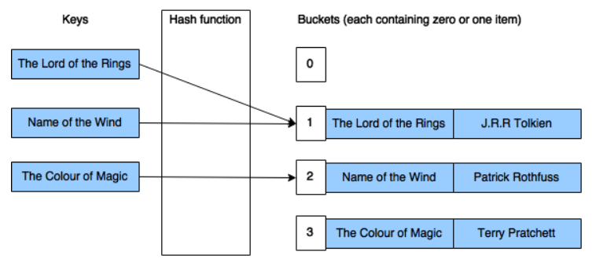

Chapter 5-Primitive, Reference, and Value Types
==============================

## Programming Language Primitive Types
Any data types the compiler directly supports are called primitive types. Primitive types map directly to types existing in the Framework Class Library (FCL). 

## Tables C# Primitives with Corresponding FCL Types (only show main ones)

| Primitive Type | FCL Type | Description |
| -------------- | -------- | ----------- |
| sbyte | System.SByte | Signed 8-bit value |
| byte | System.Byte  | Unsigned 8-bit value |
| short | System.Int16  | Signed 16-bit value |
| int | System.Int32 | Signed 32-bit value |
| uint | System.UInt32 | Unsigned 32-bit value |
| long | System.Int64 | Signed 64-bit value |
| char | System.Char | 16-bit Unicode character (char never represents an 8-bit value as it would in unmanaged C) |
| float | System.Single | IEEE 32-bit floating point value |
| double | System.Double | IEEE 64-bit floating point value |
| decimal | System.Decimal | A 128-bit high-precision floating-point value commonly used for financial calculations in which rounding errors can’t be tolerated.
| bool | System.Boolean | A true/false value |
| string | System.String | An array of characters |
| object | System.Object | Base type of all types |
| dynamic | System.Object | To the common language runtime (CLR), dynamic is identical to object. However, the C# compiler allows dynamic variables to participate in dynamic dispatch by using a simplified syntax.

<div class="alert alert-info pb-0" role="alert">
    <ul class="p-1">
      <li>string maps exactly to System.String (an FCL type), there is no difference and either can be used. So <code>string s = "Hi"</code> and <code>String s = "Hi"</code> are equivalent</li>
      <li> In C#, an int always maps to System.Int32, and therefore it represents a 32-bit integer regardless of the operating system the code is running on, not like other language like C that int can be 32-bit or 64-bit depends on the running machine'operating system
      </li>
    </ul>  
</div>

So you can think that compiler does some tricks as :
```C#
using int = System.Int32;
```
and  the following four lines of code all compile correctly and produce exactly the same IL:
```C#
int a = 0;                           // Most convenient syntax
System.Int32 a = 0;                  // Convenient syntax
int a = new int();                   // Inconvenient syntax
System.Int32 a = new System.Int32(); // Most inconvenient syntax
```

 ## Implicit or explicit casts between primitive types

C# allows implicit casts if the conversion is "safe",  that is, no loss of data is possible, for example:

```C#
 Int16 i_16 = 2;
 Int32 i_32 = i_16;
```
But implicit cast is requried when if the conversion is "unsafe":
```C#
Int32 i = 5;
Byte b = (Byte) i;  // if no implicit casts then there will be a compile error
```
Note that when performing the preceding arithmetic operation, the first step requires that all operand values be expanded to 32-bit values (or 64-bit values if any operand requires more than 32 bits), so
```C#
//DOESN'T compile
Byte b = 100;
b = b + 1;      // b + 1 becomes an int, throw a compile error "Cannot cast int to a byte"

// An implicit cast is need for the code to compile
Byte b = 100;
b = (Byte) b + 1;    
```
C# allows the programmer to decide how overflows should be handled. By default, overflow checking is turned off. This means that the compiler generates IL code by using the versions of the add, subtract, multiply, and conversion instructions that don’t include overflow checking. As a result,
the code runs faster checked operator can be used to throw OverflowException as:
```C#
Byte b = 100;
b = checked((Byte) (b + 200)); // OverflowException is thrown

checked { 
   Byte b = 100;
   b = (Byte) (b + 200); 
} 

checked { 
   Byte b = 100;
   b += 200;  //  can now use the += operator with the Byte, which simplifies the code
} 
```
<div class="alert alert-info p-1" role="alert">
   When useing checked operator, CLR produces IL codes such as `add.ovf`, `sub.ovf`, `mul.ovf` and data conversions (`conv.ovf`)
</div>

## Value Types (Struct)
All of the structures are immediately derived from the `System.ValueType` abstract type. `System.ValueType` is itself immediately derived from the `System.Object` type. By definition, all value types must be derived from `System.ValueType`. All enumerations are derived from the `System.Enum` abstract type, which is itself derived from `System.ValueType`.
```C#
struct SomeVal { public Int32 x; }

SomeVal v1 = new SomeVal();            // Allocated on stack, even though the new keyword is used

// These two lines compile because C# thinks that v1's fields have been initialized to 0.
SomeVal v1 = new SomeVal();
Int32 a = v1.x;

// These two lines don't compile because C# doesn't think that v1's fields have been initialized to 0.
SomeVal v1;
Int32 a = v1.x; // error CS0170: Use of possibly unassigned field 'x'
```

<div class="alert alert-info pt-2 pb-0" role="alert">
    <ul class="pl-1">
      <li>You cannot check if a struct is "null" as `if (v1 == null)` since null check only apply to reference type, and btw a struct instance will never be null since the compiler initializs default value to its fields.</li>
      <li> The CLR does offer a special feature that adds the notion of nullability to a value type. This feature, called nullable types, is discussed in Chapter 19, "Nullable Value Types."
      </li>
      <li> Some other languages like Javascript will convert <code>null</code> to <code>false</code>, but in C#, it is not supported as true/false is a boolean struct, value types cannot have a null value.
      </li>
    </ul>  
</div>

## Boxing and Unboxing Value Types
```C#
struct Point {
   public Int32 x, y;
}
...
ArrayList a = new ArrayList();
Point p;                           // Allocate a Point (not in the heap).
for (Int32 i = 0; i < 10; i++) {
   p.x = p.y = i;                  // Initialize the members in the value type.
   a.Add(p);                       // Box the value type and add the reference to the Arraylist.
}
```
`ArrayList`’s Add method is prototyped as `public virtual Int32 Add(Object value);`, `Add` takes an Object as a parameter, indicating that `Add` requires a reference (or pointer) to an object on the managed heap as a parameter.For this code to work, the Point value type must be converted into a true heap-managed object, and a reference to this object must be obtained.At run time, the fields currently residing in the Point value type instance p are **copied** into the newly allocated Point object. The address of the boxed Point object (now a reference type) is returned and is then passed to the Add method. The Point object will remain in the heap until it is garbage collected. 

<div class="alert alert-info pt-2 pb-0" role="alert">
    <ul class="pl-1">
      <li>The Point value type variable (p) can be reused, because the <code>ArrayList</code> never knows anything about it.</li>
      <li>The generic collection classes e.g. <code>System.Collections.Generic.List</code> offer many improvements over the non-generic equivalents. One of the biggest improvements is that the generic collection classes allow you to work with collections of value types <b>without</b> requiring that items in the collection be boxed/unboxed. (Check Chapter 12-Walkthrough for details</li>
    </ul>  
</div>

So **boxing** means convert a value type to a reference type , here’s what happens when an instance of a value type is boxed in summary:
<ol>
  <li><b>Memory is allocated from the managed heap. The amount of memory allocated is the size required by the value type’s fields plus the two additional overhead members (the type object pointer and the sync block index) required by all objects on the managed heap.</b></li>
  <li><b>The value type’s fields are copied to the newly allocated heap memory.</b></li>
  <li><b>The address of the object is returned. This address is now a reference to an object; the value type is now a reference type.</b></li>
</ol> 

Now that you know how boxing works, let’s talk about unboxing. Let’s say that you want to grab
the first element out of the ArrayList by using the following code.
```C#
Point p = (Point) a[0];
```
For this to work, all of the fields contained in the boxed Point object must be copied into the value type variable, p, which is on the thread’s stack. The CLR accomplishes this copying in two steps. First, the address of the Point fields in the boxed Point object is obtained. This process is called unboxing. Then, the values of these fields are copied from the heap to the stack-based value type instance.

Unboxing is not the exact opposite of boxing. The unboxing operation is much less costly than boxing. Unboxing is really just the operation of obtaining a pointer to the raw value type (data fields) contained within an object. In effect, the pointer refers to the unboxed portion in the boxed instance.
So, unlike boxing, <span style="color:blue">unboxing doesn’t involve the copying of any bytes in memory.</span> Having made this important clarification, it is important to note that an unboxing operation is typically followed by copying the fields. 

Obviously, boxing and unboxing/copy operations <span style="color:red">hurt</span> your application’s performance in terms of both speed and memory.

Internally, here’s exactly what happens when a boxed value type instance is unboxed:
<ul>
  <li><b>If the variable containing the reference to the boxed value type instance is null, a NullReferenceException is thrown.</b></li>
  <li><b>If the reference doesn’t refer to an object that is a boxed instance of the desired value type, an InvalidCastException is thrown.</b></li>
</ul> 

The second item in the preceding list means that the following code will not work as you might expect.
```C#
//wrong unboxing   :(
Int32 x = 5;
Object o = x;                // Box x; o refers to the boxed object
Int16 y = (Int16) o;         // Throws an InvalidCastException

//Correct unboxing :)
Int32 x = 5;
Object o = x;                // Box x; o refers to the boxed object
Int16 y = (Int16)(Int32) o;  // Unbox to the correct type and cast
```

An unboxing operation is frequently followed immediately by a field copy. Let’s take a look at some C# code demonstrating that unbox and copy operations work together:

```C#
public static void Main() {
   Point p;
   p.x = p.y = 1;
   Object o = p; // Boxes p; o refers to the boxed instance
   p = (Point) o; // Unboxes o AND copies fields from boxed instance to stack variable 
}
```
On the last line, the C# compiler emits an IL instruction to unbox o (get the address of the fields in the boxed instance) and another IL instruction to copy the fields from the heap to the stack-based variable `p`

Now look at this code

```C#
public static void Main() {
   Point p;
   p.x = p.y = 1;
   
   // Change Point's x field to 2
   p = (Point) o;   // Unboxes o AND copies fields from boxed instance to stack variable
   p.x = 2;         // Changes the state of the stack variable
   o = p;           // Boxes p; o refers to a new boxed instance
}
```
The code at the bottom of this fragment is intended only to change Point’s x field from 1 to 2. To do this, an unbox operation must be performed, followed by a field copy, followed by changing the field (on the stack), followed by a boxing operation (which creates a whole new boxed instance in the
managed heap). Hopefully, you see the <span style="color:red">impact</span> that boxing and unboxing/copying operations have on your application’s performance.

<div class="alert alert-info p-1" role="alert">
    If you’re the least bit concerned about your application's performance, uses tools such as ILDasm.exe to view the IL code for methods and see where the box IL instructions are.
</div>

Below is an example that shows you need to have a deep understanding on boxing/unboxing to know that <b>three</b> boxing operations occur:

```C#
public static void Main() {
   Int32 v = 5;     // Create an unboxed value type variable.
   Object o = v;    // o refers to a boxed Int32 containing 5.
   v = 123;         // Changes the unboxed value to 123

   Console.WriteLine(v + ", " + (Int32) o);     // Displays "123, 5"
}
```
`WriteLine` wants a String object passed to it, but there is no string object. Instead, these three items are available: an unboxed Int32 value type instance (v), a String (which is a reference type), and a reference to a boxed Int32 value type instance (o) that is being cast to an unboxed Int32. These must somehow be combined to create a String. To create a String, the C# compiler generates code that calls String's static Concat method, then The Concat method calls each of the specified object argument's ToString method and concatenates each object’s string representation. The String object returned from Concat is then passed to WriteLine to show the final result. Notice that the signature of String's static Concat method is:

```C#
public static String Concat(Object arg0, Object arg1, Object arg2);
```

We can see that:
1. `v` boxed into `o`
2. `v` boxed into `arg0`; 
3. `(Int32) o` boxed into `arg2`;

You can see that the third boxing is really unnecessary, and the generated IL code is more efficient if the call to WriteLine is written as:

```C#
//better performance
Console.WriteLine(v + ", " + o); 
```

You can further avoid the first boxing as:

```C#
//best performance
Console.WriteLine(v.ToString() + ", " + o); 
```

since ToString is called on the unboxed value type instance v, and a String is returned. String objects are already reference types and can simply be passed to the Concat method without requiring any boxing.

Have you wondered why there are so many override version of some methods e.g WriteLine method:
```C#
public static void WriteLine(Boolean);
public static void WriteLine(Char);
public static void WriteLine(Char[]);
public static void WriteLine(Int32); 
...
public static void WriteLine(Decimal);
public static void WriteLine(Object);
public static void WriteLine(String);
```
Now you know those override methods help avoid boxing.

Below is the quirk of code that many developers don't expect:
```C#
internal struct Point  {
   private Int32 m_x, m_y;

   public Point(Int32 x, Int32 y) {
      m_x = x;
      m_y = y;
   } 

   public void Change(Int32 x, Int32 y) {
      m_x = x; m_y = y;
   }

   public override String ToString() {
      return String.Format("({0}, {1})", m_x.ToString(), m_y.ToString()); 
   }
}

public static void Main() {
   Point p = new Point(1, 1);

   Console.WriteLine(p);        // display (1, 1)

   p.Change(2, 2);
   Console.WriteLine(p);        //display (2, 2), p gets boxed

   Object o = p; 
   Console.WriteLine(o);        //display (2, 2),  which is also expected

   ((Point) o).Change(3, 3);    
   Console.WriteLine(o);        // still display (2, 2) because the change only apply on temporary Point on the thread’s stack, 
                                //the boxed Point (o) isn't affected
}
```

When using value types, you need to be aware of:

1. **Unboxed value types don’t have a sync block index, you can’t have multiple threads synchronize their access to the instance by using the methods of the System.Threading.Monitor type (or by using C#’s lock statement).**

2. **If your value types override Object's virtual methods such as `Equals`, `GetHashCode`, or `ToString` and call these methods, the value types won't be boxed since value types are implicitly sealed, CLR can know there is only one method to invoke.**

3. **If you override Object's virtual methods but call base type's implementation like `base.Equals()`(base is `System.ValueType`) in the override implemention, then then the value type instance does get boxed.**

4. **Calling a nonvirtual inherited method (such as `GetType` or `MemberwiseClone`) always requires the value type to be boxed because these methods are defined by System.Object, so the methods expect the this argument to be a pointer that refers to an object on the heap.**

5. **Casting an unboxed instance of a value type to one of the type’s interfaces requires the instance to be boxed**

The following code demonstrate the fifth:
```C#
internal interface IChangeBoxedPoint { void Change(Int32 x, Int32 y); }

internal struct Point : IChangeBoxedPoint {
    ... //same as above
   public void Change(Int32 x, Int32 y) {
      m_x = x; m_y = y;
   }
}

public static void Main() {
   Point p = new Point(1, 1);
   
   Console.WriteLine(p);         //display (1, 1)

   p.Change(2, 2);    
   Console.WriteLine(p);         //display (2, 2)
 
   Object o = p;
   Console.WriteLine(o);         //display (2, 2)
   
   ((Point) o).Change(3, 3);
   Console.WriteLine(o);         //display (2, 2) as o is not affected
 
   // Boxes p, changes the boxed object and discards it, the new boxed object will be garbage collected
   ((IChangeBoxedPoint) p).Change(4, 4);
   Console.WriteLine(p);         //still display (2, 2), p is unchanged, only the new box instance on heap changes to (4, 4)

   // Changes the boxed object and shows it
   ((IChangeBoxedPoint) o).Change(5, 5);
   Console.WriteLine(o);         // now display (5, 5)
}
```

<div class="alert alert-info p-1" role="alert">
    Based on the quirk result above, now you know why value types should be immutable,  it is recommended that value types have their fields marked as <code>readonly</code>
</div>

## Object Equality and Identity

```C#
// System.Object
public class Object {
   ...
   public static bool Equals(Object objA, Object objB);
   public static bool ReferenceEquals(Object objA, Object objB);
   public virtual bool Equals(Object obj);
   public virtual int GetHashCode();
   ...
   
   // Hardcoded and purely supported by compiler
   //public static bool operator ==(object x, object y);
   //public static bool operator !=(object x, object y);
}
```

1-`System.Object`s virtual method `Equals` returns true if two references points to a same object by default

2-The static method `Object.Equals` is designed to avoid NullReferenceException e.g `Console.WriteLine(object.Equals(p1,p2));` instead of `Console.WriteLine(p1.Equals(p2)); // where p1 might be null`, the implemention is

```C#
public static bool Equals(object x, object y) {
   if (x == y) 
      return true;

   if (x == null || y == null) 
      return false;

   return x.Equals(y); // Safe as we know x != null.  
}
```
This means that the static Equals method will always give the same result as the virtual `Equals` method(since it calls the virtual method `Equals` internally), except that it checks for null first, as a static method calls the virtual method. 

3-`Object.ReferenceEquals` static method serves a slightly different purpose from the two Equals methods. You may have a question in mind that if the Equals method also checks the reference equality then what is the need for a separate method? These two methods do check reference equality, but they are not guaranteed to do so, because the virtual Equals method can be overridden to compare the values of the instance and not the reference. so `ReferenceEquals` will give the same result as Equals for the types that have not overridden the Equals method. The source code is implemented simplily as:

```C#
public static bool ReferenceEquals (Object objA, Object objB) {
   return objA == objB;
}
```

4- The `==` and `!=` doesn't exist in the the source code https://referencesource.microsoft.com/#mscorlib/system/object.cs, that's why I comment them out. They are purely supported by the compiler, so their implemention details is hard coded. Note that `==` and `!=` in `Object` checks references, they don't call `Object`'s  instance `Equals` method for polymorphic (they probably do call `ReferenceEquals` internally but it is just an implemention details), so they are not polymorphic and don't call anything polymorphic by default and you can't override them in your derived type (all types implicitly inherits from `Object`), but you can overload them as `String` does.

For `System.ValueType` (the base class of all value types), it overrides Object's Equals method. Internally, ValueType’s Equals is implemented this way:

1. If the obj argument is null, return false.

2. If the this and obj arguments refer to objects of different types, return false.

3. For each instance field defined by the type, compare the value in the this object with the value in the obj object by calling the field’s Equals method. If any fields are not equal, return false.

4. Return true. Object's Equals method is not called by ValueType’s Equals method.

Internally, ValueType’s Equals method uses reflection (covered in Chapter 23, "Assembly Loading and Reflection") to accomplish step 3. Because the CLR’s reflection mechanism is slow, when defining your own value type, you should override Equals and provide your own implementation to improve the performance of value equality comparisons that use instances of your type. Of course, in your own implementation, do not call base.Equals.

When overriding the Equals method, there are a couple more things that you’ll probably want to do:

0.  Override the `GetHashCode` method as it will be needed when using Dictionary to hash key object

1. Have the type implement the `System.IEquatable<T>.Equals` method, the type's virtul `bool Equals(Object obj)` will call this type-safe method internally.

2. Overload the == and != operator methods

3. Have the type implement the `System.IComparable.CompareTo` and type-safe `System.IComparable<T>.CompareTo` if you need sorting (The reason to implement both is existence of non-generic such as `ArrayList.Sort`)

```C#
public interface IEquatable<T> {
   bool Equals(T other);
}

public class Person : IEquatable<Person> {
   private string uniqueSsn;
   private string lName;

   ...// ctor, uniqueSsn, lName properties

   public override int GetHashCode() {
      return this.SSN.GetHashCode();
   }

   public bool Equals(Person other) {
      if (other == null)
         return false;
      if (this.uniqueSsn == other.uniqueSsn)
         return true;
  
   }

   public override bool Equals(Object obj) {    //In case non generic data structure is used  e.g  ArrayList
      if (obj == null)
         return false;
      Person personObj = obj as Person;
      if (personObj == null)
         return false;
      else
         return Equals(personObj);             // calls type-safe Equals internally
   }

   public static bool operator == (Person person1, Person person2) {
      if (((object)person1) == null || ((object)person2) == null) {    // Note that the argument needs to be casted to objects first the use ==, otherwise, it will be endless loop that causes a stackoverflow exception
         return Object.Equals(person1, person2);
      }
      return person1.Equals(person2);
   }
   //public static bool operator != (Person person1, Person person2) ...
}
```
so when using generic data structures e.g `List.Contains(T item)` or `List.Remove(T item)` method, CLR will call your type's type safe `Equals(T other)` method, if your type doesn't implement `IEquatable<T>` then normal `Equals(Object obj)` is called. Also notes that you should overload the ==, !=.

<div class="alert alert-info p-1" role="alert">
    You can see that there is no existance of non-generic version of <code>IEquatable</code>, unlike others such as <code>IComparable&lt;T&gt;</code> and <code>&lt;IComparable&gt;</code> or <code>IComparer&lt;T&gt;</code> and <code>&lt;IComparer&gt;</code> that comes as a "pair". Because non-generic IEquatable is actually the same thing as System.Object's virtual Equals method. For example, the signature of <code>Int32</code> is:
</div>

```C#
public struct Int32 : IComparable, IComparable<Int32>, IFormattable, IConvertible, IEquatable<Int32>
```

The following code demostrates the usage of `IComparable<T>` and `IComparer<T>`:

```C#
public interface IComparable<in T> { 
   int CompareTo(T other); 
}

public interface IComparer<in T> { 
   int Compare(T x, T y); 
}

public class Employee : IComparable<Employee>, IComparable, IEquatable<Employee> 
{
   public string Name { get; set; }
   public int Salary { get; set; }
   public int Age { get; set; }

   /* To implement IEquatable<Employee> , leave out for brevity
   //public bool Equals(Employee other) { ...}    
   //public override bool Equals(Object obj) { ...}  
   */

   public int CompareTo(Employee other) {
      if (this.Salary < other?.Salary)
         return 1;
      else if (this.Salary > other?.Salary)
         return -1;
      else
         return 0;
    }

    public int CompareTo(Object other) {
         Employee e = other as Employee;
         if (e != null) {
            CompareTo(e);
         }
         return 0;
    }

    // Optional static read-only property for easy access of AgeComparer
    public static IComparer<Employee> SortByAge { get { return new AgeComparer(); } }

    public override string ToString() => $"{this.Name} {this.Salary}";

    // public static bool operator XX (Employee e1, Employee e2)  leave out for brevity
}

public class AgeComparer : IComparer<Employee> {    // should really implement non-generic IComparer, leave out for brevity
   public int Compare(Employee employee1, Employee employee2) {
      if (employee1?.Age > employee2?.Age)
         return 1;
      if (employee1?.Age < employee2?.Age)
         return -1;
      return 0;
   }
}

static void Main(string[] args) {
   var employees = new List<Employee>();
   
   employees.Add(null);   // for rigorous check as List can contain null,  might throw an exception when no null check for CompareTo and uses List.Sort
   employees.Add(new Employee() { Name = "Mid", Salary = 2000, Age = 25 });
   employees.Add(new Employee() { Name = "Junior", Salary = 1000, Age = 28 });
   employees.Add(new Employee() { Name = "Senior", Salary = 3000, Age = 28 });
   employees.Add(new Employee() { Name = "CTO", Salary = 5000, Age = 40 });
   employees.Add(new Employee() { Name = "HR", Salary = 800, Age = 30 });
   
   employees.Sort();

   //public void Sort(IComparer<T> comparer);
   employees.Sort(new AgeComparer());
   employees.Sort(Employee.SortByAge);

   //public delegate int Comparison<in T>(T x, T y);
   //public void Sort(Comparison<T> comparison);
   employees.Sort((Employee e1, Employee e2) => e1.Age - e2.Age);
}

```
(The interfaces mentioned below include both generic and non-generic,  unless specified otherwise)
Think of `IComparable` as providing a default sort order for your objects when you call `employees.Sort();`.If you implement `IComparable`, you should overload the >, >=, <, <= operators to return values that are consistent with CompareTo(T). In addition, you should also implement `IEquatable<T>`, which needs to get == and != override.

<div class="alert alert-info p-1" role="alert">
    If your type doesn't implement <code>IComparable</code> and the collection calls <code>Sort()</code>, an exception will be thrown at runtime
</div>

You can also specify multiple sort orders with `IComparer`, the `IComparable` is more like default comparison, `IComparer` is like new  comparisons that override default comparison. That's why `IComparable` implemented by type classes directly while `IComparer` and `Comparer<T>` implemented by a separate sub-class. 

### Abstract Class Comparer<T>

The following code demostrates the usage of `Comparer<T>`:

```C#
//note that there is no non-generic Compare abstract class, only generic one exists
public abstract class Comparer<T> : IComparer, IComparer<T> {
   protected Comparer();
   public static Comparer<T> Default { get; }
   public static Comparer<T> Create(Comparison<T> comparison);
   public abstract int Compare(T x, T y);
   public int Compare(Object x, Object y) {             
      ...
      return Compare((T)x, (T)y);
   }
}

public class BoxLengthFirst : Comparer<Box>
{
    public override int Compare(Box x, Box y) {
        if (x.Length.CompareTo(y.Length) != 0)
            return x.Length.CompareTo(y.Length);
        if (x.Height.CompareTo(y.Height) != 0)
            return x.Height.CompareTo(y.Height);
        if (x.Width.CompareTo(y.Width) != 0)
            return x.Width.CompareTo(y.Width);
        return 0;
    }
}

public class Box : IComparable<Box>
{
    public Box(int h, int l, int w) {
        this.Height = h;
        this.Length = l;
        this.Width = w;
    }

    public int Height { get; private set; }
    public int Length { get; private set; }
    public int Width { get; private set; }

    public int CompareTo(Box other) {
        // Compares Height first , then Length, and Width.
        if (this.Height.CompareTo(other.Height) != 0)
            return this.Height.CompareTo(other.Height);
        if (this.Length.CompareTo(other.Length) != 0)
            return this.Length.CompareTo(other.Length);
        if (this.Width.CompareTo(other.Width) != 0)
            return this.Width.CompareTo(other.Width);
        return 0;
    }
}

static void Main(string[] args) {
   List<Box> Boxes = new List<Box>();
   Boxes.Add(new Box(4, 20, 14));
   Boxes.Add(new Box(12, 12, 12));
   Boxes.Add(new Box(8, 20, 10));

    //public void Sort(IComparer<T> comparer);
   Boxes.Sort(new BoxLengthFirst());   // BoxLengthFirst is an instance of abstract class Comparer<T> which implements IComparer<T> 

   Comparer<Box> defComp = Comparer<Box>.Default;
   // Calling Boxes.Sort() with no parameter is the same as calling Boxs.Sort(defComp)
   Boxes.Sort();

   // using public static Comparer<T> Create(Comparison<T> comparison);
   Comparer<Box> boxWidthFirst = Comparer<Box>.Create((Box x, Box y) => x.Length - y.Length);  //  just compare length for simplicity
   Boxes.Sort(boxWidthFirst);
}
```
Finally, it is recommended to derive from `Comparer<T>` instead of implementing `IComparer` as Microsoft quotes:
> ...because the Comparer<T> class provides an explicit interface implementation of the IComparer.Compare method and the Default property that gets the default comparer for the object.

Not quite sure on that but one benefit to use `Comparer<T>` is that you don't need to implement two interfaces(one generic, one non-generic), for example, the AgeComparer shoudl really be : `public class AgeComparer : IComparer<Employee>, IComparer<T>` .

The object returned by the `Default` property uses the `System.IComparable<T>` generic interface to compare two objects. If type T does not implement the `IComparable<T>` generic interface, the Default property returns a `Comparer<T>` that uses the `IComparable` interface.

### IEqualityComparer and EqualityComparer

There is also a `IEqualityComparer` interface, which can be used by collections to tell if a key has been already used (Dictionary) or Linq's Distinct method
```C#
public interface IEqualityComparer<in T> {
   bool Equals(T x, T y);
   int GetHashCode(T obj);
}
```
Below is code demostrate its usage with Linq's Distinct method:
```C#
public class Product : IEquatable<Product>  //show the default Equality Comaprer example
{
    public string Name { get; set; }
    public int Code { get; set; }

    public bool Equals(Product other)
    {
        //Check whether the compared object is null.
        if (Object.ReferenceEquals(other, null)) return false;

        //Check whether the compared object references the same data.
        if (Object.ReferenceEquals(this, other)) return true;

        return Code.Equals(other.Code) && Name.Equals(other.Name);
    }

    public override int GetHashCode() { ... }
}

static void Main(string[] args) {
   Product[] products = { new Product { Name = "apple", Code = 9 },
                          new Product { Name = "orange", Code = 4 },
                          new Product { Name = "apple", Code = 9 },
                          new Product { Name = "lemon", Code = 12 } };
   
   IEnumerable<Product> noduplicates = products.Distinct();

   foreach (var product in noduplicates)
      Console.WriteLine(product.Name + " " + product.Code);
   /*
    This code produces the following output:
    apple 9
    orange 4
    lemon 12
   */
}
```
When you call `System.Linq.Distinct<TSource>(this IEnumerable<TSource> source)` with no argument like above, `IEquatable<T>` is the default equality comparer. 
Also notes that if `Product` class didn't implement `IEquatable<Product>` and when you call `IEnumerable<Product> noduplicates = products.Distinct();`, then Prodcut's override Equals method is used (if it has one), if it doesn't have the override Equals method, then the base(Object)'s Equals method is used, which obviously treat all items are distinct since Object's Equals method only does reference check.

You can pass your own custom equality comparer externally instead of default equality comparer, that's when `IEqualityComparer<T>` comes into play (does it remind you the relationship between `IComparable` and `IComparer`😏):
```C#
class ProductComparer : IEqualityComparer<Product> {
   public bool Equals(Product x, Product y) {
      //Check whether the compared object is null.
      if (Object.ReferenceEquals(other, null)) return false;

      //Check whether the compared object references the same data.
      if (Object.ReferenceEquals(this, other)) return true;

      return Code.Equals(other.Code) && Name.Equals(other.Name); // You can customize your comparer, it doesn't have to be the same as default equality   
                                                                 //comparer, for example, you can relax restrictions that as long as the Name equals,
                                                                 // without worrying about the Code equality for certain circumstances 
   }

   public int GetHashCode(Product product)
   {
      //Check whether the object is null
      if (Object.ReferenceEquals(product, null)) return 0;

      //Get hash code for the Name field if it is not null.
      int hashProductName = product.Name == null ? 0 : product.Name.GetHashCode();

      //Get hash code for the Code field.
      int hashProductCode = product.Code.GetHashCode();

      //Calculate the hash code for the product.
      return hashProductName ^ hashProductCode;
   }
}

static void Main(string[] args) {
   Product[] products = { new Product { Name = "apple", Code = 9 },
                          new Product { Name = "orange", Code = 4 },
                          new Product { Name = "apple", Code = 9 },
                          new Product { Name = "lemon", Code = 12 } };
   
   IEnumerable<Product> noduplicates = products.Distinct(new ProductComparer());
   ...
}
```

`IEqualityComparer<T>` is also used by Dictionary to tell if a key is duplicated:
```C#
public Dictionary(IEqualityComparer<TKey> comparer);
```
if TKey is detected being used more than once, then `ArgumentException` is thrown. See the example below:
```C#
//use the Box class in preceding example

static void Main() {
   BoxEqualityComparer boxEqC = new BoxEqualityComparer();

   var boxes = new Dictionary<Box, string>(boxEqC);

   var redBox = new Box(4, 3, 4);
   AddBox(boxes, redBox, "red");

   var blueBox = new Box(4, 3, 4);
   AddBox(boxes, blueBox, "blue");

   var greenBox = new Box(3, 4, 3);
   AddBox(boxes, greenBox, "green");
   Console.WriteLine();

   Console.WriteLine("The dictionary contains {0} Box objects.", boxes.Count);

   // The example displays the following output:
   //    Unable to add (4, 3, 4): An item with the same key has already been added.
   //    The dictionary contains 2 Box objects.
}

private static void AddBox(Dictionary<Box, String> dict, Box box, String name) {
    try {
        dict.Add(box, name);
    }
    catch (ArgumentException e) {
        Console.WriteLine("Unable to add {0}: {1}", box, e.Message);
    }
}

class BoxEqualityComparer : IEqualityComparer<Box>
{
    public bool Equals(Box b1, Box b2)
    {
        if (b2 == null && b1 == null)
           return true;
        else if (b1 == null || b2 == null)
           return false;
        else if(b1.Height == b2.Height && b1.Length == b2.Length && b1.Width == b2.Width)
            return true;
        else
            return false;
    }

    public int GetHashCode(Box bx)
    {
        int hCode = bx.Height ^ bx.Length ^ bx.Width;
        return hCode.GetHashCode();
    }
}
```

The Microsoft document states: `Dictionary<TKey,TValue>` requires an equality implementation to determine whether keys are equal. You can specify an implementation of the `IEqualityComparer<T>` generic interface by using a constructor that accepts a comparer parameter; if you do not specify an implementation, the default generic equality comparer `EqualityComparer<T>`.Default is used. If type TKey implements the `System.IEquatable<T>` generic interface, the default equality comparer uses that implementation, if the key still doesn't implement `IEquatable<T>`, the overloaded `Equals(Objct obj)` is used. You might think the Dictionary only uses IEquatable.Equals() to check if keys are duplicated, so you might do tricky thing to force the Dictionary think all different keys are the same as below:
```C#
// When the Dictionary doesn't recevie IEqualityComparer in its constructor
// var boxes = new Dictionary<Box, string>();
public class Box : IEquatable<Box> {
   ...
   public bool Equals(Box b) {
      return true;
   }
}
```
then you expect the Dictionary won't be able to add any box object to it, but when you run the code, you'll find the Dictionary still adds all box objects into it. The document only just says the second part which involves IEquatable.Equals(). The whole process is:

<ul>
  <li>Dictinary always calls GetHashCode of Tkey, to determine which bucket is used to store Tkey</li>
  <li>After the bucket is determined, it uses IEquatable's Equals() to loop through bucket elements to check if any existing key duplicated to Tkey</li>
</ul> 


[Back to basics: Dictionary part 1, hash tables](https://blog.markvincze.com/back-to-basics-dictionary-part-1/)

Now it is clear why the Dictionary adds all box objects in the preceding example, because you didn't force the Dictionary to use the same bucket, even though two keys are duplicated, the old key is its bucket, the the Dictionaly is tring to find if current key is duplicated in a different bucket. To make the trick works, you'll need to override GetHashCode() as well:
```C#
public class Box : IEquatable<Box> {
   ...
   public bool Equals(Box b) {
      return true;
   }
   public override int GetHashCode() {
      return 1;
   }
}
```

## Using EqualityComparer

Similarly to abstract class `Comparer<T>`, there is an abstract class `EqualityComparer<T>`:
```C#
public abstract class EqualityComparer<T> : IEqualityComparer<T>, IEqualityComparer {
   protected EqualityComparer();
   public static EqualityComparer<T> Default { get; }
   public abstract bool Equals(T x, T y);
   public abstract int GetHashCode(T obj);
}
```
The `Default` property checks whether type T implements the `System.IEquatable<T>` generic interface and, if so, returns an `EqualityComparer<T>` that invokes the implementation of the `IEquatable<T>.Equals` method. Otherwise, it returns an `EqualityComparer<T>` that uses the overrides of `Object.Equals` and `Object.GetHashCode` provided by T.

<!-- <div class="alert alert-info p-1" role="alert">
    
</div> -->

<!--  -->

<!-- <code>&lt;T&gt;</code> -->

<!-- <div class="alert alert-info pt-2 pb-0" role="alert">
    <ul class="pl-1">
      <li></li>
      <li></li>
    </ul>  
</div> -->

<!-- <ul>
  <li><b></b></li>
  <li><b></b></li>
  <li><b></b></li>
  <li><b></b></li>
</ul>  -->

<!-- <span style="color:red">hurt</span> -->

<style type="text/css">
.markdown-body {
  max-width: 1800px;
  margin-left: auto;
  margin-right: auto;
}
</style>

<link rel="stylesheet" href="./zCSS/bootstrap.min.css">
<script src="./zCSS/jquery-3.3.1.slim.min.js"></script>
<script src="./zCSS/popper.min.js"></script>
<script src="./zCSS/bootstrap.min.js"></script>