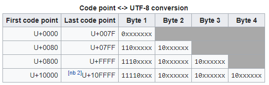
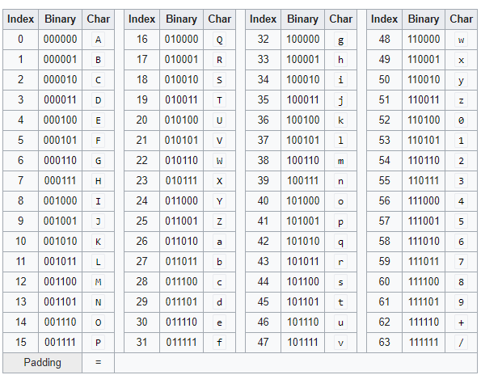

Chapter 14-Chars, Strings, and Working with Text
==============================

## Characters

In the .NET Framework, characters are always represented in **16-bit** Unicode code values, easing the development of global applications. A characters is represented with an instance of the System.Char structure(a value type). The `System.Char` type is pretty simple, it offers two public read-only constant fields: `MinValue`, defined as `\0`, and MaxValue, defined as `\uffff`.

```C#
public struct Char : IComparable, IConvertible, IComparable<Char>, IEquatable<Char> {
   public const Char MaxValue = '\uffff';
   public const Char MinValue = '\0';

   public static UnicodeCategory GetUnicodeCategory(Char c);
   public static double GetNumericValue(Char c);

   public static bool IsDigit(Char c);
   public static bool IsDigit(string s, int index);  // string and index parameters pattern for all IsXXX method
   public static bool IsNumber(Char c);   // for Roman numeral 5 (V) Char.IsNumber('\x2165') is true while Char.IsDigit('\x2165') is false                
   public static bool IsLetter(Char c);
   public static bool IsHighSurrogate(Char c);
   public static bool IsLower(Char c);
   public static bool IsPunctuation(Char c);
   public static bool IsSurrogatePair(Char highSurrogate, Char lowSurrogate);
   ...
   public static Char ToUpper(Char c);
   public static Char ToUpper(Char c, CultureInfo culture);
   public static Char ToUpperInvariant(Char c);
   ...
   public bool Equals(Char obj);
   public TypeCode GetTypeCode();
   public string ToString(IFormatProvider provider);
}

public enum UnicodeCategory {
   UppercaseLetter = 0,
   LowercaseLetter = 1,
   ...
   Control = 14,
   ...
   DashPunctuation = 19,
   ...
   OtherPunctuation = 24,
   ...
   CurrencySymbol = 26,
   ...
}

static void Main(string[] args) {
   var c = Char.GetUnicodeCategory('-');    // UnicodeCategory.DashPunctuation
}
```

Given an instance of a Char, you can call the static `GetUnicodeCategory` method, which returns a value of the `System.Globalization.UnicodeCategory` enumerated type. This value indicates whether the character is a control character, a currency symbol, a lowercase letter, an uppercase letter, a punctuation character, a math symbol, or another character (as defined by the Unicode standard).

To ease developing, the `Char` type also offers several static methods, such as IsDigit, IsLetter, IsWhiteSpace, IsUpper, IsLower, IsPunctation IsLetterOrDigit, IsControl, IsNumber, IsSeparator, IsSurrogate, IsLowSurrogate, IsHighSurrogate, and IsSymbol. Most of these methods call `GetUnicodeCategory` method internally. Note that all of these methods take either a single character for a parameter or a String and the index of a character within the String as parameters.

In addition, you can convert a single character to its lowercase or uppercase equivalent in a culture-agnostic way by calling the static `ToLowerInvariant` or `ToUpperInvariant` method. Alternatively, the `ToLower` and `ToUpper` methods (without taking CultureInfo parameter) convert the character by using the culture information associated with the calling thread (which the methods obtain internally by querying the static CurrentCulture property of the `System.Globalization.CultureInfo` class). You can also specify a particular culture by passing an instance of the CultureInfo class to these methods. ToLower and ToUpper require culture information because letter casing is a culture-dependent operation. For example, Turkish considers the uppercase of U+0069 (LATIN LOWERCASE LETTER I) to be U+0130 (LATIN UPPERCASE LETTER I WITH DOT ABOVE), whereas other cultures consider the result to be U+0049 (LATIN CAPITAL LETTER I).

Besides theres static methods, the Char type also offers a few instance methods of its own. The `Equals` method return true only if two Char instances represent the same 16-bit Unicode code point (Ordinal). The `CompareTo` methods (defined by the `IComparable/IComparable<Char>` interfaces) return a
comparison of two Char instances; this comparison is not culture-sensitive. The ToString method returns a String consisting of a single character. The opposite of ToString is Parse/TryParse, which takes a single-character String and returns its UTF-16 code point.

`GetNumericValue` method returns the numeric equivalent of a character. I demonstrate this method in the following code:
```C#
public static void Main() {
   Double d;                           // '\u0033' is the "digit 3"
   d = Char.GetNumericValue('\u0033'); // '3' would work too
   Console.WriteLine(d.ToString());    // Displays "3" 

   // '\u00bc' is the "vulgar fraction one quarter ('¼')" 
   d = Char.GetNumericValue('\u00bc');
   Console.WriteLine(d.ToString()); // Displays "0.25"

   // 'A' is the "Latin capital letter A"
   d = Char.GetNumericValue('A'); 
   Console.WriteLine(d.ToString()); // Displays "-1" since The numeric value of d cannot represents a number
}
```

Finally, three techniques allow you to convert between various numeric types to Char instances and vice versa. The techniques are listed here in order of preference:
<ul>
  <li><b>Casting</b> The easiest way to convert a Char to a numeric value such as an Int32 is simply by casting. Of the three techniques, this is the most efficient because the compiler emits Intermediate Language (IL) instructions to perform the conversion, and no methods have to be called. In addition, some languages (such as C#) allow you to indicate whether the conversion should be performed using checked or unchecked code</li>
  <li><b>Use the Convert type</b> The System.Convert type offers several static methods that are capable of converting a Char to a numeric type and vice versa. All of these methods perform the conversion as a checked operation, causing an OverflowException to be thrown if the conversion results in the loss of data.
</li>
  <li><b>Use the IConvertible interface</b> The Char type and all of the numeric types in the .NET Framework Class Library (FCL) implement the IConvertible interface. This interface defines methods such as ToUInt16 and ToChar. This technique is the least efficient of the three because calling an interface method on a value type requires that the instance be boxed— Char and all of the numeric types are value types. The methods of IConvertible throw a
System.InvalidCastException if the type can't be converted (such as converting a Char to a Boolean) or if the conversion results in a loss of data. Note that many types (including the FCL's Char and numeric types) implement IConvertible's methods as explicit interface member implementations. This means that you must
explicitly cast the instance to an IConvertible before you can call any of the interface's methods.All of the methods of IConvertible except GetTypeCode accept a reference to an object that implements the IFormatProvider interface. This parameter is useful if for some reason the conversion needs to take culture information into account. For most conversions, you can pass null for this parameter because it would be ignored anyway</li>
</ul> 

The following code demonstrates how to use these three techniques:
```C#
public static void Main() {
   Char c;
   Int32 n;

   // Convert number <-> character using C# casting
   c = (Char) 65;
   Console.WriteLine(c);    // Displays "A"

   n = (Int32) c;
   Console.WriteLine(n);    // Displays "65"

   // Convert number <-> character using Convert
   c = Convert.ToChar(65);
   Console.WriteLine(c);    // Displays "A"

   n = Convert.ToInt32(c);
   Console.WriteLine(n);    // Displays "65"

   // Convert number <-> character using IConvertible
   c = ((IConvertible) 65).ToChar(null); 
   Console.WriteLine(c);    // Displays "A" 
   
   n = ((IConvertible) c).ToInt32(null);
   Console.WriteLine(n);    // Displays "65"
}
```

## String Type

```C#
public sealed class String : IComparable, ICloneable, IConvertible, IComparable<String>, IEnumerable<char>, IEnumerable, IEquatable<String> {
   public static readonly String Empty;

   public String(char[] value);
   public String(char c, int count);
   public String(char[] value, int startIndex, int length);
   public String(char* value);    // when used unmanaged code
   ...

   public int Length { get; }

   public static int Compare(String strA, String strB);
   public static int Compare(String strA, String strB, StringComparison comparisonType);
   public static Int32 Compare(string strA, string strB, Boolean ignoreCase, CultureInfo culture);
   public static Int32 Compare(String strA, String strB, CultureInfo culture, CompareOptions options);

   public static String Format(String format, params object[] args);
   public static String Format(IFormatProvider provider, String format, params object[] args);
   ...
   public Boolean StartsWith(String value, StringComparison comparisonType);
   public Boolean StartsWith(String value, Boolean ignoreCase, CultureInfo culture);
   
   public static bool Equals(String a, String b) {
      if ((Object)a==(Object)b)  // casting to avoid infinite stackoverflow
         return true 
      if ((Object)a==null || (Object)b==null)
         return false; 
      if (a.Length != b.Length) {  // quick comparision for efficiency
          return false;
      }
      return EqualsHelper(a, b);   // contains unmanaged code to compare char by char
   }

   public override bool Equals(Object obj) {
      // similar to implemention of its static counterpart above
   }

   public bool Equals(String value); 

   public bool Equals(String value, StringComparison comparisonType);
   public int CompareTo(String strB);
   ...
   public object Clone();
   public void CopyTo(int sourceIndex, char[] destination, int destinationIndex, int count);
   public String Substring(int startIndex, int length);
   public override String ToString();
   public static String Copy(String str);

   public static bool operator ==(String a, String b) {
      return String.Equals(a, b);
   }
   public static bool operator !=(String a, String b) {
      return !String.Equals(a, b);
   }
}

public enum StringComparison {
   CurrentCulture = 0,
   CurrentCultureIgnoreCase = 1,
   InvariantCulture = 2,
   InvariantCultureIgnoreCase = 3,
   Ordinal = 4,
   OrdinalIgnoreCase = 5
}

public enum CompareOptions {
   None = 0,
   IgnoreCase = 1,
   IgnoreNonSpace = 2,
   IgnoreSymbols = 4,
   IgnoreKanaType = 8,
   IgnoreWidth = 0x00000010,
   Ordinal = 0x40000000,
   OrdinalIgnoreCase = 0x10000000,
   StringSort = 0x20000000
}
```

A String represents an immutable sequence of characters. The String type is derived immediately from Object, making it a reference type, and therefore, String objects (its array of characters) always live in the heap, never on a thread’s stack.

Many programming languages (including C#) consider String to be a primitive type—that is, the compiler lets you express literal strings directly in your source code. **The compiler places these literal strings in the module's metadata, and they are then loaded and referenced at run time**.

In C#, you can't use the `new` operator to construct a String object from a literal string:
```C#
public static void Main() {
   String s = new String("Hi there."); // <-- Error
}
```

Instead, you must use the following simplified syntax:
```C#
public static void Main() {
   String s = "Hi there.";
   Console.WriteLine(s);
}
```

If you compile this code and examine its IL (using ILDasm.exe), you'd see the following:
```
.method public hidebysig static void Main() cil managed {
    ...
    .locals init ([0] string s)
    IL_0000: ldstr     "Hi there." 
    IL_0005: stloc.0
    IL_0006: ldloc.0
    IL_0007: call      void [mscorlib]System.Console::WriteLine(string) 
     IL_000c: ret 
}
```
The `newobj` IL instruction constructs a new instance of an object. However, no newobj instruction appears in the IL code example. Instead, you see the special `ldstr` (load string) IL instruction, which constructs a String object by using a literal string obtained from metadata. This shows you that the common language runtime (CLR) does, in fact, have a special way of constructing literal String objects.

C# offers some special syntax to help you enter literal strings into the source code. For special characters such as new lines, carriage returns, and backspaces, C# uses the escape mechanism familiar to C/C++ developers:
```C#
// String containing carriage-return and newline characters, but not recommended
String s = "Hi\r\nthere."; 

String s = "Hi" + Environment.NewLine + "there.";  // recommend
```

Although the preceding example hard-codes carriage-return and newline characters into the string, I don’t recommend this practice. Instead, the `System.Environment` type defines a read-only NewLine property that returns a string consisting of these characters when your application is running on Windows. However, the NewLine property is platform sensitive, and it returns the appropriate string required to obtain a newline by the underlying platform. So, for example, if the Common Language Infrastructure (CLI) is ported to a UNIX system, the NewLine property would return a string consisting of just a single
character \n. Here’s the proper way to define the previous string so that it works correctly on any platform.

You can concatenate several strings to form a single string by using C#’s + operator as follows:
```C#
// Three literal strings concatenated to form a single literal string
String s = "Hi" + " " + "there.";
```
In this code, because all of the strings are literal strings, the C# compiler concatenates them at compile time and ends up placing just one string—"Hi there."—in the module's metadata. Using the + operator on nonliteral strings causes the concatenation to be performed at run time. To concatenate several strings together at run time, avoid using the + operator because it creates multiple string objects on the garbage-collected heap. Instead, use the `System.Text StringBuilder` type 

Finally, C# also offers a special way to declare a string in which all characters between quotes are considered part of the string which is called verbatim string:
```C#
// Specifying the pathname of an application
String file = "C:\\Windows\\System32\\Notepad.exe";

// Specifying the pathname of an application by using a verbatim string
String file = @"C:\Windows\System32\Notepad.exe";
```

## Strings Are Immutable

The most important thing to know about a String object is that it is immutable. That is, once created, a string can never get longer, get shorter, or have any of its characters changed. Having immutable strings offers several benefits. First, it allows you to perform operations on a string without actually changing the string:

```C#
if (s.ToUpperInvariant().Substring(10, 21).EndsWith("EXE")) { 
   ...
}
```

Here, ToUpperInvariant returns a new string; it doesn’t modify the characters of the string s. Substring operates on the string returned by ToUpperInvariant and also returns a new string, which is then examined by EndsWith. The two temporary strings created by ToUpperInvariant and Substring are not referenced for long by the application code, and the garbage collector will reclaim their memory at the next collection. **If you perform a lot of string manipulations, you end up creating a lot of String objects on the heap, which causes more frequent garbage collections, thus hurting your application’s performance**.

Having immutable strings also means that there are no thread synchronization issues when manipulating or accessing a string. In addition, it's possible for the CLR to share multiple identical String contents through a single String object. This can reduce the number of strings in the system—thereby conserving memory usage—and it is what string interning (discussed later in the chapter) is all about.

For performance reasons, the String type is tightly integrated with the CLR. Specifically, the CLR knows the exact layout of the fields defined within the String type, and the CLR accesses these fields directly. This performance and direct access come at a small development cost: the String class is sealed, which means that you cannot use it as a base class for your own type. If you were able to define your own type, using String as a base type, you could add your own fields, which would break the CLR’s assumptions. In addition, you could break some assumptions that the CLR team has made about String objects being immutable.

## Comparing Strings

Comparing is probably the most common operation performed on strings. There are two reasons to compare two strings with each other. We compare two strings to determine equality or to sort them (usually for presentation to a user). In determining string equality or when comparing strings for sorting, it is highly recommended that you call one of these methods defined in String class:
```C#
Boolean Equals(String value, StringComparison comparisonType)
static Boolean Equals(String a, String b, StringComparison comparisonType) 
static Int32 Compare(String strA, String strB, StringComparison comparisonType)
static Int32 Compare(string strA, string strB, Boolean ignoreCase, CultureInfo culture)
static Int32 Compare(String strA, String strB, CultureInfo culture, CompareOptions options)
Boolean StartsWith(String value, StringComparison comparisonType)
Boolean StartsWith(String value, Boolean ignoreCase, CultureInfo culture)
```

When sorting, you should always perform case-sensitive comparisons. The reason is that if two strings differing only by case are considered to be equal, they could be ordered differently each time you sort them; this would confuse the user.

Methods that accept a `CompareOptions` argument also force you to explicitly pass in a culture. When passing in the Ordinal or OrdinalIgnoreCase flag, these Compare methods ignore the specified culture.
 
Many programs use strings for internal programmatic purposes such as path names, file names, URLs, registry keys and values, environment variables, reflection, Extensible Markup Language (XML) tags, XML attributes, and so on. Often, these strings are not shown to a user and are used only within the program. **When comparing programmatic strings, you should always use `StringComparison.Ordinal` or `StringComparison.OrdinalIgnoreCase`.** This is the fastest
way to perform a comparison that is not to be affected in any linguistic way because culture information is not taken into account when performing the comparison.

On the other hand, when you want to compare strings in a linguistically correct manner (usually for display to an end user), you should use `StringComparison.CurrentCulture` or `StringComparison.CurrentCultureIgnoreCase`.


<div class="alert alert-info p-1" role="alert">
   For the most part, <code>StringComparison.InvariantCulture</code> and <code>StringComparison.InvariantCultureIgnoreCase</code> should not be used. ALthough these values cause the comparison to be linguistically correct, using them to compare programmatic strings takes longer than performing an ordinal comparison. Futhermore, the invariant culture is culture agnostic, which makes it an incorrect choice when working with strings that you want to show to an end user.
</div>

<div class="alert alert-info p-1" role="alert">
   If you want to change the case of a string's characters before performing an ordinal comparison, you should use String's <code>ToUpperInvariant</code> or <code>ToLowerInvariant</code> method. When normalizing strings, it is highly recommended that you use <code>ToUpperInvariant</code> instead of <code>ToLowerInvariant</code> because Microsoft has optimized the code for performing uppercase comparisons. In fact, the FCL internally normalizes strings to uppercase prior to performing case-insensitive comparisons.  We use <code>ToUpperInvariant</code> and <code>ToLowerInvariant</code> methods because the String class does not offer <code>ToUpperOrdinal</code> and <code>ToLowerOrdinal</code> methods. We do not use the <code>ToUpper</code> and <code>ToLower</code> methods because these are culture sensitive.
</div>

## Background knowledge on different culture
When you want to compare string, you might do sth easily as:
```C#
string arg = "Login";

if (arg.ToUpper() == "LOGIN") {   // won't work 100% correctly due to Turkish's uppercasecase and lowercase quirk
   ...                            
}
```
But in Turkish, this code will always throw an exception, because ToUpper("i") method returns `İ` instead of `I`.

<div class="alert alert-info p-1" role="alert">
    In Turkish, there are four i characters. lowercase <code>i</code> (dotted) and <code>ı</code> (dotless). Uppercase for them are <code>İ</code> and  <code>I</code> respectively.
</div>

Below code shows the differences in detail:
```C#
// Set current culture to Turkey (for Test)
Thread.CurrentThread.CurrentCulture = new CultureInfo("tr-TR");

string s = "i";
Debug.WriteLine(s.ToUpper()); // İ
Debug.WriteLine(s.ToUpperInvariant()); // I

s = "I";
Debug.WriteLine(s.ToLower()); // ı
Debug.WriteLine(s.ToLowerInvariant()); // i
```
so to compare, it is better(still not 100% correct but much better then culture sensitive operation like `ToUpper()`) to use
```C#
// Use ToUpperInvariant
if (arg.ToUpperInvariant() == "LOGIN") { 
   ... 
}
 
// Use Equals with InvariantCultureIgnoreCase
if (arg.Equals("Login", StringComparison.InvariantCultureIgnoreCase)) {
    ...
}
```
InvariantCulture uses culture table to compare characters (and interpret linguistically) whereas Ordinal performs byte-by-byte comparison. OrdinalIgnoreCase is the same as Ordinal except that casing is ignored for [A-Z] and [a-z] characters. Other characters except [A-Z], **OrdinalIgnoreCase uses InvariantCulture table to lookup uppercase/lowercase.**

`ToUpperInvariant()` and Equals with InvariantCultureIgnoreCase option are generally OK. But InvariantCulture has its own problem. That is, under this invariant culture, some characters can be interpreted differently. For example, `\u0061\u030a` is interpreted as `\u00e5`,  which is like combination of multiple characters into one when it seems to appropriate, more on this in the Introduction to UTF-16 encoding in later section.
So what the best method shoud be used when compare with "Login"? The answer is:
```C#
public sealed class String {
   public static bool Equals(String a, String b, StringComparison comparisonType);
   public bool Equals(String value, StringComparison comparisonType);
}
```
so the 100% correct code should be:
```C#
// Both non-static and static methods are the same just written in a different way

if (arg.Equals("LOGIN", StringComparison.OrdinalIgnoreCase)) {
   ...
}

if(String.Equals(args, "LOGIN", StringComparison.OrdinalIgnoreCase)) {
   ...
}
```

<div class="alert alert-info p-1" role="alert">
    You should avoid use <code>==</code> in string comparision like <code>arg.ToUpperInvariant() == "LOGIN"</code>, more on this in next section
</div>

Sometimes, when you compare strings in a linguistically correct manner, you want to specify a specific culture rather than use a culture that is associated with the calling thread. In this case, you can use the overloads of the StartsWith, EndsWith, and Compare methods shown earlier, all of which take Boolean and CultureInfo arguments.

Note that  by default, String's `public int CompareTo(String strB)` (required by the IComparable) performs a culture-sensitive comparison, whereas `public bool Equals(String value);`, `==` performs an ordinal comparison. You should avoid these methods and operators is because the caller does not explicitly indicate how the string comparison should be performed, and you cannot determine from the name of the method what the default comparison will be. Your code will be easier to read and maintain if you always indicate explicitly how you want to perform your string comparisons. 

Now, let's talk about how to perform linguistically correct comparisons. The .NET Framework uses the `System.Globalization.CultureInfo` type to represent a language/country pair. For example, "en-US" identifies English as written in the United States, "en-AU" identifies English as written in Australia, and "de-DE" identifies German as written in Germany. In the CLR, every thread has two properties associated with it. Each of these properties refers to a `CultureInfo` object. The two properties are:

<ul>
  <li><b>CurrentUICulture</b> This property is used to obtain resources that are shown to an end user. It is most useful for GUI or Web Forms applications because it indicates the language that should be used when displaying UI elements such as labels and buttons. By default, when you create a thread, this thread property is set to a CultureInfo object, which identifies the language of the Windows version the application is running on using the Win32 GetUserDefaultUILanguage function. </li>
  <li><b>CurrentCulture</b> This property is used for everything that CurrentUICulture isn’t used for, including number and date formatting, string casing, and string comparing. When formatting, both the language and country parts of the CultureInfo object are used. By default, when you create a thread, this thread property is set to a CultureInfo object, whose value is determined by calling the Win32 GetUserDefaultLCID method, whose value is set in the Regional And Language Control Panel applet.</li>
</ul> 

On many computers, a thread’s CurrentUICulture and CurrentCulture properties will be set to the same CultureInfo object, which means that they both use the same language/country information. However, they can be set differently. For example: an application running in the United States could use Spanish for all of its menu items and other GUI elements while properly displaying all of the currency and date formatting for the United States. To do this, the thread's CurrentUICulture property should be set to a CultureInfo object initialized with a language of "es" (for Spanish), while the thread's CurrentCulture property should be set to a CultureInfo object initialized with a language/country pair of "en-US."

The following code demonstrates the difference between performing an ordinal comparison and a culturally aware string comparison:
```C#
public static void Main() {
   String s1 = "Strasse";
   String s2 = "Straße"; 
   Boolean eq; 

   // CompareOrdinal returns nonzero. 
   eq = String.Compare(s1, s2, StringComparison.Ordinal) == 0;
   Console.WriteLine("Ordinal comparison: '{0}' {2} '{1}'", s1, s2, eq ? "==" : "!="); 

   // Compare Strings appropriately for people who speak German (de) in Germany (DE) 
   CultureInfo ci = new CultureInfo("de-DE");

   // Compare returns zero.
   eq = String.Compare(s1, s2, true, ci) == 0;
   Console.WriteLine("Cultural comparison: '{0}' {2} '{1}'", s1, s2, eq ? "==" : "!="); 

   //output:
   // Ordinal comparison: 'Strasse' != 'Straße'
   // Cultural comparison: 'Strasse' == 'Straße'
}
```
When the Compare method is not performing an ordinal comparison, it performs character expansions. A character expansion is when a character is expanded to multiple characters regardless of culture. In the above case, the German Eszet character 'ß' is always expanded to 'ss'. Similarly, the 'Æ' ligature character is always expanded to 'AE'. So in the code example, the second call to Compare will always return 0 regardless of which culture I actually pass in to it.

## String Pooling

When compiling source code, your compiler must process each literal string and emit the string into the managed module’s metadata. If the same literal string appears several times in your source code, emitting all of these strings into the metadata will bloat the size of the resulting file.

To remove this bloat, many compilers (including the C# compiler) write the literal string into the module's metadata only once. All code that references the string will be modified to refer to the one string in the metadata. This ability of a compiler to merge multiple occurrences of a single string into
a single instance can reduce the size of a module substantially. This process is nothing new—C/C++ compilers have been doing it for years. (Microsoft's C/C++ compiler calls this string pooling.)

## String Interning

As I said in the preceding section, checking strings for equality is a common operation for many applications—this task can hurt performance significantly. When performing an ordinal equality check, the CLR quickly tests to see if both strings have the same number of characters. If they don't, the strings are definitely not equal; if they do, the strings might be equal, and the CLR must then compare each individual character to determine for sure. When performing a culturally aware comparison, the CLR must always compare all of the individual characters because strings of different lengths might be considered equal, that's why **ordinal equality check is much faster than  culturally aware comparison**.

In addition, if you have several instances of the same string duplicated in memory, you're wasting memory because strings are immutable. You’ll use memory much more efficiently if there is just one instance of the string in memory and all variables needing to refer to the string can just point to the single string object.

If your application frequently compares strings for equality by using case-sensitive, ordinal comparisons, or if you expect to have many string objects with the same value, you can enhance performance substantially if you take advantage of the string interning mechanism in the CLR. When the CLR initializes, it creates an internal hash table in which the keys are strings and the values are references to String objects in the managed heap. Initially, the table is empty (of course). The String class offers two methods that allow you to access this internal hash table:
```C#
public static String Intern(String str); 
public static String IsInterned(String str);
```
The first method `Intern` takes a string, obtains a hash code for it, and checks the internal hash table for a match. If an identical string already exists, a reference to the already existing String object is returned. If an identical string doesn't exist, a copy of the string is made, the copy is added to the internal hash table, and a reference to this copy is returned. If the application no longer holds a reference to the original String object, the garbage collector is able to free the memory of that string. Note that the garbage collector can't free the strings that the internal hash table refers to because the hash table holds the reference to those String objects. String objects referred to by the internal hash table can’t be freed until the AppDomain is unloaded or the process terminates.

The `IsInterned` method takes a String and also looks it up in the internal hash table. If a matching string is in the hash table, `IsInterned` returns a reference to the interned string object. If a matching string isn't in the hash table, however, IsInterned returns null; it doesn't add the string to the hash table. 

By default, when an assembly is loaded, the CLR interns all of the literal strings described in the assembly's metadata. Microsoft learned that this hurts performance significantly due to the additional hash table lookups, so it is now possible to turn this "feature" off by adding an attribute, then the CLR choose not to intern all of the strings defined in that assembly's metadata. Note that, in an attempt to improve your application's performance, the C# compiler always specifies this attribute/flag whenever you compile an assembly.

**Even if an assembly has this attribute/flag specified, the CLR may choose to intern the strings, but you should not count on this.**  In fact, you really should never write code that relies on strings being interned unless you have written code that explicitly calls the String's `Intern` method yourself. The following code demonstrates string interning:
```C#
String s1 = "Hello";
String s2 = "Hello"; 
Console.WriteLine(Object.ReferenceEquals(s1, s2)); // Should be 'False' 

s1 = String.Intern(s1);
s2 = String.Intern(s2);
Console.WriteLine(Object.ReferenceEquals(s1, s2)); // 'True'
```
In the first call to the ReferenceEquals method, s1 refers to a "Hello" string object in the heap, and s2 refers to a different "Hello" string object in the heap. Because the references are different, False should be displayed. However, if you run this on version 4.5 of the CLR, you’ll see that True is displayed. The reason is because this version of the CLR chooses to ignore the attribute/flag emitted by the C# compiler, and the CLR interns the literal "Hello" string when the assembly is loaded into the AppDomain. This means that s1 and s2 refer to the single "Hello" string in the heap. However, as mentioned previously, you should never write code that relies on this behavior because a future version of the CLR might honor the attribute/flag and not intern the "Hello" string. In fact, version 4.5 of the CLR does honor the attribute/flag when this assembly’s code has been compiled using the NGen.exe utility.

Before the second call to the ReferenceEquals method, the "Hello" string has been explicitly interned, and s1 now refers to an interned "Hello". Then by calling Intern again, s2 is set to refer to the same "Hello" string as s1. Now, when ReferenceEquals is called the second time, we are guaranteed to get a result of True regardless of whether the assembly was compiled with the attribute/flag.

So now, let's look at an example to see how you can use string interning to improve performance and reduce memory usage. The NumTimesWordAppearsEquals method below takes two arguments: a word and an array of strings in which each array element refers to a single word. This method then determines how many times the specified word appears in the wordlist and returns this count:
```C#
private static Int32 NumTimesWordAppearsEquals(String word, String[] wordlist) {
   Int32 count = 0;
   for (Int32 wordnum = 0; wordnum < wordlist.Length; wordnum++) {
      if (word.Equals(wordlist[wordnum], StringComparison.Ordinal))
         count++;
   } 
   return count; 
}
```
As you can see, this method calls String’s Equals method, which internally compares the strings' individual characters and checks to ensure that all characters match. This comparison can be slow. In addition, the wordlist array might have multiple entries that refer to multiple String objects containing the same set of characters. This means that multiple identical strings might exist in the heap and are surviving ongoing garbage collections.

Now, let's look at a version of this method that was written to take advantage of string interning:
```C#
private static Int32 NumTimesWordAppearsIntern(String word, String[] wordlist) {
   // This method assumes that all entries in wordlist refer to interned strings
   word = String.Intern(word);
   Int32 count = 0;
   for (Int32 wordnum = 0; wordnum < wordlist.Length; wordnum++) {
      if (Object.ReferenceEquals(word, wordlist[wordnum])) {
         count ++
      }
   }
   return count;
}
```
This method interns the word and assumes that the wordlist contains references to interned strings. First, this version might be saving memory if a word appears in the wordlist multiple times because, in this version, wordlist would now contain multiple references to the same single String object in the heap. Second, this version will be faster because determining if the specified word is in the array is simply a matter of comparing pointers.

Although the NumTimesWordAppearsIntern method is faster than the NumTimesWordAppearsEquals method, the overall performance of the application might be slower when using the NumTimesWordAppearsIntern method because of the time it takes to intern all of the strings when they were added to the wordlist array (code not shown). The NumTimesWordAppearsIntern method will really show its performance and memory improvement if the application needs to call the method multiple times using the same wordlist. The point of this discussion is to make it clear that string interning is useful, but it should be used with care and caution. In fact, this is why the C# compiler indicates that it doesn’t want string interning to be enabled.

<div class="alert alert-info p-1" role="alert">
    keep in mind that interning a string has two unwanted side effects. First, the memory allocated for interned String objects is not likely to be released until the CLR terminates. The reason is that the CLR's reference to the interned String object can persist after your application, or even your application domain, terminates. Second, to intern a string, you must first create the string. The memory used by the String object must still be allocated, even though the memory will eventually be garbage collected.
</div>

<div class="alert alert-info p-1" role="alert">
    The author says: "when an assembly is loaded, the CLR interns all of the literal strings described in the assembly's metadata.",  but it doesn't seem to true, I asked a question on stackoverflow, one answer is "the literal from the assembly isn't interned until CLI has jitted ldstr" (when a method related to the string is called). See code example below.
</div>

```C#
static void Main(string[] args) {
    //Test();
    string userName = Console.ReadLine();
    Console.WriteLine(String.IsInterned(userName) ?? "No Interned");

    //output is "No Interned", if you uncomment the first line to call Test() method first then "Hello" is interned, then the ouput is "Hello"
}

static string Test() {
    return "Hello";
}
```

## Other String Operations

The String type also offers methods that allow you to copy a string or parts of it. Table below summarizes these methods:

| Member | Type | Description |
| -------| ----------- | ----------- |
| Clone | Instance | Returns a reference to the same object (this).  This is OK because String objects are immutable. This method implements String's ICloneable interface. |
| Copy | Static | Returns a new duplicate string of the specified string. This method is rarely used and exists to help applications that treat string as tokens. Normally, strings with the same set of characters are interned to a single string. This method creates a new string object so that the references (pointers) are different even though the strings contain the same characters. |
| CopyTo | Instance | Copy a portion of the string's characters to an array of characters. |
| Substring | Instance | Returns a new string that represents a portion of the original string. |
| ToString | Instance | Returns a reference to the same object (this). |

In addition to these methods, String offers many static and instance methods that manipulate a string, such as Insert, Remove, PadLeft, Replace, Split, Join, ToLower, ToUpper, Trim, Concat, Format, and so on. Again, the important thing to remember about all of these methods is that they return new string objects; because strings are immutable, after they’re created, they can’t be modified (using safe code).

## Constructing a String Efficiently

Because the String type represents an immutable string, the FCL provides another type, `System.Text.StringBuilder`, which allows you to perform dynamic operations efficiently with strings and characters to create a String. Think of StringBuilder as a fancy constructor to create a String that can be used with the rest of the framework. In general, you should design methods that take String parameters, not StringBuilder parameters.

Logically, a `StringBuilder` object contains a field that refers to an array of Char structures. StringBuilder's members allow you to manipulate this character array, effectively shrinking the string or changing the characters in the string. **If you grow the string past the allocated array of characters, the StringBuilder automatically allocates a new, larger array, copies the characters, and starts using the new array. The previous array is garbage collected.**

When finished using the StringBuilder object to construct your string, "convert" the StringBuilder's character array into a String simply by calling the StringBuilder's `ToString` method. This creates a new String object in the heap that contains the string that was in the StringBuilder at the time you called ToString. At this point, you can continue to manipulate the string inside the StringBuilder, and later you can call ToString again to convert it into another String object.

## Constructing a StringBuilder Object

Unlike with the String class, the CLR has no special information about the `StringBuilder` class:
```C#
public sealed class StringBuilder : ISerializable {
   public StringBuilder();
   public StringBuilder(int capacity);
   public StringBuilder(string value);
   public StringBuilder(string value, int capacity);
   public StringBuilder(int capacity, int maxCapacity);
   public StringBuilder(string value, int startIndex, int length, int capacity);

   public char this[int index] { get; set; };

   public int MaxCapacity { get; };
   public int Length { get; set; };
   public int Capacity { get; set; };
   
   public StringBuilder Append(object value);
   public StringBuilder Append(char[] value);
   public StringBuilder Append(string value);

   public StringBuilder AppendFormat(string format, object arg0);
   public StringBuilder AppendFormat(string format, object arg0, object arg1);
   public StringBuilder AppendFormat(string format, object arg0, object arg1, object arg2);
   public StringBuilder AppendFormat(string format, params object[] args);
   public StringBuilder AppendFormat(IFormatProvider provider, string format, params object[] args);
   public StringBuilder AppendLine();
   public StringBuilder Clear();

   public StringBuilder Insert(int index, object value);
   public StringBuilder Insert(int index, char[] value);
   public StringBuilder Insert(int index, string value);
   public StringBuilder Remove(int startIndex, int length);

   public StringBuilder Replace(char oldChar, char newChar);
   public StringBuilder Replace(char oldChar, char newChar, int startIndex, int count);
   public StringBuilder Replace(string oldValue, string newValue);
   public StringBuilder Replace(string oldValue, string newValue, int startIndex, int count);
   ...
   public string ToString(int startIndex, int length);
   public override string ToString();
}
```
In addition, most languages (including C#) don't consider the StringBuilder class to be a primitive type. You construct a StringBuilder object as you would any other non-primitive type:
```C#
StringBuilder sb = new StringBuilder();
```
The StringBuilder type offers many constructors. The job of each constructor is to allocate and initialize the state maintained by each StringBuilder object, Below is the internal state of a StringBuilder object:

<ul>
  <li><b>Maximum capacity</b> The maximum number of characters that can be placed in the string. The default is Int32.MaxValue (approximately 2 billion).  It's unusual to change this value. However, you might specify a smaller maximum capacity to ensure that you never create a string over a certain length. Once constructed, a StringBuilder's maximum capacity value can’t be changed.</li>
  <li><b>Capacity</b> An Int32 value indicating the size of the character array being maintained by the StringBuilder. The default is 16. If you have some idea of how many characters you will place in the stringBuilder, you should use this number to set the capacity when constructing the StringBuilder object.
  
  When appending characters to the characters to the character array, the StringBuilder detects if the array is trying to grow beyond the array's capacity. If it is, the StringBuilder automatically doubles the capacity field, allocates a new array (the size of the new capacity), and copies the characters from the original array into the new array. The original array will be garbage collected. Dynamically growing the array hurts performance; avoid this by setting a good initial capacity.</li>
  <li><b>Character array</b> An array of Char structures that maintains the set of characters in the "string". The number of characters is always less than or equal to the capacity and maximum capacity values. You can use the StringBuilder's <code>Length</code> property to obtain the number of characters used in the array. The Length is always less than or equal to the StringBuilder's capacity value. When constructing a StringBuilder, you can pass a String to initalize the character array. If you don't specify a string, the array initially contains no characters-that is, the Length property returns 0.</li>
</ul> 

## StringBuilder Members

Unlike a String, a StringBuilder represents a mutable string. This means that most of StringBuilder's members change the contents in the array of characters and don't cause new objects to be allocated on the managed heap. A StringBuilder allocates a new object on only two occasions:
<ul>
  <li>You dynamically build a string whose length is longer than the capacity you've set.</li>
  <li>You call StringBuilder's ToString method.</li>
</ul> 

Table below summarizes StringBuilder's members:

| Member | Type | Description |
| -------| ----------- | ----------- |
| MaxCapacity | Read-only property | Returns the largest number of characters that can be placed in the string. |
| Capacity | Read-only property | Gets or sets the size of the character array. Trying to set the capacity smaller than the string's length or bigger than MaxCapacity throws an ArgumentOutOfRangeException. |
| EnsureCapacity | Method | Guarantees that the character array is at least the size specified. If the value passed is larger than the StringBuilder's current capacity, the current capacity increases.  If the current capacity is already larger than the value passed to this method, no change occurs. |
| Length | Read/write property | Gets or sets the number of characters in the "string". This will likely be smaller than the character array's current capacity. Setting this property to 0 resets the StringBuilder’s contents to an empty string. |
| ToString | Method | The parameterless version of this method returns a String representing the StringBuilder's character array. |
| Chars | Read/write indexer property | Gets or sets the character at the specified index into the character array. In C#, this is an indexer (parameterful property) that you access using array syntax ([]). |
| Clear | Method | Clears the contents of the StringBuilder object, the same as setting its Length property to 0. |
| Append | Method | Appends a single object to the end of the character array, growing the array if necessary. The object is converted to a string by using the general format and the culture associated with the calling thread. |
| Insert | Method | Inserts a single object into the character array, growing the array if necessary. |
| AppendFormat | Method | Appends the specified objects to the end of the character array, growing the array if necessary. The objects are converted to strings by using the formatting and culture information provided by the caller. **AppendFormat is one of the most common methods used with StringBuilder objects** |
| AppendLine | Method | Appends a blank line to the end of the character array, increasing the capacity of the array if necessary.|
| Replace | Method | Replaces one character with another or one string with another from within the character array. |
| Remove | Method | Removes a range of characters from the character array |
| Equals | Method | Returns true only if both StringBuilder objects have the same maximum capacity, capacity, and characters in the array |

One important thing to note about StringBuilder's methods is that most of them return a reference to the same StringBuilder object. this allows a conventient syntax to chain several operations together:
```C#
StringBuilder sb = new StringBuilder();
String s = sb.AppendFormat("{0} {1}", "Jeffrey", "Richter")
             .Replace(' ', '-')
             .Remove(4, 3)
             .ToString();
```

You'll notice that the String and StringBuilder classes don't have full method parity; that is, String has ToLower, ToUpper, EndsWith, PadLeft, PadRight, Trim and so on, The StringBuilder class doesn't offer any of these methods, On the other hand, the StringBuilder class offers a richer `Replace` method that allows you to replace characters or strings in a portion of the string (not the whole string). It's unfortunate that there isn't complete parity between these two classes because now you must convert between String and StringBuilder to accomplish certain tasks. For example, to build up a string, convert all characters to uppercase, and then insert a string requires code like the following:
```C#
// Construct a StringBuilder to perform string manipulations. 
StringBuilder sb = new StringBuilder();

// Perform some string manipulations by using the StringBuilder. 
sb.AppendFormat("{0} {1}", "Jeffrey", "Richter").Replace(" ", "-");

// Convert the StringBuilder to a String in order to uppercase all the characters.
String s = sb.ToString().ToUpperInvariant();

// Clear the StringBuilder (allocates a new Char array).
sb.Length = 0;

// Load the uppercase String into the StringBuilder and perform more manipulations
sb.Append(s).Insert(8, "Marc-");

// Convert the StringBuilder back to a String.
s = sb.ToString();

// Display the String to the user.
Console.WriteLine(s); // "JEFFREY-Marc-RICHTER"
```

It's inconvenient and inefficient to have to write this code just because StringBuilder doesn't offer all of the operations that String does. In the future, I hope that Microsoft will add more string operation methods to StringBuilder to make it a more complete class.

## Obtaining a String Representation of an Object: ToString

You frequently need to obtain a string representation of an object. Usually, this is necessary when you want to display a numeric type (such as Byte, Int32, and Single) or a DateTime object to the user. Because the .NET Framework is an object-oriented platform, every type is responsible for providing code that converts an instance's value to a string equivalent. When designing how types should accomplish this, the designers of the FCL devised a pattern that would be used consistently throughout. In this section, I’ll describe this pattern.

You can obtain a string representation for any object by calling the `ToString` method. A public, virtual, parameterless ToString method is defined by `System.Object` and is therefore callable using an instance of any type. Semantically, ToString returns a string representing the object’s current value, and this string should be formatted for the calling thread’s current culture; that is, the string representation of a number should use the proper decimal separator, digit-grouping symbol, and other elements associated with the culture assigned to the calling thread.

`System.Object`'s implementation of ToString simply returns the full name of the object's type. This value isn't particularly useful, but it is a reasonable default for the many types that can't offer a sensible string. For example, what should a string representation of a FileStream or a Hashtable object look like?

All types that want to offer a reasonable way to obtain a string representing the current value of the object should override the ToString method. Many of the core types built into the FCL (Byte, Int32, UInt64, Double, and so on) override their ToString method and return a culturally aware string. In the Visual Studio debugger, a datatip is displayed when the mouse is placed over a particular variable. The text shown in the datatip is obtained by calling the object’s ToString method. So, when you define a class, you should always override the ToString method so that you get good debugging support.

## Specific Formats and Cultures

The parameterless of `ToString` method has two problems, First, the caller has no control over the formatting of the string. For example, an application might want to format a number into a currency string, decimal string, percent string, or hexadecimal string. Second, the caller can't easily choose to format a string by using a specific culture. This second problem is more troublesome for server-side application code than for client-side code. On rare occasions, an application needs to format a string by using a culture other than the culture associated with the calling thread. To have more control over string formatting, you need a version of the ToString method that allows you to specify precise formatting and culture information.

Types that offer the caller a choice in formatting and culture implement the `System.IFormattable` interface:
```C#
public interface IFormattable {
   String ToString(String format, IFormatProvider formatProvider);
}
```
and the `IFormatProvider` interface signature:
```C#
public interface IFormatProvider {
   object GetFormat(Type formatType);
}
```

In the FCL, all of the base types (Byte, SByte, Int16/UInt16, Int32/UInt32, Int64/UInt64, Single, Double, Decimal, and DateTime) implement this interface, In addition, some other types, such as Guid, implement it. Finally every enumerated type definition will automatically implement the IFormattable interface so that a meaningful string symbol from an instance of the enumerated type can be obtained.

`IFormattable`'s `ToString` method takes two parameters. The first, format, is a string tells the method how the object should be formatted. ToString's second parameter, formatProvider, is an instance of a type that implements the `System.IFormatProvider` interface. This type supplies specific culture information to the ToString method. I'll discuss how shortly.

The type implementing the IFormattable interface's ToString method determines which format strings it's going to recognize. If you pass a format string that the type doesn't recognize, the type is supposed to throw a System.FormatException.

Many of the types Microsoft has defined in the FCL recongnize several formats. For example, the `DateTime` type supports "d" for short date, "D" for long date, "g" for general, "M" for month/day, "s" for sortable, "T" for long time, "u" for universal time in ISO 8601 formats. "U" for universal time in full date format, "Y" for year/month, and others. All enumerated types support "G" for general, "F" for flags, "D" for decimal, and "X" for hexadecimal. I'll cover formatting enumerated types in more detail in Chapter 15, Enumerated Types and Bit Flags.

Also, all of the built-in numeric types support "C" for currency, "D" for decimal, "E" for exponential (scientific) notation, "F" for fixed-point, "G" for general, "N" for number, "P" for percent, "R" for round-trip, and "X" for hexadecimal.

For the most types, calling ToString and passing null for the format string is identical to calling ToString and pass "G" for the format string. In other words, objects format themselves using the "general format" by default. When implementing a type, choose a format that you think will be the most common;y used format; this format is the "General format." By the way, the `ToString` method that takes no parameters assumes that the caller wants the gneral format.

The Standard format patterns for date time is follows:
```
Format Specifier            Format Pattern

       d                    MM/dd/yyyy
       D                    dddd*, MMMM* dd, yyyy
       f                    dddd*, MMMM* dd, yyyy HH*:mm*
       F                    dddd*, MMMM* dd, yyyy HH*:mm*:ss*
       g                    MM/dd/yyyy HH*:mm*
       G                    MM/dd/yyyy HH*:mm*:ss*
       m, M                 MMMM* dd
       t                    HH*:mm*
       T                    HH*:mm*:ss*
       U                    dddd*, MMMM* dd, yyyy HH*:mm*:ss*
       y, Y                 YYYY MMMM*
```
A concrete example that uses format and culture:
```C#
Console.WriteLine(DateTime.Now.ToString("d", new CultureInfo("en-US")));  // 28-Feb-21
Console.WriteLine(DateTime.Now.ToString("d", new CultureInfo("en-AU")));  // 28/02/2021

// Note that it is the format that has impact on the date format like "dd-mm" vs "mm-dd", 
//culture only have impact ont the separator "-" vs "/"
```

So now that format strings are out of the way, let's turn to culture information. By default, strings are formatted using the culture information associated with the calling thread. The parameterless `ToString` method certainly does this, and so does `IFormattable`'s ToString if you pass null for the formatProvider parameter.

Culture-sensitive information applies when you're formatting numbers (including currency, integers, floating point, percentages, dates, and times).

When formatting a number, the ToString method sees what you've passed for the formatProvider parameter. If null is passed, ToString determines the culture associated with the calling thread by reading the `CurrentCulture` property. This property returns an instance of the `CultureInfo` type.

Using this object, ToString reads this object's `NumberFormat` or `DateTimeFormat` property, depending on whether a number or date/time is being formatted, for example, you can pass a `CultureInfo` type object which implements `IFormatProvider`:
```C#
public class CultureInfo : IFormatProvider, ... {
   ...
   public virtual NumberFormatInfo NumberFormat { get; set; }
   public virtual DateTimeFormatInfo DateTimeFormat { get; set; }

   public virtual Object GetFormat(Type formatType) {
      if (formatType == typeof(NumberFormatInfo)) {
         return (NumberFormat);
      }
      if (formatType == typeof(DateTimeFormatInfo)) {
         return (DateTimeFormat);
      }
      return null;
   }
}

public sealed class NumberFormatInfo : IFormatProvider, ... {
   ...
   internal String currencyDecimalSeparator = ".";
   public String CurrencyDecimalSeparator {
      get { return currencyDecimalSeparator; }
      set { currencyDecimalSeparator = value }  // for brevity
   }
   
   public Object GetFormat(Type formatType) {
      return formatType == typeof(NumberFormatInfo)? this: null;
   }

   public static NumberFormatInfo GetInstance(IFormatProvider formatProvider) {
       ...
       // Fast case for an NFI;
       info = formatProvider as NumberFormatInfo;
       if (info != null) {
          return info;
       }
       // info is null when you pass an CultureInfo object
       if (formatProvider != null) {    // for brevity
          info  = formatProvider.GetFormat(typeof(NumberFormatInfo)) as NumberFormatInfo;
          return info;
       }
   }
}

public struct Int32 : IFormattable ... {
   public String ToString(String format, IFormatProvider provider) {
      ...
      return Number.FormatInt32(..., format, NumberFormatInfo.GetInstance(provider));
   }
}
```
The `NumberFormatInfo` type defines a bunch of properties, such as `CurrencyDecimalSeparator`, `CurrencySymbol`, `NegativeSign`, `NumberGroupSeparator`, and `PercentSymbol`. ToString reads these properties when constructing and formatting a string.

When calling IFormattable's ToString method, instead of passing null, you can pass a reference to an object whose type implements the `IFormatProvider` interface. Here's the basic idea behind it: when a type implements this interface, it is saying that an instance of the type is able to provide culture-specific formatting information and that the culture information associated with the calling thread should be ignored.

The `System.Globalization.CultureInfo` type is one of the very few types defined in the FCL that implements the IFormatProvider interface. If you want to format a string for, say, Vietnam, you'd construct a CultureInfo object and pass that object in as ToString's formatProvider parameter. The following code obtains a string representation of a Decimal numeric value formatted as currency appropriate for Vietnam:
```C#
Decimal price = 123.54M;
String s = price.ToString("C", new CultureInfo("vi-VN"));
```
Internally, Decimal's ToString method sees that the formatProvider argument is not null and calls the object’s GetFormat method as follows (like Int32 struct implemention above):
```C#
NumberFormatInfo nfi = (NumberFormatInfo)formatProvider.GetFormat(typeof(NumberFormatInfo));
```

In the FCL, just three types implement the IFormatProvider interface. The first is `CultureInfo`, the other two are `NumberFormatInfo` and `DateTimeFormatInfo`. When `GetFormat` is called on a `NumberFormatInfo` object, the method checks whether the type being requested is a NumberFormatInfo. If it is, this is returned; if it's not, null is returned. Similarly, calling `GetFormat` on a `DateTimeFormatInfo` object returns this if a DateTimeFormatInfo
is requested and null if it's not. These two types implement this interface simply as a programming convenience. When trying to obtain a string representation of an object, the caller commonly specifies a format and uses the culture associated with the calling thread. For this reason, you often call ToString, passing a string for the format parameter and null for the formatProvider parameter. To make calling ToString easier for you, many types offer several overloads of the ToString method. For example, the Decimal type offers four different ToString methods:
```C#
// Most common used override method inherit from Object
//calls ToString(null, null) internally.
public override String ToString();

// This version simply calls ToString(format, null) internally.
// Meaning: Caller-specified format, thread's culture information. 
public String ToString(String format);

// This version simply calls ToString(null, formatProvider) internally.
// This version implements IConvertible's ToString method. 
// Meaning: General format, caller-specified culture information
public String ToString(IFormatProvider formatProvider);

// This version is where the actual implementation of ToString goes.
// This version implements IFormattable's ToString method.
public String ToString(String format, IFormatProvider formatProvider);
```

## Formatting Multiple Objects into a Single String

So far, I've explained how an individual type formats its own objects. At times, however, you want to construct strings consisting of many formatted objects. For example, the following string has a date, a person's name, and an age:
```C#
String s = String.Format("On {0}, {1} is {2} years old.", new DateTime(2012, 4, 22, 14, 35, 5), "Aidan", 9);
Console.WriteLine(s);
```
If you build and run this code where "en-US" is the thread’s current culture, you'll see the following line of output:
```
On 4/22/2012 2:35:05 PM, Aidan is 9 years old.
```

Internally, the Format method calls each object's ToString method to obtain a string representation for the object. Then the returned strings are all appended and the complete, final string is returned. This is all fine and good, but it means that all of the objects are formatted by using their general format and the calling thread's culture information.

You can have more control when formatting an object if you specify format information within braces. For example, the following code is identical to the previous example except that I've added formatting information to replaceable parameters 0 and 2:
```C#
// public static String Format(String format, params object[] args);

String s = String.Format("On {0:D}, {1} is {2:E} years old.", new DateTime(2012, 4, 22, 14, 35, 5), "Aidan", 9);
Console.WriteLine(s);
```
If you build and run this code where "en-US" is the thread’s current culture, you'll see the following line of output:
```
On Sunday, April 22, 2012, Aidan is 9.000000E+000 years old.
```
When the Format method parses the format string, it sees that replaceable parameter 0 should have its IFormattable interface's ToString method called passing "D" and null for its two parameters. Likewise, Format calls replaceable parameter 2’s IFormattable ToString method, passing "E" and null. If the type doesn't implement the IFormattable interface, Format calls its parameterless ToString method inherited from Object (and possibly overridden), and the default format
is appended into the resulting string.

The String class offers several overloads of the static Format method. One version takes an object that implements the IFormatProvider interface so that you can format all of the replaceable parameters by using caller-specified culture information:
```C#
public static String Format(IFormatProvider provider, String format, params object[] args);
```
Obviously, Format calls each object's IFormattable.ToString method, passing it with IFormatProvider object and format.

If you're using StringBuilder instead of String to construct a string, you can call StringBuilder's AppendFormat method, This method works exactly as String's Format method except that it formats a string and appends to the StringBuilder's character array. As does String's Format, AppendFormat takes a format string, and there's version that takes an IFormatProvider.

`System.Console` offers Write and WriteLine methods that also take format strings and replaceable parameters. However, there are no overloads of Console's Write and WriteLine methods that allow you to pass an IFormatProvider. If you want to format a string for a specific culture, you have to call String's Format method, first passing the desired IFormatProvider object and then pass the resulting string to Console's Write or WirteLine method. This shouldn't be a big deal because, as I said earlier, it's rare for client-code to format a string by using a culture other than the one assocaited with the calling thread.

## Providing You Own Custom Formatter
It's possible for you to define a method that StringBuilder's `AppendFormat` or String's `Format` method will call whenever any object is being formatted into a string. In other words, instead of calling IFormattable interface's ToString for each object, AppendFormat can call a function you define, allowing you to format any or all of the objects in any way you want. What I'm about to describe also works with String's Format method.

Let me explain this mechanism by way of an example. Let’s say that you’re formatting HTML text that a user will view in an Internet browser. You want all Int32 values to appear in bold. To accomplish this, every time an Int32 value is formatted into a String, you want to surround the string with
HTML bold tags: `<B>` and `</B>`. The following code demonstrates how easy it is to do this:
```C#
public interface ICustomFormatter {
   String Format(String format, Object arg, IFormatProvider formatProvider);  
}

public static void Main() {
   StringBuilder sb = new StringBuilder(); 
   sb.AppendFormat(new BoldInt32s(), "{0} {1} {2:M}", "Jeff", 123, DateTime.Now);
   Console.WriteLine(sb); 
}

internal sealed class BoldInt32s : IFormatProvider, ICustomFormatter {
   public Object GetFormat(Type formatType) {
      if (formatType == typeof(ICustomFormatter))
         return this;
      return Thread.CurrentThread.CurrentCulture.GetFormat(formatType);  // this is the key where DateTime can get the desired provider, 
                                                                         // you can even use a different culture here, that's way StringBuilder's AppendFormat
                                                                         // doesn't require an extra IFormatProvider for a culture instance
   }

   public String Format(String format, Object arg, IFormatProvider formatProvider) {
      String s;
      IFormattable formattable = arg as IFormattable;
      if (formattable == null)
         s = arg.ToString();
      else
         s = formattable.ToString(format, formatProvider)  //it might be weird in the first sight that i.e the third DateTime argument when you pass 
                                                           // BoldInt32s as formatProvider, but the key is in the IFormatProvider.GetFormat above
      if (arg.GetType() == typeof(Int32))
         return "<B>" + s + "</B>"; 
      
      return s;
   }
}
```
When you compile and run this code where “en-US” is the thread’s current culture, it displays the following output (your date may be different, of course):
```
Jeff <B>123</B> September 1
```
Let's look inside the AppendFormat method to see exactly how it works. The following pseudocode shows how AppendFormat works:
```C#
public StringBuilder AppendFormat(IFormatProvider formatProvider, String format, params Object[] args) {
   // If an IFormatProvider was passed, find out
   // whether it offers an ICustomFormatter object.
   ICustomFormatter cf = null;  
   if (formatProvider != null)
      cf = formatProvider.GetFormat(typeof(ICustomFormatter)) as ICustomFormatter; // where BoldInt32s return itself as 'this'
   
   // Keep appending literal characters (not shown in this pseudocode)
   // and replaceable parameters to the StringBuilder's character array.
   Boolean MoreReplaceableArgumentsToAppend = true; 
   while (MoreReplaceableArgumentsToAppend) {
      String argFormat = /* ... */;  // argFormat refers to the replaceable format string obtained  from the format parameter
                                     // i.e "M" for DateTime
      
      Object argObj = /* ... */;     // argObj refers to the corresponding element, i.e 123

      // argStr will refer to the formatted string to be appended to the final, resulting string
      String argStr = null; 
      
      // If a custom formatter is available, let it format the argument.
      if (cf != null)
         argStr = cf.Format(argFormat, argObj, formatProvider); // Both ct and formatProvider is the same instance of BoldInt32s
                                                                // it might be weird in the first sight that for the third DateTime argument you pass 
                                                                //BoldInt32s as formatProvider, but the key is in the IFormatProvider.GetFormat method
      
      // If there is no custom formatter
      if (argStr == null) {
         // Does the argument's type support rich formatting?
         IFormattable formattable = argObj as IFormattable; 
         if (formattable != null) {
            // Yes; pass the format string and provider to
            // the type's IFormattable ToString method, provider can be an CultureInfo instance passed in the AppendFormat 
            argStr = formattable.ToString(argFormat, formatProvider);
         } else {
         // No; get the default format by using // the thread's culture information.
         if (argObj != null) 
            argStr = argObj.ToString();
         }
      }
      // Append argStr's characters to the character array field member.
      /* ... */

      // Check if any remaining parameters to format
      MoreReplaceableArgumentsToAppend = /* ... */; 
   }
   return this;
}
```
Check the code and the comment carefully, especailly the squirk park of inconsistent provider part. Also notice that if an ICustomFormatter is provided, all the formatting thing happens in ICustomFormatter's Format method, if the provider is not an ICustomFormatter, then all the format thing happens in StringBuilder's AppendFormat method.

## Parsing a String to Obtain an Object: Parse

In the preceding section, I explained how to take an object and obtain a string representation of that object. In this section, I'll talk about the opposite: how to take a string and obtain an object representation(instance of other type) of it. Obtaining an object from a string isn’t a very common operation, but it does occasionally come in handy. Microsoft felt it necessary to formalize a mechanism by which strings can be parsed into objects.

Any type that can parse a string offers a public, static method called `Parse`, this method takes a String and returns an instance of the type; in a way, Pase acts as a factory. In the FCL, a Parse method exists on all of the numeric types as well as for DateTime, TimeSpan, and a few other types (such as the SQL data types).

Let's look at how to parse a string into a number type. Almost all of the numeric types (Byte, SByte, Int16/UInt16, Int32/UInt32, Int64/UInt64, Single, Double, Decimal, and BigInteger) offer at least one Parse method. Here I'll show you just the Parse method defined by the Int32 type. (The Parse methods for the other numeric types work similarly to Int32’s Parse method.):
```C#
public static Int32 Parse(String s, NumberStyles style, IFormatProvider provider);

public enum NumberStyles {
   None = 0,
   AllowLeadingWhite = 1,
   AllowTrailingWhite = 2, 
   AllowLeadingSign = 4,
   Integer = 7,          // Indicates that the AllowLeadingWhite, AllowTrailingWhite, and AllowLeadingSign styles are used. This is a composite number style.
   ...
   AllowCurrencySymbol = 256,
   ...
   AllowHexSpecifier = 512,
   HexNumber = 515
}
```
The String parameter, s, identifies a string representation of a number you want parsed into an Int32 object. The `System.Globalization.NumberStyles` parameter, style, is a set of bit flags that identify characters that Parse should expect to find in the string. And the IFormatProvider parameter, provider, identifies an object that the Parse method can use to obtain culture-specific information, as discussed earlier in this chapter.

For example, the following code causes Parse to throw a System.FormatException because the string being parsed contains a leading space:
```C#
Int32 x = Int32.Parse(" 123", NumberStyles.None, null);   // throw FormatException
```
To allow Parse to skip over the leading space, change the style parameter as follows:
```C#
Int32 x = Int32.Parse(" 123", NumberStyles.AllowLeadingWhite, null);

//More examples
Int32 x = Int32.Parse("1A", NumberStyles.HexNumber, null); 
Console.WriteLine(x); // Displays "26"
```

This Parse method accepts three parameters. For convenience, many types offer additional overloads of Parse so you don't have to pass as many arguments. For example, Int32 offers three overloads of the Parse method:
```C#
public static Int32 Parse(String s);  // Passes NumberStyles.Integer for style and thread's culture's provider information

public static Int32 Parse(String s, NumberStyles style);  // Passes thread's culture's provider information

public static Int32 Parse(String s, IFormatProvider provider); // Passes NumberStyles.Integer for the style parameter
```

The DateTime type also offers a Parse method:
```C#
public static DateTime Parse(String s, IFormatProvider provider, DateTimeStyles styles);

public enum DateTimeStyles {
   None = 0,
   AllowLeadingWhite = 1,
   AllowTrailingWhite = 2, 
   AllowInnerWhite = 4,
   AllowWhiteSpaces = 7, 
   NoCurrentDateDefault = 8,
   AdjustToUniversal = 16,
   AssumeLocal = 32,
   AssumeUniversal = 64,
   RoundtripKind = 128
}
```
For convenience, the DateTime type offers two overloads of the Parse method:
```C#
public static DateTime Parse(String s);  // Passes thread's culture's provider information and DateTimeStyles.None for the style

public static DateTime Parse(String s, IFormatProvider provider);  // Passes DateTimeStyles.None for the style
```

Parsing dates and times is complex. Some developers have reported the following back to Microsoft: when their application calls Parse frequently, and Parse throws exceptions repeatedly (due to invalid user input), performance of the application suffers. For these performance-sensitive uses of Parse, Microsoft added `TryParse` methods to all of the numeric data types, DateTime, DateTimeOffset, TimeSpan, and even IPAddress. Below is what one of the two Int32's two TryParse method overloads looks like:
```C#
public static Boolean TryParse(String s, NumberStyles style, IFormatProvider provider, out Int32 result);
```
As you can see, this method returns true or false indicating whether the specified string can be parsed into an Int32. If the method returns true, the variable passed by reference to the result parameter will contain the parsed numeric value. The TryXxx pattern is discussed in Chapter 20, "Exceptions and State Management."


## Text Encodings and Unicode  


There are two character sets in common use: Unicode and ASCII.  Unicode has an address space of approximately one million characters, of which about 100,000 are currently allocated. Unicode covers most spoken world languages, as well as some historical languages and special symbols. Unicode defines *code point* that can almost represent all characters of all language all over the world. Code point is numeric value (represented as hex) that ranges from 0x0 to 0x10FFFF (the high 11 bits are always 0). **The ASCII set is simply the first 128 characters of the Unicode set**, which covers most of what you see on a USstyle keyboard. ASCII predates Unicode by 30 years and is still sometimes used for its simplicity and efficiency: each character is represented by one byte.

The .NET type system is designed to work with the Unicode character set. ASCII is implicitly supported, though, by virtue of being a subset of Unicode.

A *text encoding* maps characters from their numeric code point to a binary representation. In .NET, text encodings come into play primarily when dealing with text files or streams. When you read a text file into a string, a *text encoder* translates the file data from binary into the internal Unicode representation that the char and string types expect. A text encoding can restrict what characters can be repre‐ sented, as well as impacting storage efficiency.

There are two categories of text encoding in .NET:
<ul>
  <li>Those that map Unicode characters to another character set</li>
  <li>Those that use standard Unicode encoding schemes</li>
</ul> 

The first category contains legacy encodings such as IBM's EBCDIC and 8-bit character sets with extended characters in the upper-128 region that were popular prior to Unicode (identified by a code page). Think of a code page as an organized table containing a collection of characters, called the character set, which computers use to process text, allowing operating systems to distinctively identify a character through its corresponding code point value. For example, when a person types the euro currency symbol '€' in a language environment that uses the Windows 1252 code page, which is the code page that covers most of the West European and English languages on Windows, a code point value of '0xA4' is registered; and when the character '€' is saved, the data actually being written to disk will be the code point value '0xA4'. But for old IBM machine, '0xA4' might represent a totally different character.

In the second category are UTF-8, UTF-16, and UTF-32 (and the obsolete UTF-7).Each differs in space efficiency. UTF-8 is the most space-efficient for most kinds of text: it uses between 1 and 4 bytes to represent each character. The first 128 characters require only a single byte, making it compatible with ASCII. **UTF-8 is the most popular encoding for text files and streams (particularly on the Internet), and it is the default for stream I/O in .NET** (in fact, it's the default for almost everything that implicitly uses an encoding).

**UTF-16 uses one or two 16-bit words to represent each character, and is what .NET uses internally to represent characters and strings.** Some programs also write files in UTF-16.

UTF-32 is the least space-efficient: it maps each code point directly to 32 bits, so every character consumes 4 bytes. UTF-32 is rarely used for this reason. It does, however, make random access very easy because every character takes an equal number of bytes.

Let's deep into these three main Unicode Encodings: **UTF-8**, **UTF-16**, **UTF-32**.

## UTF-8



We can see that UTF-8 uses 1 to 4 bytes to represent a character. Note the number of 1 in the first byte indicates how many bytes will be used. For example, `©` (U+00A9), will be encoded to `110 00010 10 101001`. To verify, we get `00010101001` which has a hex value of 0xA9. Note that UTF-8 implicitly the same as ASCII in encoding. UTF-8 is an extremely popular encoding, but it’s less efficient than UTF-16 if you encode many characters with values of 0x0800 or above.

## UTF-16

See this article for details: [Character encoding in .NET](https://docs.microsoft.com/en-us/dotnet/standard/base-types/character-encoding-introduction). UTF-16 uses 2 bytes to represent a character in most of time, but uses 4 bytes (2 "characters", shouldn't really say characters here, since each of these two characters doesn't represent a meanningful character, only two used toghter has the correct context) to represent a character/code point. Check the article for a *surrogate* pairs concept.

## UTF-32

This encoding uses 4 bytes to represent a chatacter, which is exactly one to one mapping to code points. Obviously, UTF-32 is not an efficient encoding
in terms of memory usage and is therefore rarely used for saving or transmitting strings to a file or network. This encoding is typically used inside the program itself. Also note that UTF-32 can be used to convert from little-endian to big-endian and vice versa.

## In a summary
UTF-8:

	1 byte:       0 -     7F     (ASCII)
	2 bytes:     80 -    7FF     (all European plus some Middle Eastern)
	3 bytes:    800 -   FFFF     (Basic multilingual plane incl. the top 1792 and private-use)
	4 bytes:  10000 - 10FFFF

UTF-16:

    2 bytes:      0 -   D7FF     (Basic multilingual plane except the top 1792 and private-use )
    4 bytes:   D800 - 10FFFF

UTF-32:

    4 bytes:      0 - 10FFFF

<div class="alert alert-info p-1" role="alert">
    Now you see why you sometimes need to use UTF-8 to encoding UTF-16 (used by .NET), because if you transmit binary data that represent UTF-16 string, half of the bytes written would contain zeros.
</div>

## Encodings: Converting Between Characters and Bytes
In the CLR, all characters are represented as 16-bit Unicode code values and all strings are composed of 16-bit Unicode code value. This makes working with characters and string easy at run time.

At Times, however, you want to save strings to a file or transmit them over a network. If the strings consist mostly of characters readable by English speaking people, saving or transmitting a set of 16 bit values isn't very efficient because half of the bytes written would contain zeros. Instead, it would be more efficient to encode the 16-bit values into a compressed array of bytes and then decode the array of bytes back into an array of 16-bit values.

Encoding is typically done when you want to send a string to a file or network stream by using the `System.IO.BinaryWriter` or `System.IO.StreamWriter` type. Decoding is typically done when you want to read a string from a file or network stream by using the ` System.IO.BinaryReader` or `System.IO.StreamReader` type. **If you don't explicitly select an encoding, all of these types default to using UTF-8. (UTF stands for Unicode Transformation Format.)** However, at times, you might want to explicitly encode or decode a string. Even if you don't want to explicitly do this, this section will give you more insight into the reading and writing of strings from and to streams.


When you need to encode or decode a set of characters, you should obtain an instance of a class derived from `System.Text.Encoding`. Encoding is an abstract base class that offers several static readonly properties, each of which returns an instance of an Encoding-derived class:
```C#
public abstract class Encoding : ICloneable {
   ...
   public static Encoding Unicode { get; }  // UTF-16 format
   public static Encoding UTF8 { get; }
   public static Encoding ASCII { get; }
   ...
   public virtual byte[] GetBytes(string s);
   public virtual string GetString(byte[] bytes);

   public virtual Decoder GetDecoder();
   public virtual Encoder GetEncoder();
   ...
}

public static class BitConverter {
   ...
   public static string ToString(byte[] value); 
   ...  
}
```
Here's an example that encodes and decodes characters by using UTF-8:
```C#
using System.Text; 

public static void Main() {
   // This is the string we're going to encode. 
   String s = "Hi there."; 
   // Obtain an Encoding-derived object that knows how to encode/decode using UTF8 
   Encoding encodingUTF8 = Encoding.UTF8;
   
   // Encode a string into an array of bytes.
   Byte[] encodedBytes = encodingUTF8.GetBytes(s);

   // Show the encoded byte values.
   Console.WriteLine("Encoded bytes: " + BitConverter.ToString(encodedBytes));

   // Decode the byte array back to a string.
   String decodedString = encodingUTF8.GetString(encodedBytes);

   // Show the decoded string.
   Console.WriteLine("Decoded string: " + decodedString); 

   // output:  Encoded bytes: 48-69-20-74-68-65-72-65-2E 
   //          Decoded string: Hi there.         
}
```

When you first request an encoding object by calling the static properties, the `Encoding`'s properties constructs a single object for the requested encoding and returns this object. If an alreadyrequested encoding object is requested in the future, the encoding class simply returns the object it previously constructed; it doesn’t construct a new object for each request. This efficiency reduces the number of objects in the system and reduces pressure in the garbage-collected heap.

Instead of calling one of Encoding's static properties, you could also construct an instance of one of the following classes: `System.Text.UnicodeEncoding`,
`System.Text.UTF8Encoding`, `System.Text.UTF32Encoding`, `System.Text.UTF7Encoding`, or `System.Text.ASCIIEncoding`. (These classes all inherit from base Encoding abstract class):
```C#
public class UnicodeEncoding : Encoding {
   public UnicodeEncoding();
   public UnicodeEncoding(bool bigEndian, bool byteOrderMark);  //BOM is prefixed into the encoding to indicate the endianness 
   public UnicodeEncoding(bool bigEndian, bool byteOrderMark, bool throwOnInvalidBytes);
   ...
   public override Decoder GetDecoder();
   public override Encoder GetEncoder();
   ...
}
```
However, keep in mind that constructing any of these classes creates new objects in the managed heap, which hurts performance. 
 
Four of these classes, UnicodeEncoding, UTF8Encoding, UTF32Encoding, and UTF7Encoding, offer multiple constructors, providing you with more control over the encoding and preamble. (Preamble is sometimes referred to as a byte order mark or BOM.) The first three aforementioned classes also offer constructors that let you tell the class to throw exceptions when decoding an invalid byte sequence; you should use these constructors when you want your application to be secure and resistant to invalid incoming data.

You might want to explicitly construct instances of these encoding types when working with a BinaryWriter or a StreamWriter. The ASCIIEncoding class has only a single constructor and therefore doesn't offer any more control over the encoding. If you need an ASCIIEncoding object, always obtain it by querying Encoding's ASCII property; this returns a reference to a single ASCIIEncoding object. If you construct ASCIIEncoding objects yourself, you are creating more objects on the heap, which hurts your application's performance.

After you have an Encoding-derived object, you can convert a string or an array of characters to an array of bytes by calling the GetBytes method. (Several overloads of this method exist.) To convert an array of bytes to an array of characters or a string, call the GetChars method or the more useful GetString method. (Several overloads exist for both of these methods.) The preceding code demonstrated calls to the GetBytes and GetString methods.

All Encoding-derived types offer a GetByteCount method that obtains the number of bytes necessary to encode a set of characters without actually encoding. Although GetByteCount isn't especially useful, you can use this method to allocate an array of bytes. There's also a GetCharCount method that returns the number of characters that would be decoded without actually decoding them. These methods are useful if you’re trying to save memory and reuse an array.

The GetByteCount/GetCharCount methods aren't that fast because they must analyze the array of characters/bytes in order to return an accurate result.


## Encoding and Decoding Streams of Characters and Bytes
Imagine that you're reading a UTF-16 encoded string via a System.Net.Sockets.NetworkStream object. The bytes will very likely stream in as chunks of data. a. In other words, you might first read 5 bytes from the stream, followed by 7 bytes. In UTF-16, each character consists of 2 bytes. So calling Encoding's GetString method passing the first array of 5 bytes will return a string consisting of just two characters. If you later call GetString, passing in the next 7 bytes that come in from the stream, GetString will return a string consisting of three characters, and all of the code points will have the wrong values!

The data corruption problem occurs because none of the Encoding-derieved classes maintains any state in between calls to their methods. If you'll be encoding or decoding characters/bytes in chunks, you must do some additional work to maintain state between calls, preventing any loss of data.

To decode chunks of bytes, you should obtain a reference to an Encoding-derived object (as described in the previous section) and call its `GetDecoder` method.  This method returns a reference to a newly constructed object whose type is derived from the System.Text.Decoder class. Like the Encoding class, the Decoder class is an abstract base class. If you look in the .NET Framework SDK documentation, you won’t find any classes that represent concrete implementations of the Decoder class. However, the FCL does define a bunch of Decoder-derived classes. These classes are all internal to the FCL, but the GetDecoder method can construct instances of these classes and return them to your application code.

All Decoder-derived classes offer two important methods: `GetChars` and `GetCharCount`. Obviously, these methods are used for decoding an array of bytes and work similarly to Encoding's GetChars and GetCharCount methods, discussed earlier. When you call one of these methods, it decodes the byte array as much as possible. If the byte array doesn’t contain enough bytes to complete a character, the leftover bytes are saved inside the decoder object. The next time you call one of these methods, the decoder object uses the leftover bytes plus the new byte array passed to it—this ensures that the chunks of data are decoded properly. Decoder objects are very useful when reading bytes from a stream.

An Encoding-derived type can be used for stateless encoding and decoding. However, a Decoderderived type can be used only for decoding. If you want to encode strings in chunks, call GetEncoder instead of calling the Encoding object’s GetDecoder method. GetEncoder returns a newly constructed object whose type is derived from the abstract base class System.Text.Encoder.

## Base-64 String Encoding and Decoding

As of this writing, the UTF-16 and UTF-8 encodings are quite popular. It is also quite popular to encode a sequence of bytes to a base-64 string.

The meanning of "64" from Base-64 is, Base-64 uses 64 chars to encoding binary data:



Let's deep into why we need to use Base-64 when we already have encoding like UTF-8, UTF-16 etc:

Let's I want to send 
    
    Hello
    world!

One way is to send it in ASCII/UTF-8 like 

    72 101 108 108 111 10 119 111 114 108 100 33

But byte 10 might not be interpreted correctly as a newline at the other end (e.g. mail system). The byte 10 is corrupted in some systems so we can base 64 encode these bytes as a Base64 string:

<pre>SGVsbG8Kd29ybGQh</pre>

Which when encoded using ASCII looks like this:

    83 71 86 115 98 71 56 75 100 50 57 121 98 71 81 104

All the bytes here are known safe bytes, so there is very little chance that any system will corrupt this message. I can send this instead of my original message and let the receiver reverse the process to recover the original message.

So in a summary, to send text reliably you can first encode to bytes using a text encoding of your choice (for example UTF-8) and then afterwards Base64 encode the resulting binary data into a text string that is safe to send encoded as ASCII. The receiver will have to reverse this process to recover the original message. This of course requires that the receiver knows which encodings were used, and this information often needs to be sent separately.

The FCL does offer methods to do base-64 encoding and decoding, and you might expect that this would be accomplished via an Encoding-derived type. However, for some reason, base-64 encoding and decoding is done using some static methods offered by the `System.Convert` type.

To encode a base-64 string as an array of bytes, you call Convert's static `FromBase64String` or `FromBase64CharArray` method. Likewise, to decode an array of bytes as a base-64 string, you call Convert's static `ToBase64String` or `ToBase64CharArray` method.


## Secure String
To work on in the future

<style type="text/css">
.markdown-body {
  max-width: 1800px;
  margin-left: auto;
  margin-right: auto;
}
</style>

<link rel="stylesheet" href="./zCSS/bootstrap.min.css">
<script src="./zCSS/jquery-3.3.1.slim.min.js"></script>
<script src="./zCSS/popper.min.js"></script>
<script src="./zCSS/bootstrap.min.js"></script>