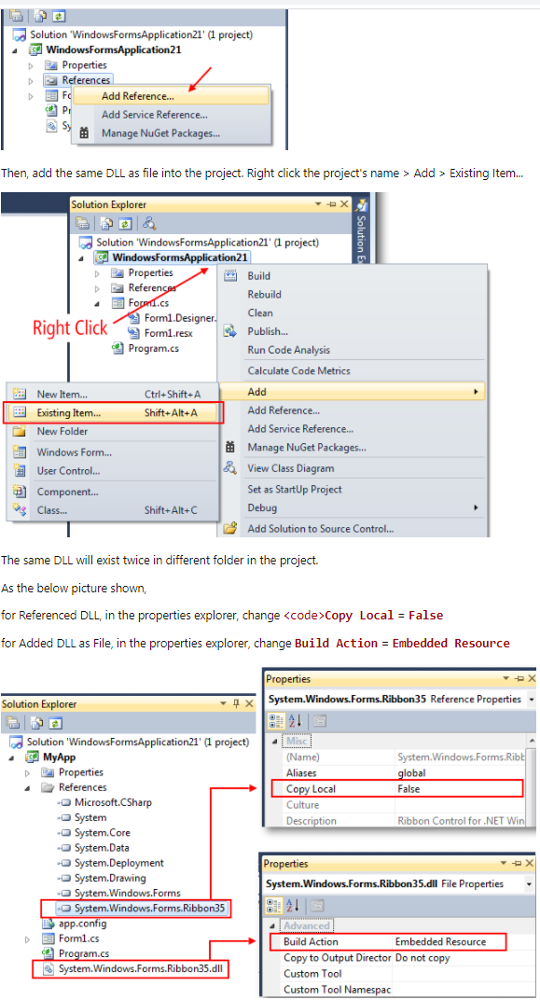
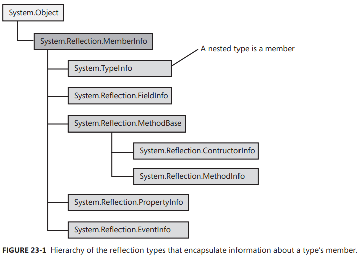

Chapter 23-Assembly Loading and Reflection
==============================

This chapter is all about discovering information about types, creating instances of then, and accessing their members when you didn't know anything about them at compile time.

## Assembly Loading

As you know, when the just-in-time (JIT) compiler compiles the Intermediate Language (IL) for a method, it sees what types are referenced in the IL code. Then at run time, the JIT compiler uses the assembly's TypeRef and AssemblyRef metadata tables to determine what assembly defines the type being referenced. The AssemblyRef metadata table entry contains all of the parts that make up the strong name of the assembly. (not sure why the author specificily mentions strong name, obvious weak name can be loaded in this approach with the public key set to null, will explain soon). The JIT compiler grabs all of these parts-name (without extension or path), version, culture, and public key token-concatenates them into a string, and then attempts to load an assembly matching this identity into the AppDomain (assuming that it's not already loaded). If the assembly being loaded is weaked named, the identity is just the name of the assembly (no version, culture, or public key token information, an concrete example will be demonstrated soon).

Internally, the CLR attempts to load this assembly by using the `System.Reflection.Assembly` class's static `Load` method:
```C#
public abstract class Assembly : ... {
   ...
   public static Assembly Load(string assemblyString);
   public static Assembly Load(AssemblyName assemblyRef);
   public static Assembly LoadFrom(String path);
   // Less commonly used overloads of Load are not shown
   
   public virtual string CodeBase { get; } 
   public virtual string FullName { get; }
   public virtual AssemblyName GetName();
}

public sealed class AssemblyName : ... {   // this class is a wrapper of assembly identify, 
                                           //so FullName property (assembly indentity string) is the most important
   ...
   public string CodeBase { get; set; }    // C:\Users\XXX\source\repos\ConsoleApp\bin\Debug\SomeLibrary\SomeLibrary.dll
                                           // this property is only useful when the assmebly is not found in default configurable folders
   public string Name { get; set; }        // "SomeLibrary"
   public Version Version { get; set; }
   public string CultureName { get; }
   public StrongNameKeyPair KeyPair { get; set; }
   public string FullName { get; }         // "SomeLibrary, Version=0.0.0.0, Culture=neutral, PublicKeyToken=01234567890abcde"

   public static AssemblyName GetAssemblyName(string assemblyFile);
   ...
}

static void Main(string[] args) {
   //Use Assembly Load(string assemblyString)
   string strongName = "SomeLibrary, Version=1.0.0.0, Culture=neutral, PublicKeyToken=01234567890abcde";   
   Assembly loadedStrongAssembly = Assembly.Load(strongName);

   string weakName = "SomeLibrary"; // as mentioned above that for weak assembly, the identity is just the name of the assembly
   //Or use alterantive weak name below, note that you do need to specific version and culture in this approach
   //string weakNameAlternative = "SomeLibrary, Version=1.0.0.0, Culture=neutral, PublicKeyToken=null"; 
   Assembly loadedWeakedAssembly = Assembly.Load(weakName);

   //---------------------------------------------------------------------------------------------------

   //Use Assembly Load(AssemblyName assemblyRef)
   AssemblyName an = AssemblyName.GetAssemblyName(@"C:\Users\XXX\source\repos\ConsoleApp\bin\Debug\SomeLibrary.dll");
   Assembly asm = Assembly.Load(an);

   //---------------------------------------------------------------------------------------------------
   // Demonstate that public static Assembly.Load(AssemblyName assemblyRef) uses AssemblyName.FullName
   // and pass this string to public static Assembly.Load(string assemblyString) internally
   an.Name = "SomeLibraryNonExist";   // it will change FullName property indirectly
   Console.WriteLine(an.FullName);    // "SomeLibraryNonExist, Version=0.0.0.0, Culture=neutral, PublicKeyToken=01234567890abcde"
   Assembly asm = Assembly.Load(an);  // <--error, throw System.IO.FileLoadException :Could not load file or assembly ///
}
```
Internally, `Load` causes the CLR to apply a version-binding redirection policy to the assembly and looks for the assembly in the GAC, followed by the application's base directory, private path subdirectories, and codebase location. If you call Load by passing a weakly named assembly, Load doesn’t apply a version-binding redirection policy to the assembly, and the CLR won't look in the GAC for the assembly. If Load finds the specified assembly, it returns a reference to an Assembly object that represents the loaded assembly. If Load fails to find the specified assembly, it throws a `System.IO.FileNotFoundException`.

Note that inside `Assembly.Load(AssemblyName assemblyRef)` method, `assemblyRef.FullName` is first retrieved, then this identify get passed to `Assembly.Load(string assemblyString)`. Because of this, if you use `AssemblyName` associating with a file name and pass it to `Assembly.Load(AssemblyName assemblyRef)` method, you might load a different file (or even load assembly from GAC). We know that CLR probe assembly in this default order:
```
GAC directory if it is a strong assembly
AppDir\AsmName.dll
AppDir\AsmName\AsmName.dll
AppDir\firstPrivatePath\AsmName.dll
AppDir\firstPrivatePath\AsmName\AsmName.dll
AppDir\secondPrivatePath\AsmName.dll
AppDir\secondPrivatePath\AsmName\AsmName.dll

// firstPrivatePath and secondPrivatePath are specified via the config file's privatePath attribute
```
 So if you create a folder that has the same name of the assembly under debug folder and place the assembly in this newly created folder as `C:\Users\XXX\source\repos\ConsoleApp\bin\Debug\SomeLibrary\SomeLibrary.dll`, and then pass this new path to `AssemblyName.GetAssemblyName()`, then you will load this file in `...Debug\SomeLibrary.dll` instead of `...Debug\SomeLibrary\SomeLibrary.dll`, becuase eventually it is the identify name that will be used by Assembly's Load method.

Another example, let's say a strong name assembly `SomeLibrary.dll` is in the debug folder as `...Debug\SomeLibrary.dll` and we have previous installed it to GAC, then you try to pass `...Debug\SomeLibrary.dll` as a file name (contains a specified path) to `AssemblyName.GetAssemblyName(string assemblyFile)` method(a explicit request that you want to load the assembly file under debug folder) then calls `Assembly.Load(returnedReferencedOfAssemblyName);`, you will find the assembly in GAC will be loaded instead of the counterpart in Debug folder, you can verify by querying `Assembly.CodeBase` static method which returns a string of `C:/WINDOWS/Microsoft.Net/assembly/GAC_MSIL/SomeLibrary/v4.0_0.0.0.0__01234567890abcde/SomeLibrary.dll`, so `Assembly.CodeBase` is the real place you load assembly from.


<div class="alert alert-info p-1" role="alert">
   Keep in mind that no matter what method you uses takes a file string to load an assembly, it is always the assembly identity string will be used eventually by Assembly's <code>Load(string assemblyString)</code> method. In a nutshell, assembly identity string will be generated/concatenateed using name, version, culture, public key from the file's metadata table, then this assembly identity string will be used by Assembly's <code>Load(string assemblyString)</code> method. It is this feature that makes you might load a different file when you actually specific a assembly file to load.
</div>

In most dynamically extensible applications, Assembly's `Load(String assemblyString)` method is the preferred way of loading an assembly into an AppDomain. However, it does require that you have all of the pieces that make up an assembly's identify, and that's why the name of the parameter is called "assemblyString", compared to "assemblyFile" in AssemblyName's GetAssemblyName(string assemblyFile).

To load an assembly specifying a path name in one step, you can call `Assembly.LoadFrom(String path)` method, which internally calls `AssemblyName.GetAssemblyName(string assemblyFile);`, which opens the specified file, finds the AssemblyDef metadata table's entry, and extracts the assembly identify information and returns it in a `System.Reflection.AssemblyName` object (the file is also closed). Then, LoadFrom internally calls Assembly's Load method, passing it the AssemblyName object. At this point, the CLR applies a version-binding redirection policy and searches the various locations looking for a matching assembly. If Load finds the assembly, it will load it, and an Assembly object that represents the loaded assembly will be returned; If Load fails to find an assembly (probably because the assembly identity string doesn't match), LoadFrom loads the assembly at the path name specified in LoadFrom's argument (it could happen when you specifically configure CLR via the configure file to only search some certain folders while the assembly file path is not in those specified folders). Of course, if an assembly with the same identity is already loaded, LoadFrom simply returns an Assembly object that represents the already loaded assembly.

Let's look at an exaple how Load "fails" to find an assembly and then loads the assembly at the path name specified in LoadFrom's argument: 
```C#
// SomeLibrary.dll doesn't exist in Debug folder, only exists in Debug\AnotherFolder folder
static void Main(string[] args) {
   AssemblyName an = AssemblyName.GetAssemblyName(@"C:\Users\XXX\source\repos\ConsoleApp20\bin\Debug\AnotherFolder\SomeLibrary.dll");
   Assembly asm = Assembly.Load(an);   // CLR "fails" to load assembly in pre-configure folders, so CLR has to load the assembly in Debug\AnotherFolder folder
   
   an.CodeBase = @"C:\Users\XXX\source\repos\ConsoleApp20\bin\Debug\SomeLibrary.dll";
   Assembly asm2 = Assembly.Load(an);  //<--error throw a FileNotFoundException exception, because CLR really fails to load assembly in \Debug\AnotherFolder folder
}
```
Note that if SomeLibrary.dll does exist in Debug folder
```C#
static void Main(string[] args) {
   ...
   an.CodeBase = @"C:\NonExistFolder\SomeLibrary.dll";
   Assembly asm2 = Assembly.Load(an);  // successfully load the assembly
}
```
Note that even though you change the CodeBase to an invalid folder, the assembly will still be loaded successfully because only the assembly indentity matter once the assembly indentity string is obtained.

<div class="alert alert-info p-1" role="alert">
    As you can see from above examples, it is possible to have different assemblies on a single machine all with the same identity. Because LoadForm calls Load internally, it is possible that the CLR will not load the specified file and instead will load a different file, giving you unexpected behavior. It is highly recommended that each build of your assembly change the version number; this ensures that each vision has its own identity, and because of this, LoadFrom will work as expected.
</div>

If you are building a tool that simply analyzes an assembly's metadata via reflection, and you want to ensure that none of the code contained inside the assembly can execute, use `Assembly.ReflectionOnlyLoadFrom` method, or in some rarer cases, `Assembly.ReflectionOnly` method:
```C#
public class Assembly {
   public static Assembly ReflectionOnlyLoadFrom(String assemblyFile);
   public static Assembly ReflectionOnlyLoad(String assemblyString);
}
```
The ReflectionOnlyLoadFrom method will load the file specified by the path; the string name identity of the file is not obtained, and the file is not searched for in the GAC or elsewhere. The ReflectionOnlyLoad method will search for the specified assembly looking in the GAC, application base directory, private paths, and codebases. However, unlike the Load method, the ReflectionOnlyLoad method does not apply versioning policies, so you will get the exact version that you specify. (the author probably means version redirecting by the config file).

When an assembly is loaded with ReflectionOnlyLoadFrom or ReflectionOnlyLoad, the CLR forbids any code in the assembly from executing; any attempt to execute code in an assembly loaded with either of these methods causes the CLR to throw an InvalidOperationException. These methods allow a tool to load an assembly that was delay-signed, would normally require security permissions that prevent it from loading, or was created for a different CPU architecture.

Many applications consist of an EXE file that depends on many DLL files. When deploying this application, all the files must be deployed. However, there is a technique that you can use to deploy just a single EXE file:


This causes the C# compiler to embed the DLL file(s) into your EXE file, and you can deploy this one EXE file, and you can use `Assembly GetManifestResourceNames` method to query these files.

At run time, the CLR won't be able to find the dependent DLL assemblies, which is a problem. To fix this, when your application initializes, register a callback method with the AppDomain's ResolveAssembly event. The callback method’s code should look something like the following:
```C#
class Test {
   public static void Main() {
      AppDomain currentDomain = AppDomain.CurrentDomain;

      // This call will fail to create an instance of MyType since the assembly resolver is not set
      InstantiateMyTypeFail(currentDomain);

      currentDomain.AssemblyResolve += new ResolveEventHandler(MyResolveEventHandler);

      // This call will succeed in creating an instance of MyType since the assembly resolver is now set.
      InstantiateMyTypeFail(currentDomain);
   }

   private static void InstantiateMyTypeFail(AppDomain domain) {
      // Calling InstantiateMyType will always fail since the assembly info
      // given to CreateInstance is invalid.
      try {
         domain.CreateInstance("Assembly text name, Version, Culture, PublicKeyToken", "MyType");   // invalid assembly identity string
      }
      catch (Exception e) {
         Console.WriteLine();
         Console.WriteLine(e.Message);
      }
   }

   private static void InstantiateMyTypeSucceed(AppDomain domain) {
      try {
         string asmname = Assembly.GetCallingAssembly().FullName;
         domain.CreateInstance(asmname, "MyType");
      }
      catch (Exception e) {
         Console.WriteLine();
         Console.WriteLine(e.Message);
      }
   }

   private static Assembly MyResolveEventHandler(object sender, ResolveEventArgs args) {
      String dllName = new AssemblyName(args.Name).Name + ".dll";

      var assem = Assembly.GetExecutingAssembly();

      String resourceName = assem.GetManifestResourceNames().FirstOrDefault(rn => rn.EndsWith(dllName));

      using (var stream = assem.GetManifestResourceStream(resourceName)) {
         Byte[] assemblyData = new Byte[stream.Length];
         stream.Read(assemblyData, 0, assemblyData.Length);
         return Assembly.Load(assemblyData);
      }
   }
}

public class MyType {
   public MyType() { }
}
```

## Reflection Performance

Reflection is an extremely powerful mechanism because it allows you to discover and use types and members at run time that you did not know about at compile time. This power does come with two main drawbacks:

<ul>
  <li>Reflection prevents type safety at compile time. Because reflection uses strings heavily, you lose type safety at compile time. For example, if you call Type.GetType("int"); to ask reflection to find a type called "int", the code compiles but returns null at run time because the CLR knows the "int" type as "System.Int32". </li>
  <li>Reflection is slow. When using reflection, the names of types and their members are not known at compile time; you discover them at run time by using a string name to identify each type and member. This means that reflection is constantly performing string searches as the types in the System.Reflection namespace scan through an assembly's metadata. Often, the string searches are case-insensitive comparisons, which can slow this down even more.</li>
</ul> 

Invoking a member by using reflection will also hurt performance. When using reflection to invoke a method, you must first package the arguments into an array; internally, reflection must unpack these on to the thread's stack. Also, the CLR must check that the arguments are of the correct data type before invoking a method. Finally, the CLR ensures that the caller has the proper security permission to access the member being invoked. For all of these reasons, it's best to avoid using reflection to access a field or invoke a method/ property.

## Discovering Types Defined in an Assembly

Reflection is frequently used to determine what types an assembly defines. The FCL offers many APIs to get this information. By far, the most commonly used API is `Assembly.ExportedTypes` property:
```C#
class Program {
   static void Main(string[] args) {
      String dataAssembly = "System.Data, version=4.0.0.0, " + "culture=neutral, PublicKeyToken=b77a5c561934e089";
      LoadAssemAndShowPublicTypes(dataAssembly);
      Console.ReadLine();
   }

   static void LoadAssemAndShowPublicTypes(String assemId) {
      // Explicitly load an assembly in to this AppDomain
      Assembly a = Assembly.Load(assemId);

      // Execute this loop once for each Type public-exported from the loaded assembly
      foreach (Type t in a.ExportedTypes) {
         // Display the full name of the type
         Console.WriteLine(t.FullName);
      }
   }
}
```

## What Exactly Is a Type Object?

Notice that the previous code iterates over a sequence of System.Type objects. The System.Type type is your starting point for doing type and object manipulations. A System.Type object represents a type reference (as opposed to a type definition).

```C#
public abstract class Type : MemberInfo ... {
   public bool IsAbstract { get; }
   public bool IsValueType { get; }
   public bool IsInterface { get; }
   public bool IsSealed { get; }
   public bool IsPublic { get; }
   ...
   // all with overloads such as public MethodInfo GetMethod(string name);
   public MemberInfo[] GetMembers();
   public MethodInfo[] GetMethods();
   public FieldInfo[] GetFields();
   public PropertyInfo[] GetProperties();
   public ConstructorInfo[] GetConstructors();
   ...
   public virtual bool IsGenericType { get; }
   public virtual bool IsGenericTypeDefinition { get; }   // false for Dictionary[String,Int32], true for Dictionary[TKey,TValue]
   public virtual bool IsConstructedGenericType { get; }  // check if it's closed type, always negation of IsGenericTypeDefinition
   ...
   
   public static Type GetType(string typeName);
   public static Type GetType(string typeName, bool throwOnError, bool ignoreCase);
   public static Type ReflectionOnlyGetType(string typeName, bool throwIfNotFound, bool ignoreCase);
   public abstract Type BaseType { get; }   //  Gets the type from which the current Type directly inherits. Direclty means only one level will be checked
   ...
   public abstract string FullName { get; }
   public abstract Assembly Assembly { get; }
   
   public override Type ReflectedType { get; }
   public virtual RuntimeTypeHandle TypeHandle { get; }
}

public abstract class TypeInfo : Type ... {
   // all with overloads such as public virtual MethodInfo GetDeclaredMethod(string name);
   public virtual IEnumerable<MemberInfo> DeclaredMembers { get; }
   public virtual IEnumerable<MethodInfo> DeclaredMethods { get; }
   public virtual IEnumerable<FieldInfo> DeclaredFields { get; }
   public virtual IEnumerable<PropertyInfo> DeclaredProperties { get; }
   public virtual IEnumerable<ConstructorInfo> DeclaredConstructors { get; }
   public virtual IEnumerable<Type> ImplementedInterfaces { get; }
   ...
   public virtual Type AsType();
   public virtual bool IsAssignableFrom(TypeInfo typeInfo);   // Check inherance hierarchy(multiple levels), true for BaseType.IsAssignableFrom(DeriveType)
   public virtual Type[] GenericTypeParameters { get; }   // Gets an array of the generic parameters of the current type.
}

namespace System.Reflection {
   public static class IntrospectionExtensions {
      public static TypeInfo GetTypeInfo(this Type type);
   }
}
```
The .NET 4.5 Framework includes some changes to the typical reflection use cases. Most importantly, the Type object has been split into two separate classes: Type and TypeInfo. A TypeInfo instance contains the definition for a Type, and a Type now contains only reference data. Getting a TypeInfo object forces the assembly that contains that type to load. In comparison, you can manipulate Type objects without necessarily requiring the runtime to load the assembly they reference.

Recall that System.Object defines a public, nonvirtual instance method named `GetType`. When you call this method, the CLR determines the specified object's type and returns a reference to its Type object. **Because there is only one Type object per type in an AppDomain, you can use equality and inequality operators to see whether two objects are of the same type**:
```C#
private static Boolean AreObjectsTheSameType(Object o1, Object o2) {
   return o1.GetType() == o2.GetType();
}
```
In addition to calling Object's GetType method, the FCL offers several more ways to obtain a Type object:

The System.Type type offers several overloaded versions of the static GetType method. All versions of this method take a String. The string must specify the full name of the type (including its namespace). Note that the primitive type names supported by the compiler (such as int, string, bool, and so on) aren't allowed because these names mean nothing to the CLR. If the string is simply the name of a type, the method checks the calling assembly to see whether it defines a type of the specified name. If it does, a reference to the appropriate Type object is returned.
 
If the calling assembly doesn't define the specified type, the types defined by `MSCorLib.dll` are checked. If a type with a matching name still can't be found, null is returned or a System.TypeLoadException is thrown, depending on which overload of the GetType method you called and what parameters you passed to it.

Many programming languages also offer an operator that allows you to obtain a Type object from a type name that is known at compile time. When possible, you should use this operator to obtain a reference to a Type instead of using any of the methods, because the operator generally produces faster code. In C#, the operator is called typeof, and you use this operator typically to compare late-bound type information with early-bound (known at compile time) type information:
```C#
private static void SomeMethod(Object o) {
   // GetType returns the type of the object at runtime (late-bound)
   // typeof returns the type of the specified class (early-bound)
   if (o.GetType() == typeof(FileInfo)) { ... }
   if (o.GetType() == typeof(DirectoryInfo)) { ... }
}
```
<div class="alert alert-info p-1" role="alert">
   The first if statement in the code checks whether the variable o refers to an object of the FileInfo type; it does not check whether o refers to an object that is derived from the FileInfo type. In other words, the preceding code tests for an exact match, not a compatible match, which is what you would get if you use a cast or C#'s is or as operators.
</div>

Let's look some code in regards to base-derived relationship:
```C#
static void Main(string[] args) {
   Derived derivedType = new Derived();
   if (derivedType.GetType() == typeof(Base)) { // false; }

   Base baseType = new Derived();
   if (baseType.GetType() == typeof(Base)) { // false; }
   if (baseType.GetType() == typeof(Derived)) { // true; }

   MemberInfo[] derivedMembers = derivedType.GetType().GetMembers();  // derivedMembers includes its parent's baseName
}

class Base {
   public String baseName = "Base";
}

class Derived : Base {
   public String derivedName = "Derived";
}
```


As mentioned earlier, a Type object represents a type reference that is a lightweight object. If you want to learn more about the type itself, then you must acquire a TypeInfo object, which represents a type definition. You can convert a Type object to a TypeInfo object by calling `System.Reflection.IntrospectionExtensions.GetTypeInfo` extension method:
```C#
Type typeReference = ...; // For example: o.GetType() or typeof(Object)
TypeInfo typeDefinition = typeReference.GetTypeInfo();
```
Obtaining a TypeInfo object forces the CLR to resolve the type by ensuring that the assembly that defines the type is loaded. This can be an expensive operation that can be avoided if all you need are type references (Type objects).

## Building a Hierarchy of Exception-Derived Types
The following code uses many of the concepts discussed already in this chapter to load a bunch of assemblies into the AppDomain and display all of the classes that are ultimately derived from System.Exception:
```C#
class Program {
   static void Main(string[] args) {
      // Explicitly load the assemblies that we want to reflect over
      LoadAssemblies();
      var allTypes = (from a in AppDomain.CurrentDomain.GetAssemblies()
                      from t in a.ExportedTypes
                      where typeof(Exception).GetTypeInfo().IsAssignableFrom(t.GetTypeInfo())   // this line is important as it check inheritence
                      orderby t.Name
                      select t).ToArray();

      // Filter & sort all the types
      Console.WriteLine(WalkInheritanceHierarchy(new StringBuilder(), 0, typeof(Exception), allTypes));
      Console.ReadLine();
   }

   static StringBuilder WalkInheritanceHierarchy(StringBuilder sb, Int32 indent, Type baseType, IEnumerable<Type> allTypes) {
      String spaces = new String(' ', indent * 3);
      sb.AppendLine(spaces + baseType.FullName);
      foreach (var t in allTypes) {
         if (t.GetTypeInfo().BaseType != baseType)
            continue;
         WalkInheritanceHierarchy(sb, indent + 1, t, allTypes);
      }
      return sb;
   }

   static void LoadAssemblies() {
      String[] assemblies = {
             "System, PublicKeyToken={0}",
             "System.Core, PublicKeyToken={0}",
             "System.Data, PublicKeyToken={0}",
             "System.Design, PublicKeyToken={1}",
             "System.DirectoryServices, PublicKeyToken={1}",
             "System.Drawing, PublicKeyToken={1}",
             "System.Drawing.Design, PublicKeyToken={1}",
             "System.Management, PublicKeyToken={1}",
             "System.Messaging, PublicKeyToken={1}",
             "System.Runtime.Remoting, PublicKeyToken={0}",
             "System.Security, PublicKeyToken={1}",
             "System.ServiceProcess, PublicKeyToken={1}",
             "System.Web, PublicKeyToken={1}",
             "System.Web.RegularExpressions, PublicKeyToken={1}",
             "System.Web.Services, PublicKeyToken={1}",
             "System.Xml, PublicKeyToken={0}",
         };

      String EcmaPublicKeyToken = "b77a5c561934e089";
      String MSPublicKeyToken = "b03f5f7f11d50a3a";

      // Get the version of the assembly containing System.Object
      // We'll assume the same version for all the other assemblies
      Version version = typeof(Object).Assembly.GetName().Version;

      // Explicitly load the assemblies that we want to reflect over
      foreach (String a in assemblies) {
         String AssemblyIdentity = String.Format(a, EcmaPublicKeyToken, MSPublicKeyToken) + ", Culture=neutral, Version=" + version;
         Assembly.Load(AssemblyIdentity);
      }
   }
}
```

## Constructing an Instance of a Type
After you have a reference to a Type-derived object, you might want to construct an instance of this type. The FCL offers several mechanisms to accomplish this:

<ul>
  <li><b>System.Activator.CreateInstance</b> methods. The Activator class offers several moverloads of its static CreateInstance method. When you call this method, you can pass either a reference to a Type object or a String that identifies the type of object you want to create. The versions that take a type are simpler. 
  </br></br>
  The versions of this method in which you specify the desired type by using a string are a bit more complex. You must also specify a assembly identify string that represents the assembly as the first parameter. Secondly, these version don't return a reference to the new object. Instead, they return a ObjectHandle.
  </br></br>
  An ObjectHandle is a type that allows an object created on one AppDomain to be passed around to other AppDomain without forcing the object to materialize. When you're ready to materialize the obejct, you call ObjectaHandle's UnWrap method. This method loads the assembly that defines the type being materialized in the AppDomain where Unwrapi is called. If the object is being marshaled by reference, the proxy type and object are created. If the object is being marshaled by value, the copy is deserialized.
  </li>
  <li><b>System.Activator.CreateInstanceFrom</b> methods. The Activator class also offers a set of static CreateInstanceFrom methods. These methods behave just as the CreateInstance method, except that you must always specify the type and its assembly via string parameters. The assembly is loaded into the calling AppDomain by using Assembly's LoadFrom method (instead of Load). Because none of these methods takes a Type parameter, all of the CreateInstanceFrom methods return a reference to an ObjectHandle, which must be unwrapped.</li>
  <li><b>System.AppDomain's methods</b> The AppDomain type offers four instance methods (each with several overloads) that construct an instance of a type: CreateInstance, CreateInstanceAndUnwrap, CreateInstanceFrom, and CreateInstanceFromAndUnwrap. These methods work just as Activator’s methods except that these methods are instance methods, allowing you to specify which AppDomain the object should be constructed in. The methods that end with Unwrap exist for convenience so that you don’t have to make an additional method call.</li>
  <li><b>System.Reflection.ConstructorInfo</b>'s Invoke instance method. Using a reference to a TypeInfo object, you can bind to a particular constructor and obtain a reference to the constructor's ConstructorInfo object. The type is always created in the calling AppDomain, and a reference to the new object is returned. I'll also discuss this method in more detail later in this chapter.</li>
</ul> 

```C#
public sealed class Activator : _Activator {
   public static object CreateInstance(Type type);  
   public static object CreateInstance(Type type, params object[] args);
   public static object CreateInstance(Type type, bool nonPublic); // nonPublic to control public/nonpublic default constructor,
   public static T CreateInstance<T>();   // using the parameterless constructor, suitable for struct
   ...
   public static ObjectHandle CreateInstance(string assemblyName, string typeName);
   ...
}

public class ObjectHandle : MarshalByRefObject ... { 
   ...
   public object Unwrap();
}
```
<div class="alert alert-info p-1" role="alert">
   The CLR doesn't require that value types define any constructors. However, this is a problem because all of the mechanisms in the preceding list construct an object by calling its constructor.  However, Activator's CreateInstance methods will allow you to create an instance of a value type without calling a constructor.If you want to create an instance of a value type without calling a constructor, you must call the version of the CreateInstance method that takes a single Type parameter or the version that takes Type and Boolean parameters.
</div>

The mechanisms just listed allow you to create an object for all types except for arrays (System.Array-derived types) and delegates (System MulticastDelegate-derived types). To create an array, you should call Array's static CreateInstance method (several overloaded versions exist).To create a delegate, you should call MethodInfo's CreateDelegate method.

To construct an instance of a generic type, first get a reference to the open type, and then call Type's MakeGenericType method, passing in an array of types that you want to use as the type arguments. Then, take the returned Type object and pass it into one of the various methods previously listed:
```C#
internal sealed class MyDictionary<TKey, TValue> { }

static void Main(string[] args) {
   // Get a reference to the generic type's type object
   Type openType = typeof(MyDictionary<,>);

   // Close the generic type by using TKey=String, TValue=Int32
   Type closedType = openType.MakeGenericType(typeof(String), typeof(Int32));

   // Construct an instance of the closed type
   Object o = Activator.CreateInstance(closedType);

   Console.WriteLine(o.GetType());
}
// note that this approach is for scnerios that you don't know the generic type argument would be
// you can get type of closed type directly e.g Type closedeType = typeof(MyDictionary<String, Int32>);
//the above example should really be:
static void Test(Object o1, Object o2) {
   Type openType = typeof(MyDictionary<,>);
   Type closedType = openType.MakeGenericType(o1.GetType(), o2.GetType());
   Object o = Activator.CreateInstance(closedType);
}
```

## Designing an Application(uses SDK) That Supports Add-Ins

When you're building extensible applications, interfaces should be the centerpiece. You could use a base class instead of an interface, but in general, an interface is preferred because it allows add-in developers to choose their own base class. Suppose, for example, that you're writting an application and you want others to be able to create types that your application can lod and use seamlessly. Here's the way to design this application:

<ul>
  <li>Create a Host SDK assembly that defines an interface whose methods are used as the communication mechanism between the host application and the add-in components. When defining the parameters and return types for the interface methods, try to use other interfaces or types defined in MSCorLib.dll. If you want to pass and return your own data types, define them in this Host SDK Assembly, too. After you settle on your interface definitions, give this assembly a strong name, and then package and deploy it to your partners and users. Once published, you should really avoid making any kind of breaking changes to the types in this assembly. For example, do not change the interface in any way. However, if you define any data types, it is OK to add new members.</li>
  <li>The add-in developers will, of course, define their own types in their own Add-In assembly. Their Add-In assembly will reference the types in your Host SDK assembly. The add-in developers are able to put out a new version of their assembly as often as they'd like, and the host application will be able to consume the add-in types without any problem whatsoever.</li>
  <li>Create a separate Host Application assembly containing your application's type. This assembly will obviously reference the Host SDK assembly and use the types defined in it.  Feel free to modify the code in the Host Application assembly to your heart's desire. Because the add-in developers don't reference the Host Application assembly, you can put out a new version of it every hour if you want to and not affect any of the add-in developers.</li>
</ul> 

<div class="alert alert-info p-1" role="alert">
   By creating a separate SDK for application developers (those who rely on framework) to reference, the software engineers (those who design the framework) can change the host application (e.g. .net framework source code) as they want and therefore produces a different/improved assembly, then it won't affect the application developers who only references the SDK, and SDK won't get changed as often as host application, and even SDK does get changed (new types added) and application developers doesn't reference the latest SDK, it is not a problem becuase of the nature of backward compatibility.
</div>

Full code:
```C#
//  HostSDK.dll
namespace Wintellect.HostSDK {
    public interface IAddIn {
      String DoSomething(Int32 x);
   }
}

//AddInTypes.dll maintained by application developer
using Wintellect.HostSDK;

public sealed class AddIn_A : IAddIn {
   public AddIn_A() { }

   public String DoSomething(Int32 x) {
      return "AddIn_A: " + x.ToString();
   }
}

public sealed class AddIn_B : IAddIn {
   public AddIn_B() { }

   public String DoSomething(Int32 x) {
      return "AddIn_B: " + (x * 2).ToString();
   }
}

// Host.dll
using Wintellect.HostSDK;

namespace Host {
   class Program {
      static void Main(string[] args) {
         // Find the directory that contains the Host exe
         String AddInDir = Path.GetDirectoryName(Assembly.GetEntryAssembly().Location);

         // Assume AddIn assemblies are in same directory as host's EXE file
         var AddInAssemblies = Directory.EnumerateFiles(AddInDir, "*.dll");

         // Create a collection of Add-In Types usable by the host
         IEnumerable<Type> AddInTypes = 
            from file in AddInAssemblies
            let assembly = Assembly.Load(file)
            from t in assembly.ExportedTypes // Publicly-exported types
            // Type is usable if it is a class that implements IAddIn
            where t.IsClass && typeof(IAddIn).GetTypeInfo().IsAssignableFrom(t.GetTypeInfo())
            select t;
         // Here's how the host can construct Add-In objects and use them
         foreach (Type t in AddInTypes) {
            IAddIn ai = (IAddIn)Activator.CreateInstance(t);
         }
      }
   }
}
```

## Discovering a Type’s Members

Fields, constructors, methods, properties, events, and nested types can all be defined as members within a type. The FCL contains a type called `System.Reflection.MemberInfo`. This class is an abstract base class that encapsulates a bunch of properties common to all type members. Derived
from MemberInfo are a bunch of classes; each class encapsulates some more properties related to a specific type member. Figure 23-1 shows the hierarchy of these types:


```C#
public abstract class MemberInfo : ... {
   public abstract string Name { get; }
   public abstract Type DeclaringType { get; }
   public virtual Module Module { get; }
   public virtual IEnumerable<CustomAttributeData> CustomAttributes { get; }
   ...
}
```

```C#
static void Main(string[] args) {
   // Loop through all assemblies loaded in this AppDomain
   Assembly[] assembliesAll = AppDomain.CurrentDomain.GetAssemblies();
   Assembly[] assemblies = assembliesAll.Skip(1).Take(1).ToArray();

   foreach (Assembly a in assemblies) {
      var type = a.GetExportedTypes()[0];
      var typeinfo = type.GetTypeInfo();
      Show(0, "Assembly: {0}", a);

      // Find Types in the assembly
      foreach (Type t in a.ExportedTypes) {
         Show(1, "Type: {0}", t);

         // Discover the type's members
         foreach (MemberInfo mi in t.GetTypeInfo().DeclaredMembers) {
            String typeName = String.Empty;
            if (mi is Type)
               typeName = "(Nested) Type"
            if (mi is FieldInfo)
               typeName = "FieldInfo"
            if (mi is MethodInfo)
               typeName = "MethodInfo"
            if (mi is ConstructorInfo)
               typeName = "ConstructoInfo"
            if (mi is PropertyInfo)
               typeName = "PropertyInfo"
            if (mi is EventInfo)
               typeName = "EventInfo"
            Show(2, "{0}: {1}", typeName, mi);
         }
      }
   }
   Console.ReadLine();
}

static void Show(Int32 indent, String format, params Object[] args) {
   Console.WriteLine(new String(' ', 3 * indent) + format, args);
}
```

From a type, it is also possible to discover the interfaces it implements:
```C#
public struct InterfaceMapping {
   public Type InterfaceType;
   public Type TargetType;
   public MethodInfo[] InterfaceMethods;
   public MethodInfo[] TargetMethods;
}

static void Main(string[] args) {
   // Find interfaces implemented by MyRetailer where the interface is defined in our own assembly.
   TypeInfo ti = typeof(MyRetailer).GetTypeInfo();
   IEnumerable<Type> interfaces = ti.ImplementedInterfaces.Where(i => i.Assembly == typeof(Program).Assembly);  // Filter out the IDisposable who is defined in the MSCorLib.dll(.net framework) or System.Runtime.dll (.net core)
   Console.WriteLine("MyRetailer implements the following interfaces (defined in this assembly):");

   foreach (Type i in interfaces) {
      Console.WriteLine("\nInterface: " + i);

      // Get the type methods that map to the interface's methods
      InterfaceMapping map = ti.GetRuntimeInterfaceMap(i);

      for (Int32 m = 0; m < map.InterfaceMethods.Length; m++) {
         // Display the interface method name and which type method implements the interface method.
         Console.WriteLine("   {0} is implemented by {1}", map.InterfaceMethods[m], map.TargetMethods[m]);
      }
   }
}

interface IBookRetailer : IDisposable {
   void Purchase();
   void ApplyDiscount();
}

interface IMusicRetailer {
   void Purchase();
}

class MyRetailer : IBookRetailer, IMusicRetailer, IDisposable {
   // IBookRetailer methods
   void IBookRetailer.Purchase() { }
   public void ApplyDiscount() { }

   // IMusicRetailer method
   void IMusicRetailer.Purchase() { }

   // IDisposable method
   public void Dispose() { }

   // MyRetailer method (not an interface method)
   public void Purchase() { }
}
```
And from a constructor, method, property accessor method, or event add/remove method, you can call the `GetParameters` method to obtain an array of `ParameterInfo` objects. You can also query the read-only `ReturnParameter` property to get a ParameterInfo object for detailed information about a member's return type.

## Invoking a Type's Members

Now you know how to discover the members defined by a type, you may want to invoke one of these members. What invoke means depends on the kind of member being invoked. Table below shows which method to call for each kind of member to invoke that member:

| Type of Member | Method to Invoke Member |
| -------------- | -------- |
| FieldInfo | Call **GetValue** to get a field's value. </br>Call **SetValue** to set a field's value. |
| ConstructorInfo | Call **Invoke** to construct an instance of the type and call a constructor.  |
| MethodInfo | Call **Invoke** to call a method of the type.  |
| PropertyInfo | Call **GetValue** to call a property's get access method. </br>Call **SetValue** to call a property's set accessor method. |
| EventInfo | Caa **AddEventHandler** to call an event's add access method. </br>Call **RemoveEventHandler** to call an event's remove access method. |

The following sample application demonstrates the various ways to use reflection to access a type's members:
```C#
static void Main(string[] args) {
   //BindToMemberThenInvokeTheMember(typeof(SomeType));
   //BindToMemberCreateDelegateToMemberThenInvokeTheMember(typeof(SomeType));
   UseDynamicToBindAndInvokeTheMember(typeof(SomeType));
   Console.ReadLine();
}

static void BindToMemberThenInvokeTheMember(Type t) {
   Console.WriteLine("BindToMemberThenInvokeTheMember");
   // Construct an instance
   Type ctorArgument = Type.GetType("System.Int32&"); // or typeof(Int32).MakeByRefType();
   ConstructorInfo ctor = t.GetTypeInfo().DeclaredConstructors.First(c => c.GetParameters()[0].ParameterType == ctorArgument);
   Object[] args = new object[] { 12 };  // Constructor arguments
   Console.WriteLine("x before constructor called: " + args[0]);
   Object obj = ctor.Invoke(args);
   Console.WriteLine("Type: " + obj.GetType());
   Console.WriteLine("x after constructor returns: " + args[0]);

   // Read and write to a field
   FieldInfo fi = obj.GetType().GetTypeInfo().GetDeclaredField("m_someField");
   fi.SetValue(obj, 33);
   Console.WriteLine("someField: " + fi.GetValue(obj));
   // Call a method
   MethodInfo mi = obj.GetType().GetTypeInfo().GetDeclaredMethod("ToString");
   String s = (String)mi.Invoke(obj, null);
   Console.WriteLine("ToString: " + s);

   // Read and write a property
   PropertyInfo pi = obj.GetType().GetTypeInfo().GetDeclaredProperty("SomeProp");
   try {
      pi.SetValue(obj, 0, null);
   }
   catch (TargetInvocationException e) {
      if (e.InnerException.GetType() != typeof(ArgumentOutOfRangeException))
         throw;
      Console.WriteLine("Property set catch.");
   }
   pi.SetValue(obj, 2, null);
   Console.WriteLine("SomeProp: " + pi.GetValue(obj, null));

   // Add and remove a delegate from the event
   EventInfo ei = obj.GetType().GetTypeInfo().GetDeclaredEvent("SomeEvent");
   EventHandler eh = new EventHandler(EventCallback); 
   ei.AddEventHandler(obj, eh);
   ei.RemoveEventHandler(obj, eh);
}

static void BindToMemberCreateDelegateToMemberThenInvokeTheMember(Type t) {
   Console.WriteLine("BindToMemberCreateDelegateToMemberThenInvokeTheMember");

   // Construct an instance (You can't create a delegate from a constructor like example above)
   Object[] args = new object[] { 12 };   // Constructor arguments
                                          //Console.WriteLine("x before constructor called: ", args[0]);
   Object obj = Activator.CreateInstance(t, args);
   Console.WriteLine("Type: " + obj.GetType().ToString());
   Console.WriteLine("x after constructor returns: " + args[0]);


   // Call a method
   MethodInfo mi = obj.GetType().GetTypeInfo().GetDeclaredMethod("ToString");
   Func<String> toString = mi.CreateDelegate(typeof(Func<String>), obj) as Func<String>;
   String s = toString.Invoke();
   Console.WriteLine("ToString: " + s);

   // Read and write a property
   PropertyInfo pi = obj.GetType().GetTypeInfo().GetDeclaredProperty("SomeProp");
   Action<Int32> setSomeProp = pi.SetMethod.CreateDelegate(typeof(Action<Int32>), obj) as Action<Int32>;
   try {
      setSomeProp(0);
   }
   catch (ArgumentOutOfRangeException) {
      Console.WriteLine("Property set catch.");
   }
   setSomeProp(2);
   Func<Int32> getSomeProp = pi.GetMethod.CreateDelegate(typeof(Func<Int32>), obj) as Func<Int32>;
   Console.WriteLine("SomeProp: " + getSomeProp());

   // Add and remove a delegate from the event
   EventInfo ei = obj.GetType().GetTypeInfo().GetDeclaredEvent("SomeEvent");
   Action<EventHandler> addSomeEvent = ei.AddMethod.CreateDelegate(typeof(Action<EventHandler>), obj) as Action<EventHandler>;
   addSomeEvent(EventCallback);

   Action<EventHandler> removeSomeEvent = ei.RemoveMethod.CreateDelegate(typeof(Action<EventHandler>), obj) as Action<EventHandler>;
   removeSomeEvent(EventCallback);
}

// Callback method added to the event
static void EventCallback(Object sender, EventArgs e) { }

static void UseDynamicToBindAndInvokeTheMember(Type t) {
   Console.WriteLine("UseDynamicToBindAndInvokeTheMember");

   // Construct an instance (You can't use dynamic to call a constructor)
   Object[] args = new Object[] { 12 }; // Constructor arguments

   Type ctorArgument = Type.GetType("System.Int32&"); // or typeof(Int32).MakeByRefType();
   ConstructorInfo ctor = t.GetTypeInfo().DeclaredConstructors.First(c => c.GetParameters()[0].ParameterType == ctorArgument);

   //dynamic obj = ctor.Invoke(args);
   dynamic obj = Activator.CreateInstance(t, args);
   Console.WriteLine("Type: " + obj.GetType().ToString());
   Console.WriteLine("x after constructor returns: " + args[0]);

   // Read and write to a field
   try {
      obj.m_someField = 5;
      Int32 v = (Int32)obj.m_someField;
      Console.WriteLine("someField: " + v);
   }
   catch (RuntimeBinderException e) {
      // We get here because the field is private
      Console.WriteLine("Failed to access field: " + e.Message);
   }
   //...
}

class SomeType {
   private Int32 m_someField;
   public SomeType(ref Int32 x) {
      x *= 2;
      m_someField = x;
   }
   public override string ToString() {
      return m_someField.ToString();
   }

   public string GetString(string s) {
      return "This is " + s;
   }

   public Int32 SomeProp {
      get { return m_someField; }
      set {
         if (value < 1)
            throw new ArgumentOutOfRangeException("value");
         m_someField = value;
      }
   }
   public event EventHandler SomeEvent;
   private void NoCompilerWarnings() {
      SomeEvent.ToString();
   }
}
```
<!-- <code>&lt;T&gt;<code> -->

<!-- <div class="alert alert-info p-1" role="alert">
    
</div> -->

<!-- <div class="alert alert-info pt-2 pb-0" role="alert">
    <ul class="pl-1">
      <li></li>
      <li></li>
    </ul>  
</div> -->

<!-- <ul>
  <li></li>
  <li></li>
  <li></li>
  <li></li>
</ul>  -->

<!-- <ul>
  <li><b></b></li>
  <li><b></b></li>
  <li><b></b></li>
  <li><b></b></li>
</ul>  -->

<!--  -->

<!-- <span style="color:red">hurt</span> -->

<style type="text/css">
.markdown-body {
  max-width: 1800px;
  margin-left: auto;
  margin-right: auto;
}
</style>

<link rel="stylesheet" href="./zCSS/bootstrap.min.css">
<script src="./zCSS/jquery-3.3.1.slim.min.js"></script>
<script src="./zCSS/popper.min.js"></script>
<script src="./zCSS/bootstrap.min.js"></script>