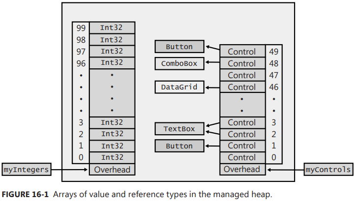

Chapter 29-Primitive Thread Synchronization Constructs
==============================

Thread synchronization is used to prevent corruption when multiple threads access shared data at the same time. I emphasize *at the same time*, because thread synchronization is all about timing. If you have some data that is accessed by two thrads and thoses threads cannot possibly touch the data simulataneously, then thread synchronization is not required at all. In Chapter 28, I discussed how different sections of async functions can be executed by different threads.  Here we could potentially have two different threads accessing the same variables and data. But async functions are implemented in such a way that it is impossible for two threads to access this same data at the same time. Therefore, no thread synchronization is required when code accesses data contained within the async function.

Thread synchronization has many problems associated with it. First, it is tedious and extremely error-prone. In your code, you must identify all data that could potentially be touched by multiple threads at the same time. Then you must surround this code with additional code that acquires and releases a thread synchronization lock. **The lock ensures that only one thread at a time can access the resource**. If you forget to surround just one block of code with a lock, then the data will become corrupted. Also, there is no way to prove that you have added all your locking code correctly. You just have to run your application, stress-test it a lot, and hope that nothing goes wrong. In fact, you should test your application on a machine that has as many CPUs as possible because the more CPUs you have, the better chance that two or more threads will attempt to access the resource at the same time, making it more likely you'll detect a problem.

The second problem with locks is that they hurt performance. It takes time to acquire and release a lock because there are additional method calls, and because the CPUs must coordinate with each other to determine which thread will acquire the lock first. Having the CPUs in the machine communicate with each other this way hurts performance.

The third problem with thread synchronization locks is that they allow only one thread to access the resource at a time. This is the lock’s whole reason for existing, but it is also a problem, because blocking a thread causes more threads to be created. So, for example, **if a thread pool thread attempts to acquire a lock that it cannot have, it is likely that the thread pool will create a new thread to keep the CPU's saturated with work**. Creating a thread
is very expensive in terms of both memory and performance. And to make matters even worse, when the blocked thread gets to run again, it will run with this new thread pool thread; Windows is now scheduling more threads than there are CPUs, and this increases context switching, which also hurts performance.

The summary of all of this is that thread synchronization is bad, so you should try to design your applications to avoid as much of it as possible. To that end, you should avoid shared data such as static fields. Try to use value types because they are always copied, so each thread operates on its own copy. Finally, it is OK to have multiple threads accessing shared data simultaneously if that access is readonly. The String type is an example of this: after a String object is created, it is immutable; so many threads can access a single String object at the same time without any chance of the String object becoming corrupted.

## Class Libraries and Thread Safety

**Microsoft's Framework Class Library (FCL) gurantees that all static methods are thread safe. This means that if two threads call a static method at the same time, no data will get corrupted**. The FCl had to do this internally because thiese is no way that mutiple companies producing different assemblies could coordinate on a single lock for arbitrating addcess to the resource. The `Console` class contains a static field, inside which many of its methods acquire and release to ensure that only one thread at a time is accessing the console.

Making a method thread safe does not mean that it internally takes a thread synchronization lock. A thread-safe method means that data doesn’t get corrupted if two threads attempt to access the data at the same time. The `System.Math` class has a static `Max` method implemented as follows:
```C#
public static Int32 Max(Int32 val1, Int32 val2) {
   return (val1 < val2) ? val2 : val1;
}
```
This method is thread safe even though it doesn't take any lock. Because Int32 is a value type, the two Int32 values passed to Max are copied into it and so, multiple threads could be calling Max simultaneously, but each thread is working on its own data, isolated from any other thread.

**On the other hand, the FCL does not guarantee that instance methods are thread safe because adding all the locking code would hurt performance too much**. And, in fact, if every instance method acquires and releases a lock, then you ultimately end up having just one thread running in your application at any given time, which hurts performance even more. As mentioned earlier, when a thread constructs an object, only this thread has a reference to the object, no other thread can access that object, and no thread synchronization is required when invoking instance methods. However, if the thread then exposes the reference to the object—by placing it in a static field, passing as the state argument to ThreadPool.QueueUserWorkItem or to a Task, and so on—then thread synchronization is required if the threads could attempt simultaneous non-read-only access.

It is recommended that your own class libraries follow this pattern; that is, make all your static methods thread safe and make all your instance methods not thread safe. There is one caveat to this pattern: if the purpose of the instance method is to coordinate threads, then the instance method should be thread safe. For example, one thread can cancel an operation by calling CancellationTokenSource's Cancel method, and another thread detects that it should stop what it's doing by querying the corresponding CancellationToken's IsCancellationRequested property. These two instance members have some special thread synchronization code inside them to ensure that the coordination of the two threads goes as expected ( Specifically, the field that both members access is marked as volatile, a concept that will be discussed later in this chapter).

## Primitive User-Mode and Kernel-Mode Constructs

I explain the *primitive* thread synchronization constructs. By primitive, I mean the simplest constructs that are available to use in your code. There are two kinds of primitive constructs: user-mode and kernel-mode. **Whenever possible, you should use the primitive user-mode constructs, because they are significantly faster than the kernel-mode constructs because they use special CPU instructions to coordinate threads**. This means that the coordination is occurring in hardware (which is what makes it fast). But this also means that the Windows operating system never detects that a thread is blocked on a primitive user-mode construct. Because a thread pool thread blocked on a user-mode primitive construct is never considered blocked, the thread pool will not create a new thread to replace the temporarily blocked thread. In addition, these CPU instructions block the thread for an extremely short period of time.

 However, there is a downside, only the Windows operating system kernel can stop a thread from running so that it is not wasting CPU time. A thread running in user mode can be preempted by the system, but the thread will be scheduled again as soon as possible. So, a thread that wants to acquire some resource, but can't get it, spins in user mode. This potentially wastes a lot of CPU time, which would be better spent performing other work or even just letting the CPU go idle to conserve power.

This brings us to the primitive kernel-mode constructs. The kernel-mode constructs are provided by the Windows operating system itself. As such, they require that your application's thrad call functions implemented in the operating system kernel. Having thread transition from user mode to kernel mode and back incurs a big performance, which is why kernel-mode construct should be avoided. However, they do have a positive feature-when a thread uses a kernel-mode construct to acquire a resource that another thread has, Windows blocks the thread so that it is no loger wasting CPU time. Then, when the reousrce becomes available, Windows resumes the thread, allowing it to access the resource.

A thread waiting on a construct might block forever if the thread currently holding the construct never releases it. If the construct is a user-mode construt, the thread is running on a CPU forever, and we call this a ***livelock***. If the construct is a kernel-mode construct, the thread is blocked forever,and we call this a ***deadlock***. Both of these are bad, but of the two, a deadlock is always preferable to a livelock, because a livelock wastes both CPU time and memory (the thread's stack, etc), whereas a deadlock wastes only memory.

In an ideal world, we'd like to have constructs that take the best of both worlds. That is, we'd like a construct that is fast and non-blocking (like the user-mode constructs) when there is no contention. But when there is contention for the construct, we'd like it to be blocked by the operating system
kernel. Constructs that work like this do exist; I call them hybrid constructs. A hybrid construct keeps your application running fast most of the time, and occasionally it runs slowly to block the thread. The slowness usually doesn’t matter at this point, because your thread is going to be blocked anyway.

## User-Mode Constructs

There are two kinds of primitive user-mode thread synchronization constructs:
<ul>
  <li><br>Volatile constructs</br></li>
  <li><br>Interlocked constructs</br></li>
</ul> 
All the volatile and interlocked constructs require you to pass a reference (memory address) to a variable containing a simple data type.

## Volatile Constructs

When the C# compiler, JIT compiler, and CPU optimize our code, they guarantee us that the intention of the code is preserved. That is, **from a single threaded perspective, the method does what we want it to do, although it may not do it exactly the way we described in our source code. However, the intention might not be preserved from a multithreaded perspective**.

Let's look at an example, which has two threads that are both accessing two fields:
```C#
class ThreadsSharingData {
   private Int32 m_flag = 0;
   private Int32 m_value = 0;

   // This method is executed by one thread
   public void Thread1() {
      // Note: These could execute in reverse order
      m_value = 5;
      m_flag = 1;
   }
   
   // This method is executed by another thread
   public void Thread2() {
      // Note: m_value could be read before m_flag
      if (m_flag == 1)
         Console.WriteLine(m_value);
   }
}
```
You might think "oh, when Thread2 method execute and display `m_value`, it must be 5 since Thread1 write m_value to 5 first". But Thread2 might print m_value 
as 0 becuse JIT compiler reverses the two lines of code in the Thread1.

But even Thread1 method executes in program order (the way it was written), Thread2 method could still display 0. When compiling the code in the Thread2 method, the compiler must generate code to read m_flag and m_value from RAM into CPU registers. It is possible that RAM will deliver the value of m_value first, which would contain a 0. Then the Thread1 method could execute, changing m_value to 5 and m_flag to 1. But Thread2's CPU register doesn’t see that
m_value has been changed to 5 by this other thread, and then the value in m_flag could be read from RAM into a CPU register and the value of m_flag becomes 1 now, causing Thread2 to again display 0.

This is all very scary stuff and is more likely to cause problems in a release build of your program than in a debug build of your program, making it particularly tricky to detect these problems and correct your code. Now, let's talk about how to correct your code.

The static System.Threading.Volatile class offers static methods that look like this:
```C#
public static class Volatile {
   public static void Write(ref Int32 location, Int32 value);
   public static Int32 Read(ref Int32 location);
 
   public static bool Read(ref bool location);
   ... // similar overloads

   public static T Read<T>(ref T location) where T : class;
   public static void Write<T>(ref T location, T value) where T : class;
}
```
So now we can fix the ThreadsSharingData class by using these methods:
```C#
class ThreadsSharingData {
   private Int32 m_flag = 0;
   private Int32 m_value = 0;

   // This method is executed by one thread
   public void Thread1() {
      // Note: 5 must be written to m_value before 1 is written to m_flag
      m_value = 5;
      Volatile.Write(ref m_flag, 1)
   }
   
   // This method is executed by another thread
   public void Thread2() {
      // Note: m_value must be read after m_flag is read
      if (Volatile.Read(ref m_flag) == 1)
         Console.WriteLine(m_value);
   }
}
```
What is really happening here? Well, for the Thread1 method, the `Volatile.Write` call ensures that all the writes above it are completed before a 1 is written to m_flag. In fact, if there were many variables being modified before the call to Volatile.Write, they would all have to complete before 1 is written to m_flag. Note that the writes before the call to Volatile.Write can be optimized to execute in any order; it's just that all the writes have to complete before the call to Volatile.Write. For the Thread2 method, the `Volatile.Read` call ensures that all variable reads after it start after the value in m_flag has been read. Because reading m_value is after the call to Volatile.Read, the value must be read after having read the value in m_flag. If there were many reads after the call to Volatile.Read, they would all have to start after the value in m_flag has been read. Note that the reads after the call to Volatile.Read can be optimized to execute in any order; it's just that the reads can't start happening until after the call to Volatile.Read.

Furthermore, the Volatile tells the **C# and JIT compilers not to cache the field in a CPU register, ensuring that all reads to and from the field actually cause the value to be read from memory**.

So in a summary, Volatile does two things:

<ul>
  <li>Do not reorder codes</li>
  <li>Get latest value from main memory instead of registers</br></li>
</ul> 

Alternatively, you can use `volatile` keyword to simply further:
```C#
internal sealed class ThreadsSharingData {
   private volatile Int32 m_flag = 0;
   private Int32 m_value = 0;
   ...
}
```

## Interlocked Constructs

From CSAPP, you know that if you perform to do a simple incrementation like `i++` in multi-threading program, one thread might wrongly overwrite the result produced by the other thread (review critical section in CSAPP Chapter 12-Concurrenct Programming). In this section, we look at the static `System.Threading.Interlocked` and see how it solve the "preemepted" problem.

The static methods that operate on Int32 variables are by far the most commonly used methods:
```C#
public static class Interlocked {
   // return (++location)
   public static Int32 Increment(ref Int32 location) {
       return Add(ref location, 1);   // call ExchangeAdd internally, which is C++ native method that uses P/V operation I think
   }

   internal static extern int ExchangeAdd(ref int location1, int value);

   // return (--location)
   public static Int32 Decrement(ref Int32 location);

   // return (location += value) 
   // Note: value can be a negative number allowing subtraction
   public static Int32 Add(ref Int32 location, Int32 value);

   // Int32 old = location; location = value; return old, again it is atomic operation
   public static Int32 Exchange(ref Int32 location, Int32 value);

   // Int32 old = location;
   // if (location == comparand) location = value;
   // return old; 
   public static Int32 CompareExchange(ref Int32 location, Int32 value, Int32 comparand);

   ... // long, double, object, T overloads
}
```
There are also overloads of the preceding methods that operate on Int64 values. Furthermore, the Interlocked class offers Exchange and CompareExchange methods that take Object, IntPtr, Single, and Double, and there is also a generic version in which the generic type is constrained to class (any reference type).

Let's say the location is 1, and we use `Exchange` method to update to 2, and another thread is trying to overwrite it to 10,
Using `Exchange` means, you will get the old return value,the location has to overwrite to 2 first, then another thread can overwrite it to 10. You only get return value 10 if the another thread runs first before `Exchange` method ( which you will still update the location to 2 in the last). It is up to your code logic to handle these logic. And `CompareExchange` takes this further when you get return value 10 first, but stoping you update location to 2, you will see a concrete example later.

Let me show you some code that uses the Interlocked methods to asynchronously query several web servers and concurrently process the returned data:
```C#
class MultiWebRequests {
   private AsyncCoordinator m_ac = new AsyncCoordinator();

   // Set of web servers we want to query & their responses (Exception or Int32), 
   // no need to synchronize access to it because the keys are read-only after construction
   private Dictionary<String, Object> m_servers = new Dictionary<String, Object> {
         { "http://Wintellect.com/", null }, { "http://Microsoft.com/", null }, { "http://1.1.1.1/", null }
      };

   public MultiWebRequests(Int32 timeout = Timeout.Infinite) {
      // Asynchronously initiate all the requests all at once
      var httpClient = new HttpClient();
      foreach (var server in m_servers.Keys) {
         m_ac.AboutToBegin(1);
         httpClient.GetByteArrayAsync(server).ContinueWith(task => ComputeResult(server, task));
      }
      // Tell AsyncCoordinator that all operations have been initiated and to call AllDone
      // when all operations complete, Cancel is called, or the timeout occurs
      m_ac.AllBegun(AllDone, timeout);
   }

   public void ComputeResult(String server, Task<Byte[]> task) {
      Object result;
      if (task.Exception != null) {
         result = task.Exception.InnerException;
      } else {
         // Process I/O completion here on thread pool thread(s)
         // Put your own compute-intensive algorithm here...
         result = task.Result.Length; // This example just returns the length
      }
      // Save result (exception/sum) and indicate that 1 operation completed
      m_servers[server] = result;
      m_ac.JustEnded();
   }

   // Calling this method indicates that the results don't matter anymore
   public void Cancel() {
      m_ac.Cancel();
   }

   // This method is called after all web servers respond, Cancel is called, or the timeout occurs
   public void AllDone(CoordinationStatus status) {
      switch (status) {
         case CoordinationStatus.Cancel:
            Console.WriteLine("Operation canceled.");
            break;

         case CoordinationStatus.Timeout:
            Console.WriteLine("Operation timed-out.");
            break;

         case CoordinationStatus.AllDone:
            Console.WriteLine("Operation completed; results below:");
            foreach (var server in m_servers) {
               Console.Write("{0} ", server.Key);
               Object result = server.Value;
               if (result is Exception) {
                  Console.WriteLine("failed due to {0}.", result.GetType().Name);
               } else {
                  Console.WriteLine("returned {0:N0} bytes.", result);
               }
            }
            break;
      }
   }
}

class AsyncCoordinator {
   private Int32 m_opCount = 1;   // Decremented when AllBegun calls JustEnded
   private Int32 m_statusReported = 0; // 0=false, 1=true
   private Action<CoordinationStatus> m_callback;
   private Timer m_timer;

   // This method MUST be called BEFORE initiating an operation
   public void AboutToBegin(Int32 opsToAdd = 1) {
      Interlocked.Add(ref m_opCount, opsToAdd);
   }

   public void JustEnded() {
      if (Interlocked.Decrement(ref m_opCount) == 0) {
         ReportStatus(CoordinationStatus.AllDone);
      }
   }

   // This method MUST be called AFTER initiating ALL operations
   public void AllBegun(Action<CoordinationStatus> callback, Int32 timeout = Timeout.Infinite) {
      m_callback = callback;
      if (timeout != Timeout.Infinite)
         m_timer = new Timer(TimeExpired, null, timeout, Timeout.Infinite);
      JustEnded();
   }

   private void TimeExpired(Object o) { ReportStatus(CoordinationStatus.Timeout); }
   public void Cancel() { ReportStatus(CoordinationStatus.Cancel); }

   private void ReportStatus(CoordinationStatus status) {
      // If status has never been reported, report it; else ignore it
      if (Interlocked.Exchange(ref m_statusReported, 1) == 0) {
         m_callback(status);
      }
   }
}

enum CoordinationStatus { AllDone, Timeout, Cancel };
```

## Implementing a Simple Spin Lock

The Interlocked methods are great, but they mostly operate on Int32 values. What if you need to manipulate a bunch of fields in a class object atomically? In this case, we need a way to stop all threads but one from entering the region of code that manipulates the fields. Using Interlocked methods, we can build a thread synchronization lock:
```C#
internal struct SimpleSpinLock {
   private Int32 m_ResourceInUse; // 0=false (default), 1=true

   public void Enter() {
      while (true) {
         // Always set resource to in-use. When this thread changes it from not in-use, return
         if (Interlocked.Exchange(ref m_ResourceInUse, 1) == 0) {
            return;
         }
         // Black magic goes here
      }
   }

   public void Leave() {
      // Set resource to not in-use
      Volatile.Write(ref m_ResourceInUse, 0);
   }
}
```
And here is a class that shows how to use the SimpleSpinLock:
```C#
public sealed class MyClassWithSharedResource {
   private SimpleSpinLock m_sl = new SimpleSpinLock();

   public void AccessResource() {
      m_sl.Enter();
      // Only one thread at a time can get in here to access the resource...
      m_sl.Leave();
   }
}
```
The SimpleSpinLock implementation is very simple. If two threads call Enter at the same time, `Interlocked.Exchange` ensures that one thread changes m_resourceInUse from 0 to 1 and sees that m_resourceInUse was 0. This thread then returns from Enter so that it can continue executing the code in the AccessResource method. The other thread will change m_resourceInUse from a 1 to a 1 (Interesting). This thread will see that it did not change m_resourceInUse from a 0, and this thread will now start spinning continuously, calling Exchange until the first thread calls Leave.

This is a simple implementation of a thread synchronization lock. The big potential problem with this lock is that it causes threads to spin when there is contention for the lock. This spinning wastes precious CPU time, preventing the CPU from doing other, more useful work. As a result, spin locks should only ever be used to guard regions of code that execute very quickly.

Spin locks should not typically be used on single-CPU machines, because the thread that holds the lock can't quickly release it if the thread that wants the lock is spinning. The situation becomes much worse if the thread holding the lock is at a lower priority than the thread wanting to get the lock, because now the thread holding the lock may not get a chance to run at all, resulting in a livelock situation. Windows sometimes boosts a thread's priority dynamically for short periods of time. Therefore, **boosting should be disabled for threads that are using spin locks** (the author probably means threads that are trying to get the resource). There are issues related to using spin locks on hyperthreaded machines, too. In an attempt to circumvent these kinds of problems, many spin locks have some additional logic in them; I refer to the additional logic as *Black Magic*. I'd rather not go into the details of Black Magic because it changes over time as more people study locks and their performance. The FCL ships with a structure, `System.Threading.SpinWait`, which encapsulates the state-of-the-art thinking around this Black Magic. Note that `SpinWait` is not a primitive user-mode construct or kernel-mode construct, it just a helper struct to assist how the program should "spin wait" when there is a contention.

The FCL `SpinLock` struct (primitive user-mode constructs, no kernel involved):
```C#
public struct SpinLock {
   /*
   The current ownership state is a single signed int. There are two modes:
      1) Ownership tracking enabled: the high bit is 0, and the remaining bits store the managed thread ID of the current owner.  When the 31 low bits are 0, the lock is available.
      2) Performance mode: when the high bit is 1, lock availability is indicated by the low bit. When the low bit is 1 -- the lock is held; 0 -- the lock is available.
   */
   private volatile int m_owner;

   public SpinLock(bool enableThreadOwnerTracking);   // enableThreadOwnerTracking is for debugging purposes
   public bool IsHeld { get; }
   public bool IsHeldByCurrentThread { get; }
   public bool IsThreadOwnerTrackingEnabled { get; }

   public void Enter(ref bool lockTaken) {
      ...
       if (...) {
         Interlocked.CompareExchange(ref m_owner, ...);
         ContinueTryEnter(Timeout.Infinite, ref lockTaken);
      }
   }

   // TryEnter will not block waiting for the lock to be available. 
   // If the lock is not available when TryEnter is called, it will return immediately without any further spinning.
   public void TryEnter(ref bool lockTaken) {
      TryEnter(0, ref lockTaken);
   }

   public void TryEnter(int millisecondsTimeout, ref bool lockTaken) {
      ...
      if (...) {
         Interlocked.CompareExchange(ref m_owner, ...);
         ContinueTryEnter(millisecondsTimeout, ref lockTaken);
      }
   }

   private void ContinueTryEnter(int millisecondsTimeout, ref bool lockTaken) {
      ... // Black magic here, if millisecondsTimeout is 0 (TryEnter(ref bool lockTaken)), return to the caller immediately, otherwise spinning
   }

   public void Exit();

   public void Exit(bool useMemoryBarrier);   // note that there is no counterpart for Enter method, I think it is because it doesn't matter who is the first one to acquire the lock
}
```
And `SpinWait` struct which is a hybrid synchronization construct designed to wait in the user mode for some time, and then switch to the kernel mode to save CPU time (review after Chapter 30).

<!-- ```C#
public struct SpinWait {
   // The number of times we've spun already.
   private int m_count;

   public int Count {
      get { return m_count; }
   }
}
``` -->

#### Putting a Delay in the Thread's Processing

The Black Magic is all about having a thread that wants a resource to pause its execution temporarily so that the thread that currently has the resource can execute its code and relinquish the resource. To do this, the `SpinWait` struct internally calls Thread's static Sleep, Yield, and SpinWait methods. I'll briefly describe these methods in this sidebar.

A thread can tell the system that it doesn't want to be schedulable for a certain amount of time. This is accomplished by calling Thread's static Sleep method.
```C#
public static void Sleep(Int32 millisecondsTimeout);
```
This method causes the thread to suspend itself until the specified amount of time has elapsed. Calling Sleep allows the thread to voluntarily give up the remainder of its time-slice. The system makes the thread not schedulable for approximately the amount of time specified. That's right-if you tell the system you want a thread to sleep for 100 milliseconds, the thread will sleep approximately that long, but possible serveral seconds or even minutes more. Remember that Windows is not a real-time operating systems. Your thread will probably wake up at the right time, but whether it does depends on what else is going on in the system.

You can call Sleep and pass the value in `System.Threading.Timeout.Infinite` (definedas -1) for the millisecondsTimeout parameter:
```C#
public static class Timeout {
   public const int Infinite = -1;
   public static readonly TimeSpan InfiniteTimeSpan;
}
```
This tells the system to never schedule the thread, and it is not a useful thing to do, it is much better to have the thread exit and then recover its stack and kernel object. You can pass `0` to Sleep, this tells the system that the calling thread relinquishes the remainder of its current time-slice, and it forces the system to schedule another thread. However, the system can reschedule the thread that just called Sleep. This will happen if there are no more schedulable threads at the same priority or higher.

A thread can ask Windows to schedule another thread on the current CPU by calling Thread's Yield method:
```C#
public static Boolean Yield();
```

<div class="alert alert-info p-1" role="alert">
    Yield (verb): (formal) to agree to do sth that you do not want to do (SYN give way)
</div>

If Windows has another thread ready to run on the current processor, then Yield returns true and the thread that called Yield ended its time-slice early, the selected thread gets to run for one time-slice, and then the thread that called Yield is scheduled again and starts running with a fresh new time-slice. If Windows doesn't have another thread to run on the current processor, then Yield returns false and the thread continues its time-slice.

The most important difference between Sleep() and Yield() is: Yield says "end my timeslice prematurely, look around for other threads to run. If there is nothing better than me, continue". Sleep says "I don't want to run for x milliseconds. Even if no other thread wants to run, don't make me run".
And the differences between `Thread.Sleep(0)` and `Thread.Yield()` are: 
<ul>
  <li>After calling Yield(), time-slice is given only to those threads who are running at the same processor core with current thread</li>
  <li>Yield() has a boolean return value which indicates that whether there were any threads who has received time-slice or not, but Sleep() has not return value.</li>
  <li>Sleep(0) prevents time-slice being handed over to the threads with lower priorities. So it is more prone to starvation. But Yield() doesn't care to thread priorities, so starvation is less to happen</li>
</ul> 

Yield method exists in order to give a thread of lower priority that is starving for CPU time a chance to run. A thread calls this method if it wants a resource that is currently owned by another thread. The hope is that Windows will schedule the thread that currently owns the resource and that this thread will finish this resource soon. Then, when the thread that called Yield runs again, this thread can have the resource.

Thread also offers a static `SpinWait()` method:
```C#
public static void SpinWait(Int32 iterations);
```
So SpinWait method doesn't relinquish any CPU time, instead looping the CPU – keeping it "uselessly busy 'for the given number of iterations. 50 iterations might equate to a pause of around a microsecond, although this depends on CPU speed and load.  SpinWait is rarely used – its primary purpose being to wait on a resource that's expected to be ready very soon (inside maybe a microsecond) without calling Sleep and wasting CPU time by forcing a thread change (context switch). However this technique is advantageous only on multi-processor computers: on single-processor computers, there's no opportunity for a resource's status to change until the spinning thread ends its time-slice – which defeats the purpose of spinning to begin with. And calling SpinWait often or for long periods of time itself is wasteful on CPU time.

## The Interlocked Anything Pattern

Many people look at the Interlocked methods and wonder why Microsoft doesn't create a richer set of interlocked methods that can be used in a wider range of scenarios. For example, it would be nice if the Interlocked class offered Multiply, Divide, Minimum, Maximum, And, Or, Xor, and a bunch of other methods Although the Interlocked class doesn't offer these methods, there is a well-known pattern that allows you to perform any operation on an Int32 in an atomic way by using `Interlocked.CompareExchange`. In fact, because Interlocked.CompareExchange has additional overloads that operate on Int64, Single, Double, Object, and a generic reference type, this pattern will actually work for all these types, too.

Here is an example of the pattern that is being used to create an atomic Maximum method:
```C#
static Int32 Maximum(ref Int32 target, Int32 value) {
   Int32 currentVal = target, startVal, desiredVal;

   // Don't access target in the loop except in an attempt
   // to change it because another thread may be touching it
   do {
      // Record this interation's starting value
      startVal = currentVal;

      // Calculate the desired value in terms of startVal and value
      desiredVal = Math.Max(startVal, value);

      // NOTE: the thread could be preempted here!
      // -----------------> context switch to another thread -------------------------------> target = xxx;
      // context switch back to this thread to execute CompareExchange

      currentVal = Interlocked.CompareExchange(ref target, desiredVal, startVal);

      // If the starting value changed during this iteration, repeat 

   } while (startVal != currentVal);

   // Return the maximum value when this thread tried to set it
   return desiredVal;
}
```
`Interlocked.CompareExchange` is needed because while this operation is running, another thread could change the value in target. It is unlikely that this will happen, but it is possible. If this does happen, then the value in desiredVal is based off an old value in startVal, not the current value in target, and therefore, we should not change the value in target.

The real magic of `Interlocked.CompareExchange` is that this is one of the few method calls in the entirety of C# that maps directly to a processor instruction CMPXCHG8B (for 64-bit x64). The processor itself ensures that no other cores can update the value from underneath you. If the comparison is true, the value will be replaced in one atomic operation. Even the operating system can't interrupt it; **your thread gets pre-empted either before or after the instruction but not during it**. That means you can't have the situation where if(_location == oldValueSeenEarlier) runs, evaluates to true, then another thread changed _location, while you blindly overwrite that value with yours i.e. if you do
```C#
if (target == startVal) {
   target = desiredVal    // this thread may preempted by another thread here and that thread can change target value.
}
```

## Kernel-Mode Constructs

Windows offers serveral kernel-mode constructs for synchronizing threads. The kernel-mode constructs are much slower than user-mode constructs. This is because they require coordination from the Windows operating systems itself. Also, each method call on a kernel object causes the calling thread to transition from managed code to native user-mode code to native kernel-mode code and then return all the way back. These transitions requires a lot of CPU time and, if performed frequently, can adversely affect the overall performance of your application.

However, the kernel-mode constructs offer some benefits over the primitive user-mode constructs, such as:

<ul>
  <li>When a kernel-mode construct detects contention on a resource, Windows blocks the losing thread so that it is not spinning on a CPU, wasting processor resources.</li>
  <li>A thread can block on a kernel-mode constructs specifying a timeout value; if the thread can't have access to the resource it wants in the specified amount of time, then the thread is unblocked and can perform other tasks.</li>
</ul> 

The two primitive kernel-mode thread synchronization constructs are events and semaphones. Other kernel-mode constructs, such as mutex, are built on top of the two primitive constructs.

The `System.Threading` namespace offers an abstract base class called `WaitHandle`. The WaitHandle class is a simple class whose sole purpose is to wrap a Windows kernel object handle. The FCL provides several classes derived from WaitHandle:
```
WaitHandle
   EventWaitHandle
      AutoResetEvent
      ManualResetEvent
   Semaphore
   Mutex
```
```C#
public abstract class WaitHandle : MarshalByRefObject, IDisposable {
   internal volatile SafeWaitHandle safeWaitHandle;   // public sealed class SafeWaitHandle : SafeHandleZeroOrMinusOneIsInvalid

   [Obsolete("Use the SafeWaitHandle property instead.")]
   public virtual IntPtr Handle { get; set; }

   public SafeWaitHandle SafeWaitHandle {
      get {
        if (safeWaitHandle == null)
        {
           safeWaitHandle = new SafeWaitHandle(InvalidHandle, false);
        }
        return safeWaitHandle;
      }
   }

   // WaitOne internally calls the Win32 WaitForSingleObjectEx function. 
   public virtual Boolean WaitOne();   // Blocks the current thread until receives a signal (uses System.Threading.cv Timeout.Infinite (-1) internally)
   public virtual Boolean WaitOne(Int32 millisecondsTimeout);   // The number of milliseconds to wait
   public virtual Boolean WaitOne(TimeSpan timeout);   

   // WaitAll internally calls the Win32 WaitForMultipleObjectsEx function
   public static Boolean WaitAll(WaitHandle[] waitHandles);
   public static Boolean WaitAll(WaitHandle[] waitHandles, Int32 millisecondsTimeout);
   public static Boolean WaitAll(WaitHandle[] waitHandles, TimeSpan timeout);

   // WaitAny internally calls the Win32 WaitForMultipleObjectsEx function 
   public static Int32 WaitAny(WaitHandle[] waitHandles);
   public static Int32 WaitAny(WaitHandle[] waitHandles, Int32 millisecondsTimeout); 
   public static Int32 WaitAny(WaitHandle[] waitHandles, TimeSpan timeout);
   public const Int32 WaitTimeout = 258; // Returned from WaitAny if a timeout occurs

   // Dispose internally calls the Win32 CloseHandle function – DON’T CALL THIS.
   public void Dispose();
}
```

## Event Constructs

Events are simply Boolean variables maintained by the kernel. A thread waiting on event blocks when the event is false and unblocks when the event is true. There are two kinds of events. When an auto-reset event is true, it wakes up just one blocked thread, because the kernel automatically resets the events back to false after unblocking the first thread. When a manual-reset event is true, it unblocks all threads waiting for it because the kernel doesn't automatically reset the event back to false; your code must manually reset the event back to false. So if you call ManualResetEvent's Set method and don't call Reset method for a period of time, several threads might be released to execute.
```C#
public class EventWaitHandle : WaitHandle {
    public EventWaitHandle(bool initialState, EventResetMode mode, string name) {
       ...
       switch(mode) {
          case EventResetMode.ManualReset:
             //internal static extern SafeWaitHandle CreateEvent(SECURITY_ATTRIBUTES lpSecurityAttributes, bool isManualReset, bool initialState, String name) 
             _handle = Win32Native.CreateEvent(null, true, initialState, name);   // 
             break;
          case EventResetMode.AutoReset:
             _handle = Win32Native.CreateEvent(null, false, initialState, name);
             break;
       }
       if (_handle.IsInvalid) {
          ...
       }
       safeWaitHandle = _handle;  
    }
    ...
    public bool Set() {   // Sets the state of the event to signaled, allowing one or more waiting threads to proceed.
       bool res = Win32Native.SetEvent(safeWaitHandle);
       ...
       return res;
    }

    public bool Reset() {   // Sets the state of the event to nonsignaled, causing threads to block.
       bool res = Win32Native.ResetEvent(safeWaitHandle);
       ...
       return res;
    }
}

public sealed class AutoResetEvent : EventWaitHandle {
   public AutoResetEvent(bool initialState) : base(initialState,EventResetMode.AutoReset){ }
}

public sealed class ManualResetEvent : EventWaitHandle {
   public ManualResetEvent(bool initialState) : base(initialState,EventResetMode.ManualReset){}
}
```
You can imagine that the AutoResetEvent executes `WaitOne()` and `Reset()` as a single atomic operation, but you might get confused on AutoResetEvent's Reset method, if the kernel automatically resets the events back to false after unblocking the first thread, then why we need to call Reset? Yes the AutoResetEvent will automatically reset it's state whenever a thread which is waiting on the event is signaled. However it's possible that a given event is no longer valid and no thread has waited on an AutoResetEvent since it was originally set. In that scenario the Reset method becomes useful.

Using an auto-reset event, we can easily create a thread synchronization lock whoses behavior is similar to the `SimpleSpinLock` class I showed earlier:
```C#
internal sealed class SimpleWaitLock : IDisposable {
   private readonly AutoResetEvent m_available;
    public SimpleWaitLock() {
       m_available = new AutoResetEvent(true);   // Initially free
    }

    public void Enter() {
       // Block in kernel until resource available
       m_available.WaitOne();
    }

    public void Leave() {
       // Let another thread access the resource
       m_available.Set();
    }

    public void Dispose() { m_available.Dispose() }
}
```
You would use this `SimpleWaitLock` exactly the same way that you'd use the `SimpleSpinLock`. In fact, the external bechavior is exactly the same; however, the performance of the two locks in radically different. When there is no centention on the lock, the `SimpleWaitLock` is much slower than the `SimpleSpinLock`, because every call to `SimpleWaitLock`'s Enter and Leave methods forces the calling thread to transition from managed code to the kernel and back-which is bad. But when there is contention, the losing thread is blocked by the kernel and is not spinning and wasting CPU cycles-which is good. Note also that constructing the `AutoResetEvent` object and calling Dispose on it also causes managed to kernel transitions, affecting performance negatively. These calls ususally happen rarely, so they are not something to be too concerned about.

#### Setting an AutoResetEvent that is already set

Since an event has only two states (set and reset), setting an event that is already set has no effect. If you are using an event to control a resource producer/consumer model, then the “setting an event that is already set” case will result in you appearing to "lose" a token. Consider the following intended pattern:

**Workflow that produces correct results**:

| Producer | Consumer |
| -------- | -------- |
|  | Wait |
| Produce work |  |
| SetEvent |  |
|  | Wake up and reset event |
|  | Do work |
| Produce work |  |
|  | Wait |
| SetEvent |  |
|  | Wake up and reset event |
|  | Do work |
| ... | ... |

But what if the timing doesn’t quite come out? What if the consumer thread is a little slow to do the work (or the producer thread is a little fast in generating it):

**Workflow that produces incorrect results**:

| Producer | Consumer |
| -------- | -------- |
|  | Wait |
| Produce work |  |
| SetEvent |  |
|  | Wake up and reset event |
| Produce work |  |
| SetEvent |  |
|  | Do work |
| Produce work |  |
| SetEvent (has no effect)|  |
|  | Wait satisfied immediately |
|  | Reset event |
|  | Do work |
|  | Wait |
| ... | ... |

Notice that the producer produced three work items, but the consumer performed only two of them. The third SetEvent had no effect since the event was already set. If you want the number of wakes to match the number of sets, then you need to use a semaphore with a maximum token count as high as the maximum number of outstanding work items you will support.

## Semaphore Constructs

**Semaphone are simply Int32 variables maintained by the kernel**. A thread waiting on a semaphone blocks when the semaphore is 0 and unblocks when the semaphore is greater than 0. When a thread waiting ona semaphore unblocks, the kernel automatically substracts 1 from the semaphore's count. Semaphores also have a maximum Int32 value associated with them, and the current count is never allowed to go over the maximum count. Here is what the Semaphore class looks like:
```C#
public sealed class Semaphore: WaitHandle {
   ... // constructors
   public Semaphore(int initialCount, int maximumCount, string name) {
      ... // throw Exception when initialCount < 0, maximumCount < 1, initialCount > maximumCount

      SafeWaitHandle myHandle = SafeNativeMethods.CreateSemaphore(null, initialCount, maximumCount, name);
   }
   
   public int Release() {   // Calls Release(1); returns previous count
      return Release(1);
   }

   public int Release(int releaseCount) {   // Returns previous count
      if (releaseCount < 1) {
         throw new ArgumentOutOfRangeException("releaseCount", SR.GetString(SR.ArgumentOutOfRange_NeedNonNegNumRequired));        
      }
      
      int previousCount;
      
      // Win32 function that increases the count of the specified semaphore object by a specified amount
      // ReleaseSempahore returns false when the specified value would cause the semaphore's count to exceed the maximum count set when Semaphore was created
      if (!SafeNativeMethods.ReleaseSemaphore(SafeWaitHandle, releaseCount, out previousCount)) {
         throw new SemaphoreFullException();
      }
      return previousCount;
   }
}
```
By the way, if you call Release on a semaphore too many times, causing its count to exceed its maximum count, then Release will throw a `SemaphoreFullException`.

Using a semaphore, we can re-implement the SimpleWaitLock as follows, so that it gives multiple threads concurrent access to a resource (which is not necessarily a safe thing to do unless all threads access the resource in a read-only fashion):
```C#
public sealed class SimpleWaitLock : IDisposable {
   private readonly Semaphore m_available;

   public SimpleWaitLock(Int32 maxConcurrent) {
      m_available = new Semaphore(maxConcurrent, maxConcurrent);
   }

   public void Enter() {
      // Block in kernel until resource available
      m_available.WaitOne();
   }

   public void Leave() {
      // Let another thread access the resource
      m_available.Release(1);
   }

   public void Dispose() { m_available.Close(); }
}
```

## Mutex Constructs

A Mutex represents a nutual-exclusive lock. It works similar to an AutoResetEvent or a Semaphore with a count of 1 because all three constructs release only one waiting thread at a time.
```C#
public sealed class Mutex : WaitHandle {
   public Mutex();
   public void ReleaseMutex();
}
```
Mutexes have some additional logic in them, which makes them more complex than the other constructs. 

**First, Mutex objects record which thread obtained it by querying the calling thread's ID. When a thread calls ReleaseMutex, the Mutex makes sure that the calling threads is the same thread that obtained the Mutex.** If the calling thread is not the thread that obtained the Mutex, then the Mutex object's state is unaltered and ReleaseMutex throws a `System.ApplicationException`. Also, **if a thread owning a Mutex terminates for any reason, then some thread waiting on the Mutex will be awakened by having `System.Threading.AbandonedMutexException` thrown**. Ususally, this exception will go unhandled, terminating the whole process. This is good because a thread acquired the Mutex and it is likely that the thread terminated before it finished updating the data that the Mutex was protecting.  If a thread catches AbandonedMutexException, then it could attempt to access the corrupt data, leading to unpredictable results and security problems.

**Second, Mutex objects maintain a recursion count indicating how many timnes the owning thread owns the Mutex.** If a thread currently owns a Mutex and then that thread waits on the Mutex again, the recursion count is incremented and the thread is allowed to continue running. When that thread calls ReleaseMutex, the recursion count is decremented. Only when the recursion count becomes 0 can another thread become the owner of the mutex.

Usually a recursive lock is needed when a method takes a lock and then calls another method that also requires the lock, as the following code demonstrates:
```C#
class SomeClass : IDisposable {
   private readonly Mutex m_lock = new Mutex();
   
   public void Method1() {
      m_lock.WaitOne();
      // Do whatever...
      Method2(); // Method2 recursively acquires the lock
      m_lock.ReleaseMutex();
   }
   
   public void Method2() {
      m_lock.WaitOne();
      // Do whatever...
      m_lock.ReleaseMutex();
   }

   public void Dispose() { m_lock.Dispose(); }
}
```
In the preceding code, code that uses a SomeClass object could call Method1, which acquires the Mutex, performs some thread-safe operation, and then calls Method2, which also performs some thread-safe operation. Because Mutex objects support recursion, the thread will acquire the lock twice and then release it twice before another thread can own the Mutex. If SomeClass has used an AutoResetEvent instead of a Mutex, then the thread would block when it called Method2's WaitOne method.

Most people do not like this additional logic. The problem is that these "features" have a cost associated with them. The Mutex object needs more memory to hold the additional thread ID and recursion count information. And, more importantly, the Mutex code has to maintain this information, which makes the lock slower. If an application needs or wants these additional features, then the application code could have done this itself; the code doesn't have to be built into the Mutex object. For this reason, a lot of people avoid using Mutex objects.

If you need a recursive lock, then you could create one easily by using an AutoResetEvent:
```C#
class RecursiveAutoResetEvent : IDisposable {
   private AutoResetEvent m_lock = new AutoResetEvent(true);
   private Int32 m_owningThreadId = 0;
   private Int32 m_recursionCount = 0;

   public void Enter() {
      // Obtain the calling thread's unique Int32 ID
      Int32 currentThreadId = Thread.CurrentThread.ManagedThreadId;

      // If the calling thread owns the lock, increment the recursion count
      if (m_owningThreadId == currentThreadId) {
         m_recursionCount++;
         return;
      }
      // The calling thread doesn't own the lock, wait for it
      m_lock.WaitOne();
      
      // The calling now owns the lock, initialize the owning thread ID & recursion count
      m_owningThreadId = currentThreadId;
      m_recursionCount = 1;
   }

   public void Leave() {
      // If the calling thread doesn't own the lock, we have an error
      if (m_owningThreadId != Thread.CurrentThread.ManagedThreadId) 
         throw new InvalidOperationException();
      // Subtract 1 from the recursion count
      if (--m_recursionCount == 0) {
         // If the recursion count is 0, then no thread owns the lock
         m_owningThreadId = 0; 
         m_lock.Set(); // Wake up 1 waiting thread (if any)
      }
   }
}
```


<!-- <code>&lt;T&gt;<code> -->

<!-- <div class="alert alert-info p-1" role="alert">
    
</div> -->

<!-- <div class="alert alert-info pt-2 pb-0" role="alert">
    <ul class="pl-1">
      <li></li>
      <li></li>
    </ul>  
</div> -->

<!-- <ul>
  <li></li>
  <li></li>
  <li></li>
  <li></li>
</ul>  -->

<!-- <ul>
  <li><b></b></li>
  <li><b></b></li>
  <li><b></b></li>
  <li><b></b></li>
</ul>  -->

<!--  -->

<!-- <span style="color:red">hurt</span> -->

<style type="text/css">
.markdown-body {
  max-width: 1800px;
  margin-left: auto;
  margin-right: auto;
}
</style>

<link rel="stylesheet" href="./zCSS/bootstrap.min.css">
<script src="./zCSS/jquery-3.3.1.slim.min.js"></script>
<script src="./zCSS/popper.min.js"></script>
<script src="./zCSS/bootstrap.min.js"></script>