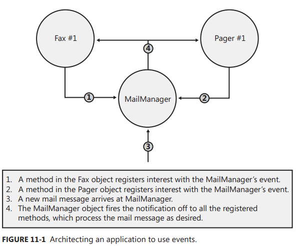

Chapter 11-Events
==============================

In this chapter, I'll talk about the last kind of member a type can define: events. A type that defines an event member allows the type (or instances of the type) to notify other objects that something special has happened. For example, the `Button` class offers an event called `Click`. When a Button object is clicked, one or more objects in an application may want to receive notification about this event in order to perform some action. Events are type members that allow this interaction. Specifically, defining an event member means a type is offering the following capabilities:

<ul>
  <li>A method can register its interest in the event.</li>
  <li>A method can unregister its interest in the event.</li>
  <li>Registered methods will be notified when the event occurs</li>
</ul> 

Types can offer this functionality when defining an event because they maintain a list of the registered methods. When the event occurs, the type notifies all of the registered methods in the collection.

The CLR event model is based on *delegates*. A delegate is a type-safe way to invoke a callback method. Callback methods are the means by which objects receive the notifications they subscribed to. In this chapter, I'll be using delegates, but I won't fully explain all their details until Chapter 17, "Delegate".

To help you fully understand the way events work within the CLR, I’ll start with a scenario in which events are useful. Suppose you want to design an email application. When an email message arrives, the user might like the message to be forwarded to a fax machine or a pager. In architecting this application, let's say that you'll first design a type called MailManager that receives the incoming email messages. MailManager will expose an event called NewMail. Other types (such as Fax and Pager) may register interest in this event. When MailManager receives a new email message, it will raise the event, causing th emessage to be distributed to each of the registered objects.  Each object can process the message in any way it desires.

When the application initializes, let's instantiate just one MailManager instance—the application can then instantiate any number of Fax and Pager types. Figure below shows how the applicationinitializes and what happens when a new email message arrives:



## Designing a Type That Exposes an Event

There are many steps a developer must take in order to define a type that exposes one or more event members. In this section, I'll walk through each of the necessary steps.

#### Step #1: Define a type (Event Argument) that will hold any additional information that should be sent to receivers of the event notification

When an event is raised, the object raising the event may want to pass some additional information to the objects receiving the event notification. This additional information needs to be encapsulated into its own class, which typically contains a bunch of private fields along with some read-only public properties to expose these fields. By convention, classes that hold event information to be passed to the event handler should be derived from `System.EventArgs`, and the name of the class should be suffixed with 'EventArgs'. In this example, the `NewMailEventArgs` class has fields identifying who sent the message, who is receiving the message, and the subject of the message:
```C#
// Step #1: Define a type that will hold any additional information that
// should be sent to receivers of the event notification

internal class NewMailEventArgs : EventArgs {
  private readonly String m_from, m_to, m_subject;

  public NewMailEventArgs(String from, String to, String subject) {
     m_from = from; m_to = to; m_subject = subject; 
  }
  public String From { get { return m_from; } }
  public String To { get { return m_to; } }
  public String Subject { get { return m_subject; } } 
}

public class EventArgs {
   public static readonly EventArgs Empty = new EventArgs();
   public EventArgs() { }
}
```
As you can see, `EventArgs` serves as a base type from which other types can derive. Many events don't have any additional information to pass on. For example, when a Button notifies its registered receivers that it has been clicked, just invoking the callback method is enough information. When you're defining an event that doesn't have any additional data to pass on, just use `EventArgs.Empty` rather than constructing a new EventArgs object.

#### Step #2: Define the event member

An event member is defined using the C# keyword event. Each event member is given accessibility (which is almost always public so that other code can access the event member), a type of delegate indicating the prototype of the method(s) that will be called, and a name (which can be any valid identifier). Here is what the event member in our MailManager class looks like: 
```C#
public delegate void EventHandler<TEventArgs>(Object sender, TEventArgs e);

internal class MailManager {
   // Step #2: Define the event member
   public event EventHandler<NewMailEventArgs> NewMail;  
}
```

A lot of people wonder why the event pattern requires the sender parameter to always be of type Object. After all, because the MailManager will be the only type raising an event with a NewMailEventArgs object, it makes more sense for the callback method to be proptotyped like the following:
```C#
void MethodName(Object sender, NewMailEventArgs e);
```
The pattern requires the sender parameter to be of type `Object` mostly because of inheritance. What if MailManager were used as a base class for SmtpMailManager? In this case, the callback method should have the sender paramter prototyped as SmtpMailManager instead of MailManager, but this can't happen because SmtpMailManager just inherited the NewMail event.  So the code that was expecting SmtpMailManager to raise the event must still have to cast the sender argument to SmtpMailManager. In other words, the cast is still required, so the sender parameter might as well be typed as Object.

<div class="alert alert-info p-1" role="alert">
    I think the author here didn't well explain why <code>Object</code> is needed. The author's grounds is baed on the the usage of <code>EventHandler</code> which limits the first parameter to be object in the first place, if you want to dig deeper, what if we use a different delegate as below shows:
</div>
Continued from above:

```C#
public delegate void EventHandlerBetter<TSenderArgs, TEventArgs>(TSenderArgs sender, TEventArgs e);

internal class MailManager : {
   public event EventHandlerBetter<MailManager,NewMailEventArgs> NewMail;
   protected virtual void OnNewMail(NewMailEventArgs e) {
      EventHandlerBetter<MailManager, NewMailEventArgs> temp = Volatile.Read(ref NewMail);  
      if (temp != null)
         temp(this, e);  // 'this' causes the FaxMsg2 cannot be registered, 
                         // unless in `SmtpMailManager`, you override the OnNewMail method to use a different EventHandlerBetter
   }
}

internal class SmtpMailManager : MailManager { }

internal sealed class Fax {
   public Fax(MailManager mm) {
      mm.NewMail += FaxMsg;
   }
   private void FaxMsg(MailManager sender, NewMailEventArgs e) { }
   private void FaxMsg2(SmtpMailManager sender, NewMailEventArgs e) {}
}
```
Then you will see you can't register the callback method `private void FaxMsg2(SmtpMailManager sender, NewMailEventArgs e)`, because in the `OnNewMail`, `this` is an instance of `MailManager`. To make it registable, even though you can modify the SmtpMailManager to override the OnNewMail method(explained in Step 3) as:

```C#
internal class SmtpMailManager : MailManager {
   protected override void OnNewMail(NewMailEventArgs e) {
      EventHandlerBetter<SmtpMailManager, NewMailEventArgs> temp = Volatile.Read(ref NewMail);   // change MailManager to SmtpMailManager
      if (temp != null)
         temp(this, e); 
   }
}
```
But this really complicates the thing unnessearily, if you want to override a method, you want to do sth differenly (for example, ignore/bypass the event), here you just change a bit to make the code compile.

The next reason for typing the sender parameter as Object is just flexibility. It allows the delegate to be used by multiple types that offer an event that passes a NewMailEventArgs object. For example, a PopMailManager class could use the delegate even if this class were not derived from MailManager.
 

 #### Step #3: Define a method responsible for raising the event to notify registered objects that the event has occurred

 By convention, the class should define a protected, virtual method that is called by code internally within the class and its derived classes when the event is to be raised. This method takes one parameter, a `NewMailEventArgs` object, which includes the information passed to the objects receiving the notification. The default implementation of this method simply checks if any objects have registered interest in the event and, if so, the event will be raised, thereby notifying the registered methods that the event has occurred. Here is what the method in our MailManager class looks like:
 ```C#
internal class MailManager {
   ...
   // Step #3: Define a method responsible for raising the event
   // to notify registered objects that the event has occurred
   // If this class is sealed, make this method private and nonvirtual 
   protected virtual void OnNewMail(NewMailEventArgs e) {
      // Copy a reference to the delegate field now into a temporary field for thread safety
      EventHandler<NewMailEventArgs> temp = Volatile.Read(ref NewMail);   // This is to raise an Event in a thread-safe way
                                                                          //will be explained in Chapter 29, "Primitive Thread Synchronization Constructs"
      // If any methods registered interest with our event, notify them
      if (temp != null) 
         temp(this, e); 
   } 
   ...
}
 ```

<div class="alert alert-info p-1" role="alert">
    To work on in the future-Raising an Event in a Thread-Safe Way
</div>

#### Step #4: Define a method that transaltes the input into the desired event

You class must have some method that takes some input and translates it into the raising of the event. In my MailManager example, the SimulateNewMail method is called to indicate that a new email message has arrived into MailManager:
```C#
internal class MailManager {
   // Step #4: Define a method that translates the input into the desired event 
   public void SimulateNewMail(String from, String to, String subject) {
      NewMailEventArgs e = new NewMailEventArgs(from, to, subject);
      OnNewMail(e);
   } 

}
```
SimulateNewMail accepts information about the message and constructs a NewMailEventArgs object, passing the message information to its constructor. MailManager's own virtual OnNewMail method is then called to formally notify the MailManager object of the new email message. Usually, this causes the event to be raised, notifying all of the registered methods. (As mentioned before, a class using MailManager as a base class can override this behavior.)

## How the Compiler Implements an Event
Now that you know how to define a class that offers an event member, let's take a closer look at what an event really is and how it works. In the MailManager class, we have a line of code that defines the event member itself:
```C#
public event EventHandler<NewMailEventArgs> NewMail;
```
When the C# compiler compiles the line above, it translates this single line of source code into the following three constructs:
```C#
// 1. A PRIVATE delegate field that is initialized to null that allows methods to register interest in the event.
private EventHandler<NewMailEventArgs> NewMail = null;

// 2. A PUBLIC add_Xxx method (where Xxx is the Event name)
public void add_NewMail(EventHandler<NewMailEventArgs> value) {
   // The loop and the call to CompareExchange is all just a fancy way of 
   // adding a delegate to the event in a thread-safe way
   EventHandler<NewMailEventArgs>prevHandler;
   EventHandler<NewMailEventArgs> newMail = this.NewMail;
   do {
      prevHandler = newMail;
      EventHandler<NewMailEventArgs> newHandler =
      (EventHandler<NewMailEventArgs>) Delegate.Combine(prevHandler, value);
      newMail = Interlocked.CompareExchange<EventHandler<NewMailEventArgs>>(
         ref this.NewMail, newHandler, prevHandler);
   } while (newMail != prevHandler);
}

// 3. A PUBLIC remove_Xxx method (where Xxx is the Event name) allows methods to unregister interest in the event.
public void remove_NewMail(EventHandler<NewMailEventArgs> value) {
  ... // same except use  Delegate.Remove
}
```
<div class="alert alert-info p-1" role="alert">
   To work in the future-using CompareExchange, adding a delegate to the event in a thread-safe way in Chapter 29 "The Interlocked Anything Pattern" section
</div>

The first construct is simply a field of the appropriate delegate type. This field is a reference to the head of a list of delegates that will be notified when this event occurs. This field is initialized to null, meaning that no listeners have registered interest in the event. When a method registers interest in the event, this field refers to an instance of the `EventHandler<NewMailEventArgs> delegate`, which may refer to additional `EventHandler<NewMailEventArgs> ` delegates. When a listener registers interest in an event, the listener is simply adding an instance of the delegate type to the list. Obviously unregistering means removing the delegate from the list.

You'll notice that the delegate field, `NewMail` in this example, is always private even though the original line of source code defines the event as public. The reason for making the delegate field private is to prevent code outside the defining class from manipulating it improperly. If the field were public, any code could alter the value in the field and potentially wipe out all of the delegates that have registered interest in the event. So even though the field is private internally, but it is defined as public in a way that the compiler let you access it to use it with `+=` and `-=`, but not `=`.

<div class="alert alert-info p-1" role="alert">
   This is why you have to use <code>+=</code> and <code>-=</code> only on events. The reason you can't assign a delegate to an event like <code>mm.NewMail = FaxMsg</code>, which throws the old delegate and its invocation list down the drain and creates a whole new delegate with a single item in its invocation list. If you use <code>=</code> on an event then the VS will show a compile error "NewMail can only appear on the left hand size of += or -=".
</div>

<div class="alert alert-info p-1" role="alert">
   It is important to note that if you attempt to remove a method that was never added, then Delegate's Remove method internally does nothing. That is, you get no exception or warning of any type; the event's collection of methods remains unchanged.
</div>

In addition to emitting the aforementioned three constructs, **compilers also emit an event definition entry into the managed assembly's metadata**. This entry contains some flags and the underlying delegate type, and refers to the add and remove accessor methods. This information exists
simply to draw an association between the abstract concept of an “event” and its accessor methods. Compilers and other tools can use this metadata, and this information can also be obtained by using the System.Reflection.EventInfo class. However, the CLR itself doesn't use this metadata information and requires only the accessor methods at run time.

## Designing a Type That Listens for an Event

The hard work is definitely behind you at this point. In this section, I'll show you how to define a type that uses an event provided by another type. Let’s start off by examining the code for the Fax type:
```C#
internal sealed class Fax {
   // Pass the MailManager object to the constructor
   public Fax(MailManager mm) {
      // Construct an instance of the EventHandler<NewMailEventArgs>
      // delegate that refers to our FaxMsg callback method.
      // Register our callback with MailManager's NewMail event
      mm.NewMail += FaxMsg; 
   }  
   // This is the call back method the MailManager will call when a new email message arrives 
   private void FaxMsg(Object sender, NewMailEventArgs e) {
      Console.WriteLine("Faxing mail message:");
      Console.WriteLine(" From={0}, To={1}, Subject={2}", e.From, e.To, e.Subject);
   }

   // This method could be executed to have the Fax object unregister
   // itself with the NewMail event so that it no longer receives notifications 
   public void Unregister(MailManager mm) {
      mm.NewMail -= FaxMsg;  
   }
}
```
When the email application initializes, it would first construct a MailManager object and save
the reference to this object in a variable. Then the application would construct a Fax object, passing the reference to the MailManager object as a parameter. In the Fax constructor, the Fax object registers its interest in MailManager's NewMail event using C#'s += operator.

**Because the C# compiler has built-in support for events, the compiler translates the use of the += operator into the following line of code to add the object’s interest in the event**:
```C#
mm.add_NewMail(new EventHandler<NewMailEventArgs>(this.FaxMsg));
```
As you can see, the C# compiler is generating code that will construct an `EventHandler<NewMailEventArgs>` delegate object that wraps the Fax class's FaxMsg method. Then, the C# compiler calls the MailManager's add_NewMail method, passing it the new delegate. Of course, you can verify all of this by compiling the code and looking at the IL with a tool such as ILDasm.exe.

<div class="alert alert-info p-1" role="alert">
   You can see by now that delegates(without event prefix) and event (delgate without event prefix) are different in two prospects. Firstly, as mentioned above, you can't use <code>=</code> on events. Secondly, events maintain thread-safe while delegates don't. For example if you use <code>+=</code> on delegates, it just simply call <code>Delegate.Combine</code> interanlly.
</div>

When an object is no longer interested in receiving event notifications, it should unregister its interest. For example, the Fax object would unregister its interest in the NewMail event if the user no longer wanted his or her email forwarded to a fax. As long as an object has registered one of its methods with an event, the object can't be garbage collected. If you type implements `IDisposable`'s `Dispose` method, the implementation shoudl cause it to unregister interest in all events (See Chapter 21, "The Managed Heap and Garbage Collection" for more information about IDisposable).

By the way, C# requires your code to use the += and -= operators to add and remove delegates from the list. If you try to call the add or remove method explicitly, the C# compiler produces the CS0571 cannot explicitly call operator or accessor error message.

Below is the functional full code:
```C#
class Program {
   static void Main(string[] args) {
      MailManager mm = new MailManager();
      Fax fax = new Fax(mm);
      mm.SimulateNewMail("from me", "abc girl", "Love");
      Console.ReadLine();
   }
}

internal class NewMailEventArgs : EventArgs {

   private readonly String m_from, m_to, m_subject;

   public NewMailEventArgs(String from, String to, String subject) {
      m_from = from; m_to = to; m_subject = subject;
   }

   public String From { get { return m_from; } }
   public String To { get { return m_to; } }
   public String Subject { get { return m_subject; } }
}

internal class MailManager {
   public event EventHandler<NewMailEventArgs> NewMail;

   protected virtual void OnNewMail(NewMailEventArgs e) {
      EventHandler<NewMailEventArgs> temp = Volatile.Read(ref NewMail);

      if (temp != null)
         temp(this, e);
   }

   public void SimulateNewMail(String from, String to, String subject) {
      NewMailEventArgs e = new NewMailEventArgs(from, to, subject);
      OnNewMail(e);
   }
}

internal sealed class Fax {
   public Fax(MailManager mm) {
      mm.NewMail += FaxMsg;
   }

   private void FaxMsg(Object sender, NewMailEventArgs e) {
      Console.WriteLine("Faxing mail message:");
      Console.WriteLine(" From={0}, To={1}, Subject={2}", e.From, e.To, e.Subject);
   }

   public void Unregister(MailManager mm) {
      mm.NewMail -= FaxMsg;
   }
}
```

## Explicitly Implementing an Event

The `System.Windows.Forms.Control` type defines about 70 events. If the `Control` type implemented the events by allowing the compiler to implicitly generate the `add` and `remove` accessor methods and delegate fields, every `Control` object would have 70 delegate fields in it just for the events! Because most programmers care about just a few events, an enormous amount of memory would be wasted for each object created from a `Control`-derived type.

In this section, I discuss how the C# compiler allows a class developer to explicitly implement an event, allowing the developer to control how the add and remove methods manipulate the callback delegates. I'm going to demonstrate how explicitly implementing an event can be used to efficiently implement a class that offers many events. However, there are certainly other scenarios where you might want to explicitly implement a type's event.

To efficiently store event delegates, each object that exposes events will maintain a collection (usually a dictionary) with some sort of event identifier as the key and a delegate list as the value. When a new object is constructed, this collection is empty. When interest in an event is registered, the event's
identifier is looked up in the collection. If the event identifier is there, the new delegate is combined with the list of delegates for this event. If the event identifier isn’t in the collection, the event identifier is added with the delegate.

When the object needs to raise an event, the event identifier is looked up in the collection. If the collection doesn't have an entry for the event identifier, nothing has registered interest in the event and no delegates need to be called back. If the event identifier is in the collection, the delegate list associated with the event identifier is invoked. Implementing this design pattern is the responsibility of the developer who is designing the type that defines events; the developer using the type has no idea how the events are implemented internally.

Here is an example of how you could accomplish this pattern. First, I implemented an EventSet class that represents a collection of events and each event's delegate list as follows:
```C#
// This class exists to provide a bit more type safety and
// code maintainability when using EventSet
public sealed class EventKey { }

public sealed class EventSet {
   // The private dictionary used to maintain EventKey -> Delegate mappings
   private readonly Dictionary<EventKey, Delegate> m_events = new Dictionary<EventKey, Delegate>();

   public void Add(EventKey eventKey, Delegate handler) {
      Monitor.Enter(m_events);
      m_events.TryGetValue(eventKey, out d);
      m_events[eventKey] = Delegate.Combine(d, handler);
      Monitor.Exit(m_events);
   }

   public void Remove(EventKey eventKey, Delegate handler) {
      Monitor.Enter(m_events);
      // Call TryGetValue to ensure that an exception is not thrown if
      // attempting to remove a delegate from an EventKey not in the set
      Delegate d;
      if (m_events.TryGetValue(eventKey, out d)) {
         d = Delegate.Remove(d, handler);
         // If a delegate remains, set the new head else remove the EventKey
         if (d != null) 
            m_events[eventKey] = d;
         else  m_events.Remove(eventKey);
      }
      Monitor.Exit(m_events);
   }

   // Raises the event for the indicated EventKey
   public void Raise(EventKey eventKey, Object sender, EventArgs e) {
      // Don't throw an exception if the EventKey is not in the set
      Delegate d;
      Monitor.Enter(m_events);
      m_events.TryGetValue(eventKey, out d);
      Monitor.Exit(m_events);

      if (d != null) {
         // Because the dictionary can contain several different delegate types, it is impossible to construct a type-safe call to the delegate at
         // compile time. So, I call the System.Delegate type's DynamicInvoke method, passing it the callback method's parameters as an array of
         // objects. Internally, DynamicInvoke will check the type safety of the parameters with the callback method being called and call the method.
         // If there is a type mismatch, then DynamicInvoke will throw an exception.
         d.DynamicInvoke(new Object[] { sender, e});
      }
   }
}
```

Now, I show a class that uses my EventSet class. This class has a field that refers to an EventSet object, and each of this class's events is explicitly implemented so that each event's `add` method stores the specified callback delegate in the EventSet object and each event's remove method eliminates the specified callback delegate (if found):
```C#
public class TypeWithLotsOfEvents {
   private readonly EventSet m_eventSet = new EventSet();

   // The protected property allows derived types access to the collection.
   protected EventSet EventSet { get { return m_eventSet; } }

   // 2a. Construct a static, read-only object to identify this event.
   protected static readonly EventKey s_fooEventKey = new EventKey();

   // 2b. Define the event's accessor methods that add/remove the delegate from the collection. 
   public event EventHandler<FooEventArgs> Foo {
      add { m_eventSet.Add(s_fooEventKey, value); }
      remove { m_eventSet.Remove(s_fooEventKey, value); }
   } 

   // 2c. Define the protected, virtual On method for this event.
   protected virtual void OnFoo(EventArgs e) {
      m_eventSet.Raise(s_fooEventKey, this, e);
   }
   
   // 2d. Define the method that translates input to this event.
   public void SimulateFoo() { OnFoo(EventArgs.Empty); }

    /* Repeat the process for every event
   protected static readonly EventKey s_fooXEventKey = new EventKey();

   public event EventHandler<FooEventArgs> FooX {
      add { m_eventSet.Add(s_fooXEventKey, value); }
      remove { m_eventSet.Remove(s_fooXEventKey, value); }
   } 

   protected virtual void OnFooX(EventArgs e) {
      m_eventSet.Raise(s_fooXEventKey, this, e);
   }

   protected virtual void OnFooX(EventArgs e) {
      m_eventSet.Raise(s_fooXEventKey, this, e);
   }
   
   public void SimulateFooX() { OnFooX(EventArgs.Empty); }
   */
}
```

**Code that uses the `TypeWithLotsOfEvents` type can't tell whether the events have been implemented implicitly by the compiler or explicitly by the developer.** They just register the events by using normal syntax. Here is some code demonstrating this:
```C#
public static void Main() {
   TypeWithLotsOfEvents twle = new TypeWithLotsOfEvents();

   // Add a callback here
   twle.Foo += HandleFooEvent;

   // Prove that it worked
   twle.SimulateFoo();

   private static void HandleFooEvent(object sender, EventArgs e) {
      Console.WriteLine("Handling Foo Event here...");
   }
}
```

Note that:
```C#
public event EventHandler<FooEventArgs> Foo {
   add { m_eventSet.Add(s_fooEventKey, value); }
   remove { m_eventSet.Remove(s_fooEventKey, value); }
}
```
**does not** generate any fields like compiler auto-implemented event, it only generates two methods:
```C#
private void add_Foo(EventHandler<FooEventArgs> value) {
    m_eventSet.Add(s_fooEventKey, value); 
}

private void remove_Foo(EventHandler<FooEventArgs> value) {
    m_eventSet.Remove(s_fooEventKey, value);
}
```
You would still have the field from s_fooEventKey to s_foo70EventKey (let's say we implement 70 events like `System.Windows.Forms.Control` type), but there are static, so for TypeWithLotsOfEvents-derived types, they don't have any extra fields, only their parent `Control` type has 70 static fields, while the compiler generating addXXX/removeXXX approach, every TypeWithLotsOfEvents-derived type has 70 fields by contrast, which is the reson that the author mentioned **"an enormous amount of memory would be wasted for each object created from a `Control`-derived type**. explicitly implementing events is most useful in derived type context. I think the syntax of `public event EventHandler<XXX> XXX { add ... , remove... }` has following purposes:

<ul>
  <li><b>Save unnessary delegate fields in derived types</b>This is the most important feature I think</li>
  <li><b>Proviede consistent API with compiler auto-implemented event style</b> So people who are using the types that contains thoese event couldn't tell whether the events have been implemented implicitly by the compiler or explicitly by the developer</li>
  <li><b>Construct a delegate object from <code>value</code></b> So that this delegate can be passed to the dictionary's Add, Remove methods</li>
  <li><b>Allow you use your own logic in anyway you want</b> You can do something else before dictionary's Add, Remove method is called</li>
</ul> 

<style type="text/css">
.markdown-body {
  max-width: 1800px;
  margin-left: auto;
  margin-right: auto;
}
</style>

<link rel="stylesheet" href="./zCSS/bootstrap.min.css">
<script src="./zCSS/jquery-3.3.1.slim.min.js"></script>
<script src="./zCSS/popper.min.js"></script>
<script src="./zCSS/bootstrap.min.js"></script>