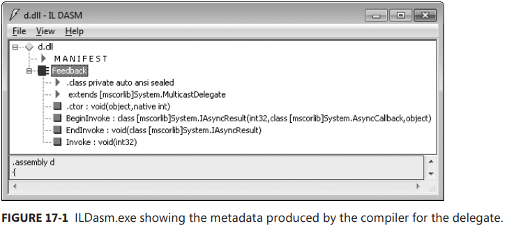
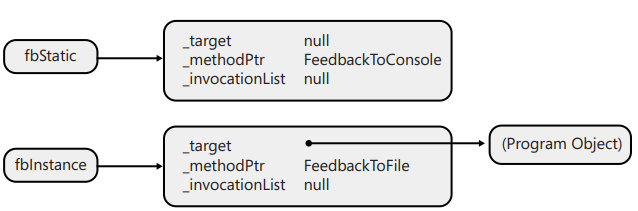
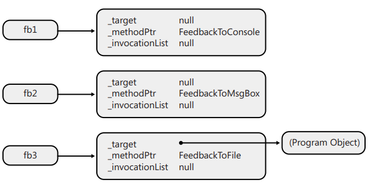
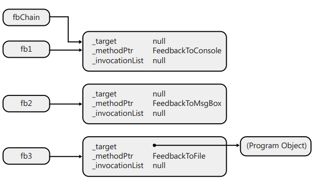
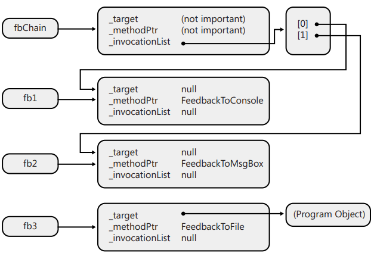
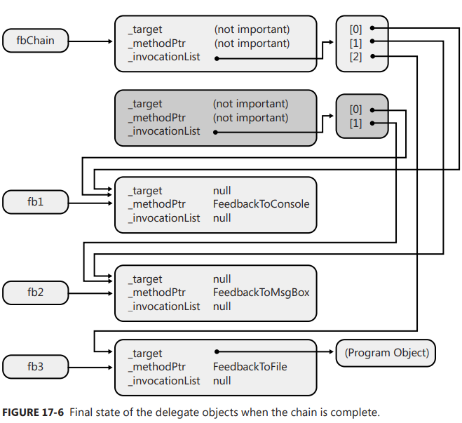

Chapter 17-Delegates
==============================

In this chapter, I talk about callback functins. Callback functions are an extremely useful programing mechanism that has been around for years. The Microsoft .NET Framework exposes a callback function mechanism by using delegates. Unlike callback mechanisms used in other platforms, such as unmanaged C++, delegates offer much more functionality. For example, delegates ensure that the callback method is type-safe, in keeping with one of the most important goals of the CLR. Delegates also integrate the ability to call multiple methods sequentially and support the calling of static methods as well as instance methods.

## A First Look at Delegates

In Windows, callback functions are required for window procedures, hook procedures, asynchronous procedure calls, and more. In the .NET Framework, callback methods are used for a whole slew of things. For example, you can register callback methods to get a variety of notifications such as unhandled exceptions, window state changes, menu item selections, file system changes, form control events, and completed asynchronous operations.

In unmanaged C/C++, the address of a non-member function is just a memory address. This address doesn’t carry any additional information such as the number of parameters the function expects, the types of these parameters, the function’s return value type, and the function's calling convention. In short, unmanaged C/C++ callback functions are not type-safe (although they are a very lightweight mechanism).

The .NET Framework provides a type-safe mechanism called *delegates*. I'll start off the discussion of delegates by showing you how to use them. The following code demonstrates how to declare, create, and use delegates:
```C#
// Declare a delegate type; instances refer to a method that
// takes an Int32 parameter and returns void. 
internal delegate void Feedback(Int32 value);

class Program {
    static void Main(string[] args) {
        StaticDelegateDemo();
        InstanceDelegateDemo();
        ChainDelegateDemo1(new Program());
        ChainDelegateDemo2(new Program());
        Console.ReadLine();
    }

    private static void StaticDelegateDemo() {
        Console.WriteLine("----- Static Delegate Demo -----");
        Counter(1, 3, null);
        Counter(1, 3, new Feedback(Program.FeedbackToConsole));
        Counter(1, 3, new Feedback(FeedbackToMsgBox));   // "Program." is optional
        Console.WriteLine();
    }

    private static void InstanceDelegateDemo() {
        Console.WriteLine("----- Instance Delegate Demo -----");
        Program p = new Program();
        Counter(1, 3, new Feedback(p.FeedbackToFile));
        Console.WriteLine();
    }

    private static void ChainDelegateDemo1(Program p) {
        Console.WriteLine("----- Chain Delegate Demo 1 -----");
        Feedback fb1 = new Feedback(FeedbackToConsole);
        Feedback fb2 = new Feedback(FeedbackToMsgBox);
        Feedback fb3 = new Feedback(p.FeedbackToFile);

        Feedback fbChain = null;
        fbChain = (Feedback)Delegate.Combine(fbChain, fb1);
        fbChain = (Feedback)Delegate.Combine(fbChain, fb2);
        fbChain = (Feedback)Delegate.Combine(fbChain, fb3);
        Counter(1, 2, fbChain);

        Console.WriteLine();
        fbChain = (Feedback)Delegate.Remove(fbChain, new Feedback(FeedbackToMsgBox));
        fbChain = (Feedback)Delegate.Remove(fbChain, new Feedback(p.FeedbackToFile));  
        //fbChain = (Feedback)Delegate.Remove(fbChain, new Feedback(new Program().FeedbackToFile));  // cannot remove in this way because instance is different
        Counter(1, 2, fbChain);
    }

    private static void ChainDelegateDemo2(Program p) {
        Console.WriteLine("----- Chain Delegate Demo 2 -----");
        Feedback fb1 = new Feedback(FeedbackToConsole);
        Feedback fb2 = new Feedback(FeedbackToMsgBox);
        Feedback fb3 = new Feedback(p.FeedbackToFile);
        Feedback syntacticalSugarDemo = FeedbackToMsgBox;  // This is C#'s Syntactical Sugar illustrates in later section

        Feedback fbChain = null;
        fbChain += fb1;
        fbChain += fb2;
        fbChain += fb3;
        Counter(1, 2, fbChain);

        Console.WriteLine();
        fbChain -= new Feedback(FeedbackToMsgBox);
        Counter(1, 2, fbChain);
    }

    private static void Counter(Int32 from, Int32 to, Feedback fb) {
        for (Int32 val = from; val <= to; val++) {
            // If any callbacks are specified, call them
            if (fb != null)
                fb(val);
        }
    }

    private static void FeedbackToConsole(Int32 value) {
        Console.WriteLine("Item=" + value);
    }

    private static void FeedbackToMsgBox(Int32 value) {
        MessageBox.Show("Item=" + value);
    }

    private void FeedbackToFile(Int32 value) {
        using (StreamWriter sw = new StreamWriter("Status", true)) {
            sw.WriteLine("Item=" + value);
        }
    }
}
```
A delegate indicates the signature of a callback method. In this example, a Feedback delegate identifies a method that takes one parameter (an Int32) and returns void. In a way, a delegate is very much like an unmanaged C/C++ `typedef` that represents the address of a function.

**Background Knowledge**: Naming data types with typedef

The `typedef` declaration in C provides a way of giving a name to a data type. This can be a great help in improving code readability. The syntax for typedef is exactly like that of declaring a variable, except that it is used as a type namerather than a variable name. For example, the declaration:
```C
typedef int *int_pointer;
int_pointer ip;
```
defines type int_pointer to be a pointer to an int, and declares a variable ip of this type. Alternatively, we could declare this variable directly as:
```C
int *ip;
```
Takig to function pointer, we can do:

```C
typedef void (*printer_t)(int);

void fun(int x,);

int main() {
   printer_t fp = fun;
   ...
}
```
If typedef is not used:
```C
void fun(int x,);

int main() {
   int (*fp)(int, int *);
   fb = fun;
   ...
}

//Since typedef is not used, you can't resue the type
//have to declare a variable every time when in need
int anotherMethod() {
  int (*fp)(int, int *);
  fb = fun;
  ...
}
```

## Using Delegates to Call Back Static Methods

The StaticDelegateDemo method calls the Counter method, passing null in the third parameter, which corresponds to Counter’s fb parameter. Because Counter's fb parameter receives null, each item is processed without calling any callback method.

Next, the StaticDelegateDemo method calls Counter a second time, passing a newly constructed Feedback delegate object in the third parameter of the method call. This delegate object is a wrapper around a method, allowing the method to be called back indirectly via the wrapper. When Counter executes, it will call the Program type's static FeedbackToConsole method for each item in the series. FeedbackToConsole simply writes a string to the console indicating the item being processed.

<div class="alert alert-info p-1" role="alert">
    The FeedbackToConsole method is defined as private inside the Program type, but the Counter method is able to call Program's private method. In this case, you might not expect a problem because both Counter and FeedbackToConsole are defined in the same type. However, this code would work just fine even if the Counter method was defined in another type. In short, it is not a security or accessibility violation for one type to have code that calls another type's private member via a delegate as long as the delegate object is created by code that has ample security/accessibility.
</div>

Everything in this example is type-safe. For instance, when constructing a Feedback delegate object, the compiler ensures that the signatures of Program’s FeedbackToConsole and FeedbackToMsgBox methods are compatible with the signature defined by the Feedback delegate. Specifically, both methods must take one argument (an Int32), and both methods must have the same return type (void). If FeedbackToConsole had been defined like this:
```C#
private static Boolean FeedbackToConsole(String value) {
   ...
}
```
the C# compiler wouldn’t compile the code and would issue the following error: error CS0123: No overload for 'FeedbackToConsole' matches delegate 'Feedback'.

Both C# and the CLR allow for covariance and contra-variance of reference types when binding a method to a delegate. Covariance means that a method can return a type that is derived from the delegate's return type. Contra-variance means that a method can take a parameter that is a base of the delegate's parameter type. For example, given a delegate defined like this:
```C#
delegate Object MyCallback(FileStream s);
```
it is possible to construct an instance of this delegate type bound to a method that is prototyped like this:
```C#
String SomeMethod(Stream s);
```
**Note that covariance and contra-variance are supported only for reference types,** not for value types or for void. So, for example, I can't bind the following method to the MyCallback delegate like:
```C#
Int32 SomeOtherMethod(Stream s);
```
Even though SomeOtherMethod's return type (Int32) is derived from MyCallback's return type(Object), this form of covariance is not allowed because Int32 is a value type. Obviously, the reason why value types and void cannot be used for covariance and contra-variance is because the memory structure for these things varies, whereas the memory structure for reference types is always a pointer. Fortunately, the C# compiler will produce an error if you attempt to do something that is not supported.

## Using Delegates to Call Back Instance Methods

I just explained how delegates can be used to call static methods, but they can also be used to call instance methods for a specific object. To understand how calling back an instance method works, look at the InstanceDelegateDemo method that appears in the code shown at the beginning of this chapter.

Notice that a Program object named p is constructed in the InstanceDelegateDemo method. This Program object doesn't have any instance fields or properties associated with it; I created it merely for demonstration purposes. When the new Feedback delegate object is constructed, its constructor is passed p.FeedbackToFile. This causes the delegate to wrap a reference to the FeedbackToFile method, which is an instance method (not a static method). When Counter calls the callback method identified by its fb argument, the FeedbackToFile instance method is called, and the address of the recently constructed object p will be passed as the implicit this argument to the instance method. Recall Chapter 6-Type and Member Basics which illustrates that methods always receive a hidden this argument as the method's first prarmeter. How delegate store and pass the instance (p in this example) to the callback method will be clear in the next section "Demystifying Delegates".

Again, the purpose of this example is to demonstrate that delegates can wrap calls to instance methods as well as static methods. For instance methods, the delegate needs to know the instance of the object the method is going to operate on. Wrapping an instance method is useful because code inside the object can access the object's instance members. This means that the object can have some state that can be used while the callback method is doing its processing.

## Demystifying Delegates

On the surface, delegates seem easy to use: you define them by using C#’s delegate keyword, you construct instances of them by using the familiar new operator, and you invoke the callback by using the familiar method-call syntax (except instead of a method name, you use the variable that refers to
the delegate object).

However, what's really going on is quite a bit more complex than what the earlier examples illustrate.The compilers and the CLR do a lot of behind-the-scenes processing to hide the complexity. In this section, I'll focus on how the compiler and the CLR work together to implement delegates. Having this knowledge will improve your understanding of delegates and will teach you how to use them efficiently and effectively. Let's start by reexamining this line of code:
```C#
internal delegate void Feedback(Int32 value);
```
When the compiler sees this line, it actually defines a complete class that looks something like this:
```C#
internal class Feedback : System.MulticastDelegate {
   // Constructor
   public Feedback(Object @object, IntPtr method);

   // Method with same prototype as specified by the source code
   public virtual void Invoke(Int32 value); 

   // Methods allowing the callback to be called asynchronously
   public virtual IAsyncResult BeginInvoke(Int32 value, AsyncCallback callback, Object @object);
   public virtual void EndInvoke(IAsyncResult result); 
}
```
and the `System.MulticastDelegate` inherits from `System.Delegate`:
```C#
public abstract class MulticastDelegate : Delegate {
   
   private Object _invocationList;

   protected MulticastDelegate(object target, string method);
   protected MulticastDelegate(Type target, string method);

   // This is the behind the scene method that does the work of Delegate.Remove(Delegate source, Delegate value)
   protected override sealed Delegate RemoveImpl(Delegate value) {
      MulticastDelegate v = value as MulticastDelegate;
      if (v == null) return this;
      if (v._invocationList == null) {
          if (this.Equals(value))
             return null;   
      } else {
          for(...) {   //loop each item in invocation list
             if (value.Equals(invocationList[i])) {
                 if (invocationCount == 2)
                    return (Delegate)invocationList[1-i];  // return the remaining instance
                 else
                    // new up an new invocation list and a new delegate instance containing this invocation list
             }               
          }            
      }
      return this;  // If you attempt to remove a method that was never added, then Delegate's method internally does nothing. 
                    // That is, you get no exception or warning.
   }
   ...
   public sealed override Delegate[] GetInvocationList();
   ...
   public override sealed bool Equals(Object obj) {
       // compare _invocationList first
       ...
       // then compare _target and _methodPtr
       base.Equals(obj);
   }
}

public abstract class Delegate : ICloneable, ISerializable {
   internal Object _target;
   // _methodPtr is a pointer to the method we will invoke
   internal IntPtr _methodPtr;

   protected Delegate(object target, string method);
   protected Delegate(Type target, string method);

   public MethodInfo Method { get; }
   public object Target { get; }

   public static Delegate Combine(Delegate a, Delegate b);
   public static Delegate Combine(params Delegate[] delegates);
   public static Delegate CreateDelegate(Type type, MethodInfo method);
   ...
   public static Delegate Remove(Delegate source, Delegate value) {
       if (source == null) return null;
       if (value == null)  return source;
       ...
       return source.RemoveImpl(value);  // call MulticastDelegate.RemoveImpl(Delegate value)
   }
   public static Delegate RemoveAll(Delegate source, Delegate value);
   
   public virtual Delegate[] GetInvocationList();
   public object DynamicInvoke(params object[] args);

   public override bool Equals(Object obj) {
       // compare _target and _methodPtr
   }
   ...
}
```

The `Feedback` class defined by the compiler has four methods: a constructor, Invoke, BeginInvoke, and EndInvoke. In this chapter, I'll concentrate on the constructor and Invoke methods. The BeginInvoke and EndInvoke methods are related to the .NET Framework's Asynchronous Programming Model which is now considered obsolete and has been replaced by tasks that I discuss in Chapter 27, "Compute-Bound Asynchronous Operations."

In fact, you can verify that the compiler did indeed generate this class automatically by examining the resulting assembly with ILDasm.exe, as shown in Figure:



In this example, the compiler has defined a class called Feedback that is derived from the `System.MulticastDelegate` type defined in the Framework Class Library (FCL). (All delegate types are derived from MulticastDelegate.)

<div class="alert alert-info p-1" role="alert">
    The System.MulticastDelegate class is derived from System.Delegate, which is itself derived from System.Object. The reason why there are two delegate classes is historical and unfortunate; there should be just one delegate class in the FCL. Sadly, you need to be aware of both of these classes because even though all delegate types you create have MulticastDelegate as a base class, you'll occasionally manipulate your delegate types by using methods defined by the Delegate class instead of the MulticastDelegate class. For example, the Delegate class has static methods called <code>Combine</code> and <code>Remove</code>.
</div>

<div class="alert alert-info p-1" role="alert">
   Note that all <code>Invoke</code> related methods are not in <code>MulticastDelegate</code> or <code>Delegate</code>. If you think about it, of course it has to be in the concrete type added by the compiler, since it has unlimited combinations. So in the later chapter 23 Reflection, you have to do the casting back to concrete type rather than MulticastDelegate or Delegate, then invoke the concrete concrete delegate type.
</div>

You should be aware that delegate types can be defined within a type (nested within another type) or at global scope. Basically, because delegates are classes, a delegate can be defined anywhere a class can be defined.

Because all delegate types are derived from MulticastDelegate, they inherit MulticastDelegate's fields, properties, and methods. Of all of these members, three non-public fields(some are from Delegate base class) are probably most significant. Table below describes these significant fields:

| Field | Type | Description |
| -------------- | ---------- | ----------- |
| _target | System.Object | When the delegate object wraps a static method, this field is null. When the delegate objects wraps an instance method, this field refers to the object  should be operated on when the callback method is called. In other words, this field indicates the value that should be passed for the instance method's implicit `this` parameter.  |
| _methodPtr | System.IntPtr  | An internal integer the CLR uses to identify the method that is to be called back. |
| _invocationList | System.Object  | This field is usually null. It can refer to an array of delegates when building a delegate chain. |

Notice that all delegates(generated by the compiler, for example FeedBack class) have a constructor that takes two parameters: a reference to an object
and an integer(represented as System.IntPtr which is a struct, how this integer is further transfered to the base class's Constructor's second string parameter method is unimportant) that refers to the callback method. However, if you examine the source code, you'll see that I'm passing in values such as  Program.FeedbackToConsole or p.FeedbackToFile. Everything you've learned about programming tells you that this code shouldn't compile!

However, the C# compiler knows that a delegate is being constructed and parses the source code to determine which object and method are being referred to. A reference to the object is passed for the Feedback's constructor's object parameter, and a specail IntPtr value (obtained from a MethodDef or MemberRef metadata token) that identifies the method is passed for the method parameter. For static methods, null is passed for the object parameter. Inside the constructor, these two arguments are saved in the `_target` and `_methodPtr` private fields, respectively. In addition, the constructor sets the `_invocationList` field to null. I'll postpone discussing this field until the next section, "Using Delegates to Call Back Many Methods (Chaining)".

So each delegate object is really a wrapper around a method and an object to be operated on when the method is called. So if I have two lines of code that look like this:
```C#
Feedback fbStatic = new Feedback(Program.FeedbackToConsole);
Feedback fbInstance = new Feedback(new Program().FeedbackToFile);
```
the fbStatic and fbInstance variables refer to two separate Feedback delegate objects that are initialized, as shown in Figure below:



Now that you know how delegate objects are constructed and what their internal structure looks like, let's talk about how the callback method is invoked. For convenience, I've repeated the code for the Counter method here:
```C#
private static void Counter(Int32 from, Int32 to, Feedback fb) {
   for (Int32 val = from; val <= to; val++) {
      // If any callbacks are specified, call them
      if (fb != null)
      fb(val);
   }
}
```
The null check is required because fb is really just a variable that can refer to a Feedback delegate object; it could also be null. It might seem as if I'm calling a function named fb and passing it one parameter (val). However, there is no function called fb. Again, because the compiler knows that fb is a variable that refers to a delegate object, the compiler generates code to call the delegate object's `Invoke` method. In other words, the compiler sees the following:
```C#
fb(val);
```
But the compiler generates code as though the source code said the following:
```C#
fb.Invoke(val);
```

<div class="alert alert-info p-1" role="alert">
    Note that the <code>Invoke</code> method is generated dynamically by the compiler, not inherits from its base classes such as MulticastDelegate or Delegate. So you cannot click go to definition in VS (you can still get intellisense support which might confuse you that makes you think you can check the definition). Of course that Invoke method has to be dynamically generated, as there are infinite combinations of different method signatures.
</div>

You can verify that the compiler produces code to call the delegate type's Invoke method by using ILDasm.exe to examine the Intermediate Language (IL) code created for the Counter method. Here is the IL for the Counter method:
```
.method private hidebysig static void Counter(int32 from, int32 to, class Feedback fb) cil managed {
  ...
  IL_0007: ldarg.2
  IL_0008: ldloc.0
  IL_0009: callvirt instance void Feedback::Invoke(int32)
  ...
}  // end of method Program::Counter
```
In fact, you could modify the Counter method to call Invoke explicitly, as shown here: ```
```C#
private static void Counter(Int32 from, Int32 to, Feedback fb) {
   for (Int32 val = from; val <= to; val++) {
      // If any callbacks are specified, call them
      if (fb != null)
      fb.Invoke(val);
   }
}
```
You'll recall that the compiler defined the Invoke method when it defined the Feedback class. When Invoke is called, it uses the private _target and _methodPtr fields to call the desired method on the specified object. Note that the signature of the Invoke method matches the signature of the delegate; 

## Using Delegates to Call Back Many Methods (Chaining)

By themselves, delegates are incredibly useful. But add in their support for chaining, and delegates become even more useful. Chaining is a set or collection of delegate objects, and it provides the ability to invoke, or call, all of the methods represented by the delegates in the set. To understand this, see the ChainDelegateDemo1 method that appears in the code shown at the beginning of this chapter. In this method, after the Console.WriteLine statement, I construct three delegate objects and have variables—fb1, fb2, and fb3—refer to each object, as shown in Figure below:



The reference variable to a Feedback delegate object, fbChain, is intended to refer to a chain or set of delegate objects that wrap methods that can be called back. Initializing fbChain to null indicates that there currently are no methods to be called back. The Delegate class’s public, static Combine method is used to add a delegate to the chain:
```C#
fbChain = (Feedback) Delegate.Combine(fbChain, fb1);
```
When this line of code executes, the Combine method sees that we are trying to combine null and fb1. Internally, Combine will simply return the value in fb1, and the fbChain variable will be set to refer to the same delegate object referred to by the fb1 variable, as shown figure below:



To add another delegate to the chain, the Combine method is called again:
```C#
fbChain = (Feedback) Delegate.Combine(fbChain, fb2);
```
fbChain will be set to refer to the newly created delegate object,shown in Figure below:



Internally, the Combine method sees that fbChain already refers to a delegate object, so Combine will construct a new delegate object. This new delegate object initializes its private _target and _methodPtr fields to values that are not important for this discussion. However, what is important is that the `_invocationList` field is initialized to refer to an array of delegate objects. The first element of this array (index 0) will be initialized to refer to the delegate that wraps the FeedbackToConsole method (this is the delegate that fbChain currently refers to). The second element of the array (index
1) will be initialized to refer to the delegate that wraps the FeedbackToMsgBox method (this is the delegate that fb2 refers to). Finally, fbChain will be set to refer to the newly created delegate object.

To add the third delegate to the chain, the Combine method is called once again:
```C#
fbChain = (Feedback) Delegate.Combine(fbChain, fb3);
```
Again, Combine sees that fbChain already refers to a delegate object, and this causes a new delegate object to be constructed, as shown in Figure below:



As before, this new delegate object initializes the private _target and _methodPtr fields to values unimportant to this discussion, and the `_invocationList` field is initialized to refer to an array of delegate object. The first and second elements of this array (indexes 0 and 1) will be initialized to refer to the same delegates the previous delegate object referred to in its array. The third element of the array (index 2) will be initialized to refer to the delegate that wraps the FeedbackToFile method (this is the delegate that fb3 refers to). Finally, fbChain will be set to refer to this newly created delegate object. **Note that the previously created delegate and the array referred to by its `_invocationList` field are now candidates for garbage collection**.

After all of the code has executed to set up the chain, the fbChain variable is then passed to 
```C#
Counter(1, 2, fbChain);
```
Inside the Counter method is the code that implicitly calls the Invoke method on the Feedback delegate object as I detailed earlier. when Invoke is called on the delegate referred to by fbChain, the delegates sees thath the private `_invocationList` field is not null, causing it to execute a loop that iterates through all of the elements in the array, calling the method wrapped by each delegate. In this example, FeedbackToConsole will get called first, following by FeedbackToMsgBox, followed by FeedbackToFile.

Feedback's Invoke method is essentially implemented something like the following (in pseudocode):
```C#
public void Invoke(Int32 value) {
   Delegate[] delegateSet = _invocationList as Delegate[];
   if (delegateSet != null) {
     foreach(Feedback d in delegateSet) 
        d(value);   // Call each delegate
   } else {
      // This delegate identifies a single method to be called back
      // Call the callback method on the specified target object.
      _methodPtr.Invoke(target, value);
      // The preceding line is an approximation of the actual code.
      // What really happens cannot be expressed in C#. 
   }
}
```
<div class="alert alert-info p-1" role="alert">
   Note that it is possible that each delegate in delegateSet has non-null _invocationList, for example, if fbChain is further combined with other delegate
</div>

Note that it is also possible to remove a delegate from a chain by calling Delegate's public, static Remove method. This is demonstrated toward the end of the ChainDelegateDemo1 method:
```C#
fbChain = (Feedback) Delegate.Remove(fbChain, new Feedback(FeedbackToMsgBox));
```
When Remove is called, it scans the delegate array (from the end toward index 0 i.e remove the latest one) maintained inside the delegate object referred to by the first parameter (fbChain, in my example). Remove is looking for a delegate entry whose  _target and _methodPtr fields match those in the second argument
(the new Feedback delegate, in my example). If a match is found and there is only one item left(after the matching delegate is "remove") in the array, that array item is returned. **If a match is found and there are multiple items left in the array, a new delegate object is constructed**, the _invocationList array created and initialized will refer to
all items in the original array except for the item being removed, of course—and a reference to this new delegate object is returned. If you are removing the only element in the chain, Remove returns null. Note that each call to Remove removes just one delegate from the chain; it does not remove all delegates that have matching _target and _methodPtr fields(`RemoveAll` removes all matching instances.). The previously created delegate and the array referred to by its `_invocationList` field are now candidates for garbage collection.

<div class="alert alert-info p-1" role="alert">
    If you attempt to remove a method that was never added, then Delegate's Remove method internally does nothing. That is, you get no exception or warning, the source delegate remains the same.
</div>

<div class="alert alert-info p-1" role="alert">
    Note that using <code>Remove</code> on a source delegate(new up for checking purpose only)on a dest delegate whose invocation list is null will return <code>null</code> if they match, you might wrongly think <code>Remove</code> won't work on a delegate whose invocation list is null, check the source code you will see how it work.
</div>

So far, I've shown examples in which my delegate type, Feedback, is defined as having a void return value. However, I could have defined my Feedback delegate as follows:
```C#
public delegate Int32 Feedback(Int32 value);
```
If I had, its Invoke method would have internally looked like the following (again, in pseudocode):
```C#
public Int32 Invoke(Int32 value) {
   Int32 result; 
   Delegate[] delegateSet = _invocationList as Delegate[]; 
   if (delegateSet != null) {
      foreach (Feedback d in delegateSet) 
         result = d(value); 
   } else {
      result = _methodPtr.Invoke(_target, value);
   } 
   return result;
}
```
As each delegate in the array is called, its return value is saved in the result variable. When the loop is complete, the result variable will contain only the result of the last delegate called (previous return values are discarded); this value is returned to the code that called Invoke. See the later section "Having More Control over Delegate Chain Invocation" if you want to get and manipulate individual returned result.

## C#’s Support for Delegate Chains
To make things easier for C# developers, the C# compiler automatically provides overloads of the += and -= operators for instances of delegate types. These operators call Delegate.Combine and Delegate.Remove, respectively. Using these operators simplifies the building of delegate chains. The ChainDelegateDemo1 and ChainDelegateDemo2 methods in the source code shown at the beginning of this chapter produce absolutely identical IL code.

Another thing to note is, it is very rare to use Combine and Remove methods in your code, using `+=`, `-=` is recommended not only for its concise syntax(improve code readibility) but also maintaining type-safety.

Let's say we have another delegate `Feedback2` takes one extra parameter as:
```C#
internal delegate void Feedback(Int32 value);
internal delegate void Feedback2(Int32 value, Int32 anotherValue);

static void Main(string[] args) {                 
   Feedback fb1 = new Feedback(...);
   Feedback fb2 = new Feedback(...);
   Feedback2 fb3 = new Feedback2(...);

   Feedback fbChain = null;
   fbChain = (Feedback)Delegate.Combine(fbChain, fb1);
   fbChain = (Feedback)Delegate.Combine(fbChain, fb2);
   fbChain = (Feedback)Delegate.Combine(fbChain, fb3);  // throws exception at runtime

```
the code does compiles since the Delegate's static Combine method takes parameters as `Delegate` which is the base type of any other delegates, which results in throwing  an exception throws at runtime.

But if you use `+=`:
```C#
fbChain += fb3 // code doesn't compile, type-safety is maintained
```
So `+=`, `-=` (defined implicitly by the language, so you won't see it in the classes source code) maintains type-safety at compilation.

## Having More Control over Delegate Chain Invocation

At this point, you understand how to build a chain of delegate objects and how to invoke all of the objects in that chain. All items in the chain are invoked because the delegate type's Invoke method includes code to iterate through all of the items in the array, invoking each item. This is obviously a very simple algorithm. And although this simple algorithm is good enough for a lot of scenarios, it has many limitations. For example, the return values of the callback methods are all discarded except for the last one. Using this simple algorithm, there’s no way to get the return values for all of the callback methods called. But this isn’t the only limitation. What happens if one of the invoked delegates throws an exception or blocks for a very long time? Because the algorithm invoked each delegate in the chain serially, a "problem" with one of the delegate objects stops all of the subsequent delegates in the chain from being called. Clearly, this algorithm isn't robust.

For those scenarios in which this algorithm is insufficient, the MulticastDelegate class offers an instance method `GetInvocationList`, that you can use to call each delegate in a chain explicitly, using any algorithm that meets your needs:
```C#
public abstract class MulticastDelegate : Delegate {
    // Creates a delegate array where each element refers
    // to a delegate in the chain.
    public override sealed Delegate[] GetInvocationList() {
        Delegate[] del;
        Object[] invocationList = _invocationList as Object[];
        if (invocationList == null) {
            del = new Delegate[1];
            del[0] = this;
        } else {
            // Create an array of delegate copies and each
            //    element into the array
            int invocationCount = (int)_invocationCount;
            del = new Delegate[invocationCount];

            for (int i = 0; i < invocationCount; i++)
                del[i] = (Delegate)invocationList[i];
        }
        return del;
    }
}
```
The GetInvocationList method operates on a MulticastDelegate-derived object and returns an array of Delegate references where each reference points to one of the chain's delegate objects. Internally, GetInvocationList constructs an array and initializes it with each element referring to a delegate in the chain; a reference to the array is then returned. IF the _invocationList field is null, the returned array contains one element that references the only delegate in the chain: the delegate instance itself.

You can easily write an algorithm that explicitly calls each object in the array. The following code demonstrates:
```C#
class Program {
    // Definition of delegate that allows querying a component's status.
    private delegate String GetStatus();

    static void Main(string[] args) {
        GetStatus getStatus = null;

        // Construct the three components, and add their status methods to the delegate chain.
        getStatus += new GetStatus(new Light().SwitchPosition);
        getStatus += new GetStatus(new Fan().Speed);
        getStatus += new GetStatus(new Speaker().Volume);

        // Show consolidated status report reflecting
        // the condition of the three components.
        Console.WriteLine(GetComponentStatusReport(getStatus));

        Console.ReadLine();
    }

    // Method that queries several components and returns a status report
    private static String GetComponentStatusReport(GetStatus status) {
        if (status == null)
            return null;

        StringBuilder report = new StringBuilder();

        //Get an array where each element is a delegate from the chain.
        Delegate[] arrayOfDelegates = status.GetInvocationList();

        foreach (GetStatus getStatus in arrayOfDelegates) {
            try {
                report.AppendFormat("{0}{1}{1}", getStatus(), Environment.NewLine);
            }
            catch (InvalidOperationException e) {
                // Generate an error entry in the report for this component.
                Object component = getStatus.Target;
                report.AppendFormat("Failed to get status from {1}{2}{0} Error: {3}{0}{0}",
                    Environment.NewLine,
                    ((component == null) ? "" : component.GetType() + "."),
                    getStatus.GetMethodInfo().Name,
                    e.Message);
            }
        }
        return report.ToString();
    }
}

internal sealed class Light {
    // This method returns the light's status.
    public String SwitchPosition() {
        return "The light is off";
    }
}

internal sealed class Fan {
    // This method returns the fan's status.
    public String Speed() {
        throw new InvalidOperationException("The fan broke due to overheating");
    }
}

internal sealed class Speaker {
    // This method returns the speaker's status.
    public String Volume() {
        return "The volume is loud";
    }
}
```
When you build and run this code, the following output appears:
```
The light is off

Failed to get status from Fan.Speed
   Error: The fan broke due to overheating

The volume is loud
```

## Enough with the Delegate Definitions Already, use Generic Delegates

Many years ago, when the .NET Framework was just starting to be developed, Microsoft introduced the notion of delegates. As Microsoft teams was adding classes to the FCL, they would define new delegate types any place they introduced a callback method. Over time, many, many delegates got defined. In fact, in MSCorLib.dll alone, close to 50 delegate types are now defined. Let's just look at a few of them:
```C#
public delegate void TryCode(Object userData);
public delegate void WaitCallback(Object state);
public delegate void TimerCallback(Object state);
public delegate void ContextCallback(Object state);
public delegate void SendOrPostCallback(Object state);
public delegate void ParameterizedThreadStart(Object obj);
```
Do you notice anything similar about the few delegate definitions that I selected? They are really all the same: a variable of any of these delegate types must refer to a method that takes an Object and returns void. There is really no reason to have all of these delegate types defined; there really just needs to be one.

In fact, now that the .NET Framework supports generics, .NET Framework now ships with 17 `Action` delegates that range from having no arguments upto having 16 arguments:
```C#
public delegate void Action();  // OK, this one is not generic
public delegate void Action<T>(T obj);
public delegate void Action<T1, T2>(T1 arg1, T2 arg2);
public delegate void Action<T1, T2, T3>(T1 arg1, T2 arg2, T3 arg3);
...
public delegate void Action<T1, ..., T16>(T1 arg1, ..., T16 arg16);
```

In addition to the Action delegates, the .NET Framework ships with 17 `Func` delegates, which allow the callback method to return a value:
```C#
public delegate TResult Func<TResult>();
public delegate TResult Func<T, TResult>(T arg);
public delegate TResult Func<T1, T2, TResult>(T1 arg1, T2 arg2);
public delegate TResult Func<T1, T2, T3, TResult>(T1 arg1, T2 arg2, T3 arg3);
...
public delegate TResult Func<T1,..., T16, TResult>(T1 arg1, ..., T16 arg16);
```
If you ever need to call a method that has more than 16 arguments, you will be forced to define your own delegate type, but this is very unlikely.

It is now recommended that these delegate types be used wherever possible instead of developers defining even more delegate types in their code. This reduces the number of types in the system and also simplifies coding. However, you might have to define your own delegate if you need to pass an argument by reference using the ref or out keyword:
```C#
delegate void Bar(ref Int32 z);
```
You may also have to do this if you want your delegate to take a variable number of arguments via C#'s params keyword, if you want to specify any default values for any of your delegate’s arguments, or if you need to constrain a delegate’s generic type argument.

When using delegates that take generic arguments and return values, contra-variance and covariance come into play, and it is recommended that you always take advantage of these features because they have no ill effects and enable your delegates to be used in more scenarios.

## C#'s Syntactical Sugar for Delegates
Most programmers find working with delegates to be cumbersome because the syntax is so strange. For example, take this line of code:
```C#
button1.Click += new EventHandler(button1_Click);
```
where button1_Click is a method that looks something like this:
```C#
void button1_Click(Object sender, EventArgs e) {
   // Do something, the button was clicked...
}
```
To most programmers, it feels quite unnatural to construct an EventHandler delegate object just to specify the address of the button1_Click method. However, constructing the EventHandler delegate object is required for the CLR because this object provides a wrapper that ensures that the method can be called only in a type-safe fashion. The wrapper also allows the calling of instance methods and chaining. Unfortunately, most programmers don't want to think about these details. Programmers would prefer to write the preceding code as follows:
```C#
button1.Click += button1_Click;
```
Fortunately, Microsoft's C# compiler offers programmers some syntax shortcuts when working with delegates. I’ll explain all of these shortcuts in this section.

## Syntactical Shortcut #1: No Need to Construct a Delegate Object
As demonstrated already, C# allows you to specify the name of a callback method without having to construct a delegate object wrapper. Here is another example:
```C#
internal sealed class AClass {
   public static void CallbackWithoutNewingADelegateObject() {
      ThreadPool.QueueUserWorkItem(SomeAsyncTask, 5);
   }

   private static void SomeAsyncTask(Object o) {
      Console.WriteLine(o);
   }
}

public static class ThreadPool {
   ...
   public static bool QueueUserWorkItem(WaitCallback callBack, object state);
}

namespace System.Threading {
   public delegate void WaitCallback(object state);  
}
```
Here, the ThreadPool class's static QueueUserWorkItem method expects a reference to a WaitCallback delegate object that contains a reference to the SomeAsyncTask method.  Because the C# compiler is capable of inferring this on its own, it allows me to omit code that constructs the WaitCallback delegate object, making the code much more readable and understandable. Of course, when the code is compiled, the C# compiler does produce IL that does, in fact, new up the WaitCallback delegate object—we just got a syntactical shortcut.

## Syntactical Shortcut #2: No Need to Define a Callback Method (Lambda Expressions)

In the preceding code, the name of the callback method, SomeAsyncTask, is passed to the ThreadPool's QueueUserWorkItem method. C# allows you to write the code for the callback method inline so it doesn’t have to be written inside its very own method. For example, the preceding code could be rewritten as follows:
```C#
internal sealed class AClass {
   public static void CallbackWithoutNewingADelegateObject() {
      ThreadPool.QueueUserWorkItem( obj => Console.WriteLine(obj), 5);
   }
}
```
 C# lambda expression is easy to detect due to the use of C#'s lambda expression operator: =>. You may use a lambda expression in your code where the compiler would normally expected to see a delegate. And, when the compiler sees the use of this lambda expression, the compiler automatically defineds a new private method in the calss (AClass, in this example). This new method is called an anonymous function because the compiler creates the name of the method for you automatically, and normally, you wouldn't know its name. However, you could use a tool such as ILDasm.exe to examine the compiler-generated code. After I wrote the preceding code and compiled it, I was able to see, by using ILDasm.exe, that the C# compiler decided to name this method `<CallbackWithoutNewingADelegateObject>b__0` and ensured that this method took a single Object argument and returned void.

The compiler chose to start the method name with a `<` sign because in C#, an identifier cannot contain a `<` sign; this ensures that you will not accidentally define a method that coincides with the name the compiler has chosen for you. Incidentally, while C# forbids identifiers to contain a `<` sign,
the CLR allows it, and that is why this works. Also, note that although you could access the method via reflection by passing the method name as a string, the C# language specification states that there is no guarantee of how the compiler generates the name. For example, each time you compile the code, the compiler could produce a different name for the method.

Finally, if you write the preceding code and compile it, it's as if the C# compiler rewrote your code to look like the following (comments inserted by me):
```C#
internal sealed class AClass {
   // This private field is created to cache the delegate object.
   // Pro: CallbackWithoutNewingADelegateObject method will not create
   // a new object each time it is called.
   // Con: The cached object never gets garbage collected 
   [CompilerGenerated]
   private static WaitCallback <>9__CachedAnonymousMethodDelegate1;

   public static void CallbackWithoutNewingADelegateObject() {
      if (<>9__CachedAnonymousMethodDelegate1 == null) {
         // First time called, create the delegate object and cache it.
         <>9__CachedAnonymousMethodDelegate1 = new WaitCallback(<CallbackWithoutNewingADelegateObject>b__0);
      }
      ThreadPool.QueueUserWorkItem(<>9__CachedAnonymousMethodDelegate1, 5);  
   }

   [CompilerGenerated]
   private static void <CallbackWithoutNewingADelegateObject>b__0(Object obj) {
      Console.WriteLine(obj);   
   }
}
```

<div class="alert alert-info p-1" role="alert">
    Note that when using lambda expression, CallbackWithoutNewingADelegateObject method will not createa new object each time it is called. While Syntactical Shortcut #1 version will create a new WaitCallback instance everytime if CallbackWithoutNewingADelegateObject method is called multiple times. So it is better to use lambda expression.
</div>

The lambda expression must match that of the WaitCallback delegate: it returns void and takes an Object parameter. However, I specified the name of the parameter by simply putting obj to the left of the => operator. On the right of the => operator, Console.WriteLine happens to return void. However, if I had placed an expression that did not return void, the compiler-generated code would just ignore the return value because the method that the compiler generates must have a void return type to satisfy the WaitCallback delegate.

It is also worth noting that the anonymous function is marked as private; this forbids any code not defined within the type from accessing the method (although reflection will reveal that the method does exist). Also, note that the anonymous method is marked as static; this is because the code doesn't access any instance members (which it can’t because CallbackWithoutNewingADelegateObject is itself a static method. However, the code can reference any static fields or static methods defined within the class. Here is an example:
```C#
internal sealed class AClass {
   private static String sm_name; // A static field
   private String m_name; // An instance field

   public static void CallbackWithoutNewingADelegateObject() {
      ThreadPool.QueueUserWorkItem(
      // The callback code can reference static members.
      obj =>Console.WriteLine(sm_name + ": " + obj), 5); 
   }

   public void CallbackWithoutNewingADelegateObjectInstanceField() {
      ThreadPool.QueueUserWorkItem(
      // The callback code can reference instance members. 
      obj =>Console.WriteLine(m_name + ": " + obj), 5); 
   }
}
```
Note that if the CallbackWithoutNewingADelegateObject method had not been static, the anonymous method's code could contain references to instance members. (when it is not static)If it doesn't contain references to instance members, the compiler will still produce a static anonymous method because this is more
efficient than an instance method because the additional this parameter is not necessary. But, if the anonymous method's code does reference an instance member, the compiler will produce a nonstatic anonymous method.

On the left side of the => operator is where you specify the names of any arguments that are to be passed to the lambda expression. There are some rules you must follow here. See the following examples:
```C#
// If the delegate takes no arguments, use ()
Func<String> f = () => "Jeff";

// If the delegate takes 1+ arguments, you can explicitly specify the types
Func<Int32, String> f2 = (Int32 n) => n.ToString();
Func<Int32, Int32, String> f3 = (Int32 n1, Int32 n2) => (n1 + n2).ToString();

// If the delegate takes 1+ arguments, the compiler can infer the types (most commonly used)
Func<Int32, String> f4 = (n) => n.ToString();
Func<Int32, Int32, String> f5 = (n1, n2) => (n1 + n2).ToString();

// If the delegate takes 1 argument, you can omit the ()s
Func<Int32, String> f6 = n => n.ToString();

// If the delegate has ref/out arguments, you must explicitly specify ref/out and the type
Bar b = (out Int32 n) => n = 5;
```
If you want the body to consist of two or more statements, then you must enclose it in curly braces. And if the delegate expects a return value, then you must have a return statement inside the body. Here is an example:
```C#
Func<Int32, Int32, String> f7 = (n1, n2) => { Int32 sum = n1 + n2; return sum.ToString(); };
```

<div class="alert alert-info p-1" role="alert">
    In case it’s not obvious, let me explicitly point out that the main benefit of lambda expressions is that they remove a level of indirection from within your source code. Normally, you’d have to write a separate method, give that method a name, and then pass the name of that method where a delegate is required. The name gives you a way to refer to a body of code, and if you need to refer to the same body of code from multiple locations in your source code, then writing a method and giving it a name is a great way to go. However, if you need to have a body of code that is referred to only once within your source code, then a lambda expression allows you to put that code directly inline without having to assign it a name, thus increasing programmer productivity.
</div>

<div class="alert alert-info p-1" role="alert">
    When C# 2.0 came out, it introduced a feature called anonymous methods. Like lambda expressions (introduced in C# 3.0), anonymous methods describes a syntax for creating anonymous functions. The systax is like <code>Feedback fb = delegate(Int32 value) { Console.WriteLine("Item=" + value); }</code>
    It is now recommended (in section 7.14 of the C# Language Specification) that developers use the newer lambda expression syntax rather than the older anonymous method syntax because the lambda expression syntax is more terse, making code easier to write, read, and maintain. Of course, Microsoft's C# compiler continues to support parsing both syntaxes for creating anonymous functions so that developers are not forced to modify any code that was originally written for C# 2.0. In this book, I will explain and use only the lambda expression syntax.
</div>

## Syntactical Shortcut #3: No Need to Wrap Local Variables in a Class Manually to Pass Them to a Callback Method

I've already shown how the callback code can reference other members defined in the class. However, sometimes, you might like the callback code to reference local parameters or variables that exist in the defining method. Here's an interesting example:
```C#
internal sealed class AClass {
    public static void UsingLocalVariablesInTheCallbackCode(Int32 numToDo) {
        // Some local variables
        Int32[] squares = new Int32[numToDo];
        AutoResetEvent done = new AutoResetEvent(false);

        // Do a bunch of tasks on other threads 
        for (Int32 n = 0; n < squares.Length; n++) {
            ThreadPool.QueueUserWorkItem(obj => {
                Int32 num = (Int32)obj;

                // This task would normally be more time consuming
                squares[num] = num * num;

                // This task would normally be more time consuming
                if (Interlocked.Decrement(ref numToDo) == 0)
                    done.Set();
            }, n);
        }
        // Wait for all the other threads to finish
        done.WaitOne();

        // Show the results
        for (Int32 n = 0; n < squares.Length; n++)
            Console.WriteLine("Index {0}, Square={1}", n, squares[n]);
    }
}
```
This example really shows off how easy C# makes implementing what used to be a pretty complex task. The preceding method defines one parameter, numToDo, and two local variables, squares and done. And the body of the lambda expression refers to these variables.

Now image that the code in the body of the lambda expression is placed in a separate method (required by the CLR). How would the values of the variables be passed to the separate method? The only way to do this is to define a new helper class that also defines a field for each value that you want passed to the callback code. In addition, the callback code would have to be defined as an instance method in this helper class. Then, the UsingLocalVariablesInTheCallbackCode method would have to construct an instance of the helper class, initialize the fields from the values in its local variables, and then construct the delegate object bound to the helper object/instance method.

This is very tedious and error-prone work, and, of course, the C# compiler does all this for you automatically. When you write the preceding code, it's as if the C# compiler rewrites your code so that it looks something like the following:
```C#
internal sealed class AClass {
   public static void UsingLocalVariablesInTheCallbackCode(Int32 numToDo) {
      // Some local variables
      WaitCallback callback1 = null; 

      // Construct an instance of the helper class
      <>c__DisplayClass2 class1 = new <>c__DisplayClass2(); 

      // Initialize the helper class's fields
      class1.numToDo = numToDo;
      class1.squares = new Int32[class1.numToDo];
      class1.done = new AutoResetEvent(false);  

      // Do a bunch of tasks on other threads
      for (Int32 n = 0; n < class1.squares.Length; n++) {
         if (callback1 == null) {
            // New up delegate object bound to the helper object and its anonymous instance method
            callback1 = new WaitCallback(class1.<UsingLocalVariablesInTheCallbackCode>b__0);
         }  
         ThreadPool.QueueUserWorkItem(callback1, n);  
      }

      // Wait for all the other threads to finish
      class1.done.WaitOne();

      // Show the results
      for (Int32 n = 0; n < class1.squares.Length; n++)
         Console.WriteLine("Index {0}, Square={1}", n, class1.squares[n]);
      }   
}

// The helper class is given a strange name to avoid potential
// conflicts and is private to forbid access from outside AClass
[CompilerGenerated]
private sealed class <>c__DisplayClass2 : Object {
   // One public field per local variable used in the callback code
   public Int32[] squares;
   public Int32 numToDo;
   public AutoResetEvent done;

   // public parameterless constructor
   public <>c__DisplayClass2 { } 

   // Public instance method containing the callback code 
   public void <UsingLocalVariablesInTheCallbackCode>b__0(Object obj) {
      Int32 num = (Int32) obj;
      squares[num] = num * num; 
      if (Interlocked.Decrement(ref numToDo) == 0)
         done.Set(); 
   }
}
```
Lambda expressions can greatly increase programmer productivity as well as the maintainability of your code. The following is some code in which using lambda expressions feels very natural. Without them, this code would be tedious to write, harder to read, and harder to maintain:
```C#
// Create and initialize a String array
String[] names = { "Jeff", "Kristin", "Aidan", "Grant" };

// Get just the names that have a lowercase 'a' in them.
Char charToFind = 'a';
names = Array.FindAll(names, name => name.IndexOf(charToFind) >= 0);

// Convert each string's characters to uppercase
names = Array.ConvertAll(names, name => name.ToUpper());

// Display the results
Array.ForEach(names, Console.WriteLine);
```

## Delegates and Reflection
So far in this chapter, the use of delegates has required the developer to know up front the prototype of the method that is to be called back. For example, if fb is a variable that references a Feedback delegate, to invoke the delegate, the code would look like the following:
```C#
fb(item);  // item is defined as Int32
```
As you can see, the developer must know when coding how many parameters the callback method requires and the types of those parameters. Fortunately, the developer almost always has this information, so writing code like the preceding code isn't a problem.

In some rare circumstance, however, the developer doesn't have this infirmation at compile time. I showed an example of this in Chapter 11, "Events" when I discussed the EventSet type. In this example, a dictionary maintained a set of different delegate types. At run time, to raise an event, one of the delegates was looked up in the dictionary and invoked. At compile time, it wasn't possible to know exactly which delegate would be called and which parameters were necessary to pass to the delegate's callback method.

Fortunately, System.Reflection.MethodInfo offers a CreateDelegate method that allows you to create a delegate when you just don't have all the necessary information about the delegate at compile time. Here are the method overloads that MethodInfo defines:
```C#
public abstract class MethodInfo : MethodBase {
   // Construct a delegate wrapping a static method.
   public virtual Delegate CreateDelegate(Type delegateType); 

   // Construct a delegate wrapping an instance method; target refers to the ‘this’ argument. 
   public virtual Delegate CreateDelegate(Type delegateType, Object target); 
}
```
After you've created the delegate, you can call it by using Delegate's `DynamicInvoke` method, which looks like the following:
```C#
public abstract class Delegate {
   // Invoke a delegate passing it parameters
   public Object DynamicInvoke(params Object[] args);    
}
```
Using reflection APIs (discussed in Chapter 23, "Assembly Loading and Reflection" ), you must first acquire a MethodInfo object referring to the method you want to create a delegate to. Then, you call the CreateDelegate method to have it construct a new object of a Delegate-derived type identified by the first parameter, delegateType. If the delegate wraps an instance method, you will also pass to CreateDelegate a target parameter indicating the object that should be passed as the this parameter to the instance method.

System.Delegate's DynamicInvoke method allows you to invoke a delegate object's callback method, passing a set of parameters that you determine at run time. When you call DynamicInvoke, it internally ensures that the parameters you pass are compatible with the parameters the callback method expects. If they're compatible, the callback method is called. If they’re not, an ArgumentException is thrown. DynamicInvoke returns the object the callback method returned.

The following code shows how to use the CreateDelegate and DynamicInvoke methods:
```C#
// Here are some different delegate definitions
internal delegate Object TwoInt32s(Int32 n1, Int32 n2);
internal delegate Object OneString(String s1);

public static class DelegateReflection {
    public static void Main(string[] args) {
        if (args.Length < 2) {
            String usage = @"Usage:" +
            "{0} delType methodName [Arg1] [Arg2]" +
            "{0} where delType must be TwoInt32s or OneString" + "{0} if delType is TwoInt32s, methodName must be Add or Subtract" +
            "{0} if delType is OneString, methodName must be NumChars or Reverse" +
            "{0}" +
            "{0}Examples:" +
            "{0} TwoInt32s Add 123 321" +
            "{0} TwoInt32s Subtract 123 321" +
            "{0} OneString NumChars \"Hello there\"" +
            "{0} OneString Reverse \"Hello there\"";
            Console.WriteLine(usage, Environment.NewLine);
            Console.ReadLine();
            return;
        }

        // Convert the delType argument to a delegate type
        Type delType = Type.GetType(args[0]);
        if (delType == null) {
            Console.WriteLine("Invalid delType argument: " + args[0]);
            return;
        }

        Delegate d;
        try {
            // Convert the Arg1 argument to a method
            MethodInfo mi = typeof(DelegateReflection).GetTypeInfo().GetDeclaredMethod(args[1]);

            // Create a delegate object that wraps the static method
            d = mi.CreateDelegate(delType);
        }
        catch (ArgumentException) {
            Console.WriteLine("Invalid methodName argument: " + args[1]);
            return;
        }

        // Create an array that that will contain just the arguments
        // to pass to the method via the delegate object
        Object[] callbackArgs = new Object[args.Length - 2];

        if (d.GetType() == typeof(TwoInt32s)) {
            try {
                // Convert the String arguments to Int32 arguments
                for (Int32 a = 2; a < args.Length; a++)
                    callbackArgs[a - 2] = Int32.Parse(args[a]);
            }
            catch (FormatException) {
                Console.WriteLine("Parameters must be integers.");
                return;
            }
        }

        if (d.GetType() == typeof(OneString)) {
            // Just copy the String argument
            Array.Copy(args, 2, callbackArgs, 0, callbackArgs.Length);         
        }

        try {
            // Invoke the delegate and show the result
            Object result = d.DynamicInvoke(callbackArgs);
            Console.WriteLine("Result = " + result);
        }
        catch (TargetParameterCountException) {
            Console.WriteLine("Incorrect number of parameters specified.");
        }

        Console.ReadLine();
    }

    // This callback method takes 2 Int32 arguments
    private static Object Add(Int32 n1, Int32 n2) {
        return n1 + n2;
    }

    // This callback method takes 2 Int32 arguments
    private static Object Subtract(Int32 n1, Int32 n2) {
        return n1 - n2;
    }

    // This callback method takes 1 String argument
    private static Object NumChars(String s1) {
        return s1.Length;
    }

    // This callback method takes 1 String argument
    private static Object Reverse(String s1) {
        return new String(s1.Reverse().ToArray());
    }
}
```

<style type="text/css">
.markdown-body {
  max-width: 1800px;
  margin-left: auto;
  margin-right: auto;
}
</style>

<link rel="stylesheet" href="./zCSS/bootstrap.min.css">
<script src="./zCSS/jquery-3.3.1.slim.min.js"></script>
<script src="./zCSS/popper.min.js"></script>
<script src="./zCSS/bootstrap.min.js"></script>