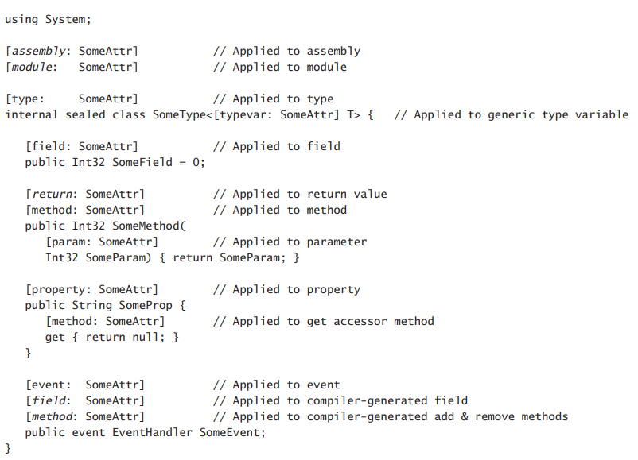

Chapter 18-Custom Attributes
==============================

In this chapter, I'll discuss one of the most innovative features the Microsoft .NET Framework has to offer: ***custom attributes***. Custom attributes allow you to declaratively annotate your code constructs, thereby enabling special features. Custom attributes allow information to be defined and applied to almost any metadata table entry. This extensible metadata information can be queried at run time to dynamically alter the way code executes. As you use the various .NET Framework technologies, you'll see that they all take advantage of custom attributes, allowing developers to express their intentions within code very easily. A solid understanding of custom attributes is necessary for any .NET Framework developer.

## Using Custom Attributes

Attributes, such as public, private, static, and so on, can be applied to types and members. I think we'd all agree on the usefulness of applying attributes, but wouldn't it be even more useful if we could define our own attributes? For example, what if I could define a type and somehow indicate that the type can be remoted via serialization? Or maybe I could apply an attribute to a method to indicate that certain security permissions must be granted before the method can execute.

Of course, creating and applying user-defined attributes to types and methods would be great and convenient, but it would require the compiler to be aware of these attributes so it would emit the attribute information into the resulting metadata. Because compiler vendors usually prefer not to release the source code for their compiler, Microsoft came up with another way to allow user-defined attributes. This mechanism, called *custom attributes*, is an incredibly powerful mechanism that's useful at both application design time and run time. Anyone can define and use custom attributes, and all compilers that target the CLR must be designed to recognize custom attributes and emit them into the resulting metadata.

The first thing you should realilze about custom attributes is that they're just a way to associate information with a target. The compiler emits this additional information into the managed module's metadata. Most attributes have no meaning for the compiler; the compiler simply detects the attributes in the source code and emits the corresponding metadata.

The .NET Framework Class Library (FCL) defines literally hundreds of custom attributes that can be applied to items in your own source code. Here are some examples:

<ul>
  <li>Applying the <code>DllImport</code> attribute to a method informs the CLR that the implementation of the method is actually in unmanaged code contained in the specified DLL.</li>
  <li>Applying the <code>Serializable</code> attribute to a type informs the serialization formatters that an instance's fields may be serialized and deserialized</li>
  <li>Applying the <code>AssemblyVersion</code> attribute to an assembly sets the version number of the assembly.</li>
  <li>Applying the <code>Flags</code> to an enumerated type causes the enumerated type to act as a set of bit flags.</li>
</ul> 

Following is some C# code with many attributes applied to it. In C#, you apply a custom attribute to a target by placing the attribute in square brackets immediately before(on top of the target if in different line or as the first word right before the target in same line) the target. It's not important to understand what this code does. I just want you to see what attributes look like:
```C#
using System;
using System.Runtime.InteropServices;

[StructLayout(LayoutKind.Sequential, CharSet = CharSet.Auto)]
internal sealed class OSVERSIONINFO {
   public OSVERSIONINFO() {
      OSVersionInfoSize = (UInt32)Marshal.SizeOf(this);
   }
   public UInt32 OSVersionInfoSize = 0;
   public UInt32 MajorVersion = 0;
   public UInt32 MinorVersion = 0;
   public UInt32 BuildNumber = 0;
   public UInt32 PlatformId = 0;
   [MarshalAs(UnmanagedType.ByValTStr, SizeConst = 128)]
   public String CSDVersion = null;
}

internal sealed class MyClass {
   [DllImport("Kernel32", CharSet = CharSet.Auto, SetLastError = true)]
   public static extern Boolean GetVersionEx([In, Out] OSVERSIONINFO ver);
}
```

In this case, the StructLayout attribute is applied to the OSVERSIONINFO class, the MarshalAs
attribute is applied to the CSDVersion field, the DllImport attribute is applied to the GetVersionEx method, and the In and Out attributes are applied to GetVersionEx's ver parameter. Every programming language defines the syntax a developer must use in order to apply a custom attribute to a target. Microsoft Visual Basic .NET, for example, requires angle brackets (<, >) instead of square brackets.

The CLR allows attributes to be applied to just about anything that can be represented in a file's metadata. Most commonly, attributes are applied to entries in the following definition tables: TypeDef (classes, structures, enumerations, interfaces, and delegates), MethodDef (including constructors), ParamDef, FieldDef, PropertyDef, EventDef, AssemblyDef, and ModuleDef. Specifically, C# allows you to apply an attribute only to source code that defines any of the following targets: assembly, module, type (class, struct, enum, interface, delegate), field, method (including constructors), method parameter, method return value, property, event, and generic type parameter.

When you're applying an attribute, C# allows you to specify a prefix specifically indicating the target the attribute applies to. The following code shows all of the possible prefixes. In many cases, if you leave out the prefix, the compiler can still determine the target an attribute applies to, as shown in the previous example. In some cases, the prefix must be specified to make your intentions clear to the compiler. The prefixes shown in italics in the following code are mandatory:



Now that you know how to apply a custom attribute, let's find out what an attribute really is. Custom attribute classes must be derived, directly or indirectly, from the public abstract `System.Attribute` class.
```C#
public abstract class Attribute : _Attribute {
   protected Attribute();
   public virtual object TypeId { get; }

   public static Attribute[] GetCustomAttributes(Assembly element, Type attributeType, bool inherit);
   public static Attribute[] GetCustomAttributes(Module element, Type attributeType, bool inherit);
   public static Attribute[] GetCustomAttributes(MemberInfo element, Type type, bool inherit);
   public static Attribute[] GetCustomAttributes(ParameterInfo element, Type attributeType, bool inherit);

   public static bool IsDefined(Assembly element, Type attributeType, bool inherit);
   public static bool IsDefined(Module element, Type attributeType, bool inherit);
   public static bool IsDefined(MemberInfo element, Type attributeType, bool inherit);
   public static bool IsDefined(ParameterInfo element, Type attributeType, bool inherit);
   ...
}
```
<div class="alert alert-info p-1" role="alert">
    When applying an attribute to a target in source code, the C# compiler allows you to omit the Attribute suffix to reduce programming typing and to improve the readability. My code examples in this chapter take advantage of this C# convenience. For example, my source code contains <code>[DllImport(...)]</code>instead of <code>[DllImportAttribute(...)]</code>.
</div>

A custom attribute must have a public constructor so that instances of it can be "created" (By "created", it doesn't mean an instance of custom attribute will be created in heap by CLR, custom attributes are designed as class that have constructors to micmic oop, what it really does is to write inforamtion in target 's metadata tables). So when you apply an attribute to a target, the syntax is similar to that for calling one of the class's instance constructors. In addition, a language might permit some special syntax to allow you to set any public fields or properties associated with the attribute class. Let's look at an example. Recall the application of the DllImport attribute as it was applied to the GetVersionEx method earlier:
```C#
[DllImport("Kernel32", CharSet = CharSet.Auto, SetLastError = true)]
```
The syntax of this line should look pretty strange to you because you could never use syntax like this when calling a constructor. If you examine the DllImportAttribute class in the documentation, you'll see that its constructor requires a single String parameter
```C#
public sealed class DllImportAttribute : Attribute {
   public DllImportAttribute(string dllName);
   public CharSet CharSet;
   public bool SetLastError;
   ...
}
```
In this example, "Kernel32" is being passed for this parameter. A constructor's parameters are called ***positional parameters*** and are mandatory; the parameter must be specified when the attribute is applied.

What are the other two "parameters"? This special syntax allows you to set any public fields or properties of the DllImportAttribute object after the object is constructed. In this example, when the DllImportAttribute object is constructed and "Kernel32" is passed to the constructor, the object's public instance fields, CharSet and SetLastError, are set to CharSet.Auto and true, respectively. The "parameters" that set fields or properties are called ***named parameters*** and are optional because the parameters don’t have to be specified when you're applying an instance of the attribute.

Also note that it's possible to apply multiple attributes to a single target. For example, in this chapter’s first program listing, the GetVersionEx method’s ver parameter has both the In and Out attributes applied to it. **When applying multiple attributes to a single target, be aware that the order of attributes has no significance**. Also, in C#, each attribute can be enclosed in square brackets, ormultiple attributes can be comma-separated within a single set of square brackets. If the attribute class's constructor takes no parameters, the parentheses are optional. Finally, as mentioned earlier, the Attribute suffix is also optional. The following lines behave identically and demonstrate all of the possible ways of applying multiple attributes:
```C#
[Serializable][Flags]
[Serializable, Flags]
[FlagsAttribute, SerializableAttribute]
[FlagsAttribute()][Serializable()]
```

## Defining Your Own Attribute Class

You know that an attribute is an instance of a class derived from System.Attribute, and you also know how to apply an attribute. Let’s now look at how to define your own custom attribute classes. Say you're the Microsoft employee responsible for adding the bit flag support to enumerated types. To accomplish this, the first thing you have to do is define a `FlagsAttribute` class:
```C#
namespace System {
   public class FlagsAttribute : System.Attribute {
      public FlagsAttribute() {
      }
   }
}
```
Notice that the FlagsAttribute class inherits from Attribute; this is what makes the FlagsAttribute class a CLS-compliant custom attribute. In addition, the class's name has a suffix of Attribute; this follows the standard convention but is not mandatory. Finally, all non-abstract attributes must contain at least one public constructor. The simple FlagsAttribute constructor takes no parameters and does absolutely nothing.

<div class="alert alert-info p-1" role="alert">
    You should think of an attribute as a logical state container. That is, while an attribute type is a class, the class should be simple. The class should offer just one public constructor that accepts the attribute's mandatory/positional state infomation, and the class can offer public fields/properties that accetps the attribute's optional (or named) state information. The class should not offer any public methods, events, or other members.
    <br><br>In general, I always discourage the use of public fields, and I still discourage them for attributes. It is much better to use properties because this allows more flexibility if you ever decide to change how the attribute class is implemented.
</div>

So far, instances of the `FlagsAttribute` class can be applied to any target, but this attrivute should really be applied to enumerated types only. It doesn't make sense to apply the attribute to a property or a method. to tell the compiler where this attribute can legally be applied, you apply an instance of the `System.AttributeUsageAttribute` class to the attribute class. Here's the new code:
```C#
namespace System {
   [AttributeUsage(AttributeTarget.Enum, Inherited = false)]
   public class FlagsAttribute : System.Attribute {
      public FlagsAttribute() {
      }
   }
}

[AttributeUsage(AttributeTargets.Class, Inherited = true)]  // it applies itself on it, looks like a infinite loop, but it is legal 
public sealed class AttributeUsageAttribute : Attribute {
   internal AttributeTargets m_attributeTarget = AttributeTargets.All;   // Defaults to all
   internal bool m_allowMultiple = false;   // Defaults to false
   internal bool m_inherited = true;   // Defaults to true

   internal static AttributeUsageAttribute Default = new AttributeUsageAttribute(AttributeTargets.All);
   
   //Constructors 
   public AttributeUsageAttribute(AttributeTargets validOn);
   internal AttributeUsageAttribute(AttributeTargets validOn, bool allowMultiple, bool inherited) {
      m_attributeTarget = validOn;
      m_allowMultiple = allowMultiple;
      m_inherited = inherited;
   }

   //Properties
   public AttributeTargets ValidOn { get{ return m_attributeTarget; } }
   public bool AllowMultiple { get { return m_allowMultiple; } set { m_allowMultiple = value; } }
   public bool Inherited { get { return m_inherited; } set { m_inherited = value; } }
}

[Flags]
public enum AttributeTargets {
   Assembly      = 0x0001,
   Module        = 0x0002,
   Class         = 0x0004,
   ...
   Delegate      = 0x1000,
   ReturnValue   = 0x2000,
   GenericParameter = 0x4000,
   All = ...
}
```
The AttributeUsage attribute is a simple class that allows you to specify to a compiler where your custom attribute can legally be applied. All compilers have built-in support for this attribute and generate errors when a user-defined custom attribute is applied to an invalid target. In this example, the AttributeUsage attribute specifies that instances of the Flags attribute can be applied only to enumerated type targets.

The `AttributeUsageAttribute` class offers two additional public properties that can optionally be set when the attribute is applied to an attribute class: `AllowMultiple` and `Inherited`.

For most attributes, it makes no sense to apply them to a single target more than once. For example, nothing is gained by applying the Flags or Serializable attributes more than once to a single target. In fact, if you tried to compile the following code, the compiler would report the following message: `error CS0579: Duplicate 'Flags' attribute`:
```C#
[Flags][Flags]   // compile error
internal enum Color {
   Red
}
```
For a few attribute, however, it does makes sense to apply the attribute multiple times to a single target. In the FCL, the `ConditionalAttribute` (covered in later section) attribute allows multiple instances of itself to be applied to a single target. If you don't explicitly set AllowMultiple to true, your attribute can be applied pnly once on a selected target.

AttributeUsageAttribute's other property, `Inherited`, indicates if the attribute should be applied to derived classes and overriding methods when applied on the base class. The following code demonstrates what it means for an attribute to be inherited:
```C#
[AttributeUsage(AttributeTarget.Class | AttributeTargets.Method, Inherited = true)]
internal class TastyAttribute : Attribute {
}

[Tasty][Serializable]
internal class BaseType {
   [Tasty] protected virtual void DoSomething() { }
}

internal class DerivedType : BaseType {
   protected override void DoSomething() { }
}
```
In this code, DerivedType and its DoSomething method are both considered Tasty because the TastyAttribute class is marked as inherited. However, DerivedType is not serializable because the FCL's SerializableAttribute class is marked as a noninherited attribute.

Note that I mentioned `AttributeUsage` applies itself (with `AttributeTargets.Class, Inherited = true`) on it, it is legal and has a meaning. It doesn't contradict to the `TastyAttribute` whose AttributeTarget can be class and method, the former means you can only use AttributeUsage on your custom attribute classes (target has to be class, since custom attributes cannot be used sth like `struct`), the latter means you can use your custom attribute on the target class or target method, it is a little hard to describe, but you get the idea. For examle, with `Inherited = true` on the first AttributeUsage(the one on top of AttributeUsage) you can use a TastyAttribute derived custom attribute:
```C#
internal class DerivedTastyAttribute : TastyAttribute {
}
// this dereived attribute can only applies to class and method just like its parents because of the first AttributeUsage
```

Be aware that the .NET Framework considers targets only of classes, methods, properties, events, fields, method return values, and parameters to be inheritable. So when you're defining an attribute type, you should set Inherited to true only if your targets include any of these targets. Note that inherited attributes do not cause additional metadata to be emitted for the derived types into the managed module. I'll say more about this a little later in the "Detecting the Use of a Custom Attribute" section.

<div class="alert alert-info p-1" role="alert">
    If you define your own attribute class and forget to apply an AttributeUsage attribute to your class, the compiler and the CLR will assume that your attribute can be applied to all targets, can be applied only once to a single target, and is inherited. These assumptions mimic the default field values in the AttributeUsageAttribute class
</div>

## Attribute Constructor and Field/Property Data Types

When defining your own custom attribute class, you can define its constructor to take parameters that must be specified by developers when they apply an instance of your attribute type. In addition, you can define nonstatic public fields and properties in your type that identify settings that a developer can optionally choose for an instance of your attribute class.

When defining an attribute class's instance constructor, fields, and properties, you must restrict yourself to a small subset of data types. Specifically, the legal set of data types is limited to the following: Boolean, Char, Byte, SByte, Int16, UInt16, Int32, UInt32, Int64, UInt64, Single, Double, String, **Type, Object, or an enumerated type**. In addition, you can use a single-dimensional, zero-based array of any of these types. However, you should avoid using arrays because a custom attribute class whose constructor takes an array is not CLS-compliant.

When applying an attribute, you must pass a compile-time constant expression that matches the type defined by the attribute class. Wherever the attribute class defines a Type parameter, Type field, or Type property, you must use C#'s `typeof` operator. Wherever the attribute class defines an Object parameter, Object field, or Object property, you can pass an Int32, String, or any other constant expression (including null). If the constant expression represents a value type, the value type will be boxed at run time when an instance of the attribute is constructed.

Here's an example of an attribute and its usage:
```C#
internal enum Color { Red }

[AttributeUsage(AttributeTargets.All)]
internal sealed class SomeAttribute : Attribute {
   public SomeAttribute(String name, Object o, Type[] types) {
      // 'name' refers to a String
      // 'o' refers to one of the legal types (boxing if necessary)
      // 'types' refers to a 1-dimension, 0-based array of Types
   }
}

[Some("Jeff", Color.Red, new Type[] { typeof(Math), typeof(Console) })]
internal sealed class SomeType {
   ...
}
```
Note that if you pass XXX as an Object (after casting), XXX has to be primitive type, value type, XXX cann't be the user defined class instance such as:
```C#
class Person {
   ...
}

// compile error, VS will show:
// CS0182 "An attribute argument must be a constant expression, typeof expression or array of these types"
[Some("Jeff", new Person(), new Type[] { typeof(Math), typeof(Console) })]
internal sealed class SomeType { }
``` 
Also note that you can pass structs which are primitive type only, you can't pass user defined struct instance such as:

```C#
struct Person {
   ...
}

// compile error, same as above
[Some("Jeff", new Person(), new Type[] { typeof(Math), typeof(Console) })]
internal sealed class SomeType { }

// primitive struct type is OK
[Some("Jeff", new Int32(), new Type[] { typeof(Math), typeof(Console) })]
internal sealed class SomeType { }
```
But you can actually have a collection fields whose data types are the allowed types mentioned before, so it is OK to have following code:
```C#
public class AuthorsAttribute : Attribute {
   protected List<string> _authors;
   public AuthorsAttribute(params string[] names) {
       _authors = new List<string>(names);
   }
}
```
as long as the collection's data type (string in is example) can be serialized into assembly's metadata. Keep in mind that you can have a colloection that contains illegal type such as:
```C#
public class AuthorsAttribute : Attribute {
   protected List<Person> _authors = new List<Person> { new Person() };
   public AuthorsAttribute() {
   }
}
```
The above code compiles, but _authors won't be serialized into assembly's metadata, and no exception thrown, which can be confusing to people who uses this attribute.

**Logically, when a compiler detects a custom attribute applied to a target, the compiler constructs an instance of the attribute class by calling its constructor**, passing it any specified parameters. Then the compiler initializes any pulic fields and properties by using values specified via the enhanced constructor syntax. Now that the custom attribute object is initialized, the compiler serialized the attribute object's state out to the target's metadata table entry.

<div class="alert alert-info p-1" role="alert">
    I've found this to be the best way for developers to think of custom attributes: instances of classes that have been serialized to a byte stream that resides in metadata. Later, at run time, an instance of the class can be constructed by deserializing the bytes contained in the metadata. In reality, what actually happens is that the compiler emits the information necessary to create an instance of the attribute class into metadata. Each constructor parameter is written out with a 1-byte type ID followed by the value. After "Serializing" the constructor's parameters, the compiler emits each of the specified field and property value by writting out the field/property name followed by a 1-byte type ID and then the value. For arrays, the count of elements is saved first, followed by each individual element.
</div>

## Detecting the Use of a Custom Attribute

Defining an attribute class is useless by itself. Sure, you could define attribute classes all you want and apply instances of them all you want, but this would just cause additional metadata to be written out to the assembly—the behavior of your application code wouldn't change.

In Chapter 15, "Enumerated Types and Bit Flags", you saw that applying the Flags attribute to an enumerated type altered the behavior of System.Enum's ToString and Format methods. The reason that these methods behave differently is that they check at run time if the enumerated type that they're operating on has the Flags attribute metadata associated with it. Code can look for the presence of attributes by using a technology called reflection.  I'll give some brief demonstrations of reflection here, but I'll discuss it fully in Chapter 23, "Assembly Loading and Reflection."

If you were the Microsoft employee responsible for implementing Enum's Format method, you would implement it like the following:
```C#
public override String ToString() {
   // Does the enumerated type have an instance of the FlagsAttribute type applied to it? 
   if (this.GetType().IsDefined(typeof(FlagsAttribute), false)) {
      // Yes; execute code treating value as a bit flag enumerated type.
      ...
   } else {
      // No; execute code treating value as a normal enumerated type. 
      ...
   }
}
```
This code calls `Type`'s `IsDefined` method, effectively asking the system to look up the metadata for the enumerated type and see whether an instance of the FlagsAttribute class is associated with it. If IsDefined return true, an instance of FlagsAttribute is associated with the enumerated type, and the Format method knows to treat the value as though it contained a set of bit flags. If IsDefined returns false, Format treats the value as a normal enumerated type.

So if you define your own attribute to check for the existence of an attribute. If you're checking for the existence of an attribute via a `System.Type` object, you can use the `IsDefined` method as shown earlier. However, sometimes you want to check for an attribute on a target other than a type, such as an assembly, a module, or a method. For this discussion, let's concentrate on the extension methods defined by the `System.Reflection.CustomAttributeExtension` class. This class defines three static methods for retrieving the attributes associated with a target: `IsDefined`, `GetCustomAttributes` and `GetCustomAttribute`:
```C#
public static class CustomAttributeExtensions {
   ...
   public static bool IsDefined(this MemberInfo element, Type attributeType, bool inherit) {
      return Attribute.IsDefined(element, attributeType, inherit);
   }

   public static Attribute GetCustomAttribute(this MemberInfo element, Type attributeType, bool inherit) {
      return Attribute.GetCustomAttribute(element, attributeType, inherit);
   }
   public static IEnumerable<Attribute> GetCustomAttributes(this MemberInfo element, Type attributeType, bool inherit) {
      return Attribute.GetCustomAttributes(element, attributeType, inherit);
   }
}
```
Each of these functions has several overloaded versions. For example, each method has a version that works on type members(classes, structs, enums, interfaces, delegates, constructors, methods, properties, fields, events, and return types), patameters and assemblies. There are also versions that allow you to tell the sustem to walk up the derivation hierarchy to include inherited attributes in the results, see the example below:
```C#
class Program {
   static void Main(string[] args) {
      Type t = typeof(DerivedType);
      bool result = t.IsDefined(typeof(TastyAttribute), true); // change it to false shows that DerivedType doesn't actually explicitly have 
                                                               // Tasty attribute applied on it. It still has Tasty but it inherits from parent
      Console.WriteLine(result);
      Console.ReadLine();
   }
}

[AttributeUsage(AttributeTargets.Class | AttributeTargets.Method, Inherited = true)]   // Inherrited has to be true to support it
internal class TastyAttribute : Attribute { }

[Tasty]
internal class BaseType { }

internal class DerivedType : BaseType { }
```
Note that `AttributeUsage` has to set `Inherited = true` to enable the inherited search in `IsDefined` method. If you change the true to false in the second line of the main method, then you tell the Isdefined method to check if DerivedType "originally" has a TastyAttribute applied on it, not inheriting from its parent

Table below briefly describes what each
method does:

| Method | Description |
| -------| ----------- |
|IsDefined | Returns true if there is at least one instance of the specified Attributederived class associated with the target. This method is efficient because it doesn't construct (deserialize) any instances of the attribute class. |
| GetCustomAttribute  | Returns a collection of the specified attribute objects that have been applied to the target. Each instance is constructed (deserialized) by using the parameters, fields, and properties specified during compilation. If the target has no instances of the specified attribute class, an empty collection is returned. This method is typically used with attributes that have `AllowMultiple` set to true or to list all applied attributes. |
| GetCustomAttributes  | Returns an instance of the specified attribute class that was applied to the target. The instance is constructed (deserialized) by using the parameters, fields, and properties specified during compilation. If the target has no instances of the specified attribute class, null is returned. If the target has multiple instances of the specified attribute applied to it, a `System.Reflection.AmbiguousMatchException` exception is thrown. This method is typically used with attributes that have `AllowMultiple` set to false. |

If you just want to see if an attribute has been applied to a target, you should call `IsDefined` because it's more efficient than the other two methods. However, you know that when an attribute is applied to a target, you can specify parameters to the attribute's constructor and optionally set fields and properties. Using IsDefined won’t construct an attribute object, call its constructor, or set its fields and properties.

If you want to construct an attribute object, you must call either `GetCustomAttributes` or `GetCustomAttribute`. Every time one of these methods is called, it constructs new instances of the specified attribute type and sets each of the instance's fields and properties based on the values specified in the source code. These methods return references to fully constructed instances of the applied attribute classes.

When you call any of these methods, internally, they must scan the managed module's metadata, performing string comparisons to locate the specified custom attribute class. Obviously, these operations take time. If you're performance conscious, you should consider caching the result of calling these methods rather than calling them repeatedly asking for the same information.

The `System.Reflection` namespace defines several classes that allow you to examine the contents of a module's metadata: `Assembly`, `Module`, `ParameterInfo`, `MemberInfo`, `Type`, `MethodInfo`, `ConstructorInfo`, `FieldInfo`, `EventInfo`, `PropertyInfo`, and their respective *Builder classes. All of these classes also offer `IsDefined` and `GetCustomAttributes` methods.

<div class="alert alert-info p-1" role="alert">
    I don't quite understand why both instance method and extension method of `IsDefined` and `GetCustomAttributes` exists, maybe it's a history of development. Some time ago the instance method did not exist, and the extension method was created. Then, after a while, the instance method was introduced.
</div>

There's one more thing you should be aware of: When you pass a typeof attribute to `IsDefined`, `GetCustomAttribute` or `GetCustomAttributes`, these methods search for the application of the attribute class you specify or any attribute class derived from the specified class. If your code is looking for a specific attribute class, you should perform an additional check on the returned value to ensure that what these methods returned is the exact class you're looking for. You might also want to consider defining your attribute class to be sealed to reduce potential confusion and eliminate this extra check.

#### To work in the future after learning reflection and come back to finish the folowing code:
```C#
[assembly: CLSCompliant(true)] 

[Serializable]
[DefaultMemberAttribute("Main")]
[DebuggerDisplayAttribute("Richter", Name = "Jeff", Target = typeof(Program))]
public sealed class Program ...
```

## Matching Two Attribute Instances Against Each Other

To work in the future after learning reflection and come back to finish this section

## Detecting the Use of a Custom Attribute Without Creating Attribute-Derived Objects

To work in the future after learning reflection and come back to finish this section

## Conditional Attribute Classes

Over time, the ease of defining, applying, and reflecting over attributes has caused developers to use them more and more. Using attributes is also a very easy way to annotate your code while simultaneously implementing rich features. Lately, developers have been using attributes to assist them with design time and debugging. For example, the Microsoft Visual Studio code analysis tool (FxCopCmd.exe) offers a `System.Diagnostics.CodeAnalusis.SuppressMessageAttribute` that you can apply to types and members in order to suppress the reporting of a specific static analysis tool rule violation. This attribute is only looked for by the code analysis, having `SuppressMessage` attributes sitting in the metadata just bloats the metadata, which makes your file bigger, increases your process's working set, and hurts your application's performance. It would be great if there were an easy way to have the compiler emit the SuppressMessage attributes only when you intend to use the code analysis tool. Fortunately, there is a way to do this by using conditional attribute classes.

An attribute class that has the `System.Diagnostics.ConditionalAttribute` applied to it is called a ***conditional attribute class***. Here's an example:
```C#
//#define TEST
#define VERIFY

[Conditional("VERIFY")]
public sealed class CondAttribute : Attribute {
}

[Cond]
public sealed class Program {
   public static void Main() {
      Console.WriteLine("CondAttribute is {0}applied to Program type.", Attribute.IsDefined(typeof(Program), typeof(CondAttribute)) ? "" : "not ");
   }
}
```
When a compiler sees an instance of the `Cond` being applied to a target, the compiler will emit the attribute information into the metadata only if the TEST **or** VERIFY symbol is defined when the code containing the target is compiled. However, the attribute class definition metadata and implementation is still present in the assembly.

<!-- <code>&lt;T&gt;</code> -->

<!-- <div class="alert alert-info p-1" role="alert">
    
</div> -->

<!-- <div class="alert alert-info pt-2 pb-0" role="alert">
    <ul class="pl-1">
      <li></li>
      <li></li>
    </ul>  
</div> -->

<!-- <ul>
  <li><b></b></li>
  <li><b></b></li>
  <li><b></b></li>
  <li><b></b></li>
</ul>  -->

<!--  -->

<!-- <span style="color:red">hurt</span> -->

<style type="text/css">
.markdown-body {
  max-width: 1800px;
  margin-left: auto;
  margin-right: auto;
}
</style>

<link rel="stylesheet" href="./zCSS/bootstrap.min.css">
<script src="./zCSS/jquery-3.3.1.slim.min.js"></script>
<script src="./zCSS/popper.min.js"></script>
<script src="./zCSS/bootstrap.min.js"></script>