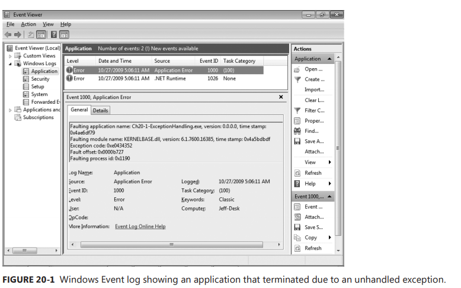
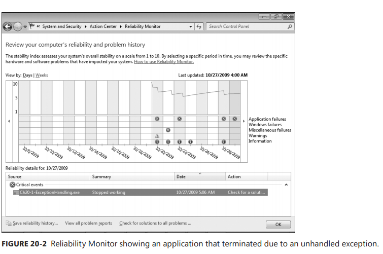
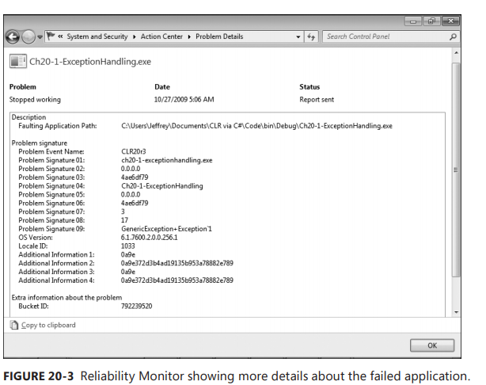
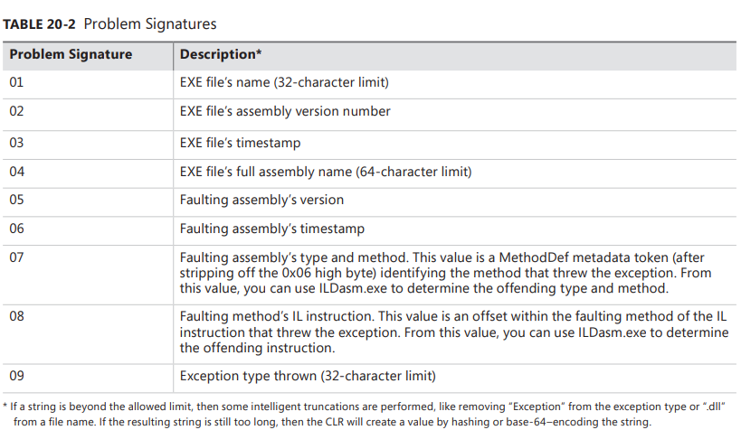

Chapter 20-Exceptions and State Management
==============================

This chapter is all about error handling. But it's not just about that. There are several parts to error handling. First, we'll define what an error actually is. Then, we'll talk about how to discover when your coce is experiencing an error and about how to recover from this error. At this point, state becomes an issue because errors tend to come at inopportune times. It is likely that your code will be in the middle of mutating some state when it experiences the error, and your code will be in the middle of mutating some state when it experiences the error, and your code lilkely will have to restore some state back to what it was prior to attempting to mutate it. Of course, we'll also talk about how your code can notifu its callers that it has detected an error. 

In my opinion, exception handling is the weakest area of the CLR and therefore causes many problems of developers writting managed code. Over the years, Microsoft has made some significant improvements to help developers deal with errors, but I believe that thre is much more that must be done before we can really have a good, reliable system. I will talk a lot about the various enhancements that have been made when dealilng with unhandled exceptions, consstrained execution regions, code contracts, runtime wrapped exceptions, uncatchable exceptions, and so on.

## Defining Exception

When designing a type, you first imagine the various situations in which the type will be used. The type name is usually a noun, such as FileStream or StringBuilder. Then you define the properties, methods, events, and so on for the type. The way you define these members becomes the programmatic interface for your type. These members indicate actions that can be performed by the type itself or on an instance of the type. THese action members are usually verbs such as Read, Write, Flush, Append, Insert, Remove, etc. When an action member cannot complete its task, the member should throw an exception.
<div class="alert alert-info p-1" role="alert">
    An exception is when a member fails to complete the task it is supposed to perform as indicated by its name
</div>

Look at the following class definition:
```C#
internal sealed class Account {
   public static void Transfer(Account from, Account to, Decimal amount) {
      from -= amount;
      to += amount;
   }  
}
```
The Transfer method accepts two Account objects and a Decimal value that identifies an amount of money to transfer between accounts. Obviously, the goal of the Transfer method is to substract money from one account and add money to another. The Transfer method could fail for many reasons: the from or to argument might be null; the from or to argument might not refer to an open account; the from account might have insufficient funds; the to account might have so much money in it that adding more would cause it to overflow; or the amount argument might be 0, negative, or have more than two digits after the decimal place.

When the Transfer method is called. its code must check for all oof these possibilities, and if any of them are detected, it can't transfer the money and should notify the caller that it failed by throwing an exception. In fact, notice that the Transfer method's return type is void. This is because the Transfer method has no meaningful value to return; if it returns at all, it was successful. If it fails, it throws a meaningful exception.

Object-oriented programming allows developers to be very productive because you get to write code like this:
```C#
Boolean f = "Jeff".Substring(1, 1).ToUpper().EndsWith("E");   // true
```
Here I'm composing my intent by chaining several operations together.1 This code was easy for me to write and is easy for others to read and maintain because the intent is obvious. This is great, but there is a big assumption being made here: no operation fails. But, of course, errors are always possible, so we need
a way to handle those errors. In fact, there are many object-oriented constructs—constructors, getting/setting a property, adding/removing an event, calling an operator overload, calling a conversion operator—that have no way to return error codes, but these constructs must still be able to report an error. The mechanism provided by the Microsoft .NET Framework and all programming languages that support it is called *exception handling*.

<div class="alert alert-info p-1" role="alert">
    Many developers incorrectly believe that an exception is related to how frequently something happens. For example, a developer designing a file Read method is likely to say the following: "When reading from a file, you will eventually reach the end of its data. Because reaching the end will always happen, I'll design my Read method so that it reports the end by returning a special value; I won't have it throw an exception". The problem with this statement is that it is being made by the developer designing the Read method, not by the developer calling the Read method.<br>
    When designing the Read method, it is impossible for the developer to know all of the possible situations in which the method gets called. Therefore, the developer can't possibly know how often the caller of the Read method will attempt to read past the end of the file. In fact, because most files contain structured data, attempting to read past the end of a file is something that rarely happens.
</div>

## Exception-Handling Mechanics

The following C# code shows a standard usage of the exception-handling mechanism. This code gives you an idea of what exception-handling blocks look like and what their purpose is. In the subsections after the code:
```C#
private void SomeMethod() {
   try {
      // Put code requiring graceful recovery and/or cleanup operations here...
   }
   catch (InvalidOperationException) {
      // Put code that recovers from an InvalidOperationException here...  
   }
   catch (IOException) {
      // Put code that recovers from an IOException here...
   }
   catch {
      // Put code that recovers from any kind of exception other than those preceding this...

      // When catching any exception, you usually re-throw the exception.
      throw;  
   }
   finally {
      // Put code that cleans up any operations started within the try block here...  
      // The code in here ALWAYS executes, regardless of whether an exception is thrown.
   }
   // Code below the finally block executes if no exception is thrown within the try block
   // or if a catch block catches the exception and doesn't throw or re-throw an exception
}
```
A concrete example:
```C#
class Program {
   static void Main(string[] args) {
      SomeMethod1();
      Console.ReadLine();
   }

   static void SomeMethod1() {
      try {
         SomeMethod2();
      }
      catch (DivideByZeroException e) {
         Console.WriteLine("SomeMethod1 caught");    6
      }
      finally {
         Console.WriteLine("SomeMethod1 finally");   7
      }
      Console.WriteLine("SomeMethod1 last");         8   // according to call stack, the exception (caught in SomeMethod2) is already "handled",
                                                         // so the exception won't go up to SomeMethod1
   }

   static void SomeMethod2() {
      try {
         SomeMethod3();
      }
      catch (DivideByZeroException e) {
         Console.WriteLine("SomeMethod2 caught");    3
         throw;                                       
      }
      finally {
         Console.WriteLine("SomeMethod2 finally");   4   // notice that finally block still execute if re-throw the exception
      }
      Console.WriteLine("SomeMethod2 last");         X   // doesn't meet criteria since re-throwing the exception
   }

   static void SomeMethod3() {
      try {
         SomeMethod4();
      }
      finally {
         Console.WriteLine("SomeMethod3 finally");   2
      }
      Console.WriteLine("SomeMethod3 last");         X   // according to call stack, the exception is not caught in SomeMethod3
                                                         // so it won't get printed here  
   }

   static void SomeMethod4() {
      try {
         Int32 i = 0;
         var c = 3 / i;
      }
      finally {
         Console.WriteLine("SomeMethod4 finally");   1
      }
      Console.WriteLine("SomeMethod4 last");         X   // No catch block to catch the exception, easy to understanding why it is not printed
   }
}
```
the output is:
```
SomeMethod4 finally
SomeMethod3 finally
SomeMethod2 caught
SomeMethod2 finally
SomeMethod1 caught
SomeMethod1 finally
SomeMethod1 last
```


## The Try Block

A try block contains code that requires common cleanup operations, exception-recovery operations, or both. The cleanup code should be placed in a single finally block. A try block can also contain code that might potentially throw an exception. The exception-recovery code should be placed in one or more catch blocks. You create one catch block for each kind of exception that your application can safely recover from. **A try block must be associated with at least one catch or finally block**; it makes no sense to have a try block that stands by itself, and C# will prevent you from doing this.

## The catch Block

A catch block contains code to execute in response to an exception. A try block can have zero or more catch blocks associated with it. If the code in a try block doesn't cause an exception to be thrown, the CLR will never execute the code contained within any of its catch blocks. The thread will simply skip over all of the catch blocks and execute the code in the finally block (if one exists). After the code in the finally block executes, execution continues with the statement following the finally block.

The parenthetical expression appearing after the catch keyword is called the *catch type*. In C#, you must specify a catch type of `System.Exception` or a type derived from it. The last catch block (which doesn't specify a catch type) handles any exception except for the exception type specified by earlier catch blocks; this is equivalent to having a catch block that specifies a catch type of `System.Exception` except that you cannot access the exception information via code inside the catch block's braces.

The CLR searches from top to bottom for a matching catch type, and therefore you should place the more specific exception types at the top. The most-derived exception types should appear first, followed by their base types (if any), down to System.Exception (or an exception block that doesn’t specify a catch type). In fact, the C# compiler generates an error if more specific catch blocks appear closer to the bottom because the catch block would be unreachable.

If an exception is thrown by code executing within the try block (or any method called from within the try block), the CLR starts searching for catch blocks whose catch type is the same type as or a base type of the thrown exception. If none of the catch types matches the exception, the CLR continues searching up the call stack looking for a catch type that matches the exception. If after reaching the top of the call stack, no catch block is found with a matching catch type, an unhandled exception occurs. I’ll talk more about unhandled exceptions later in this chapter.

After the CLR locates a catch block with a matching catch type, it executes the code in all inner finally blocks (I think the author didn't say precisely here, check the above code that reveal sequences), starting from within the try block whose code threw the exception and stopping with the catch block that matched the exception. Note that any finally block assocaited with the catch block that matched the exception is not executed yet. The code in this finally block won't execute until after the code in the handling catch block executed.

After all the code in the inner finally blocks (except the one that matches mentioned above) has executed, the code in the handling catch block executes. This code typically performs some operations to deal with the exception. At the end of the catch block, you have three choices:
<ul>
  <li>Re-throw the same exception, notifying code high up in the call stack of the exception</li>
  <li>Throw a different exception, giving richer exception information to code higher up in the call stack.</li>
  <li>Let the thread fall out of the bottom of the catch block</li>
</ul> 

Later in this chapter, I'll offer some guidelines for when you should use each of these techniques. If you choose either of the first two techniques, you're throwing an exception, and the CLR behaves just as it did before: it walks up the call stack looking for a catch block whose type matches the type of the exception thrown.

If you picl the last technique, when the thread falls out of the bottom of the catch block, it immediately starts executing code contained in the finally block (if one exists). After all of the code in the finally block executes, the thread drops out of the finally block and starts executing the statement immediately following the finally block. If no finally block exists, the thread continues execution at the statement following the last catch block.

In C#, you can specify a variable name after a catch type. When an exception is caught, this variable refers to the System.Exception-derived object that was thrown. The catch block's code can reference this variable to access information specific to the exception (such as the stack trace leading up to the exception). Although it's possible to modify this object, you shouldn’t; consider the object to be read-only. I'll explain the Exception type and what you can do with it later in this chapter.

## The finally Block

A finally block contains code that's guaranteed to execute. Typically, the code in a finally block performs the cleanup operations required by actions taken in the try block. For example, if you open a file in a try block, you'd put the code to close the file in a finally block:
```C#
private void ReadData(String pathname) {
   FileStream fs = null;
   try {
      fs = new FileStream(pathname, FileMode.Open);
      // Process the data in the file...   
   }   
   catch (IOException) {
      // Put code that recovers from an IOException here...
   }
   finally {
      // Make sure that the file gets closed
      if (fs != null)
         fs.Close(); 
   }
}
```
If the code in the try block executes without throwing an exception, the file is guaranteed to be closed. If the code in the try block does throw an exception, the code in the finally block still executes, and the file is guaranteed to be closed, regardless of whether the exception is caught. It's improper to put the statment to close the file after the finally block; the statement wouldn't execute if an exception were thrown and not caught, which would result in the file being left open (until the next garbage collection).

A try block doesn't require a finally block associated with it; sometimes the code in a try block just doesn't require any cleanup code. However, if you do have a finally block, it must appear after any and all catch blocks. A try block can have no more than one finally block associated with it. The code inside catch and finally blocks should be very short and should have a high likelihood of succeeding without itself throwing an exception. Usually the code in these blocks is just one or two lines of code.

It is always possible that exception-recovery code or cleanup code could fail and throw an exception. Although possible, it is unlikely and if it does happen it usually means there is something very wrong somewhere. Most likely some state has gotten corrupted somewhere. If an exception is inadvertently thrown within a catch or finally block, the world will not come to an end, **the CLR's exception mechanism will execute as though the exception were thrown after the finally block**. However, the CLR doesn't keep tracknof the first exception that was thrown in the corresponding try block (if any), and you will lose any and all information (such as stack trace) available about the first exception. Probably (and hopefully), this new exception will not be handled by your code and the exception will turn into an unhandled exception. The CLR will then terminate your process, which is good because all the corrupted state will now be destroyed. This is much better than having your application continue to run with unpredictable results and possible security holes.

<div class="alert alert-info p-1" role="alert">
    <h3 class="mt-0">CLS and Non-CLS Exceptions</h2>
    All programming languages for the CLR must support the throwing of Exception-derived objects because the Common Language Specification (CLS) mandates this. However, the CLR actually allows an instance of any type to be thrown, and some programming languages will allow code to throw non-CLS-compliant exception objects such as String, Int32, or DateTime. The C# compiler allows code to throw only Exception-derived objects, whereas code written in some other languages allow code to throw Exception-derived objects in addition to objects that are not derived from Exception.<br><br>
    Many programmers are not aware that the CLR allows any objects to be thrown to report an exception. Most developers believe that only Exception-derived objects can be thrown. Prior to CLR 2.0, when programmers wrote catch blocks to catch exceptions, there were catching CLS-compliant exceptions only. If a C# method called a method written in another language, and that method threw a non-CLS-compliant exception, the C# code would not catch this exception at all, leading to some security vulunerabilities. <br><br>
    In CLR 2.0, Microsoft introduced a new <code>RuntimeWrappedException</code> class. This class id derived from Exception, so it is a CLS-compilant exception type. The RuntimeWrappedException class contains a private field of type Object (which can be accessed by using RuntimeWrappedException's WrappedException read-only property). In CLR 2.0, when a non-CLS-compilant exception is thrown, the CLR automatically constructs an instance of the RuntimeWrappedException class and initializes its private field to refer to the object that was actually thrown, In effect, the CLR now turns all non-CLS-compliant exceptions into CLS-compliant exceptions.
</div>

 Before C# 2.0, developers who know CLR can catch both CLS cpmpilant and non–CLS-compliant exceptions might write code like this:
 ```C#
 // legacy code prior C# 2.0
 private void SomeMethod() {
    try {
       ...
    }
    catch (Exception e) {
       // catches CLS-compliant exceptions only
       ...
    }
    catch {
       // In all versions of C#, this block catches CLS-compliant
       // & non–CLS-compliant exceptions  
       ...
    }
 }
 ```
 But now CLR use `RuntimeWrappedException` to turn non–CLS-compliant exceptions into CLS-compliant exceptions, when you migrate this code, the second catch block will never executes and the C# compiler will indicate this by issuing a warning: `CS1058: A previous catch clause already catches all exceptions. All non-exceptions thrown will be wrapped in a System.Runtime.CompilerServices.RuntimeWrappedException.` 

There are two ways for developers to migrate code from a version of the .NET Framework prior to version 2.0. First, you can merge the code from the two catch blocks into a single catch block and delete one of the catch blocks. This is the recommended approach. Alternatively, you can tell the CLR that the code in your assembly wants to play by the old rules by using an attribute to your assembly like this:
```C#
using System.Runtime.CompilerServices;
[assembly:RuntimeCompatibility(WrapNonExceptionThrows = false)]
```

## The System.Exception Class

The CLR allows an instance of any type to be thrown for an exception—from an Int32 to a String and beyond. However, Microsoft decided against forcing all programming languages to throw and catch exceptions of any type, so they defined the `System.Exception` type and decreed that all CLScompliant programming languages must be able to throw and catch exceptions whose type is derived from this type. Exception types that are derived from `System.Exception` are said to be CLS-compliant. C# and many other language compilers allow your code to throw only CLS-compliant exceptions.
```C#
public class Exception : ISerializable, _Exception {
   public Exception();
   public Exception(string message);  
   public Exception(string message, Exception innerException);
   ...
   public virtual string Source { get; set; }
   public virtual string HelpLink { get; set; }
   public virtual string StackTrace { get; }
   public MethodBase TargetSite { get; }
   public Exception InnerException { get; }

   public virtual Exception GetBaseException() {  // Retrieves the lowest exception (inner most) for the given Exception.
      Exception inner = InnerException;
      Exception back = this;
      while (inner != null) {
         back = inner;
         inner = inner.InnerException;
      }
      return back;
   }

   public virtual string Message { get; }
   public virtual IDictionary Data { get; }
   ...
}
```
The System.Exception type is a very simple type that contains the properties described in table below. Usually, you will not write any code to query or access these properties in any way. Instead, when your application terminates due to an unhandled exception, you will look at these properties in the debugger or in a report that gets generated and written out to the Windows Application event log or crash dump:

| Property | Access | Type | Description |
| -------- | -------| ---- | ----------- |
| Message | Read-only | String | Contains helpful text indicating (e.g **"Attempted to divided by 0"**) why the exception was thrown. The message is typically written to a log when a thrown exception is unhandled. Because end users do not see this message, the message should be as technical as possible so that developers viewing the log can use the information in the message to fix the code when producing a new version. |
| Data | Read-only | IDictionary | A reference to a collection of key-value pairs, Usually, the code throwing the exception adds entries to this collection prior to throwing it<sup>1</sup>; code that catches the exception can query the enties and use the information in its exception-recovery processing. |
| Source | Read-write | String | Contains the name of the assembly that generated the exception. |
| StackTrace | Read-only | String | Contains the names and signatures of methods called that led up to the exception being thrown. This property is invaluable for debugging. |
| TargetSite | Read-only | MethodBase | Contains the method that threw the exception. |
| HelpLink | Read-only | String | Contains a URL (such as file://C:\MyApp\Help.htm#MyExceptionHelp) to documentation that can help a user understand the exception. Keep in mind that sound programming and security practices prevent users from ever being able to see raw unhandled exceptions, so unless you are trying to convey information to other programmers, this property is seldom used. |
| InnerException | Read-only | Exception | Indicates the previous exception if the current exception were raised while handling an exception. This read-only property is usually null. The Exception type also offers a public `GetBaseException` method that traverses wrapped exceptions and returns the originally thrown exception. |


Code using `Exception.Data`:
```C#
public static void SomeMehtod() {
   try {
      ...
   }
   catch (Exception e) {
      e.Data["ExtraInfo"] = "Information from SomeMehtod.";
      e.Data.Add("MoreExtraInfo", "More information from SomeMehtod.");
      throw;
   }
}
```

Code using `Exception.InnerException`:
```C#
// suppose you have a class that submits an order. That code calls other classes, and somewhere deep inside it throws a NullReferenceException
// now when the order submit fails what you get isn't just a NullReferenceException, it's an OrderSubmitException. 
// when you see that in your log or catch it further up in your application it's easier to tell that it was an exception thrown when placing an order.
// but the details, which are really important, are in the InnerException property of your new exception (because you passed that original exception into the constructor.) 
public static void SomeMehtod() {
   try {
      SubmitOrder(order);
   }
   catch (Exception e) {
      throw new OrderSubmitException("An error occurred while placing the order", ex);
   }
}
```

Code using `Exception.GetBaseException` method:
```C#
// An exception that wraps an inner exception can itself by wrapped.  
// when you catch an exception, the original cause of the exception might be several levels deep.
// you can get to the original exception by looking at the InnerException property of each exception, working your way down until you find one that has a null value for InnerException.
// you can also get access to the innermost exception using the Exception.GetBaseException method. This method just follows the chain of exceptions using the InnerException and stops when it gets to the innermost exception.
public static void SomeMehtod() {
   try {
      ...
   }
   catch (ApplicationException wrappedEx) {
      Console.WriteLine(" Base exception is: ");
      Console.WriteLine("{0}", wrappedEx.GetBaseException().ToString());
   }
}
```

I'd like to say a few words about `StackTrace` property. A catch block can read this property to obtain the stack trace indicating what methods were called that led up to the exception. This information can be extremely valuable when you're trying to detect the cause of an exception so that you can correct your code. When you access this property, you're actually calling into code in the CLR; the property doesn't simply return a string. When you construct a new object of an Exception-derived type, the `StackTrace` property is initialized to `null`. If you were to read the property, you wouldn't get back a stack trace; you would get back `null`.

When an exception is thrown, the CLR internally records where the throw instruction occurred. When a catch block accepts the exception, the CLR records where the exception was caught, if, inside a catch block, you now access the thrown exception object's `StackTrace` property, the code that implements the property calls into the CLR, which builds a string identifying all of the methods between the place where the exception was thrown and the filter that caught th e exception.

The following code throws the same exception object that it caught and causes the CLR to reset its starting point for the exception:
```C#
private void SomeMethod() {
   try { ... }
   catch (Exception e) {
      ...
      throw e;   // CLR thinks this is where exception originated.
                 // FxCop reports this as an error
   }
}
```
In contrast, if you re-throw an exception object by using the `throw` keyword by itself, the CLR doesn't reset the stack's starting point.T he following code re-throws the same exception object that it caught, causing the CLR to not reset its starting point for the exception:
```C#
private void SomeMethod() {
   try { ... }
   catch (Exception e) {
      ...
      throw;   // This has no effect on where the CLR thinks the exception originated.
               // FxCop does NOT report this as an error
   }
}
```
In fact, the only difference between these two code fragments is what the CLR thinks is the original location where the exception was thrown. Unfortunately, when you throw or re-throw an exception, Windows does reset the stack's starting point. So if the exception becomes unhandled, the stack location that gets reported to Windows Error Reporting is the location of the last throw or re-thrown, even though the CLR knows the stack location where the original exception was thrwon. This is unfortunate because it makes debugging applications that have failed in the field much more difficult. 

The strin returned from the `StackTrace` property doesn't include any of the methods in the call stack that are above the point where the catch block accepted the exception object. If you want the complete stack trace from the start of the thread up to the exception handler, you can use the `System.Diagnostics StackTrace` type. This type defines some properties and methods that allow a developer to programmatically manipulate a stack trace and the frames that make up the stack trace.

## FCL-Defined Exception Classes

The Framework Class Library (FCL) defines many exception types (all ultimately derived from `System.Exception`). The following hierarchy shows the exception types defined in the MSCorLib.dll assembly; other assemblies define even more exception types. (The application used to obtain this hierarchy is shown in Chapter 23, "Assembly Loading and Reflection."):
```
System.Exception
   System.AggregateException
   System.ApplicationException  
      System.Reflection.InvalidFilterCriteriaException
      System.Reflection.TargetException
      System.Reflection.TargetInvocationException
      System.Reflection.TargetParameterCountException
      System.Threading.WaitHandleCannotBeOpenedException
   System.Diagnostics.Tracing.EventSourceException
   System.InvalidTimeZoneException
   System.IO.IsolatedStorage.IsolatedStorageException
   System.Threading.LockRecursionException
   System.Runtime.CompilerServices.RuntimeWrappedException 
   System.SystemException
      System.Threading.AbandonedMutexException
      System.AccessViolationException
      System.Reflection.AmbiguousMatchException
      System.AppDomainUnloadedException
      System.ArithmeticException
         System.DivideByZeroException
         System.NotFiniteNumberException
         System.OverflowException
   ...
   System.Threading.Tasks.TaskSchedulerException
   System.TimeZoneNotFoundException        
```
The original idea was that System.Exception would be the base type for all exceptions and that two other types, System.SystemException and System.ApplicationException, would be the only two types immediately derived from Exception. Furthermore, exceptions thrown by the CLR would be derived from SystemException, and all application-thrown exceptions would be derived from ApplicationException. This way, developers could write a catch block that catches all CLRthrown exceptions or all application-thrown exceptions.

However, as you can see, this rule was not followed very well; some exception types are immediately derived from Exception (IsolatedStorageException), some CLR-thrown exceptions are derived from ApplicationException (TargetInvocationException), and some application-thrown exceptions are derived from SystemException (FormatException). So it is all a big mess, and the result is that the SystemException and ApplicationException types have no special meaning at all. At this point, Microsoft would like to remove them from the exception class hierarchy, but they can't because it would break any code that already references these two types.

## Throwing an Exception

When implementing your own methods, you should throw an exception when the method cannot complete its task as indicated by its name. When you want to throw an exception, there are two issues that you really need to think about and consider.

The first issue is about which Exception-derived type you are going to throw. You really want to select a type that is meaningful here. Consider the code that is higher up the call stack and how that code mught want to determine that a method failed in order to execute some graceful recovery code. You can use a type that is already defined in the FCL, but there may not be the one in the FCL that matches your exact semantics. So you'll probably need to define your own type, ultimately derived from System.Exception.

If you want to define an exception type hierarchy, it is highly recommended that the hierarchy be shallow and wide in order to create as few base classes as possible. The reason is that base classes act as a way of treating lots of errors as one error, and this is usually dangerous. Along these lines, you should never throw a System.Exception object (In fact, the System.Exception class should have been marked as abstract, which would forbid code that tried to
throw it from even compiling), and you should use extreme caution if you throw any other base class exception type.

<div class="alert alert-info p-1" role="alert">
    There are visioning ramifications here, too. If you define a new exception type derived from an existing type, then all code that catches the existing base type will now catch your new type as well. In some scenarios, this may be desired and in some scenarios, it may not be desired. The problem is that it really depends on how code that catches the base class responds to the exception type and types derived from it. Code that never anticipatedthe new exception may now behave unpredictably and open security holes. The person defining the new exception type can't know about all the places where the base exception is caught and how it is handled. And so, in practice, it is impossibile to make a good intelligent decision here.
</div>

The second issue is about deciding what string message you are going to pass to the exception type's constructor. When you throw an exception, you should include a string message with detailed information indicting why the method couldn't complete its task. If the exception is caught and handled, this string message is not seen. However, if the exception becomes an unhandled exception. this message is usually logged. An unhandled exception indicates a true bug in the application, and a developer must get involved to fix the bug. An end user will not have the source code or the ability to fix the code and recompile it. In fact, this string message should not be shown to an end user. So these string messages can be very technically detailed and as geeky as it necessary to help developers fix their code.

## Defining Your Own Exception Class

Unfortunately, designing your own exception is tedious and error prone. The main reason for this is because all Exception-derive types should be serializable so that they can cross an AppDomain boundary or be written to a log or database. There are many issues related to serialization and they are discussed in Chapter 24, "Runtime Serialization". So, in an effort to simplify things, I made my own generic `Exception<TExceptionArgs>` class, which is defined as follows:
```C#
class Program {
   static void Main(string[] args) {
      TestException();
   }

   static void TestException() {
      try {
         throw new Exception<DiskFullExceptionArgs>(new DiskFullExceptionArgs(@"C:\"), "The disk is full");
      }
      catch (Exception<DiskFullExceptionArgs> e) {
         Console.WriteLine(e.Message);
         throw;
      }
   }
}

[Serializable]
public sealed class DiskFullExceptionArgs : ExceptionArgs {
   private readonly String m_diskpath;   // private field set at construction time

   public DiskFullExceptionArgs(String diskpath) {
      m_diskpath = diskpath;
   }

   public String DiskPath { get { return m_diskpath; } }

   // Override the Message property to include our field (if set)
   public override String Message {
      get {
         return (m_diskpath == null) ? base.Message : "DiskPath=" + m_diskpath;
      }
   }
}

[Serializable]
public abstract class ExceptionArgs {
   public virtual String Message { get { return String.Empty; } } 
}

[Serializable]
public sealed class Exception<TExceptionArgs> : Exception, ISerializable where TExceptionArgs : ExceptionArgs {
   private const String c_args = "Args";   // For (de)serialization
   private readonly TExceptionArgs m_args;

   public TExceptionArgs Args { get { return m_args; } }

   public Exception(String message = null, Exception innerException = null) : this(null, message, innerException) {
   }

   public Exception(TExceptionArgs args, String message = null, Exception innerException = null) : base(message, innerException) {
      m_args = args;
   }

   // This constructor is for deserialization; since the class is sealed, the constructor is private. 
   // If this class were not sealed, this constructor should be protected 
   [SecurityPermission(SecurityAction.LinkDemand, Flags = SecurityPermissionFlag.SerializationFormatter)]
   private Exception(SerializationInfo info, StreamingContext context) : base(info, context) {
      m_args = (TExceptionArgs)info.GetValue(c_args, typeof(TExceptionArgs));
   }

   // This method is for serialization; it’s public because of the ISerializable interface
   [SecurityPermission(SecurityAction.LinkDemand, Flags = SecurityPermissionFlag.SerializationFormatter)]
   public override void GetObjectData(SerializationInfo info, StreamingContext context) {
      info.AddValue(c_args, m_args);
      base.GetObjectData(info, context);
   }

   public override String Message {
      get {
         String baseMsg = base.Message;
         return (m_args == null) ? baseMsg : baseMsg + " (" + m_args.Message + ")";

      }
   }

   public override Boolean Equals(Object obj) {
      Exception<TExceptionArgs> other = obj as Exception<TExceptionArgs>;
      if (other == null)
         return false;
      return Object.Equals(m_args, other.m_args) && base.Equals(obj);
   }
   public override int GetHashCode() { return base.GetHashCode(); }
}
```

## Trading Reliability for Productivity

In this section, I'd like to point out some of the potential failures and why it has become culturally acceptable to ignore them. I'd also like to
point out some of the significant problems that can occur when ignoring these failures and suggest some ways to help mitigate these problems.

Object-oriented programming allows developers to be very productive. A big part of this is composability which makes it easy to write, read and maintain code. Take this line of code, for example:
```C#
Boolean f = "Jeff".Substring(1, 1).ToUpper().EndsWith("E");
```

There is a big assumption being made with the preceding code: no errors occur. But, of course, errors are always possible, and so we need a way to handle those errors. This is what the exception handling constructs and mechanisms are all about and why we need them as opposed to having methods that return true/false or an HRESULT to indicate success/failure the way that Win32 and COM functions do.

In addition to code composability, we are productive due to all kinds of great features provided by our compilers. For example, the compiler implicitly:
<ul>
  <li>Inserts optional parameters when calling a method.</li>
  <li>Boxes value type instances</li>
  <li>Constructs delegate objects.</li>
  <li>...</li>
</ul> 

And, the CLR itself does all kinds of great things for developers to make our lives even easier. For example, the CLR implicitly:
<ul>
  <li>Invokes Finalize methods after a garbage collection before objects have their memory reclaimed.</li>
  <li>Creates type objects in the loader heap when using generic types</li>
  <li>Invokes a type’s static constructor potential throwing of <code>TypeInitializationException</code></li>
  <li>Throws various exceptions, including <code>OutOfMemoryException</code>, <code>DivideByZeroException</code>,
<code>NullReferenceException</code>...</li>
  <li>...</li>
</ul> 

All of this stuff—object-oriented programming, compiler features, CLR features, and the enormous class library—is what makes the .NET Framework such a compelling software development platform. My point is that all of this stuff introduces points of failure into your code, which you have little control over. As long as everything is working great, all is well: we write code easily, the code is easy to read and maintain. But, when something goes wrong, it is nearly impossible to fully understand what went wrong and why. 

Here is an example that should really help get my point across:
```C#
private static Object OneStatement(Stream stream, Char charToFind) {
   return (charToFind + ": " + stream.GetType() + String.Empty + (stream.Position + 512M))
      .Where(c=>c == charToFind).ToArray();
}
```
This slightly contrived method contains just one C# statement in it, but this statement does an awful lot of work. The Intermediate Language (IL) the C# compiler produced for this method can throw different kinds of exceptions. 

Of course, all the methods that are being called are methods that I personally have no control over because they are produced by Microsoft. And it's entirely possible that Microsoft might change how these methods are implemented in the future, so they could throw new exception types that I could not possibly know about on the day I wrote the OneStatement method. How can I possibly write my OneStatement method to be completely robust against all possible failures? By the way, the opposite is also a problem: a catch block could catch an exception type derived from the specified exception type and now I'm executing recovery code for a different kind of failure.

So now that you have a sense of all the possible failures, you can probably see why it has become culturally acceptable to not write truly robust and reliable code: it is simply impractical. Moreover, one could argue that it is actually impossible. The fact that errors do not occur frequently is another reason why it has become culturally acceptable.  Because errors (like OutOfMemoryException) occur very infrequently, the community has decided to trade truly reliable code for programmer productivity.

One of the nice things about exceptions is that an unhandled one causes your application to terminate. This is nice because during testing, you will discover problems quickly and the information you get with an unhandled exception (error message and stack trace) are usually enough to allow you to fix your code. Of course, a lot of companies don't want their application to just terminate after it has been tested and deployed, so a lot of developers insert code to catch System.Exception, the base class of all exception types. However, the problem with catching System.Exception and allowing the application to continue running is that state may be corrupted.

Earlier in this chapter, I showed an Account class that defines a Transfer method whose job is to transfer money from one account to another account. What if, when this Transfer method is called, it successfully subtracts money from the from account and then throws an exception before it adds money to the to account? If calling code catches System.Exception and continues running, then the state of the application is corrupted: both the from and to accounts have less money in them then they should. Because we are talking about money here, this state corruption wouldn't just be considered a simple bug, it would definitely be considered a security bug. If the application continues running, it will attempt to perform more transfers to and from various accounts and now state corruption is running rampant within the application.

One could say that the Transfer method itself should catch System.Exception and restore money back into the from account. And this might actually work out OK if the Transfer method is simple enough. But if the Transfer method produces an audit record of the withdrawn money or if other threads are manipulating the same account at the same time, then attempting to undo the operation could fail as well, producing yet another thrown exception. And now, state corruption is
getting worse, not better.


To work in the future-the rest of content (not very useful and some threading knowledge involved)

## Guidelines and Best Practices

All too often, I see library developers catching all kinds of exceptions, preventing the application developer from knowing that a problem occurred. In this section, I offer some guidelines for developers to be aware of when using exceptions.

#### Use finally Blocks Liberally

You should use finally blocks to clean up from any operation that successfully started before returning to your caller or allowing code following finally block to execute. You also frequently use finally blocks to explicity dispose any objects to avoid resource leaking. Here's an example that has all cleanup code (closing the file) in a finally block:
```C#
public sealed class SomeType {
   private void SomeMethod() {
      FileStream fs = new FileStream(@"C:\Data.bin ", FileMode.Open); 
      try {
         // Display 100 divided by the first byte in the file.
         Console.WriteLine(100 / fs.ReadByte()); 
      }
      finally {
         if (fs != null) 
            fs.Dispose();
      }
   }
}
```
Ensuring that cleanup code always executes is so important that many programming languages offer constructs that make writing cleanup code easier. For example, the C# language automatically emits try/finally blocks whenever you use the lock, using, and foreach statements. The C# compiler also emits try/finally blocks whenever you override a class’s destructor (the Finalize method). When using these constructs, the compiler puts the code you've written inside the try block and automatically puts the cleanup code inside the finally block. Specifically:
<ul>
  <li>When you use the lock statement, the lock is released inside a finally block.</li>
  <li>When you use the using statement, the object has its Dispose method called inside a finally block.</li>
  <li>When you define a destructor method, the base class's Finalize method is called inside a finally block.</li>
</ul> 
For example, the following C# code takes advantage of the using statement. This code is shorter than the code shown in the previous example, but the code that the compiler generates is identical to the code generated in the previous example:

```C#
public sealed class SomeType {
   private void SomeMethod() {
      using (FileStream fs = new FileStream(@"C:\Data.bin", FileMode.Open)) {
         // Display 100 divided by the first byte in the file.
         Console.WriteLine(100 / fs.ReadByte()); 
      }
   }
}
```
For more about the using statement, see Chapter 21; and for more about the lock statement, see Chapter 30.

#### Don't Catch Everything

A ubiquitous mistake by developers who have not been proply trained on the proper use of exception is to use catch blocks too often and improperly. When you catch an exception, you're stating that you expected this exception, you understand why it occured, and you know how to deal with it. In other words, you're defining a policy for the application. This all goes back to the Trading Reliability for Productivity section earlier in this chapter.

All too often, I see code like this:

```C#
try {
   // try to execute code that the programmer knows might fail...
}
catch (Exception) {
   ...
}
```
This code indicates that it was expecting any and all exceptions and knows how to recover from anyt and all situations. How can this possibly be? A type that's part of a class library should never, ever, under any circumstance catch and swallow all exceptions because there is no way for the type to know exactly how the application intends to respond to an excetpion. In addition, the type will frequently call out the application code via a delegate, virtual method, or interface method. If the application code throws an exception, another part of  the application is probably expecting to catch this exception. The exception should be allowed to filter its way up the call stack and let the application code handle the exception as it sees fit.

If the exception is unhandled, the CLR terminates the process. I'll discuss unhandled exceptions later in this chapter. Most unhandled exceptions will be discovered during testing of your code. To fix these unhandled excetpions, you will either modify the code to look for a specific exception, or you will rewrite the code to eliminate the conditions that cause the exception to be thrown. The final version of the code will be running in a production environment should see very few unhandled exceptions and will be extremely robust.

<div class="alert alert-info p-1" role="alert">
    In some cases, a method that can't complete its task will detect that some object's state has been corrupted and cannot be restored. Allowing the application to continue running might result in unpredictable behavior or security vulnerablilities. When this situation is detected, that method should not throw an excetption; instead, it should force the process to terminate immediately by calling <code>SystemEnvironment.FailFast</code> method
</div>

By the way, it is OK to catch System.Exception and execute some code inside the catch block's braces as long as you re-throw the exception at the bottom of that code. Catching System.Exception and swallowing the exception (not re-throwing it) should never be done because it hides failures that allow the application to run with unpredictable results and potential security vulnerabilities. Visual Studio's code analysis tool (FxCopCmd.exe) will flag any code that contains a catch (Exception) block unless there is a throw statement included in the block's code. The "Backing Out of a Partially Completed Operation When an Unrecoverable Exception Occurs—Maintaining State" section, coming shortly in this chapter, will discuss this pattern.

To Work in the future- re-throw the exception in another thread. The Asynchronous Programming Model (discussed in Chapter 28, “I/O-Bound Asynchronous
Operations”) supports this.

#### Recovering Gracefully from an Exception

Sometimes you call a method knowing in advance some of the exceptions that the method might throw. Because you expect these exceptions, you might want to have some code that allows your application to recover gracefully from the situation and continue running. Here's an example in pseudocode:

```C#
public String CalculateSpreadsheetCell(Int32 row, Int32 column) {
   String result;
   try {
      result = /* method to calculate value of a spreadsheet's cell */
   }
   catch (DivideByZeroException) {
      result = "Can't show value: Divide by zero";
   }
   catch (OverflowException) {
      result = "Can't show value: Too big";
   }
   return result;
}
```

#### Backing Out of a Partially Completed Operation When an Unrecoverable Exception Occurs—Maintaining State

Usually, methods call several other methods to perform a single abstract operation. Some of the individual methods might complete successfully, and some might not. For example, let's say that you're serializing a set of objects to a disk file. After serializing 10 objects, an exception is thrown (Perhaps
the disk is full or the next object to be serialized isn’t marked with the Serializable custom attribute). At this point, At this point, the exception should filter up to the caller, but what about the state of the disk file? The file is now corrupted because it contains a partially serialized object graph. It would be great if the application could back out of the partially completed operation so that the file would be in the stat it was in before any objects were serialized into it. The following code demonstrates the correct way to implement this:

```C#
public void SerializeObjectGraph(FileStream fs, IFormatter formatter, Object rootObj) {
   // Save the current position of the file. 
   Int64 beforeSerialization = fs.Position;

   try {
   // Attempt to serialize the object graph to the file.
      formatter.Serialize(fs, rootObj);
   }
   catch { // Catch any and all exceptions. 
      // If ANYTHING goes wrong, reset the file back to a good state.
      fs.Position = beforeSerialization;

      // Truncate the file.
      fs.SetLength(fs.Position);

      // NOTE: The preceding code isn't in a finally block because
      // the stream should be reset only when serialization fails.
      // Let the caller(s) know what happened by re-throwing the SAME exception.
      throw; 
   }
}
```
To properly back out of the partially completed operation, write code that catches all exceptions. Yes, catch all exceptions here because you don’t care what kind of error occurred; you need to put your data structures back into a consistent state. After you’ve caught and handled the exception, don't swallow it—let the caller know that the exception occurred. You do this by re-throwing the same exception. In fact, C# and many other languages make this easy. Just use C#'s throw keyword without specifying anything after throw, as shown in the previous code.

Notice that the catch block in the previous example doesn’t specify any exception type because I want to catch any and all exceptions. In addition, the code in the catch block doesn’t need to know exactly what kind of exception was thrown, just that something went wrong. Fortunately, C# lets me do this easily just by not specifying any exception type and by making the throw statement re-throw whatever object is caught.

#### Hiding an Implementation Detail to Maintain a "Contract"

In some situations, you might find it useful to catch one exception and re-throw a different exception. The only reason to do this is to maintain the meaning of a method's contract. Also, the new exception type that you throw should be a specific exception  (an exception that's not used as the base type of any other exception type). Imagine a PhoneBook type that defines a method that looks up a phone number from a name, as shown in the following pseudocode:

```C#
internal sealed class PhoneBook {
   private String m_pathname; // path name of file containing the address book

   // Other methods go here.

   public String GetPhoneNumber(String name) {
      String phone;
      FileStream fs = null;
      try {
         fs = new FileStream(m_pathname, FileMode.Open);
         // Code to read from fs until name is found goes here
         phone = /* the phone # found */
      }
      catch (FileNotFoundException e) {
         // Throw a different exception containing the name, and
         // set the originating exception as the inner exception.
         throw new NameNotFoundException(name, e); 
      }  
      catch (IOException e) {
         // Throw a different exception containing the name, and
         // set the originating exception as the inner exception.
         throw new NameNotFoundException(name, e); 
      }
      finally {
         if (fs != null) fs.Close();
      }
      return phone;    
   }   
}
```
The phone book data is obtained from a file (versus a network connection or database). However, the user of the PhoneBook type doesn't know this because this is an implementation detail that could change in the future. So if the file isn’t found or can’t be read for any reason, the caller would see a FileNotFoundException or IOException, which wouldn’t be anticipated. In other words, the file's existence and ability to be read is not part of the method’s implied contract: there is no way the caller could have guessed this. So the GetPhoneNumber method catches these two exception types and throws a new NameNotFoundException. Throwing an exception still lets the caller know that the method cannot complete its task, and the NameNotFoundException type gives the caller an abstracted view as to why. Setting the inner exception to FileNotFoundException or IOException is important so that the real cause of the exception isn't lost. 

Sometimes developers catch one exception and throw a new exception in order to add additional data or context to an exception. However, if this is all you want to do, you should just catch the exception type you want, add data to the exception object's Data property collection, and then re-throw the same exception object:

```C#
private static void SomeMethod(String filename) {
   try {
      ...
   }
   catch (IOException e) {
      // Add the filename to the IOException object
      e.Data.Add("Filename", filename);
      throw; // re-throw the same exception object that now has additional data in it
   }
}
```

To work in the future-when a type constructor throws an exception that is not caught within the type constructor method,the CLR internally catches that exception and throws a new `TypeInitializationException` instead. When you invoke a method via reflection, the CLR internally catches any exception thrown by the method and converts it to a TargetInvocationException.

#### Unhandled Exceptions

When an exception is thrown, the CLR climbs up the call stack looking for catch blocks that match the type of the exception object being thrown. If no catch block matches the thrown exception type, an unhandled exception occurs. When the CLR detects that any thread in the process has had an unhandled exception, the CLR terminates the process. An unhandled exception identifies a situation that the application didn't anticipate and is considered to be a true bug in the application. At this point, the bug should be reported back to the company that publishes the application. Hopefully, the publisher will fix the bug and distribute a new version of the application.

Class library developers should not even think about unhandled exceptions. Only application developers need to concern themselves with unhandled exceptions, and the application should have a policy in place for dealing with unhandled exceptions. Microsoft actually recommends that application developers just accept the CLR's default policy. That is, when an application gets an unhandled exception, Windows writes an entry to the system’s event log. You can see this entry by opening the Event Viewer application and then looking under the Windows Logs ➔ Application node in the tree,
as shown in Figure below:


However, you can get more interesting details about the problem by using the Windows Reliability Monitor applet. To start Reliability Monitor, open the Windows Control Panel and search for "reliability history". From here, you can see the applications that have terminated due to an unhandled exception in the bottom pane, as shown in figure below:


To see more details about the terminated application, double-click a terminated application in Reliability Monitor. The details will look something like Figure 20-3 and the meaning of the problem signatures are described in Table 20-2. All unhandled exceptions produced by managed applications are placed in the CLR20r3 bucket.



## Constrained Execution Regions (CERs)

<!--
Many application don't need to be robust and recover from any and all kinds of failures. This is true of many client applications like Notepad.exe and Calc.exe. And, of course, many of us have seen Microsoft Office applications like Word.exe, Excel.exe, and Outlook.exe terminate due to unhandled exceptions. Also, many server-side application, like web servers, are stateless and are automatically restarted if they fail due to an unhandled exception. Of course some servers, like SQL Server, are all about stat management and having data lost due to an unhandled exception is potentially much more disastrous.

In the CLR, we have AppDomains which contain state. When an AppDomain is unloaded, all its state is unloaded. And so, if a thread in an AppDomain experiences an unhandled exception, it is OK to unload the AppDomain (which destroys all its state) without terminating the whole process.

By definition, a CER is a block of code that must be resilient to failure. Because AppDomain can be unloaded, destroying their state, CERs are typically used to manipulate any state that is shared by multiple AppDomains or processes. CERs are useful when trying to maintain state in the face of exceptions that get thrown unexpectedly. Sometimes we refer to these kinds of exceptions as asynchronous exceptions. For example, when calling a method, the CLR has to load an assembly, create a type object in the AppDomain's loader heap, call the type's static constructor, JIT IL into native code, and so on. Any of these operations could fail, and the CLR reports the failure by throwing an exception.

If any of these operations fail within a catch or finally block, then your error recovery or clean up code won't execute in its entirety. Here is an example of code that exhibits the potential problem.

```C#
private static void Demo1()
{
   try {
      Console.WriteLine("In try");
   }
   finally {
      // Type1’s static constructor is implicitly called in here
      Type1.M();
   }
}

private sealed class Type1 {
   static Type1() {
      // if this throws an exception, M won’t get called
      Console.WriteLine("Type1's static ctor called");
   }
   public static void M() {
      Console.WriteLine("M");
   }
}
```
output is:
```
In try
Type1's static ctor called
M
```

What we want is to not even start executing the code in the preceding try block unless we know that the code in the assocaited catch and finally blocks is guaranteed to execute (or as close as we can get to guaranteed). We can accomplish this by modifying the code as follows:

```C#
private static void Demo2() {
   // Force the code in the finally to be eagerly prepared
   RuntimeHelpers.PrepareConstrainedRegions();   // System.Runtime.CompilerServices namespace
   try {
      Console.WriteLine("In try");
   }
   finally {
      // Type1’s static constructor is implicitly called in here
      Type2.M();
   }
}

private sealed class Type2 {
   static Type2() {
      Console.WriteLine("Type2's static ctor called");
   }

   // Use this attribute defined in the System.Runtime.ConstrainedExecution namespace
   [ReloabilityContract(Consistency.WillNotCorruptState, Cer.Success)]
   public static void M() {
      Console.WriteLine("M");
   }
}
```
Now, when I run this version of the code, I get the following output:
```
Type2's static ctor called
In try
M
```

The `PrepareConstrainedRegions` method is a very special method. When the JIT compiler sees this method being called immediately before a try block, it will eagerly compile the code in the try's catch and finally blocks. THe JIT compiler will load any assemblies, create any type objects, invoke any static constructors, and JIT any methods. If any of these operations result in an exception, then the exception occurs before the thread enters the try block.

When the JIT compiler eagerly prepares methods, it also walks the entire call graph eagerly preparing called methods. However, the JIT compiler only prepares methods that have `RelabilityContractAttribute` applied to them with either `Consistency.WillNotCorruptState` or `COnsistency.MayCorruptInstance` because the CLR can't make any guarantees about methods that might corrupt AppDomain or process state. Inside a catch or finally block that you are protecting with a call to PrepareConstrainedRegions, you want to make sure that you only call methods with ReliabillityContractAttribute set as I've just described.

The `ReliabilityContractAttribute` looks like this:

```C#
public sealed class ReliabilityContractAttribute : Attribute {
   public ReliabilityContractAttribute(Consistency consistencyGuarantee, Cer cer);
   public Cer Cer { get; }
   public Consistency ConsistencyGuarantee { get; }   
}
```

This attribute lets a developer document the reliability contract of a particular method to the method's potential callers. Both the `Cer` and `Consistency` types are enumerated types defined as follows:

```C#
enum Consistency {
   MayCorruptProcess, MayCorruptAppDomain, MayCorruptInstance, WillNotCorruptState
}

enum Cer { None, MayFail, Success }
```

If the method you are writing promises not to corrupt any state, use Consistency.WillNotCorruptState. Otherwise, document what your method does by using one of the other three possible values that match whatever state your method might corrupt. If the method that you are writing promises not to fail, use Cer.Success. Otherwise, use Cer.MayFail. Any method that does not have the ReliabiiltyContractAttribute applied to it is equivalent to being marked like this:

```C#
[ReliabilityContract(Consistency.MayCorruptProcess, Cer.None)]
```

The Cer.None value indicates that the method makes no CER gurantees. In other words, it wasn't written with CERs in mind; therefore, it may fail and it may or may not report that it failed. Remember that most of these settings are giving a method a way to document what it offers to potential callers so that they know what to expect. The CLR and JIT compiler do not use this information.

When you want to write a reliable method, make it small and constrain what it does. Make sure that it doesn't allocate any object (no boxing, for example), don't call any virtual methods or interface methods, use any delegates, or use reflection because the JIT compiler can't tell what method will actually be called.

--Still confused about constrained execution regions and since it is not supported in .net core or .net 5, skip it I think.
-->

## Code Contracts

To work in the future-not very useful
<!--
Code contracts provides a way for you to declaratively document design decision that you've made about your code within the code itself. The contracts take the form of the following:
<ul>
  <li><b>Preconditions</b> Typically used to validate arguments</li>
  <li><b>Postconditions</b> Used to validate state when a method terminates either due to a normal return or due to throwing an exception</li>
  <li><b>Object Invariants</b> Used to ensure an object's fields remain in a good state through an object's entire lifetime</li>
</ul> 

Code contracts facilitate code usage, understanding, evolution, testing, documentation, and early error detection. You can think of preconditions, postconditions, and object invariants as parts of a method's signature. As such, you can loosen a contract with a new version of your code, but you can not make a contract stricter with a new version without breaking backward conpatibility.

At the heart of the code contracts is the static `System.Disgostics.Contracts.Contract` class.


So now you see how to declare contracts. Let's now talk about how they function at run time. You get to declare all your precondition and postcondition contracts at the top of your methods where they are easy to find (if you don't put them in the beginning of the method, the code won't compile). Of course, the precondition contract will validate their tests when the method is invoked. However, we don't want the postcondition contracts to validate their tests until the method returns. In order to get the desired behavior, the assembly produced by the C# compiler must be processed by the Code Contract Rewriter tool (CCRewrite.exe, found in C:\Program Files(x86)\Microsoft\Contracts\Bin), which produces a modified version of the assembly. After you select the Perform Runtime Contract Checking check box for your project, Visual Studio will invoke this tool for you automatically whenever you build the project. This tool analyzes the IL in all your methods and it rewrites the IL so that any postcondition contracts are executed at the end of each method. If your method has multiple return points inside it, then the CCRewrite.exe tool modifies the method's IL code so that all return points execute the postcondition code prior to the method returning.

The CCRewrite.exe tool looks in the type for any method marked with the `[ContractInvariantMethod]` attribute. The method can have any name but, by convention, people usually name the method ObjectInvariant and mark the method as private. The method must accept no arguments and have a void return type. When the CCRewrite.exe tool sees a method marked with this attribute, it inserts IL code at the end of every public instance method to call the ObjectInvariant method. This way, the object's state is checked as each method returns to ensure that no method has violated the contract. Note that the CCRewrite.exe tool does not modify a Finalize method or an IDisposable's Dispose method to call the ObjectInvariantmethod because it is OK for an object's state to be altered if it is considered to be destroyed or disposed. Also note that a single type can define multiple methods with `[ContractInvariantMethod]` attribute; this is useful when working with partial types. The CCRewrite.exe tool will modify the IL to call all of these methods (in an indefined order) at the end of each public method.
-->

<!-- <code>&lt;T&gt;</code> -->

<!-- <div class="alert alert-info p-1" role="alert">
    
</div> -->

<!-- <div class="alert alert-info p-1" role="alert">
    <h3 class="mt-0">XXX</h2>
</div> -->

<!-- <div class="alert alert-info pt-2 pb-0" role="alert">
    <ul class="pl-1">
      <li></li>
      <li></li>
    </ul>  
</div> -->

<!-- <ul>
  <li><b></b></li>
  <li><b></b></li>
  <li><b></b></li>
  <li><b></b></li>
</ul>  -->

<!--  -->

<!-- <span style="color:red">hurt</span> -->

<!-- <sup>1</sup> -->

<style type="text/css">
.markdown-body {
  max-width: 1800px;
  margin-left: auto;
  margin-right: auto;
}
</style>

<link rel="stylesheet" href="./zCSS/bootstrap.min.css">
<script src="./zCSS/jquery-3.3.1.slim.min.js"></script>
<script src="./zCSS/popper.min.js"></script>
<script src="./zCSS/bootstrap.min.js"></script>