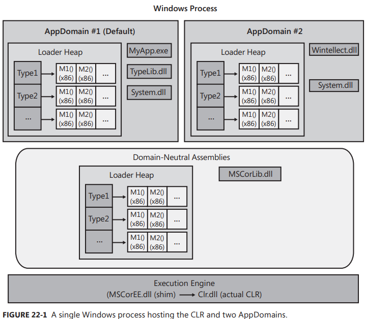
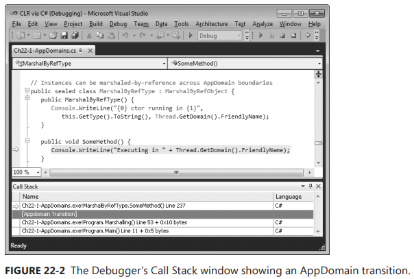
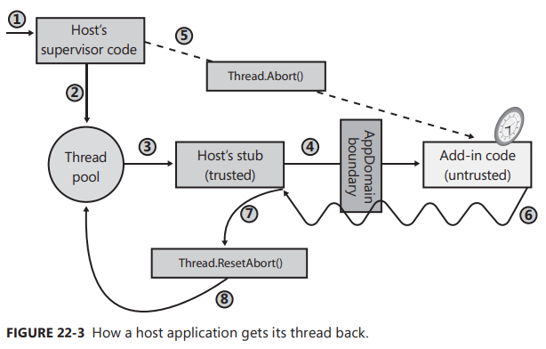

Chapter 22-CLR Hosting and AppDomains
==============================

Hosting allows any application to use the features of CLR. In particular, this allows existing applications to be at least partially written using managed code. Furthermore, hosting allows applications the ability to offer customization and extensibility via programming.

Allowing extensibility means that third-party code will be running inside your process. In Windows, loading a third party's DLLs into a process has been fraught with peril. The DLL could easily have code in it that could compromise the application to gain access to resources that it should not have access to. The CLR's AppDomain feature solves all of these problems. AppDomain allow third-party untrusted code to run in an existing process, and the CLR guarantees that the data structures, code and security context will not be exploited or compromised.

Programmers typically use hosting and AppDomains along with assembly loading and reflection. Using these four technologies together makes the CLR an incredibly rich and powerful platform. In this chapter, I'll focus on hosting and AppDomains. In the next chapter, I'll focus on assembly loading and reflection. When you learn and understand all of these technologies, you’ll see how your investment in the .NET Framework today will certainly pay off down the line.

## CLR Hosting

The .NET Framework runs on top of Windows. This means that the .NET Framework must be built using technologies that Windows can interface with. For starters, all managed module and assembly files must use the Windows portable executable (PE) file format and be either a Windows executable (EXE) file or a DLL.

To work in the future-COM Knowledge and some lower level stuff...

Any Windows application can host the CLR. Your unmanaged host should call the CLRCreateInstance function declared in MetaHost.h. The CLRCreateInstance function is implemented in the MSCorEE.dll file, which is usually found in the C:\Windows\System32 directory. This DLL is affectionately referred to as the shim, and its job is to determine which version of the CLR to create;

The actual CLR code is contained in a file whose name has changed with different versions of the CLR. For versions 1.0, 1.1, and 2.0, the CLR code is in a file called *MSCorWks.dll*, and for version 4, the CLR code is in a file called *Clr.dll*.

## AppDomains

When the CLR COM server initializes, it creates an AppDomain. An AppDomain is a logical container for a set of assemblies. The first AppDomain created when the CLR is initialized is called the default AppDomain; this AppDomain is destroyed only when the Windows process terminates. In addition to the default AppDomain, a host using either unmanaged COM interface methods or managed type methods can instruct the CLR to create additional AppDomains. The whole purpose of an AppDomain is to provide isolation. Here are the specific features offered by an AppDomain:

<ul>
  <li><b>Objects created by code in one AppDomain cannot be accessed directly by code in another AppDomain</b> Code in other AppDomain can access another AppDomain's object only by using marshal-by-reference or marshal-by=value semantics. This enforces a clean separation and boundary because code in one AppDomain can't have a direct reference to an object created by code in a different AppDomain. This isolation allows AppDomains to be easily unloaded from a process without affecting code running in other AppDomains.</li>
  <li><b>AppDomains can be unloaded</b> The CLR doesn't support the ability to unload a single assembly from an AppDomain. However, you can tell the CLR to unload an AppDomain, which will cause all of the assemblies currently contained in it to be unloaded as well.</li>
  <li><b>AppDomains can be individually secured</b> When created, an AppDomain can have a permission set applied to it that determines the maximum right granted to assembly running i the AppDomain. This allows a host to load some code and be ensured that the code cannot corrupt or read data structures used by the host itself.</li>
  <li><b>AppDomains can be individually configured</b> When created, an AppDomain can have a bunch of configuration settings associated with it. These settings mostly affect how the CLR loads assemblies into the AppDomain. There are configuration settings related to search paths, version binding redirects, shadow copying, and loader optimizations.</li>
</ul> 

<div class="alert alert-info p-1" role="alert">
    A great feature of Windows is that it runs each application in its own process address space. This ensures that code in one application cannot access code or data in use by another application. Process isolation prevents security holes, data corruption, and other unpredictable behaviors from occurring, making Windows and the applications running on it robust. Unfortunately, creating processes in Windows is very expensive. The Win32 CreateProcess function is very slow, and Windows requires a lot of memory to virtualize a process’s address space.
    </br>
    However, if an application consists entirely of managed code that is verifiably safe and doesn't call out into unmanaged code, there are no problems related to running multiple managed applications in a single Windows process. And AppDomains provide the isolation required to secure, configure, and terminate each of these applications.
</div>

Figure 22-1 shows a single Windows process that has one CLR COM server running in it:

This CLR is currently managing two AppDomains (although there is no hard-coded limit to the number of AppDomains that could be running in a single Windows process). Each AppDomain has its own loader heap, each of which maintains a record of which types have been accessed because the AppDomain was created. These type objects were discussed in Chapter 4, "Type Fundamentals"; each type object in the loader heap has a method table, and each entry in the method table points to JIT-compiled native code if the method has been executed at least once.

In addition, each AppDomain has some assemblies loaded into it. AppDomain #1 (the default AppDomain) has three assemblies: MyApp.exe, TypeLib.dll, and System.dll. AppDomain #2 has two assemblies loaded into it: Wintellect.dll and System.dll.

You'll notice that the System.dll assembly has been loaded into both AppDomains. If both AppDomains are using a single type from System.dll, both AppDomains will have a type object for the same type allocated in each loader heap; the memory for the type object is not shared by all of the AppDomains. Furthermore, as code in an AppDomain calls methods defined by a type, the method's Intermediate Language (IL) code is JIT-compiled, and the resulting native code is associated with each AppDomain; the code for the method is not shared by all AppDomains that call it.

Not sharing the memory for the type objects or native code is wasteful. However, the whole purpose of AppDomains is to provide isolation; the CLR needs to be able to unload an AppDomain and free up all of its resources without adversely affecting any other AppDomain. Replicating the CLR data structures ensures that this is possible. It also ensures that a type used by multiple AppDomains has a set of static fields for each AppDomain.

Some assemblies are expected to be used by several AppDomains. MSCorLib.dll is the best example. This assembly contains System.Object, System.Int32, and all of the other types that are so integral to the .NET Framework. This assembly is automatically loaded when the CLR initializes, and all AppDomains share the types in this assembly. To reduce resource usage, MSCorLib.dll is loaded in an AppDomain-neutral fashion; that is, the CLR maintains a special loader heap for assemblies that are loaded in a domain-neutral fashion. All type objects in this loader heap and all native code for methods of these types are shared by all AppDomains in the process. Unfortunately, the benefit gained by sharing these resources does come with a price: assemblies that are loaded domain-neutral can
never be unloaded. The only way to reclaim the resources used by them is to terminate the Windows process to cause Windows to reclaim the resources.

## Accessing Objects Across AppDomain Boundaries

Code in one AppDomain can communicate with types and objects contained in another AppDomain. However, access to these types and objects is allowed only through well-defined mechanisms. The following Ch22-1-AppDomains sample application demonstrates how to create a new AppDomain, load an assembly into it, and construct an instance of a type defined in that assembly. The code shows the different behaviors when constructing a type that is marshaled by reference, a type that is marshaled by value, and a type that can't be marshaled at all. The code also shows how these differently marshaled objects behave when the AppDomain that created them is unloaded. The Ch22-1-AppDomains sample application has very little code in it, but I have added a lot of comments. After
the code listing, I'll walk through the code, explaining what the CLR is doing:

```C#
private static void Marshalling() {
   // Get a reference to the AppDomain that the calling thread is executing in
   AppDomain adCallingThreadDomain = Thread.GetDomain();
   // or AppDomain adCallingThreadDomain = AppDomain.CurrentDomain;

   // Every AppDomain is assigned a friendly string name (helpful for debugging)
   // Get this AppDomain's friendly string name and display it
    String callingDomainName = adCallingThreadDomain.FriendlyName;
    Console.WriteLine("Default AppDomain's friendly name={0}", callingDomainName);

    // Get and display the assembly in our AppDomain that contains the 'Main' method
    String exeAssembly = Assembly.GetEntryAssembly().FullName;
    Console.WriteLine("Main assembly={0}", exeAssembly);

    // Define a local variable that can refer to an AppDomain
    AppDomain ad2 = null;
    
    // *** DEMO 1: Cross-AppDomain Communication Using Marshal-by-Reference ***
    Console.WriteLine("{0}Demo #1", Environment.NewLine);
    
    // Create new AppDomain (security and configuration match current AppDomain)
    ad2 = AppDomain.CreateDomain("AD #2", null, null);
    MarshalByRefType mbrt = null;
    
    // Load our assembly into the new AppDomain, construct an object, marshal
    // it back to our default AD (we really get a reference to a proxy)
    mbrt = (MarshalByRefType)ad2.CreateInstanceAndUnwrap(exeAssembly, typeof(MarshalByRefType).FullName);

    Console.WriteLine("Type={0}", mbrt.GetType()); // The CLR lies about the type

    // Prove that we got a reference to a proxy object
    Console.WriteLine("Is proxy={0}", RemotingServices.IsTransparentProxy(mbrt));
    
    // This looks like we're calling a method on MarshalByRefType but we're not.
    // We're calling a method on the proxy type. The proxy transitions the thread
    // to the AppDomain owning the object and calls this method on the real object.
    mbrt.SomeMethod();

    // Unload the new AppDomain
    AppDomain.Unload(ad2);
    // mbrt refers to a valid proxy object; the proxy object refers to an invalid AppDomain

    try {
       // We're calling a method on the proxy type. The AD is invalid, execption is thrown
       mbrt.SomeMethod();
       Console.WriteLine("Successful call.");
    }
    catch (AppDomainUnloadedException) {
       Console.WriteLine("Failed call.");
    }

    // *** DEMO 2: Cross-AppDomain Communication Using Marshal-by-Value ***
    Console.WriteLine("{0}Demo #2", Environment.NewLine);
    
    ad2 = AppDomain.CreateDomain("AD #2", null, null);

    mbrt = (MarshalByRefType)ad2.CreateInstanceAndUnwrap(exeAssembly, typeof(MarshalByRefType).FullName);

    // The object's method returns a COPY of the returned object;
    // the object is marshaled by value (not by reference).
    // Because MarshalByValType has Serializable attribute on it
    MarshalByValType mbvt = mbrt.MethodWithReturn();

    // Prove that we did NOT get a reference to a proxy object
    Console.WriteLine("Is proxy={0}", RemotingServices.IsTransparentProxy(mbvt));

    // This looks like we're calling a method on MarshalByValType and we are.
    Console.WriteLine("Returned object created " + mbvt.ToString());

    // Unload the new AppDomain
    AppDomain.Unload(ad2);
    // mbrt refers to a valid proxy object; the proxy object refers to an invalid AppDomain

    try {
       // We're calling a method on an object; no exception is thrown
       Console.WriteLine("Returned object created " + mbvt.ToString());
       Console.WriteLine("Successful call.");
    }
    catch (AppDomainUnloadedException) {
       Console.WriteLine("Failed call.");
    }
    
    // DEMO 3: Cross-AppDomain Communication Using non-marshalable type ***
    Console.WriteLine("{0}Demo #3", Environment.NewLine);
    
    ad2 = AppDomain.CreateDomain("AD #2", null, null);

    // Load our assembly into the new AppDomain, construct an object, marshal
    // it back to our AD (we really get a reference to a proxy)
    mbrt = (MarshalByRefType)ad2.CreateInstanceAndUnwrap(exeAssembly, "MarshalByRefType");

    // The object's method returns a non-marshalable object; exception throw here
    NonMarshalableType nmt = mbrt.MethodArgAndReturn(callingDomainName);   // System.Runtime.Serialization.SerializationException thrown here
                                                                           // Message: Type 'ConsoleAppMarshalling.NonMarshalableType is not marked as serializable
    // We won't get here...
}

// Instances can be marshaled-by-reference across AppDomain boundaries
public sealed class MarshalByRefType : MarshalByRefObject {
   public MarshalByRefType() {
      Console.WriteLine("{0} ctor running in {1}", this.GetType().ToString(), Thread.GetDomain().FriendlyName);
   }

   public void SomeMethod() {
      Console.WriteLine("Executing in " + Thread.GetDomain().FriendlyName);
   }

   public MarshalByValueType MethodWithReturn() {
      Console.WriteLine("Executing in " + Thread.GetDomain().FriendlyName);
      MarshalByValueType t = new MarshalByValueType();
      return t;
   }

   public NonMarshalableType MethodArgAndReturn(String callingDomainName) {
      // NOTE: callingDomainName is [Serializable]
      Console.WriteLine("Calling from '{0}' to '{1}'.", callingDomainName, Thread.GetDomain().FriendlyName);
      NonMarshalableType t = new NonMarshalableType();
      return t;
   }
}

// Instances can be marshaled-by-value across AppDomain boundaries
[Serializable]
public sealed class MarshalByValueType : Object {
   private DateTime m_creationTime = DateTime.Now; // NOTE: DateTime is [Serializable]

   public MarshalByValueType() {
      Console.WriteLine("{0} ctor running in {1}, Created on {2:D}", this.GetType().ToString(), Thread.GetDomain().FriendlyName, m_creationTime);
   }

   public override String ToString() {
      return m_creationTime.ToLongDateString();
   }
}

// Instances cannot be marshaled across AppDomain boundaries
public sealed class NonMarshalableType : Object {
   public NonMarshalableType() {
      Console.WriteLine("Executing in " + Thread.GetDomain().FriendlyName);
   }
}
```
If you build and run the Ch22-1-AppDomains application, you get the following output:
```
Default AppDomain's friendly name= Ch22-1-AppDomains.exe
Main assembly=Ch22-1-AppDomains, Version=0.0.0.0, Culture=neutral, PublicKeyToken=null

Demo #1
MarshalByRefType ctor running in AD #2
Type=MarshalByRefType
Is proxy=True
Executing in AD #2
Failed call.

Demo #2
MarshalByRefType ctor running in AD #2
Executing in AD #2
MarshalByValType ctor running in AD #2, Created on Friday, August 07, 2009
Is proxy=False
Returned object created Saturday, June 23, 2012
Returned object created Saturday, June 23, 2012
Successful call.

Demo #3
MarshalByRefType ctor running in AD #2
Calling from 'Ch22-1-AppDomains.exe' to 'AD #2'.
Executing in AD #2

Unhandled Exception: System.Runtime.Serialization.SerializationException:
Type 'NonMarshalableType' in assembly 'Ch22-1-AppDomains, Version=0.0.0.0,
Culture=neutral, PublicKeyToken=null' is not marked as serializable.
at MarshalByRefType.MethodArgAndReturn(String callingDomainName)
at Program.Marshalling()
at Program.Main() 
```

Now, I will discuss what this code and the CLR are doing. Inside the Marshalling method, I first get a reference to an AppDomain object that identifies the AppDomain the calling thread is currently execuing in. In Windows, a thread is always created in the context of one process, and the thread lives its entire lifetime in that process. However, a one-to-one correspondence doesn't exist between thread and AppDomains. AppDomains are a CLR feature; Windows know nothing about AppDomains. Because multiple AppDomains can be in a single Windows process, a thread can execute code in one AppDomain and then execute code another AppDomain. From the CLR's perspective, a thread is executing code on one AppDomain at a time. A thread can ask the CLR what AppDoamin it is currently executing in by calling `System.Threading.Thread.GetDomain()` static method. The thread could also query `System.AppDomain.CurrentDomain` static property to get the same information.

When an AppDomain is created, it can be assigned a *friendly name*. A friendly name is just a String that you can use to identify an AppDomain. This is typically useful in debugging scenarios. Because the CLR creates the default AppDomain before any of our code can run, the CLR uses the executable file name as the default AppDomain's friendly name. 

Next, my Marshalling method queries the strong-name identity of the assembly (loaded into the default AppDomain) that defines the entry point method Main that calls Marshalling. This assembly defines several types: Program, MarshalByRefType, MarshalBy ValType, and NonMarshalableType. At this point, we’re ready to look at the three demos that are all pretty similar to each other.

## Demo #1: Cross-AppDomain Communication Using Marshal-by-Reference

In Demo #1, System.AppDomain's static CreateDomain method is called, instructing the CLR to create a new AppDomain in the same Windows process.The AppDomain type actually offers several overloads of the CreateDomain method; I encourage you to study them and select the version that is most appropriate when you are writing code to create a new AppDomain. The version of CreateDomain that I call accepts three arguments;

<ul>
  <li><b>A String identifying the friendly name I want assigned to the new AppDomain </b> I'm passing in "AD #2" here.</li>
  <li><b>A <code>System.Security.Policy.Evidence</code> identifying the evidence that the CLR should use to calculate the AppDomain's permission set</b> I’m passing null here so that the new AppDomain will inherit the same permission set as the AppDomain creating it. ... </li>
  <li><b>A <code>System.AppDomainSetup</code> identifying the configuration settings the CLR should use for the new AppDomain</b> Again, I'm passing null here so that the new AppDomain will inherit the same configuration settings as the AppDomain creating it.</li>
</ul> 

Internally, the CreateDomain method creates a new AppDomain in the process. This AppDomain will be assigned the specified friendly name, security, and configuration settings. The new AppDomain will have its very own loader heap, which will be empty because there are currently no assemblies loading into the new AppDomain. When you create an AppDomain, the CLR does not create any threads in this AppDomain; no code runs in the AppDomain unless you explicitly have a thread call code in the AppDomain.

Now to create an instance of an object in the new AppDomain, we must first load an assembly into the new AppDomain and then construct an instance of a type defined in this assembly. This is precisely what the call to AppDomain's public, instance `CreateInstanceAndUnwrap` method does. When calling this method, I pass two arguments: a String idenrifying the assembly I want loaded into the new AppDomain and another String identifying the name of the type that I want to construct an instance of. Internally, **CreateInstanceAndUnwrap causes the calling thread to transition from the current AppDomain into the new AppDomain**. Now the thread (which is inside the call to CreateInstanceAndUnwrap) loads the specified assembly into the new AppDomain and then scans the assembly's type definition metadata table, looking for the specified type (MarshalByRefType). After the type is found, the thread calls the MarshalByRefType's parameterless constructor. Now the thread transition back to the default AppDomain so that CreateInstanceAndUnwrap can return a reference to the new MarshalByRefType object.

<div class="alert alert-info p-1" role="alert">
    There are overloaded versions of CreateInstanceAndUnwrap that allow you to call a type's constructor passing in arguments.
</div>

Although this sounds all fine and good, there is a problem: the CLR cannot allow a variable (root) living in one AppDomain to reference an object in another AppDomain. If CreateInstanceAndUnwrap simply returned the reference to the object, isolation would be broken, and isolation is the whole purpose of AppDomains! So, just before CreateInstanceAndUnwrap returns the object reference, it performs some additional logic.

You'll notice that MarshalByRefType type is derived from a very special base class `System.MarshalByRefObject`. When CreateInstanceAndUnwrap sees that it is marshalling an object whose type is derived from MarshalByRefType, the CLR will marshal the object by reference across the AppDomain boundaries. Here is what it means to marshal an object by reference from one AppDomain (the srouce AppDomain where the object is really created) to another AppDomain (the destination AppDomain from where CreateInstanceAndUnwrap is called).

When a source AppDomain want to send or return the reference of an object to a destination AppDomain, the CLR defines a proxy type in the destination AppDomain's loader type. This proxy type is defnied using the original type's metadata, and therfore, it looks exactly like the orginal type; it has all of the same instance members (proeperties, events, and methods). The instance field are not part of the type, but I'll talk more about this in a moment. This new type does have some instance fields defined inside of it, but these fields are not identical to that of the original data type. Instead, these fields indicate which AppDomain "owns" the real object and how to find the real object in the owning AppDomain. (Interanlly, the proxy object uses a GCHandle instance that refers to the real object).

After this type is defined in the destination AppDomain, CreateInstanceAndUnwrap creates an instance of this proxy type, initializes its fields to identify the source Appdomain and the real object, and returns a reference to this proxy object to the destination AppDomain. Notice that the object returned from CreateInstanceAndUnwrap is actually not an instance of the MarshalByRefType type. The CLR will usually not allow you to cast an object of one type to an incompativle type. However, in this situation, the CLR does allow the cast, because this new types has the same instance members as defined on the original type. In fact, if you use the proxy object to call GetType, it actually lies to you and says that is a MarshalByRefType object.

However, it is possible to prove the object returned from CreateInstanceAndUnwrap is actually a reference to a proxy object. To do this , the code calls s `System.Runtime.Remoting.RemotingService.IsTransparentProxy` static method passing in the reference returned from CreateInstanceAndUnwrap. As you can see from the output, IsTransparentProxy returns true, indicating that the object is a proxy.

Now, my Ch22-1-AppDomains application uses the proxy to call the SomeMethod method. Because the mbrt variable refers to a proxy object, the proxy's implementation of this method is called. The proxy's implementation uses the information fields inside the proxy object to transition the calling thread from the default Appdomain to the new AppDomain, Any actions now performed by this thread run under the new AppDomain's security and configuration settings. Next, the thread uses the proxy object's GCHandle field to find the real object int the new AppDomain, abd then it uses the real object to call the real SomeMethod mehtod.

There are two ways to prove that the calling thread has transitioned from the default AppDomain to the new AppDomain. First, inside the SomeMethod method, I call Thread.GetDomain().FriendlyName. This will return "AD #2" (as evidenced by the output) because the thread is now running in the new AppDomain created by using AppDomain.CreateDomain with “AD #2” as the friendly name parameter. Second, if you step through the code in a debugger and display the Call Stack window, the [AppDomain Transition] line marks where a thread has transitioned across an AppDomain boundary. See the Call Stack window near the bottom of Figure 22-2:


When the real SomeMethod returns, it returns to the proxy's SomeMethdo method, which transitions the thread back to the default AppDomain, and then the thread continues executing code in the default AppDomain.

<div class="alert alert-info p-1" role="alert">
    When a thread in one AppDomain calls a method in another AppDomain, the thread transitions between the two AppDomains. This means that method calls across AppDomain boundaries are executed synchronously. However, at any given time, a thread is considered to be in just one AppDomain, and it executes code using that AppDomain’s security and configuration settings. If you want to execute code in multiple AppDomains concurrently, you should create additional threads and have them execute whatever code you want in whatever AppDomains you want.
</div>

The next thing that my Ch22-1-AppDomains application does is call AppDomain's public, static Unload method to force the CLR to unload the specified AppDomain, including all of the assemblies loaded into it. A garbage collection is forced to free up objects that were created by code in the unloading AppDomain. At this point, the default AppDomain's mbrt variable still refers to a valid proxy object; however, the proxy object no longer refers to a valid AppDomain (because it has been unloaded).

When the default AppDomain attempts to use the proxy object to call the SomeMethod method, the proxy's implementation of this method is called. The proxy’s implementation determines that the AppDomain that contained the real object has been unloaded, and the proxy’s SomeMethod method throws an AppDomainUnloadedException to let the caller know that the operation cannot complete.

Obviously, accessing objects across AppDomain boundaries by using marshalby-reference semantics has some performance costs associated with it, so you typically want to keep the use of this feature to a minimum.

I promised you that I'd talk a little more about instance fields. A type derived from MarshalByRefObject can define instance fields. A type derived from MarshalByRefObject can define instance fields. However, these instance fields are not defined as being part of the proxy type and are not contained inside a proxy object. When you write code that reads from or writes to an instance field of a type derived from MarshalByRefObject, the JIT compiler emits code that uses the proxy object (to find the real AppDomain/object) by calling System.Object's FieldGetter or FieldSetter methods, respectively. These methods are private and undocumented; they are basically methods that use reflection to get and set the value in a field. So although you can access fields of a type derived from MarshalByRefObject, the performance is particularly bad because the CLR really ends up calling methods to perform the field access. In fact, the performance is bad even if the object that you are accessing is in your own AppDomain.

From a usability standpoint, a type derived from MarshalByRefObject should really avoid defining any static member. The reason is that static members are always accessed in the context of the calling AppDomain. No AppDomains transition can occur because a proxy object contains the information identifying which AppDomain to transition to , but here is no proxy object when calling a static member. Having a type's static members execute in one AppDomain while instance members execute in another AppDomain would make a very awkward programming model.

Because there are no roots in the second AppDomain, the original obejct refered to by the proxy could be garbage collected. Of course, this is not ideal. On the other hand, if the original obejct is held in memory indefinitely, then the proxy could go away and the original object would still live; this is also not ideal. The CLR solves this problem by using a *lease manager*. When a proxy for an object is created, the CLR keeps the object alive for five minutes. If no calls have been made through the proxy after five minutes, then the object is deactivated and will have its memory freed at the next garbage collection. After each call into the object, the lease manager renews the object's lease so that it is guaranteed to remain in memory for another two minutes before being deactivated. If the application attempts to call into an object through a proxy after the object's lease has expired, the CLR throws a `System.Runtime.Remoting.RemotingException`.

It is possible to override the default lease times of five minutes and two minutes by overriding MarshalByRefObject’s virtual InitializeLifetimeServices method. For more information, see the section titled "Lifetime Leases" in the .NET Framework SDK documentation.

## Demo #2: Cross-AppDomain Communication Using Marshal-by-Value

Demo #2 is very similar to Demo #1. MarshalByValType is not derived from MarshalByRefObject, and therefore, the CLRcannot define a proxy type to create an instance from; the object can’t be marshaled by reference across the AppDomain boundary.

However, because MarshalByValType is marked with the `[Serializable]` custom attribute, MethodWithReturn is allowed to marshal the object by value. The next paragraph describes what it means to marshal an object by value from one AppDomain (the source AppDomain) to another AppDomain (the destination AppDomain). For more information about the CLR's serialization and deserialization mechanisms, see Chapter 24, "Runtime Serialization."

When a source AppDomain wants to send or return a reference to an object to a destination AppDomain, the CLR serializes the object's instance fields into a byte array. This byte array is copied from the source AppDomain to the destination AppDomain. Then, the CLR deserializes the byte array in the destination AppDomain. **This forces the the CLR to load the assembly that defines the type being deserialized into the destination AppDomain** if it is not already loaded (Note that in Demo 1, only the newly created AppDomain loads the assembly, here the default AppDomain loads the assembly). Then, the CLR creates an instance of the type and uses the values in the byte array to initialize the object's fields so that they have values identical to thoses they had in the original object. In other words, the CLR makes an exact duplicate of the source object in the destination's AppDomain , and then MethodWithReturn returns a reference to this copy; the object has been marshaled by value across the AppDomain's boundary.

At this point, the object in the source AppDomain and the object in the destination AppDomain live separate lifetimes, and their states can change independently of each other. If there are no roots in the source AppDomain keeping the original object alive (as in my Ch22-1-AppDomains application), its memory will be reclaimed at the next garbage collection.

Now, my program uses the real object to call the ToString method. Because the mbvt variable refers to a real object, the real implementation of this method is called, and no AppDomain transition occurs. This can be evidenced by examining the debugger's Call Stack window, which will not show an [Appdomain Transition] line.

To further prove that no proxy is involved, my Ch22-1-AppDomains application unloads the new AppDomain and then attempts to call the ToString method again. Unlike in Demo #1, the call succeeds this time because unloading the new AppDomain had no impact on objects "owned" by the default AppDomain, and this includes the object that was marshaled by value.

## Demo #3: Cross-AppDomain Communication Using Non-Marshalable Types

In this particular demo, I am passing a System.String object across AppDomain boundaries via `mbrt.MethodArgAndReturn(callingDomainName);` (note that this time, we are trying to pass an object from default AppDomain to newly created AppDomain). The System.String type is not derived from MarshalByRefObject, so the CLR cannot create a proxy. Fortunately, System.String is marked as `[Serializable]`, and therefore the CLR can marshal it by value, which allows the code to work. Note that for String objects, the CLR performs a special optimization. When marshaling a String object across an AppDomain boundary, the CLR just passes the reference to the String object across the boundary; it does not make a copy of the String object. The CLR can offer this optimization because String objects are immutable; therefore, it is impossible for code in one AppDomain to corrupt a String object's characters.

Inside MethodArgAndReturn, I display the string passed into it to show that the string came across the AppDomain boundary, and then I create an instance of the NonMarshalableType type and return a reference to this object to the default AppDomain. Because NonMarshalableType is not derived from System MarshalByRefObject and is also not marked with the `[Serializable]` custom attribute, MethodArgAndReturn is not allowed to marshal the object by reference
or by value—the object cannot be marshaled across an AppDomain boundary at all! To report this, MethodArgAndReturn throws a SerializationException in the default AppDomain.

## AppDomain Unloading

One of the great features of AppDomains is that you can unload them. Unloading an AppDomain causes the CLR to unload all of the assemblies in the AppDomain, and the CLR frees the AppDomain's loader heap as well. To unload an AppDomain, you call AppDomain's Unload static method. This call causes the CLR to perform a lot of actions to gracefully unload the specified AppDomain

<ol>
  <li>The CLR suspends all threads in the process that have ever executed managed code</li>
  <li>The CLR examines all of the thread's stacks to see which threads are currently execuing code the AppDomain being unloaded, or which threads might return at some point to code in the AppDomain that is being unloaded. The CLR forces any threads that have the unloading AppDomain on their stack to throw a <code>ThreadAbortException</code>. This causes the threads to unwind, executing any finally blocks on their way out so that cleanup code executes. If no code catches the ThreadAbortException, it will eventually become an unhandled exception that the CLR swallows; the thread dies, but the process is allowed to continue running. This is unusual, because for all other unhandled exceptions, the CLR kills the process.
</li>
  <li>After all threads discovered in step 2 have left the AppDomain, the CLR then walks the heap and sets a flag in each proxy object that referred to an object created by the unloaded Appdomain. These proxy objects now know that the real object they referred to is gone. If any code now calls a method on an invalid proxy object, the method will throw an <code>AppDomainUnloadedException</code></li>
  <li>The CLR forces a garbage collection to occur, reclaiming the memory used by any objects that were created by the now unloaded AppDomain. The Finalize methods for these objects are called.</li>
  <li>The CLR resumes all of the remaining threads. The thread that called AppDomain.Unload will now continue running; calls to AppDomain.Unload occur synchronously.</li>
</ol> 

<div class="alert alert-info p-1" role="alert">
    The CLR will not immediately abort a thread that is currently executing code in a finally block, catch block, a class constructor, a critical execution region, or in unmanaged code.  If the CLR allowed this, cleanup code, error recovery code, type initialization code, critical code, or arbitrary code that the CLR knows nothing about would not complete, resulting in the application behaving unpredictably and with potential security holes. An aborting thread is allowed to finish executing these code blocks and then, at the end of the code block, the CLR forces the thread to throw a ThreadAbortException.
</div>

My Ch22-1-AppDomains application uses just one thread to do all of the work. Whenever my code calls AppDomain.Unload, there are no threads in the unloading AppDomain, and therefore, the CLR doesn't have to throw any `ThreadAbortException` exceptions. I'll talk more about ThreadAbortException later in this chapter.

By the way, when a thread calls AppDomain.Unload, the CLR waits 10 seconds for the threads in the unloading AppDomains to leave it. If after 10 seconds, the thread that called AppDomain.Unload doesn't return, it will throw a `CannotUnloadAppDomainException`, and the AppDomain may or may not be unloaded in the future.

## AppDomain Monitoring

To work in the future when needed, non-essential content

## AppDomain First-Chance Exception Notifications

each AppDomain can have associated with it a series of callback methods that get invoked when the CLR begins looking for catch blocks within an AppDomain. These methdos can perform logging, or a host can use this mechanism to monitor exceptions being thrown within an AppDomain. The callbacks cannot handle the exception or swallow it in any way; they are just receiving a notification that the exception has occurred. To register a callback mehtod, just add a delegate to AppDomain's instance FirstChanceException event. Below is an example:
```C#
class Program {
   static void Main(string[] args) {
      AppDomain.CurrentDomain.FirstChanceException += FirstChanceHandler;
      // Create a set of application domains, with a Worker object in each one.
      // Each Worker object creates the next application domain.
      AppDomain ad = AppDomain.CreateDomain("AD0");

      Worker w = (Worker)ad.CreateInstanceAndUnwrap(typeof(Worker).Assembly.FullName, typeof(Worker).FullName);

      w.Initialize(0, 3);

      Console.WriteLine("\r\nThe last application domain throws an exception and catches it:");
      Console.WriteLine();
      w.TestException(true);

      try {
         Console.WriteLine("\r\nThe last application domain throws an exception and does not catch it:");
         Console.WriteLine();
         w.TestException(false);
      }
      catch (ArgumentException ex) {
         Console.WriteLine("ArgumentException caught in {0}: {1}",
             AppDomain.CurrentDomain.FriendlyName, ex.Message);
      }

      Console.ReadLine();
   }

   static void FirstChanceHandler(object source, FirstChanceExceptionEventArgs e) {
      Console.WriteLine("FirstChanceException event raised in {0}: {1}",
          AppDomain.CurrentDomain.FriendlyName, e.Exception.Message);
   }
}

class Worker : MarshalByRefObject {
   private AppDomain ad = null;
   private Worker w = null;

   public void Initialize(int count, int max) {
      // Handle the FirstChanceException event in all application domains except
      // AD1.
      if (count != 1) {
         AppDomain.CurrentDomain.FirstChanceException += FirstChanceHandler;
      }

      // Create another application domain, until the maximum is reached.
      // Field w remains null in the last application domain, as a signal
      // to TestException().
      if (count < max) {
         int next = count + 1;
         ad = AppDomain.CreateDomain("AD" + next);
         w = (Worker)ad.CreateInstanceAndUnwrap(
                          typeof(Worker).Assembly.FullName, typeof(Worker).FullName);
         w.Initialize(next, max);
      }
   }

   public void TestException(bool handled) {
      // As long as there is another application domain, call TestException() on
      // its Worker object. When the last application domain is reached, throw a
      // handled or unhandled exception.
      if (w != null) {
         w.TestException(handled);
      } else if (handled) {
         try {
            throw new ArgumentException("Thrown in " + AppDomain.CurrentDomain.FriendlyName);
         }
         catch (ArgumentException ex) {
            Console.WriteLine("ArgumentException caught in {0}: {1}",
                AppDomain.CurrentDomain.FriendlyName, ex.Message);
         }
      } else {
         throw new ArgumentException("Thrown in " + AppDomain.CurrentDomain.FriendlyName);
      }
   }

   static void FirstChanceHandler(object source, FirstChanceExceptionEventArgs e) {
      Console.WriteLine("FirstChanceException event raised in {0}: {1}",
          AppDomain.CurrentDomain.FriendlyName, e.Exception.Message);
   }
}

/* This example produces output similar to the following:

The last application domain throws an exception and catches it:

FirstChanceException event raised in AD3: Thrown in AD3
ArgumentException caught in AD3: Thrown in AD3

The last application domain throws an exception and does not catch it:

FirstChanceException event raised in AD3: Thrown in AD3
FirstChanceException event raised in AD2: Thrown in AD3
FirstChanceException event raised in AD0: Thrown in AD3
FirstChanceException event raised in Example.exe: Thrown in AD3
ArgumentException caught in Example.exe: Thrown in AD3
 */
```
Here is how the CLR processes an exception: when the exception is first thrown, the CLR invokes any `FirstChanceException` callback methods registered with the AppDomain that are throwing the exception. Then, the CLR looks for any catch blocks on the stack that are within the same AppDomain. If a catch block handles the exception, then processing of the exceptions is complete and execution continues as normal. If the AppDomain has no catch block to handle the exception, then the CLR walks up the stack to the calling AppDomain and throws the same exception object again (after serializing and deserializing it, all Exception classes have `[Serializable]`). At this point, it is as if a brand new exception is being thrown, and the CLR invokes any FirstChanceException callback methods registered with the now current AppDomain. This continues until the top of the thread's stack is reached. At that point, if the exception is not handled by any code, the CLR terminates the whole process.

## How Hosts Use AppDomains

So far, I've talked about hosts and how they load the CLR. I’ve also talked about how the hosts tell the CLR to create and unload AppDomains. To make the discussion more concrete, I'll describe some common hosting and AppDomain scenarios. In particular, I’ll explain how different application types host the CLR and how they manage AppDomains.

### Executable Applications

Console UI applications, NT Service applications, Windows Forms applications, and Windows Presentation Foundation (WPF) applications are all examples of self-hosted applications that have managed EXE files. When Windows initializes a process by using a managed EXE file, Windows loads the shim, and the shim examines the CLR header information contained in the application's assmbly. The header information indicates the version of the CLR to load into the process. After the CLR loads and initializes, it again examines the assembly's CLR header to determine which method is the application's entry point (Main). The CLR invokes this method, and the application is now up and running.

As the code runs, it access other types. When referencing a type contained in another assembly, the CLR locates the necessary assembly and loads it into the same AppDomain. Any additional referenced assemblies also load into the same AppDomain. When the application's Main method returns, the Windows process terminates (destroying the default AppDomain and all other AppDomains).

### Microsoft ASP.NET and XML Web Services Applications

ASP.NET is implemented as an ISAPI DLL (implemented in ASPNet_ISAPI.dll). The first time a client requrests a URL handled by the ASP.NET ISAPI DLL, ASP.NET loads the CLR. When a client makes a request of a web application, ASP.NET determines if this is the first time a request has been made. If it is, ASP.NET tells the CLR to create a new AppDomain for this web application; each web application is identified by its virtual root directory. ASP.NET then tells the CLR to load the assembly that contains the type exposed by the web application into this new AppDomain, creates an instance of this type, and starts calling methods in it to satisfy the client's web request. If the code references more types, the CLR will load the required assemblies into the web application's AppDomain.

When future clients make requests of an already running web application, ASP.NET doesn't create a new AppDomain; instead, it uses the existing AppDomain, creates a new instance of the web application's type, and starts calling methods. The methods will already be JIT-compiled into native code, so the performance of processing all subsequent client requests is excellent.

If a client makes a request of a different web application, ASP.NET tells the CLR to create a new AppDomain. This new AppDomain is typically created inside the same worker process as the other AppDomains. This means that many web applications run in a single Windows process, which improves the efficiency of the system overall. Again, the assemblies required by each web application are loaded into an AppDomain created for the sole purpose of isolating that web application's code and objects from other web applications.

## Advanced Host Control

To work in the future-non essential content

## Writing a Robust Host Application

A host can tell the CLR what actions to take when a fialure occurs in managed code. here are some examples (listed from least severe to most severe):

<ul>
  <li>The CLR can abort a thread if the thread is taking too long to execute and return a response (I'll discuss this more in the next section.)</li>
  <li>The CLR can unload an AppDomain. This aborts all of the threads that are in the AppDomain and causes the problematic code to be unloaded</li>
  <li>The CLR can be disabled. This stops any more managed code from executing in the process, but unmanaged code is still allowed to run</li>
  <li>The CLR can exit the Windows process. This aborts all of the threads and unloads all of the AppDomains first so that cleanup operations occur, and then the process terminates.</li>
</ul> 

The CLR can abort a thread or AppDomain gracefully or rudely. A graceful abort means that cleanup code executes. In other words, code in finally blocks runs, and objects have their Finalize methods executed. A rude abort menas that cleanup code doesn't execute. In other words, code in finally blocks may not run, and object may not have their Finalize methods executed. A graceful abort cannot abort a thread that is in a catch or finally block. However, a rudfe abort will abort a thread that is in a catch or finally block. Unfortunately, a thread that is in unmanaged code or in a constrained execution region cannot be aborted at all.

A host can set what is called *escalation policy*, which tells the CLR how to deal with managed code failures. For example, SQL server tells the CLR what to do should an unhandled exception be thrown while the CLR is executing managed code. When a thread experiences an unhandled exception, the CLR first attempts to upgrade the exception to a graceful thread abort. If the thread does not abort in a specified time period, the CLR attempts to upgarde the graceful thread abort to a rude thread abort.

What I just described is what usually happens. However, if the thread experiencing the unhandled exception is in a *critial region*, the policy is different. A thread that is in a critical region is a thread that has entered a thread synchronization lock that must be released by the same thread. When a thread is in a critical region, the CLR believes that thread is accessing data is shared by multiple threads in the same AppDomain. After all, this is probably why the thread took the lock. If the thread is accessing shared dara, just terminating the thread isn't good enough, because other threads may then try to access the shared data that is now currupt, causing the AppDomain to run unpredictably or with possible security vulnerabilities.

So, when a thread in acritical region experiences an unhandled exception, the CLR first attempts to upgrade the exception to a graceful AppDomain unload in an effort to get rid of all of the threads and data objects that are currently in use. If the AppDoamin doesn't unload in a specified amount of time, the CLR upgrades the graceful AppDomain unload to a rude AppDomain unload.

## How a Host Gets Its Thread Back

Normally, a host application wants to stay in control of its threads. Let's take a database server as an example. When a request comes into the database server, a thread picks up the request and then dispatches the request to another thread that is to perform the actual work. This other thread may need to execute code that wasn't created and tested by the team that produced the database server. For example, imagine a request coming into the database server to execute a stored procedure written in managed code by the company running the server. It's great that the database server can run the stored procedure code in its own Appdomain, which is locked down with security. This prevents stored procedure from accessing any objects outside of its own AppDomain, and it also prevents the code from accessing resources that it is not allowed to access, such as disk files or the clipboard.

BUt what if the code in the stored procedure enters an infinite loop? In this case, the database server has dispatched one of its threads into the stored procedure code, and this thread is never coming back. This puts the server in a precarious position; the future behavior of the server is unknown. For example, the performance might be terrible now because a thread is in an infinite loop. Should the server create more threads? Doing so uses more resource (such as stack space), and these threads could also enter an infinite loop themselves.

To solve these problems, the host can take advantage of thread aborting. Figure 22-3 shows the typical architecture of a host application trying to solve the runaway thread problem:



Here's how it works (the numbers correspond to the circled numbers in the figure)

<ol>
  <li>A client sends a request to the server</li>
  <li>A server thread picks up this request and dispatches it to a thread pool thread to perform the actual work.</li>
  <li>A thread pool thread picls up the client request and executes trusted code written by the company that built and tested the host application</li>
  <li>This trusted code then enters a try block, and from within the try block, calls across an AppDomain boundary. This AppDomain contains the untrusted code (perhaps a stored procedure) that was not built and tested by the company that produced the host application. At this point, the server has given control of its thread to some untrusted code; the server is feeling nervous right now.</li>
  <li>When the host originally reveived the client's request, it recorded the time. If the untrusted code doesn't respond to the client in some adminstrator-set amount of time, the host calls Thread's Abort method, asking the CLR to stop the thread pool thread, forcing it to throw a <code>ThreadAbortException</code></li>
  <li>At this point, the thread pool thread starts unwinding, calling finally blocks so that cleanup code executes, Eventually, the thread pool thread crosses back over the AppDomain boundary. Because the host's stub code called the untrusted code from inside a try block, the host's stub code has a catch block that catches the <code>ThreadAbortException</code></li>
  <li>In response to catching the ThreadAbortException, the host calls <code>Thread.ResetAbort</code> method. I'll explain the purpose of this call shortly<li>
  <li>Now that the host's code has caught the ThreadAbortException, the host can return some sort of failure back to the client and allow the thread pool thread to return to the pool so that it can used for a future client request.</li>
</ol> 

Let me now clear up a few loose ends about this architecture. First, `Thread.ResetAbort()` method is asynchronous. When Abort is called, it sets the target thread's AbortRequest flag and returns immediately. When the runtime detects that a thread is to be aborted, the runtime tries to get the thread to a *safe place*. A thread is in a safe place when the runtime feels that it can stop what the thread is doing without causing disastrous effects. A thread is in a safe place if it is performing a managed blocking operation such as sleeping or waiting. A thread is not in a safe place if it is executing a type's class constructor, code in a catch or finally block, code in a CER, or unmanaged code.

After the thread reaches a safe place, the runtime will detect that the AbortRequest flag is set for the thread. This causes the thread to throw a `ThreadAbortException`. If this exception is not caught, the exception will be unhandled, all pending finally blocks will execute, and the thread will kill itself gracefully. Unlike other exceptions, and unhandled ThreadAbortException doesn't cause the application to terminate. The runtime silently eats this exception and the thread dies, but the application and all of its remaining threads continue to run just fine.

In my example, the host catches the ThreadAbortException, allowing the host to regain control of the thread and return it to the pool. But thre is a problem: What is to stop the untrusted code from catching the ThreadAbortException itself to keep control of the thread? The answer is that the CLR treats the ThreadAbortException in a very special manner. Even when code catches the TheadAbortException, the CLR doesn't allow the exception to be swallowed. In other words, **at the end of the catch block, the CLR automatically rethrows the ThreadAbortException exception**.

This CLR feature raises another question: If the CLR rethrows the ThreadAbort Exception at the end of a catch block, how can the host catch it to regain control of the thread? Inside the host's catch block, there is a call to `Thread.ResetAbort()` method. Calling this method tells the CLR to stop rethrowing the ThreadAbortException at the end of the catch block.

This raises yet another question: What's to stop the untrusted code from catching the ThreadAbortException and calling `Thread.ResetAbort()` method itself to keep control of the thread? The answer is that `Thread.ResetAbort()` method requires the caller to have the `SecurityPermission` with the `ControlThread` flag set to true. When the host creates the AppDomain for the untrusted code, the host will not grant this permission, and now, the untrusted code cannot keep control of the host's thread.

I should point out that there is still a potential hole in this story: while the thread is unwinding from its ThreadAbortException, the untrusted code can execute catch and finally blocks. Inside these blocks, the untrusted code could enter an infinite loop, preventing the host from regaining control of its thread. A host application fixes this problem by setting an escalation policy (discussed earlier). If an aborting thread doesn't finish in a reasonable amount of time, the CLR can upgrade the thread abort to a rude thread abort, a rude AppDomain unload, disabling of the CLR, or killing of the process. I should also note that the untrusted code could catch the ThreadAbortException and, inside the catch block, throw some other kind of exception. If this other exception is caught, at the end of the catch block, the CLR automatically rethrows the ThreadAbortException.

It should be noted, though, that most untrusted code is not actually intended to be malicious; it is just written in such a way so as to be taking too long by the host's standards. Usually, catch and finally blocks contain very little code, and this code usually executes quickly without any infinite loops or long-running tasks. And so it is very unlikely that the escalation policy will have to go into effect for the host to regain control of its thread.

By the way, the `Thread` class acutually offers two Abort methods: one takes no parameters, and the other takes an Object parameter allowing you to pass anything. When the code catches the ThreadAbortException, it can query its read-only ExceptionState property. This property returns the object that was passed to Abort.

<!-- <code>&lt;T&gt;<code> -->

<!-- <div class="alert alert-info p-1" role="alert">
    
</div> -->

<!-- <div class="alert alert-info pt-2 pb-0" role="alert">
    <ul class="pl-1">
      <li></li>
      <li></li>
    </ul>  
</div> -->

<!-- <ul>
  <li><b></b></li>
  <li><b></b></li>
  <li><b></b></li>
  <li><b></b></li>
</ul>  -->

<!--  -->

<!-- <span style="color:red">hurt</span> -->

<style type="text/css">
.markdown-body {
  max-width: 1800px;
  margin-left: auto;
  margin-right: auto;
}
</style>

<link rel="stylesheet" href="./zCSS/bootstrap.min.css">
<script src="./zCSS/jquery-3.3.1.slim.min.js"></script>
<script src="./zCSS/popper.min.js"></script>
<script src="./zCSS/bootstrap.min.js"></script>