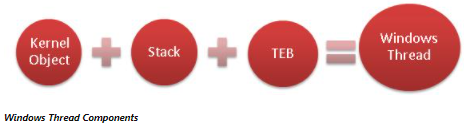
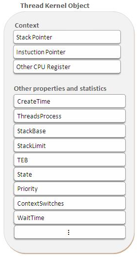
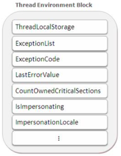
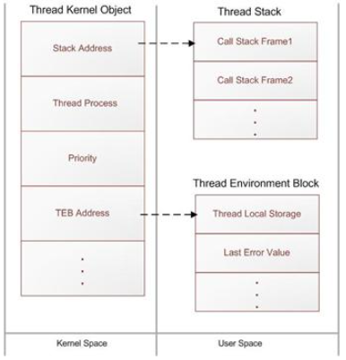
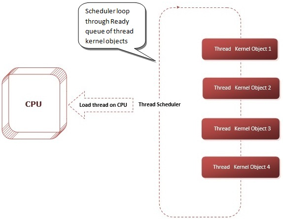

Chapter 26-Thread Basics
==============================

Source Code:

```C#
public sealed class Thread : CriticalFinalizerObject
{
   internal SynchronizationContext _synchronizationContext; // <---------------will be covered in next chapter

   public Thread(ParameterizedThreadStart start);
   public Thread(ThreadStart start);
   public Thread(ParameterizedThreadStart start, int maxStackSize);
   public Thread(ThreadStart start, int maxStackSize);
   ~Thread();

   public static IPrincipal CurrentPrincipal { get; set; }
   public static Thread CurrentThread { get; }
   public CultureInfo CurrentCulture { get; set; }
   public CultureInfo CurrentUICulture { get; set; }
   public bool IsAlive { get; }
   public bool IsBackground { get; set; }
   public bool IsThreadPoolThread { get; }
   public int ManagedThreadId { get; }
   public string Name { get; set; }
   public ExecutionContext ExecutionContext { get; }
   public ThreadPriority Priority { get; set; }
   public ThreadState ThreadState { get; }
   
   public void Join();
   public void Start();

   // ...
}
```

## Internals of Windows Thread

There are three basic components of Windows thread:

<ul>
  <li>Thread Kernel Object</li>
  <li>Stack</li>
  <li>Thread Environment Block(TEB)</li>
</ul> 



OS Kernel needs to maintain lots of data about numerous resources such as processes, threads, files etc, for that kernel use "kernel data structures" which are known as kernel objects. Each kernel object is simply a memory block allocated by OS Kernel and is accessible only to the kernel. This memory blockk is a data structure whose members maintain information about the object. Some members (security descriptor, usage count, and so on) are same across all object types, but most data members are specific to the type of kernel object. Kernel creates and manipulates several types of kernel objects, such as process kernel objects, thread kernel objects, event kernel objects, file kernel objects  mutex kernel objects etc

#### Thread Kernel Object

First and very basic component of Windows thread is thread kernel object. For every thread in system, operating system create one thread kernel object. Operating systems use these thread kernel objects for managing and executing threads across the system. The kernel object is also where the system keeps all the statistical information about the thread. Below are some of the important properties of thread kernel object:



#### Thread Context

Each thread kernel object contains set of CPU registers, called the thread's context. The context reflects state of the CPU registers when the thread last executed.The instruction pointer and stack pointer registers are the two most important registers in the threads context. A stack pointer is a register that stores the starting memory address of the stack frame of the current function executing inside the thread. Instruction pointer points to the current instruction that need to be executed by the CPU. Operating system use kernel object context information while performing thread context switching. Context switch is the process of storing and restoring the state (context) of a thread so that execution can be resumed from the same point at a later time.

#### Stack

The second basic component of a thread is stack. Once the thread kernel object has been created, the system allocates memory, which is used for the thread's stack. Every thread got its own stack which is used for maintaining local variables of functions and for passing arguments to functions executing inside a thread.

Operating system allocates two types of stack for every thread, one is **user-mode stack** and other is **kernel-mode stack**. The user-mode stack is used for local variables and arguments passed to methods. By default, Windows allocates 1 MB of memory for each thread's user-mode stack. The kernel-mode stack is used when application code passes arguments to a kernel function in the operating system. For security reasons, Windows copies any arguments passed from user-mode code to the kernel from the thread's user-mode stack to the thread’s kernel-mode stack. In addition, the kernel calls methods within itself and uses the kernel-mode stack to pass its own arguments, to store a function's local variables, and to store return addresses. The kernel-mode stack is 12 KB when running on a 32-bit Windows system and 24 KB when running on a 64-bit Windows system.

#### Thread Environment Block (TEB)

Another important data structure used by every thread is Thread environment Block (TEB). TEB is a block of memory allocated and initialized in user mode. The TEB consumes 1 page of memory (4 KB on x86 and x64 CPUs).


On of the important information TEB contains is information about exception handling. The TEB contains the head of the thread's exception-handling chain. The TEB contains the head of the thread’s exception-handling chain. Each try block that the thread enters inserts a node in the head of this chain.The node is removed from the chain when the thread exit the try block.

In addition, TEB contains the thread-local storage data. In multi-threaded applications, there often arises the need to maintain data that is unique to a thread. The place where this thread specific data get stored called thread-local storage.


#### Thread kernel object as thread handle

System keeps all information required for thread execution/ scheduling inside thread kernel object. Apart from that, the operating system stores address of thread stack and thread TEB in thread kernel object as shown in the below figure:



Thread kernel object is the only handle through which operating system access all the information about the thread and is use it for thread execution/ scheduling.

#### How OS Run Threads

Every 20 milliseconds or so, operating system thread scheduler looks at all the thread kernel objects currently inside Ready Queue (doubly linked list). Thread scheduler selects one of the thread kernel objects and loads the CPU's registers with the values that were last saved in the thread's context. This action is called a context switch. At this point, the thread is executing code and manipulating data in its process' address space. After another 20 milliseconds or so, scheduler saves the CPU's registers back into the thread's context. The scheduler again examines the remaining thread kernel objects in Ready Queue, selects another thread's kernel object, loads this thread's context into the CPU's registers, and continues.




## Thread Overhead

Threads have space (memory consumption) and time (runtime execution performance) overhead associated with them. Every thread has one of each of the following:

<ul>
  <li><b>Thread kernel object</b> The operating systems allocate and initializes one of these data structures for each thread created in the system. The data structure contains a bunch of properties that describe the thread. This data structure also contains a set of the CPU's registers.</li>
  <li><b>Thread environment block (TEB)</b> The TEB is a block of memory allocated and initialized in user mode. The TEB contains the head of the thread's exception-handling chain. Each try block that the thread enters inserts a node in the head of this chain; the node is removed from the chain when the thread exits the try block. In addition, the TEB contains the thread's thread-local storage data.</li>
  <li><b>User-mode stack</b> The user-mode stack is used for local variables and arguments passed to methods. It also contains the address indicating what the thread should execute next when the current method returns. By default, Windows allocates 1 MB of memory for each thread's user-mode stack. More specifically, Windows reserves the 1 MB of address space and sparsely commits physical storage to it as the thread actually requires it when growing the stack.</li>
  <li><b>Kernel-mode stack</b> The kernel-mode stack is also used when application code passes arguments to a kernel-mode function in the operating system. For security reasons, Windows copies any arguments passed from user-mode code to the kernel from the thread's user-mode stack to the thread's kernel-mode stack. Once copied, the kernel can verify the arguments' values, and because the application code can't access the kernel-mode stack, the application can't modify the arguments' values after they have been validated and the operating system kernel code begins to operate on them.</li>
  <li><b>DLL thread-attach and thread-detach notifications</b> Windows has a policy that whenever a thread is created in a process, all unmanaged DLLs loaded in that process have their DLLMain method called, passing a DLL_THREAD_ATTACH flag. Similarly, whenever a thread dies, all DLLs in the process have their DLLMain method called, passing it a DLL_THREAD_DETACH flag. Some DLLs need these notifications to perform some special initialization or cleanup for each thread created/destroyed in the process. For example, the C-Runtime library DLL allocates some thread-local storage state that is required should the thread use functions contained within the C-Runtime library. </li>
</ul> 

In the early days of Windows, many processes had maybe 5 or 6 DLLs loaded into them, but today, some processes have several hundred DLLs loaded into them. Right now, on my machine, Microsoft Visual Studio has about 470 DLLs loaded into its process address space! This means that whenever a new thread is created in Visual Studio, 470 DLL functions must get called before the thread is allowed to do what it was created to do. And these 470 functions must be called again whenever a thread in Visual Studio dies. Wow—this can seriously affect the performance of creating and destroying threads within a process.

<div class="alert alert-info p-1" role="alert">
    DLLs produced by C# and most other managed programming language don't have a DLLMain in them at all and so managed DLLs will not receive the DLL_THREAD_ATTACH and DLL_THREAD_DETACH notifications improving performance. In addition, unmanaged DLLs can opt out of these notifications by calling the Win32 DisableThreadLibraryCalls function. Unfortunately, many unmanaged developers are not aware of this function, so they don't call it.
</div>

So now, you see all the space and time overhead that is associated with creating a thread. But the situation gets even worse because of context switching.

At any given moment in time, Windows assigns one thread to a CPU. That thread is allowed to run for a time-slice (sometimes referred to as a quantum). When the time-slice expires, Windows context switches to another thread. Every context switch requires that Windows performs the following actions:

<ol>
  <li>Save the values in the CPU's registers to the currently running thread's context structure inside the thread's kernel object.</li>
  <li>Select one thread from the set of existing threads to schedule next. If this thread is owned by another process, then Windows must also switch the virtual address space seen by the CPU before it starts executing any code or touching any data.</li>
  <li>Load the values in the selected thread’s context structure into the CPU's registers.</li>
</ol> 

After the context switch is complete, the CPU executes the selected thread until its time-slice expires, and then another context switch happens again. Windows performs context switches about every 30 ms. Context switches are pure overhead; that is, there is no memory or performance benefit that comes from context switches. Windows performs context switching to provide end users with a robust and responsive operating system.

Now, if an application's thread enters into an infinite loop, Windows will periodically preempt that thread, assign a different thread to an actual CPU, and let this other thread run for a while.

In fact, the performance hit is much worse than you might think. Yes, a performance hit occurs when Windows context switches to another thread.  But the CPU was executing another thread, and the previously running thread's code and data reside in the CPU's caches so that the CPU doesn't have to access RAM memory as much, which has significant latency associated with it. When Windows context switches to a new thread, this new thread is most likely executing different code and accessing different data that is not in the CPU's cache. The CPU must access RAM memory to populate its cache so it can get back to a good execution speed. But then, about 30 ms later, another context switch occurs.

<div class="alert alert-info p-1" role="alert">
   A thread can voluntarily end its time-slice early, which happens quite frequently. Threads typically wait for I/O operations (keyboard, mouse, file, network, etc.) to complete.  For example, Notepad's thread usually sits idle with nothing to do; this thread is waiting for input. If the user presses the J key on the keyboard, Windows wakes Notepad's thread to have it process the J keystroke. It may take Notepad's thread just 5 ms to process
   the key, and then it calls a Win32 function that tells Windows that it is ready to process the next input event. If there are no more input events, then Windows puts Notepad's thread into a wait state (relinquishing the remainder of its time-slice) so that the thread is not scheduled on any CPU until the next input stimulus occurs. This improves overall system performance because threads that are waiting for I/O operations to complete are not scheduled on a CPU and do not waste CPU time; other threads can be scheduled on the CPU instead.
</div>

In addition, when performing a garbage collection, the CLR must suspend all the threads, walk their stacks to find the roots to mark objects in the heap, walk their stacks again (updating roots to objects that moved during compaction), and then resume all the threads. So avoiding threads will greatly improve the performance of the garbage collector, too. And whenever you are using a debugger, Windows suspends all threads in the application being debugged every time a breakpoint is hit and resumes all the threads when you single-step or run the application. So the more threads you have, the slower your debugging experience will be.

## Using a Dedicated Thread to Perform an Asynchronous Compute-Bound Operation

In this section, I will show you how to create a thread and have it perform an asynchronous computebound operation. Although I am going to walk you through this, I highly recommend that you avoid the technique I show you here. And, in fact, this technique is not even possible if you are building a Windows Store app because the Thread class is not available. Instead, you should use the thread pool to execute asynchronous compute-bound operations whenever possible.

However, there are some very unusual occasions when you might want to explicitly create a thread dedicated to executing a particular compute-bound operation. Typically, you'd want to create a dedicated thread if you’re going to execute code that requires the thread to be in a particular state that is not normal for a thread pool thread. For example, explicitly create your own thread if any of the following is true:

<ul>
  <li><b>You need the thread to run with a non-normal thread priority.</b> All thread pool threads run at normal priority. Although you can change this , it is not recommended, and the priority change does not persist across thread pool operations.</li>
  <li><b>You need the thread to behave as a foreground thread, thereby preventing the application from dying until the thread has completed its task.</b> Thread pool threads are always background threads, and they may not complete their task if the CLR wants to terminate the process.</li>
  <li><b>The compute-bound task is extremely long-running.</b> If you use thread pool thread, one worker thread will be blocked, since thread pool is dynamic,it can monitor its worker threads and then thread pool will create a replacement thread for the blocked thread, which causes performance hit because of more frequent context switch, not to mention when the blocked thread is back to alive, there will be one extra worker thread for some time before thread pool destroy it, further causing performance hit.</li>
  <li><b>You want to start a thread and possibly abort it prematurely by calling Thread's Abort method.</b> As discussed in Chapter 22, "CLR Hosting and AppDomains".</li>
</ul> 

To create a dedicated thread, you construct an instance of the System.Threading.Thread class, passing the name of a method into its constructor. Here is the prototype of Thread's constructor:
```C#
public sealed class Thread : CriticalFinalizerObject, ... {
   public Thread(ParameterizedThreadStart start);
   // Less commonly used constructors are not shown here
}

delegate void ParameterizedThreadStart(Object obj);
```
Constructing a Thread object is a relatively lightweight operation because it does not actually create a physical operating system thread. To actually create the operating system thread and have it start executing the callback method, you must call Thread's Start method, passing into it the object (state) that you want passed as the callback method's argument:
```C#
static void Main(string[] args) {
   Console.WriteLine("Main thread: starting a dedicated thread " + "to do an asynchronous operation");
   Thread dedicatedThread = new Thread(ComputeBoundOp);
   dedicatedThread.Start("Hello");

   Console.WriteLine("Main thread: Doing other work here...");
   Thread.Sleep(10000); // Simulating other work (10 seconds)

   dedicatedThread.Join();   // Wait for thread to terminate

   Console.WriteLine("Hit <Enter> to end this program...");
   Console.ReadLine();
}

private static void ComputeBoundOp(Object state) {
   // This method is executed by a dedicated thread

   Console.WriteLine("In ComputeBoundOp: state={0}", state);
   Thread.Sleep(2000);  // Simulates other work (1 second)

   // When this method returns, the dedicated thread dies
}
```

## Thread Scheduling and Priorities


## Foreground Threads vs. Background Threads

By default, the threads created by Thread API is foreground threads, which means for console application, the application won't exit until all foreground threads finish. 
```C#
static void Main(string[] args) {
   Thread t = new Thread(() => Thread.Sleep(3000));  // t.IsBackground is false
   t.Start();
}
```
The program above will freeze for 3 seconds and then terminated. If you code like
```C#
static void Main(string[] args) {
   Thread t = new Thread(() => Thread.Sleep(3000));
   t.IsBackground = true;
   t.Start();
}
```
Then the program will terminate immediately.
<!-- <code>&lt;T&gt;<code> -->

<!-- <div class="alert alert-info p-1" role="alert">
    
</div> -->

<!-- <div class="alert alert-info pt-2 pb-0" role="alert">
    <ul class="pl-1">
      <li></li>
      <li></li>
    </ul>  
</div> -->

<!-- <ul>
  <li></li>
  <li></li>
  <li></li>
  <li></li>
</ul>  -->

<!-- <ul>
  <li><b></b></li>
  <li><b></b></li>
  <li><b></b></li>
  <li><b></b></li>
</ul>  -->

<!--  -->

<!-- <span style="color:red">hurt</span> -->

<style type="text/css">
.markdown-body {
  max-width: 1800px;
  margin-left: auto;
  margin-right: auto;
}
</style>

<link rel="stylesheet" href="./zCSS/bootstrap.min.css">
<script src="./zCSS/jquery-3.3.1.slim.min.js"></script>
<script src="./zCSS/popper.min.js"></script>
<script src="./zCSS/bootstrap.min.js"></script>