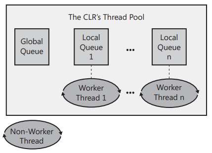

Chapter 27-Compute-Bound Asynchronous Operations
==============================

## Performing a Simple Compute-Bound Operation

To queue an asynchronous compute-bound operation to the thread pool, you typically call one of the following methods defined by the `ThreadPool` class:
```C#
public static class ThreadPool {
   public static bool QueueUserWorkItem(WaitCallback callBack);  // call QueueUserWorkItem(callBack, null) internally
   public static bool QueueUserWorkItem(WaitCallback callBack, object state);
   ...
}

delegate void WaitCallback(Object state);
```
These methods queue a "work item" and optional state data to the thread pool's queue, and then all of these methods return immediately. A work item is simply a method represented by the `WaitCallback` delegate parameter, and it can be passed with a single parameter represented by `object`. The version of QueueUserWorkItem without the object state parameter passes null to the callback method.

The following code demonstrates how to have a thread pool thread call a method asynchronously:
```C#
using System.Threading; 

static void Main() {
   Console.WriteLine("Main thread: queuing an asynchronous operation");
   ThreadPool.QueueUserWorkItem(ComputeBoundOp, 5);
   Console.WriteLine("Main thread: Doing other work here...");
   Thread.Sleep(10000); // Simulating other work (10 seconds)
   Console.WriteLine("Hit <Enter> to end this program...");
   Console.ReadLine();
}

static void ComputeBoundOp(Object state) {
   // This method is executed by a thread pool thread
   Console.WriteLine("In ComputeBoundOp: state={0}", state);
   Thread.Sleep(1000); // Simulates other work (1 second)
  
   // When this method returns, the thread goes back to the pool and waits for another task 
}
```
output is:
```
//output 1
Main thread: queuing an asynchronous operation
Main thread: Doing other work here...
In ComputeBoundOp: state=5

//output 2
Main thread: queuing an asynchronous operation
In ComputeBoundOp: state=5
Main thread: Doing other work here...
```
The difference in the order of the lines in the output is attributed to the fact that the two methods are running asynchronously with respect to one another. The Windows scheduler determines which thread to schedule first, or it may schedule them both simultaneously if the application is running on a multi-CPU machine.

Note that **if the callback method throws an exception that is unhandled, the CLR terminates the process (unless the host imposes its own policy).**. In Contrast, `Task` will swallow the unhandled exception and only throws the exception when you try to access its result or call Wait().

## Execution Contexts

Every thread has an execution context data structure associated with it. The execution context includes things such as security setting, host settings, and logical call context data. When a thread execute code, some operations are affected by the values of the thread's execution context settings. Ideally, whenever a thread uses another (helper) thread to perform tasks, the issuing thread's execution context should flow (be copied) to the helper thread. This ensures that any operations performed by helper thread(s) are executing with the same security and host settings. It also ensures that any data stored in the initiating thread's logical call context is avaulable to the helper thread.

By default, the CLR automatically causes the initiating thread's execution context to flow to any helper threads. This transfers context information to the helper thread, but it comes at a performance cost, because there is a lot of information in an execution context, and accumulating all of this information and then copying it for the helper thread takes a fair amount of time. 

In the `System.Threading` namespace, there is an `ExecutionContext` class that allows you to control how a thread's execution context flows from one thread to another:
```C#
public sealed class ExecutionContext : IDisposable, ISerializable {
   public static AsyncFlowControl SuppressFlow();
   public static void RestoreFlow();
   public static Boolean IsFlowSuppressed();
   ...
}
```
You can use this class to suppress the flowing of an execution context, thereby improving your application's performance. **The performance gains can be quite substantial for a server application**.There is not much performance benefit for a client application. If the initiating thread’s execution context does not flow to a helper thread, the helper thread will use whatever execution context it last associated with it. Therefore, the helper thread really shouldn't execute any code that relies on the execution context state (such as a user's Windows identity).

Here is an example showing how suppressing the flow of execution context affects data in a thread's logical call context when queuing a work item to the CLR's thread pool:
```C#
using System.Runtime.Remoting.Messaging;  // CallContext's namespace

static void Main() {
   // Put some data into the Main thread's logical call context
   CallContext.LogicalSetData("Name", "Jeffrey");

   // Initiate some work to be done by a thread pool thread
   // The thread pool thread can access the logical call context data
   ThreadPool.QueueUserWorkItem(state => Console.WriteLine("Name={0}", CallContext.LogicalGetData("Name")));

   // Now, suppress the flowing of the Main thread's execution context
   ExecutionContext.SuppressFlow();
   ...
}
```

## Cooperative Cancellation and Timeout

The Microsoft .NET Framework offers a standard pattern for canceling operations. This pattern is *cooperative*, meanning that the operation that you want to cancel has to explicitly support being canceled. In other words, the code performing the operation that you want to cancel and the code that attempts to cancel the operatio must both use the types mentioned in this section. 

To cancel an operation, you must first create a `System.Threading.CancellationTokenSource` object:
```C#
public class CancellationTokenSource : IDisposable {
   
   // legal values for m_state
   private const int CANNOT_BE_CANCELED = 0;
   private const int NOT_CANCELED = 1;
   private const int NOTIFYING = 2;
   private const int NOTIFYINGCOMPLETE = 3;

   public CancellationTokenSource();

   public CancellationTokenSource(int millisecondsDelay);
   ...

   public bool IsCancellationRequested {
      get { return m_state >= NOTIFYING; }
   }
   
   public CancellationToken Token { 
      get {
         ThrowIfDisposed();
         return new CancellationToken(this);
      }
    }

   public static CancellationTokenSource CreateLinkedTokenSource(params CancellationToken[] tokens);

   public void Cancel() {   // Calling Cancel throw ObjectDisposedException, first exception or a new AggregateException
       Cancel(false);       // Basically the exceptions it throw is related to the ones thrown by registered callbacks
                            // Also note that OperationCanceledException is thrown by CancellationToken's 
                            // ThrowIfCancellationRequested method, which has nothing to do with registered callbacks
   }

   public void Cancel(bool throwOnFirstException) {
      ThrowIfDisposed();   // throw ObjectDisposedException
      NotifyCancellation(throwOnFirstException);  
   }

   private void NotifyCancellation(bool throwOnFirstException) {
      ...// do some threading synchronization stuff
      ExecuteCallbackHandlers(throwOnFirstException);    // invoke callbacks registered by the CancellationToken's Register method
                                                         // this method internally can also throw the first exception or a new AggregateException
   }

   public void CancelAfter(int millisecondsDelay);

   public void Dispose();   
}

public struct CancellationToken {
   private CancellationTokenSource m_source;
   
   internal CancellationToken(CancellationTokenSource source) {
      m_source = source;
   }

   public static CancellationToken None {     // Very convenient
       get { return default(CancellationToken); }
   }

   public Boolean IsCancellationRequested { get; }   // <--------Called by non-Task invoked operations

   public void ThrowIfCancellationRequested();       // <--------Called by Task-invoked operations, throws OperationCanceledException
                                                    
   // WaitHandle is signaled when the CancellationTokenSource is canceled

   public WaitHandle WaitHandle { get; }
   // GetHashCode, Equals, operator== and operator!= members are not shown

   public Boolean CanBeCanceled { get; } // Rarely used

   // Registers a delegate that will be called when this System.Threading.CancellationToken
   public CancellationTokenRegistration Register(Action<Object> callback, Object state, Boolean useSynchronizationContext);   // Simpler overloads not shown
}

//call Dispose to remove a registered callback from the CancellationToken's Register that
//it is associated with so that it does not get invoked when calling Cancel
public struct CancellationTokenRegistration : IEquatable<CancellationTokenRegistration>, IDisposable {
    public void Dispose();
    // GetHashCode, Equals, operator== and operator!= members are not shown
}
```
A CancellationToken instance is a lightweight value type because it contains a single private field: a reference to its CancellationTokenSource object. A compute-bound operation's loop can periodically call CancellationToken's IsCancellationRequested property to know if the loop should terminate early, thereby ending the compute-bound operation. The benefit here is that CPU time is no longer being wasted on an operation whose result you know you’re not interested
in. Below is some sample code:
```C#
public static void Main() {
   CancellationTokenSource cts = new CancellationTokenSource();
   ThreadPool.QueueUserWorkItem(o => Count(cts.Token, 1000));

   Console.WriteLine("Press <Enter> to cancel the operation.");
   Console.ReadLine();
   cts.Cancel(); // If Count returned already, Cancel has no effect on it
   // Cancel returns immediately, and the method continues running here...
   Console.ReadLine();
}

static void Count(CancellationToken token, Int32 countTo) {
   for (Int32 count = 0; count <countTo; count++) {
      if (token.IsCancellationRequested) {
         Console.WriteLine("Count is cancelled");
         break; // Exit the loop to stop the operation
      }
      Console.WriteLine(count);
      Thread.Sleep(200); // For demo, waste some time
   }
   Console.WriteLine("Count is done");
}
```

<div class="alert alert-info p-1" role="alert">
    You might wonder why CancellationToken is separate from CancellationTokenSource. The fact that CancellationToken can only observe the state and not change it, is extremely critical. You can hand out the token like a candy and never worry that someone else, other than you, will cancel it. It protects you from hostile third party code. Check out this <a href="https://stackoverflow.com/questions/14215784/why-cancellationtoken-is-separate-from-cancellationtokensource">SO question</a> for more details.
</div>

**Note that if you want to execute an operation and prevent it from being canceled, you can pass the operation the CancellationToken returned from calling CancellationToken's static None property**. This very convenient property returns a special CancellationToken instance that is not associated with any CancellationTokenSource object (its private field is null). Because there is no CancellationTokenSource, no code can call Cancel, and the operation that is querying the special CancellationToken's IsCancellationRequested property will always return false. If you query CancellationToken's CanBeCanceled
property by using one of these special CancellationToken instances, the property will return false. The CanBeCanceled property returns true for all other CancellationToken instances obtained by querying a CancellationTokenSource object's Token property.

You can call CancellationTokenSource's Register method to register one or more methods to be invoked when a CancellationTokenSource is canceled. If you pass false for the useSynchronizationContext parameter, then the thread that calls Cancel will invoke all the registered methods sequentially. If you pass true for the useSynchronizationContext parameter, then the callbacks are sent to the captured SynchronizationContext object that governs which thread invokes the callback.

If Register is called multiple times, then multiple callback methods will be invoked. These callback methods could throw an unhandled exception. If you call CancellationTokenSource's Cancel, passing it true, then the frist callback method that throws an unhandled exception stops the other callback methods from executing, and the exception will be thrown from Cancel as well. If you call `Cancel()` or `Cancel(false)`, then all registered callback methods are invoked. Any unhandled exceptions that occurs are added to a collection. After all callback methods have executed, if any of callback threw an unhandled exception, then Cancel throws an `AggregateException`with its `InnerExceptions` property set to the collection of exception objects that were thrown. Do not confuse the
InnerExceptions property with the InnerException property, which the AggregateException class inherits from the System.Exception base class
```C#
public class AggregateException : Exception {
   private ReadOnlyCollection<Exception> m_innerExceptions;

   public AggregateException();
   ...
   public ReadOnlyCollection<Exception> InnerExceptions { get; }

   public AggregateException Flatten();

   public override Exception GetBaseException();

   //  Handle might throw a new AggregateException
   public void Handle(Func<Exception, bool> predicate) {  // Func takes every contained Exception to indicate whether the exception was handled.    
      ...
      List<Exception> unhandledExceptions = null;
      for (int i = 0; i < m_innerExceptions.Count; i++) {
         if (!predicate(m_innerExceptions[i])) {
            if (unhandledExceptions == null) {
                unhandledExceptions = new List<Exception>();
            }
            unhandledExceptions.Add(m_innerExceptions[i])
         }        
      }

      // If there are unhandled exceptions remaining, throw them
      if (unhandledExceptions != null) {
         throw new AggregateException(Message, unhandledExceptions);
      }
   } 
   ...
}
```

Below is some sample code:
```C#
static void Main(string[] args) {
   CancellationTokenSource cts = new CancellationTokenSource();
   cts.Token.Register(FuncFirst);
   cts.Token.Register(FuncSecond);
   cts.Token.Register(FuncThird);
   try {
      cts.Cancel(false);  // or cts.Cancel();
   }
   catch (AggregateException e) {
      // e.InnerException is TimeZoneNotFoundException, not exact sure why, maybe it is based on the first exception it encounts
      // e.InnerExceptions contains all three exceptions
   }
   Console.ReadLine();
}

// all the methods below will be executed by main thread
static void FuncFirst() {
   Console.WriteLine("FuncFirst");
   throw new DivideByZeroException();
}

static void FuncSecond() {
   Console.WriteLine("FuncSecond");
   throw new OverflowException();
}

static void FuncThird() {
   Console.WriteLine("FuncThird");
   throw new TimeZoneNotFoundException();
}

/*output is (note the order is reverse):
FuncThird
FuncSecond
FuncFirst
*/
```
If you do `cts.Cancel(true)` then Cancel will throw `DivideByZeroException` which is the first exception.

Finally, you can create new `CancellationTokenSource` object by linking a bunch of other CancellationTokenSource objects. This new CancellationTokenSource object will be canceled when **any** of the linked CancellationTokenSource objects are canceled:
```C#
// Create a CancellationTokenSource
var cts1 = new CancellationTokenSource();
cts1.Token.Register(() => Console.WriteLine("cts1 canceled"));

// Create another CancellationTokenSource
var cts2 = new CancellationTokenSource();
cts2.Token.Register(() => Console.WriteLine("cts2 canceled"));

// Create a new CancellationTokenSource that is canceled when cts1 or ct2 is canceled
CancellationTokenSource linkedCts = CancellationTokenSource.CreateLinkedTokenSource(cts1.Token, cts2.Token);
linkedCts.Token.Register(() => Console.WriteLine("linkedCts canceled"));

// Cancel one of the CancellationTokenSource objects (I chose cts2)
cts2.Cancel();
Console.WriteLine("cts1 canceled={0}, cts2 canceled={1}, linkedCts canceled={2}", cts1.IsCancellationRequested, cts2.IsCancellationRequested, linkedCts.IsCancellationRequested);

/* output is
linkedCts canceled
cts2 canceled
cts1 canceled=False, cts2 canceled=True, linkedCts canceled=True
*/
```
It is often valuable to cancel an operation after a period of time has elapsed. For example, imagine a server application that starts computing some work based on a client request. But the server application needs to respond to the client within two seconds, no matter what. In some scenarios, it is better to respond in a short period of time with an error or with partially computed results as opposed to waiting a long time for a complete result. Fortunately, CancellationTokenSource gives you a way to have it self-cancel itself after a period of time. To take advantage of this, you can either construct a
CancellationTokenSource object by using one of the constructors that accepts a delay, or you can call CancellationTokenSource's CancelAfter method.

## Task Parallel Library (TPL)

Calling ThreadPool's QueueUserWorkItem method to initiate an asynchronous compute-bound operation is very simple. However, this technique has many limitations. The biggest problem is that there is no built-in way for you to know when the operation has completed, and there is no way to get a return value back when the operation completes. To address these limitations and more, Microsoft introduced the concept of *tasks*, and you use them via types in `System.Threading.Tasks`
```C#
public class Task : IThreadPoolWorkItem, IAsyncResult, IDisposable {
   public Task(Action action);
   public Task(Action action, CancellationToken cancellationToken);
   public Task(Action action, TaskCreationOptions creationOptions);
   public Task(Action action, CancellationToken cancellationToken, TaskCreationOptions creationOptions);
   public Task(Action<object> action, object state);
   // none of constructors takes Func<TResult> delegate
   ...

   public static int? CurrentId { get; }   // used to get the identifier of the currently executing task from the code that the task is executing.
   public int Id { get; }   // used on Task instance 

   public static TaskFactory Factory { get; }
   public TaskCreationOptions CreationOptions { get; }

   public bool IsCompleted { get; }
   public bool IsCanceled { get; }
   public TaskStatus Status { get; }

   public AggregateException Exception { get; }
   
   public object AsyncState { get; }
   public bool IsFaulted { get; }

   // we can wrap a function inside the Action, so we can pass arguments to the callback as () => someFunc(p1, p2...)
   public static Task Run(Action action) {   // Note that this method makes a task deny child to attach
      ...                                    // Use Task.Factory.StartNew(...) with DenyChildAttach flag if you do want to attach child
      return Task.InternalStartNew(..., ..., ..., ..., TaskScheduler.Default, TaskCreationOptions.DenyChildAttach, ...);
   }
   public static Task Run(Func<Task> function);
   public static Task Run(Action action, CancellationToken cancellationToken);
   public static Task<TResult> Run<TResult>(Func<TResult> function);
   public static Task<TResult> Run<TResult>(Func<Task<TResult>> function);
   ...
   // all methods above have an overload Run method that takes CancellationToken parameter

   public static void WaitAll(params Task[] tasks);  // return type is void
   public static bool WaitAll(Task[] tasks, int millisecondsTimeout, CancellationToken cancellationToken);  
   // return type is bool becuase of millisecondsTimeout parameter; it return true if all of the Task instances completed execution within the allotted time; otherwise, false.
   
   public static int WaitAny(params Task[] tasks); // return the index of the completed task in the tasks array argument, or -1 if the timeout occurred.
   ...

   public static Task<Task> WhenAny(params Task[] tasks);  //  note that the returned task is a task that represents the completion of one of the supplied tasks. The return task's Result is the task that completed.

   public static Task WhenAll(params Task[] tasks);
   ...
   
   public void Wait();   // might block forever

   // Waits for the System.Threading.Tasks.Task to complete execution. The wait terminates
   // if a timeout interval elapses or a cancellation token is canceled before the task completes.
   public bool Wait(int millisecondsTimeout, CancellationToken cancellationToken);

   public void Start();
   // There is no public void Start(object state) like Thread's Start(object parameter)
   public void Start(TaskScheduler scheduler);

   public static YieldAwaitable Yield() {   // <---------- see Chapter 28 for details
      return default;
   }

   public ConfiguredTaskAwaitable ConfigureAwait(bool continueOnCapturedContext);  // <---------- see Chapter 28 for details
}
```
Insteadof calling ThreadPool's QueueUserWorkItem method, you can do the same via tasks:
```C#
ThreadPool.QueueUserWorkItem(ComputeBoundOp, 5);
new Task(ComputeBoundOp, 5).Start();             // Equivalent of preceding using Task
Task.Run(() => ComputeBoundOp(5));               // Another equivalent
```
In the second line of preceding code, I'm creating the Task object and then immediately calling Start() to schedule the task to run. Naturally, you can create the Task object and then call Start() on it later. You could image code that creates a Task object and then passes it to some other method that decides when to call Start() to schedule the task. Because it is common to create a Task object and then immediately call Start() on it, you can call Task's convenient static Run method as shown on the last line of the preceding code.

Task's all constructors only takes `Action` or `Action<Object>` delegate, no constructor take Func delegate. If you pass a method that expects a parameter, then you must also pass to Task's constructor that takes object state. Note that some constructors and Run methods takes optional CancellationToken parameter (same as TaskFactory's constructor, which will be covered soon),  it has two primary benefits (it will be covered in details with example in later section "Why Pass Cancellation Token in Task Constructor Or Task.Run(...)"):

<ol>
  <li>If the token has cancellation requested prior to the Task starting to execute, the Task won't execute. Rather than transitioning to 'Running' state, it will immediately transition to 'Canceled' state. This avoids the costs of running the task if it would just be canceled.</li>
  <li>If the execute code of task is also monitoring the cancellation token and throws an OperationCanceledException containing that token, then when the task sees that OperationCanceledException, it checks whether the OperationCanceledException's token matches the Task's token. If it does, that exception is viewed as an acknowledge of cooperative cancellation and the task transitions to the 'Canceled' state (rather than the 'Faulted' state.</li>
</ol> 

You can also optionally pass to the constructor some `TaskCreationOptions` flags that control how the Task executes:
```C#
[Flags, Serializable]
public enum TaskCreationOptions {
   None = 0x0000,   // The default
   PreferFairness = 0x0001,
   LongRunning = 0x0002,
   AttachedToParent = 0x0004,
   DenyChildAttach = 0x0008,  // If a child task attempts to attach to this parent task, an InvalidOperationException is thrown.
   HideScheduler = 0x0010  // Forces child tasks to use the default scheduler as opposed to the parent's scheduler.
}
```
To understand `PreferFairness`, you need to understand the CLR Thread Pool architecture and what's work-stealing, which will be covered later in this chapter. Work-stealing affects that fairness, because the new work item (item1) added to the global queue first, then one worker thread schedule a task (item2), even though item1 needs to be process first, but the worker thread still process item2 first because by default worker thread will check its local queue first. So using `PreferFairness`, when task scheduler schedules item2, it sees `PreferFairness` is used inside the task, so it won't schedule it to the worker thead's loca queue, it will schedule it to the global queuem, which is a first-come, first-serve model, then item1 will be processed first.

`LongRunning` is used when you know the operation is going to be time-consuming, if you just use the default`None`, then a worker thread will be assigned to execute this long running operation, since this worker thread won't return back to thread pool for a long time, then the threal pool will create more threads as compensation, which adds the frequence of context switch. So using `LongRunning`, the task scheduler will create a new thread by using Thread API `new Thread(.....)` and set `IsBackground = true`, this non-worker thread is good to perform long running operation, and if you use Visual Studio to debugging, you won't see "worker thread" in the thread window.

## Waiting for a Task to Complete and Getting Its Result

You can use `Task<TResult>` to get results.
```C#
public class Task<TResult> : Task {
   public Task(Func<TResult> function);
   public Task(Func<TResult> function, CancellationToken cancellationToken);
   public Task(Func<TResult> function, TaskCreationOptions creationOptions);
   public Task(Func<object, TResult> function, object state);
   ...

   public static TaskFactory<TResult> Factory { get; }   // e.g. Task<Int32>.Factory.
   public TResult Result { get; }
  
   // internal helper function breaks out logic used by TaskCompletionSource
   internal bool TrySetResult(TResult result)

   public Task ContinueWith(Action<Task<TResult>, object> continuationAction, object state, CancellationToken cancellationToken, TaskContinuationOptions continuationOptions, TaskScheduler scheduler);  // <-----most common used

   public Task<TNewResult> ContinueWith<TNewResult>(Func<Task<TResult>, object, TNewResult> continuationFunction, object state, CancellationToken cancellationToken, TaskContinuationOptions continuationOptions, TaskScheduler scheduler);  
   ...
}

public class TaskFactory<TResult> {
   ...  // like TaskFactory
}
```
Let's say that we have a Sum method that is computationally intensive if n is a large value:
```C#
static void Main(string[] args) {
   // Create a Task (it does not start running now)
   Task<Int32> t = new Task<Int32>(n => Sum((Int32)n), 1000000000);

   // You can start the task sometime later
   t.Start();

   // Optionally, you can explicitly wait for the task to complete
   t.Wait(); // FYI: Overloads exist accepting timeout/CancellationToken

   // You can get the result (the Result property internally calls Wait)
   Console.WriteLine("The Sum is: " + t.Result); // An Int32 value
}
```

<div class="alert alert-info p-1" role="alert">
    When a thread calls the Wait method, the system checks if the Task that the thread is waiting for has started executing. If it has, then the thread calling Wait will block until Task has completed running. But if the Task has not started executing yetm then the system may (depending on the TaskScheduler) execute the Task by using the thread that called Wait. If this happens, then the thread calling Wait does not block; it executes the Task and returns immediately. This is good in that no thread has blocked, thereby reducing resource usage (by not creating a thread to replace the blocked thread) while improving performance (no time is spent to create a thread and there is no context switching). But it can also be bad if, for example, the thread has taken a thread synchronization lock before calling Wait and then the Task tries to take the same lock, resulting in a deadlocked thread!
</div>

**If task throws an unhandled exception, the exception will be swallowed, stored in a collection, and the thread pool thread is allowed to return to the thread pool. When the `Wait` method or the `Result` property is invoked, these members will throw a `AggregateException`**, which will be covered in later section "A Task May Start Child Tasks".

In addition to waiting for a single task, the Task class also offers two static methods (`WaitAny`, `WaitAll`) that allow a thread to wait on an array of Task objects. Check their API for more details, note that they both throw `OperationCanceledException` if get canceled via a CancellationToken.


## Inside a Task

Each Task object has a set of private fields that make up the task's state. There is an Int32 ID (Task's readonly ID property), an Int32 representing the execution state of the Task, a reference to the parent task, a reference to the TaskScheduler specified when the Task was created, a reference to the callback method, a reference to the object that is to be passed to the callback method (queryable vial Task's Readonly `AsyncState` property) and so on. In addition, each Task object has a reference to some supplementary state that includes a CancellationToken, a collection of ContinueWithTask objects, a collection of Task objects for child tasks that have thrown unhandled exceptions, and more. My point is that although tasks provide you a lot of features, there is some cost to tasks because memory must be allocated for all this state. If you don't need the additional features offered by tasks, then your program will use resources more efficiently if you use `ThreadPool.QueueUserWorkItem`.

The `Task` and `Task<TResult>` classes implement the IDisposable interface, allowing you to call Dispose when you are done with the Task object. Today, all the Dispose method does is close the ManualResetEventSlim object ( Review after Chapter 30). However, it is possible to define classes derived from `Task` and `Task<TResult>`, and these classes could allocate their own resources, which would be freed in their override of the Dispose method. I recommend that developers not explicitly call Dispose on a Task object in their code; instead, just let the garbage collector clean up any resources when it determines that they are no longer in use.

You'll notice that each Task object contains an Int32 field representing a Task’s unique ID. When you create a Task object, the field is initialized to zero. Then the first time you query Task's read-only Id property, the property assigns a unique Int32 value to this field and returns it from the property. Task IDs start at 1 and increment by 1 as each ID is assigned. Just looking at a Task object in the Microsoft Visual Studio debugger will cause the debugger to display the Task's ID, forcing the Task to be assigned an ID.

During a Task object's existence, you can learn where it is in its lifecycle by querying Task's readonly Status property. This property returns a `TaskStatus` value that is defined as follows:
```C#
public enum TaskStatus {
   // These flags indicate the state of a Task during its lifetime:
   Created,               // Task created explicitly; you can manually Start() this task
   WaitingForActivation,  // Task created implicitly; it starts automatically

   WaitingToRun,          // The task was scheduled but isn’t running yet
   Running,               // The task is actually running

   // The task is waiting for children to complete before it considers itself complete
   WaitingForChildrenToComplete,

   // A task's final state is one of these:
   RanToCompletion,
   Canceled,
   Faulted
}
```
When you first construct a Task object, its status is `Created`, Later, when the task is started, its status changes to `WaitingToRun`. When the Task is actually running on a thread, its status changes to `Running`. When the task stops running and is waiting for any child tasks, the status changes to `WaitingForChildrenToCompletion`. When a task is completed finsihed (when its all children tasks finish), it enters one of three final states: `RanToCompletion`, `Canceled` or `Faulted`. 

A Task object is in the `WaitingForActivation` state if that Task is created by calling ContinueXXX functions. This state means that the Task's scheduling is controlled by the task infrastructure. For example, you cannot explicitly start a Task object that was created by calling ContinueWith, this task will start automatically when its antecedent task has finished executing.

When a `Task` or `Task<TResult>` faults, you can obtain the unhandled exception that the task threw by querying Task's `Exception` property; which always returns an `AggregateException` object whose collection contains the set of unhandled exceptions.

For convenience, Task offers serveral readonly, Boolean properties: `IsCanceled`, `IsFaulted`, and `IsCompleted`. Note that `IsComplete` returns true when the Task is in the `RanToCompletion`, `Canceled` or `Faulted` state because they all considered as "completed", so if you want to check if a Task completed successfully is to do:
```C#
if (task.Status == TaskStatus.RanToCompletion)
```

## Canceling a Task

Of course, you can use a CancellationTokenSource to cancel a Task. First, we must modify our Sum method so that it accepts a CancellationToken:
```C#
static void Main(string[] args) {
   CancellationTokenSource cts = new CancellationTokenSource();
   Task<Int32> t = Task.Run(() => Sum(cts.Token, 1000000000), cts.Token);

   cts.Cancel();   // Task may have completed already

   try {
      // If the task got canceled, Result will throw an AggregateException
      Console.WriteLine("The sum is: " + t.Result); 
   }
   catch (AggregateException x) {
      // Consider any OperationCanceledException objects as handled.
      // Any other exceptions cause a new AggregateException containing
      // only the unhandled exceptions to be thrown
      x.Handle(e => e is OperationCanceledException);  // Handle method throws a new AggregateException if there is any remaining exception
      
      // If all the exceptions were handled, the following executes
      Console.WriteLine("Sum was canceled");
   }
}

static Int32 Sum(CancellationToken ct, Int32 n) {
   Int32 sum = 0;
   for (; n > 0; n--) {
      // The following line throws OperationCanceledException when Cancel
      // is called on the CancellationTokenSource referred to by the token
      // Note that this OperationCanceledException will be swallowed by the task and task rethrows it as AggregateException when Task.Result is queried
      ct.ThrowIfCancellationRequested();
      checked { sum += n; } // if n is large, this will throw System.OverflowException
   }
   return sum;
}
```
Note that a Task object has a CancellationToken associated with it, there is no way to access it (there is nothing like nothing like `Task.CurrentTask.CancellationToken`), so you must somehow get the same CancellationToken that was used to create the Task object into the Task's code itself. The easiest way to write this code is to use a lambda expression and "pass" the CancellationToken as a closure variable (as I've done in the previous code example).

Note that the Sum mehotd periodically checks to see if the operation has been canceled by calling CancellationToken's ThrowIfCancellationRequested method. This method is similar to CancellationToken's `IsCancellationRequested` property shown eariler in the "Cooperative Cancellation and Timeout" section. However, `ThrowIFCancellationRequested` throws an `OperationCanceledException` if the CancellationTokenSource has been canceled. The reason for throwing an exception is because, unlike work items initiated with ThreadPool's QueueUserWorkItem method, tasks have the notion of having completed and a task can even retrun a value. So, there needs to be a way to distinguish a completed task from a canceled task, and having the task throw an exception lets you know that the task did not run all the way to completion, even though this exception will be swallowed by the task and be rethrow as a new `AggregateException` when Task's Wait method is called or Task's Result property is queried.

Note that:
```C#
static void Main(string[] args) {
   CancellationTokenSource cts = new CancellationTokenSource();

   var task = Task.Delay(2000, cts.Token);
   cts.Cancel();

   var exceptionProp = task.Exception;  // <------------ task's Exception is null

   Console.ReadLine();
}
```
You might wonder why `task.Exception` is null, but this exception indicates successful cancellation instead of a faulty situation. Therefore, the task's Exception property returns null. If you want to know whether the operation throws an exception in this situation, you will need to query task's `TaskStatus` property

Compared with this one:
```C#
static void Main(string[] args) {
   var task = Task.Run(() => { throw new Exception("Oops"); });
   Thread.Sleep(1000);
   var exceptionProp = task.Exception;  // <------------ task's Exception contains the AggregateException which in turn contains TaskCanceledException
   // ...  
}
```
```C#
public class TaskCanceledException : OperationCanceledException {
   // ...
   public Task? Task { get; }
}

public class OperationCanceledException : SystemException {   
   // ...
   public CancellationToken CancellationToken { get; }
}
```

By the way, if you try to cancel a task before it is even started, an `InvalidOperationException` is thrown.
```C#
CancellationTokenSource cts = new CancellationTokenSource();
var returnedTask = new Task(ComputeBoundOp, 5, cts.Token);
cts.Cancel();
returnedTask.Start();  // Start method will throw InvalidOperationException
```

#### Dangers of Closures

Closures provide a very convenient mechanism to flow local data into delegates. When the delegate is invoked synchronously there is no great need to understand what is going on under the covers; however, the same is not true for asynchronous invocation of the delegate. Let us first examine the following piece of code:
```C#
for (int i = 0; i < 10; i++)
{
   Task.Factory.StartNew(() => Console.WriteLine(i));
}
Console.ReadLine();
```
You might expect to see different number get printed out (necessarily be in order), but the output is:
```
10
10
.
.
10
```
What happen is, when the compiler creates the helper class, it capture local variable `i`, but `i` is out of the loop body, so a single `i` is used. When the program runs, main method finishes quickly and then i becomes 10, then you get all 10s output. To fix:
```C#
for (int i = 0; i < 10; i++)
{
   int toCaptureI = i;
   Task.Factory.StartNew(() => Console.WriteLine(toCaptureI));
}
Console.ReadLine();
```
Now you capture local variable `i` inside of loop, you get the expected result.


#### Why Pass Cancellation Token in Task Constructor Or Task.Run(...)

You probably wonder why Task constructor ir Task.Run(...) takes a CancellationToken as a parameter when we already pass the token to the executing code who will periodically check if the token get canceled. Below is some concrete examples:
```C#
//You have to use Thread.Sleep() in some places (I leave them out for readibility) to ensure token is canceled before ThrowIfCancellationRequested get called
static void Main(string[] args) {
   CancellationTokenSource cts = new CancellationTokenSource();
   Task<Int32> t = Task.Run(() => Sum(cts.Token, 100000), cts.Token);
   cts.Cancel();
   var status = t.Status;   // status is "Canceled" becuase of "cooperative cancellation"
   Console.ReadLine();
}

static Int32 Sum(CancellationToken ct, Int32 n) {
   Int32 sum = 0;
   for (; n > 0; n--) {
      ct.ThrowIfCancellationRequested();
   }
   return sum;
}
```
If you don't pass the token as:
```C#
static void Main(string[] args) {
   CancellationTokenSource cts = new CancellationTokenSource();
   Task<Int32> t = Task.Run(() => Sum(cts.Token, 100000));
   cts.Cancel();
   var status = t.Status;   // status is "Faulted" now
   Console.ReadLine();
}
```

## Starting a New Task Automatically When Another Task Completes

When a task completes, it can start another task. Here is a rewrite of the earlier code (call `Wait()`) that doesn't block any threads:
```C#
Task<Int32> t = Task.Run(() => Sum(CancellationToken.None, 10000));

// ContinueWith returns a Task but you usually don't care
// public Task ContinueWith(Action<Task<TResult>> continuationAction);
Task cwt = t.ContinueWith(task => Console.WriteLine("The sum is: " + task.Result));
```
Now, when the task executing Sum completes, this task will start another task (also on some thread pool thread) that displays the result. The thread that executes the preceding code does not block waiting for either of these two tasks to complete; the thread is allowed to execute other code or, if it is a thread pool thread itself, it can return to the pool to perform other operations. Note that the task executing Sum could complete before ContinueWith is called. This will not be a problem because the ContinueWith method will see that the Sum task is complete and it will immediately start the task that displays the result.

Also, note that ContinueWith returns a reference to a new Task object (which my code placed in the cwt variable). Of course, you can invoke various members (like Wait, Result, or even ContinueWith) using this Task object, but usually you will ignore this Task object and will not save a reference to it in a variable.

**Task objects internally contain a collection of ContinueWith tasks. So you can actually call ContinueWith several times using a single Task object.** (How Task contains ContinueWith tasks can be reviewed after Chapter 30). When the task completes, all the ContinueWith tasks will be queued to the thread pool. In addition, When  calling ContinueWith, you can specify a bitwise OR'd set of `TaskContinuationOptions`. The first
six flags `None`, `PreferFairness`, `LongRunning`, `AttachedToParent`, `DenyChildAttach`, and `HideScheduler` are identical to the flags offered by the TaskCreationOptions enumerated type shown earlier. Here is what the TaskContinuationOptions type looks like:
```C#
[Flags, Serializable]
public enum TaskContinuationOptions {
   None = 0x0000,
   PreferFairness = 0x0001,
   LongRunning = 0x0002,
   AttachedToParent = 0x0004,   // Always honored: Associates a Task with its parent Task (discussed shortly)
   DenyChildAttach = 0x0008, 
   HideScheduler = 0x0010,

   // a little bit complicated, check the details below
   LazyCancellation = 0x0020,

   // this flag indicates that you want the thread that executed the first task to also execute the ContinueWith task.
   // if the first task has already completed, then the thread calling ContinueWith will execute the ContinueWith task.
   ExecuteSynchronously = 0x80000,

    // these flags indicate under what circumstances to run the ContinueWith task
    NotOnRanToCompletion = 0x10000,
    NotOnFaulted = 0x20000,
    NotOnCanceled = 0x40000,

    // these flags are convenient combinations of the above three flags
    OnlyOnCanceled = NotOnRanToCompletion | NotOnFaulted,
    OnlyOnFaulted = NotOnRanToCompletion | NotOnCanceled,
    OnlyOnRanToCompletion = NotOnFaulted | NotOnCanceled,
}
```
Let's talk about `LazyCancellation`. Let's look at this code:
```C#
CancellationTokenSource cts = new CancellationTokenSource();
Task taskA = Task.Run(...);  // long running task
cts.Cancel();
Task taskB = taskA.ContinueWith(..., cts.Token);
Task taskC = taskB.ContinueWith(...);
```
Since a request for cancellation happens before `Task taskB = taskA.ContinueWith(..., cts.Token);`, so taskB doesn't invoke the callback, and taskB's status immediately becomes "canceled". Note that "canceled" is a valid status to be considered as "completed" for a task, so taskC will run. Notice that in this case, taskA and taskC can run concurrently

If you change the cancellation operation as:
```C#
CancellationTokenSource cts = new CancellationTokenSource();
Task taskA = Task.Run(...);  // long running task
Task taskB = taskA.ContinueWith(..., cts.Token);
Task taskC = taskB.ContinueWith(...);
cts.Cancel();
```
The result is still the same (I have write my own program to verify), taskA and taskC can still run concurrently. Microsoft must write robust and optimized code so that once cancellation is requested, any associated tasks get notified.

Also note that if taskA is not a long running task, and we modify the code as:
```C#
CancellationTokenSource cts = new CancellationTokenSource();
Task taskA = Task.Run(...);  // a quick task
Task taskB = taskA.ContinueWith(..., cts.Token);
Task taskC = taskB.ContinueWith(...);
Thread.Sleep(3000);  // to ensure cancelation request happen after taskA finish
cts.Cancel();
```
This time taskB will invoke the callback, the take away message, even you pass the token in the CintinueWith method, if the cancelation request happens after the antecedent(taskA in this case) finishes, then taskB will still execute, to put it in the other way, once started, it can't be canceled.


When taskA and taskC can run concurrently, in many situations, that's fine.  But if you'd constructed your chain of continuations under the notion that no two tasks in the chain could ever run concurrently, you’d be sorely disappointed. 

Enter LazyCancellation. By specifying this flag on a continuation that has a CancellationToken, you’re telling TPL to ignore that CancellationToken until the antecedent has already completed.  In other words, the cancellation check is lazy: rather than the continuation doing the work to register with the token to be notified of a cancellation request, it instead doesn't do anything, and then only when the antecedent completes and the continuation is about to run does it poll the token and potentially transition to Canceled. In our previous example, if I did want to avoid taskA and taskC potentially running concurrently, we could have instead written:
```C#
CancellationTokenSource cts = new CancellationTokenSource();
Task taskA = Task.Run(...);  
// there is no overloaded method just take first three parameters (don't know why), that's why you have to specify TaskScheduler
Task taskB = taskA.ContinueWith(..., cts.Token, TaskContinuationOptions.LazyCancellation, TaskScheduler.Default);   
Task taskC = taskB.ContinueWith(...);
cts.Cancel();
```
Now taskB won't transition to "Canceled" until taskA completes, such that taskC won't be able to start until taskA has completed, and all would be right in the world again.

----

Let's come back to the ContinueWith method topic, you can indicate that you want the new task to execute only if the first task is canceled by specifying the `TaskContinuationOptions.OnlyOnCanceled` flag. Similarly, you have the new task execute only if the first task throws an unhandled exception using the `TaskContinuationOptions.OnlyOnFaulted` flag. And, of course, you can use the `TaskContinuationOptions.OnlyOnRanToCompletion` flag to have the new task execute only if the first task runs all the way to completion without being canceled or throwing an unhandled exception. By default, if you don't specify any of these flags, then the new task will run regardless of how the first task completes. Here is an example that puts all of this together
```C#
// Create and start a Task, continue with multiple other tasks
Task<Int32> t = Task.Run(() => Sum(10000));

// Each ContinueWith returns a Task but you usually don't care
t.ContinueWith(task => Console.WriteLine("The sum is: " + task.Result),TaskContinuationOptions.OnlyOnRanToCompletion);

t.ContinueWith(task => Console.WriteLine("Sum threw: " + task.Exception.InnerException), TaskContinuationOptions.OnlyOnFaulted);

t.ContinueWith(task => Console.WriteLine("Sum was canceled"), TaskContinuationOptions.OnlyOnCanceled);
```

## A Task May Start Child Tasks

A child task (or nested task) is a Task instance that is created in the user delegate of another task, which is known as the parent task. A child task can be either detached or attached. A detached child task is a task that executes independently of its parent. An attached child task is a nested task that is created with the TaskCreationOptions.AttachedToParent option whose parent does not explicitly or by default prohibit it from being attached, demonstrated by the following code:
```C#
Task<Int32[]> parent = new Task<Int32[]>(() => {
   var results = new Int32[3];   // Create an array for the results

   // This tasks creates and starts 3 child tasks
   new Task(() => results[0] = Sum(10000), TaskCreationOptions.AttachedToParent).Start();
   new Task(() => results[1] = Sum(20000), TaskCreationOptions.AttachedToParent).Start();
   new Task(() => results[2] = Sum(30000), TaskCreationOptions.AttachedToParent).Start();

   // Returns a reference of the array (even though the elements may not be initialized yet)
   return results;
});

// When the parent and its children have run to completion, display the results
var cwt = parent.ContinueWith(parentTask => Array.ForEach(parentTask.Result, Console.WriteLine));

// Start the parent Task so it can start its children
parent.Start();
```
Here, the parent task creates and starts three Task objects. By default, Task objects created by another task have no relationship to the task that creates them. However, the `TaskCreationOptions.AttachedToParent` flag associates a Task with the Task that creates it so that the creating task is not considered finished until all its children (and grandchildren) have finished running. When creating a Task by calling the ContinueWith method, you can make the continue with task be a child by specifying the `TaskContinuationOptions.AttachedToParent` flag.

**Also note that the status of parent task depends on status of child tasks**. Parent task's staus is `Faulted` if any child task throws an exception, and interestingly, Parent task's staus is `RanToCompletion` even if all child tasks get canceled. (I have write a program to verify).

Another important note is, the difference between parent task and antecedent task, let's look at the following code:
```C#
Task parentTask = Task.Factory.StartNew(() =>
{
  Task childTask = Task.Factory.StartNew(..., TaskCreationOptions.AttachedToParent);
  Task newTask = childTask.ContinueWith(..., TaskContinuationOptions.AttachedToParent);
});
```
You might overthink that childTask is the parent of newTask, it's not. childTask is antecedent to newTask, parentTask is the parent of newTask.

Lastly, you can use `Task.Run` to implicitly add `TaskCreationOptions.DenyChildAttach`:
```C#
Task parent = Task.Factory.StartNew(...)   // if you leave out TaskCreationOptions paremeter, it allows children to be attached.

Task parent = Task.Run(...)  // a wrapper for TaskFactory.StartNew that specifies TaskCreationOptions.DenyChildAttach
```

## Exception Handling in TPL

As metioned before, when a task throws an unhandled exception, the exception will be swallowed, stored in a collection. When the Wait method or the Result property is invoked, these members will throw `AggregateException`. Even if only one exception is thrown, it is still wrapped in an AggregateException exception, as the following example shows:
```C#
static void Main(string[] args) {
   var task1 = Task.Run( () => { throw new CustomException("Oops"); } );

   try {
      task1.Wait();
   }
   catch (AggregateException ae) {
      var a = ae.InnerException;   // a is the "new CustomException("Oops")"
      var b = ae.InnerExceptions;  // b is ReadOnlyCollection<Exception> whose first item (casted to Exception of course) is the "new CustomException("Oops")"
      bool c = a == b[0]           // c is true, since a and b[0] both point to the same "new CustomException("Oops")" instance   
   }
   Console.ReadLine();
}

public class CustomException : Exception
{
   public CustomException(String message) : base(message) { }
}
```
Note that you need to run the program above with Release mode otherwise if you use the normal debug mode, the program will break at task1 unless you change the excetpion settings or uncheck the Enable Just My Code checkbox under Tools, Options, Debugging, General, also remember to add `Console.ReadLine()` to stop Task background thread finish prematurely.

#### Attached child tasks and nested AggregateExceptions

If a task has an attached child task that throws an exception, that exception is wrapped in an AggregateException before it is propagated to the parent task, which wraps that exception in its own AggregateException before it propagates it back to the calling thread.
```C#
public static void Main() {
   var task1 = Task.Factory.StartNew(() => {
      var child1 = Task.Factory.StartNew(() => {
         var child2 = Task.Factory.StartNew(() => {   // note that child2's parent is child1, not task1                                                   
            throw new CustomException("Attached child2 faulted.");
         }, TaskCreationOptions.AttachedToParent);

         throw new CustomException("Attached child1 faulted.");
      }, TaskCreationOptions.AttachedToParent);

      throw new CustomException("Parent faulted.");   // even though you remove this piece of code so that parent itself doesn't throw an exception
                                                      // calling task1.Wait() still throw an AggregateException, as long as one of its child throws exception
   });

   try {
      task1.Wait();
   }
   catch (AggregateException ae) {
      // You can see that AggregateException's InnerException is always the same as the first item of InnerExceptions
      var a = ae.InnerException;       // a is the "new CustomException("Parent faulted.")" instance
      var b = ae.InnerExceptions[0];   // b is also the "new CustomException("Parent faulted.")" instance (a == b)
      var c = ae.InnerExceptions[1] as AggregateException;   // c is AggregateException (from child1)

      var d = c.InnerException;        // d is the "new CustomException("Attached child1 faulted.")" instance
      var e = c.InnerExceptions[0];    // e == d
      var f = c.InnerExceptions[1] as AggregateException;   // f is AggregateException (from child2)

      var g = f.InnerException;        // g is the new CustomException("Attached child2 faulted.") instance
      var h = f.InnerExceptions[0];    // g == h

      var i = ae.Flatten();   // i is AggregateException, InnerExceptions is ["Parent faulted.", "Attached child1 faulted.", "Attached child2 faulted "]    
   }
   Console.ReadLine();
}

public class CustomException : Exception
{
   public CustomException(String message) : base(message) { }
}
```

#### Detached child tasks and nested AggregateExceptions
Be default, child tasks are created as detached. Exceptions thrown from detached tasks must be handled or rethrown in the immediate parent task; they are not propagated back to the parent task as attached childs task do. The topmost parent can manually rethrow an exception from a detached child to cause it to be wrapped in parent's own AggregateException and propagated back to the calling thread.
```C#
static void Main() {
   var task1 = Task.Run(() => {
      var nested1 = Task.Run(() => {
         throw new CustomException("Detached child task faulted.");
      });   
      nested1.Wait();
   });

   try {
      task1.Wait();
   }
   catch (AggregateException ae) {
       var a = ae.InnerException;      // a is the AggregateException comes from nested1
       var b = ae.InnerExceptions[0];  // InnerExceptions only has one item which is a
       bool c = a == b;   // c is true
   }
}
```
On the other hand, if you don't rethrow nested1's AggregateException in task1 as:
```C#
static void Main() {
   var task1 = Task.Run(() => {
      var nested1 = Task.Run(() => {
         throw new CustomException("Detached child task faulted.");
      });   
      //nested1.Wait();
   });

   try {
      task1.Wait();
   }
   catch (AggregateException ae) {
     ...
   }
}
```
Then the program runs normal, no exception is thrown

## Task Factories

Occasionally, you might want to create a bunch of Task objects that share the same configuration. To keep you from having to pass the same parameters to each Task's constructor over and over again, you an create a task factory that encapsulates the common configutation. The `System.Threading.Tasks` namespace defines a `TaskFactory` type as well as `TaskFactory<TResult>` type. 

```C#
public class TaskFactory<TResult> {
   public TaskFactory();
   ..
   public TaskFactory(CancellationToken cancellationToken, TaskCreationOptions creationOptions, TaskContinuationOptions continuationOptions, TaskScheduler scheduler);

   public TaskScheduler Scheduler { get; }
   public CancellationToken CancellationToken { get; }
   public TaskCreationOptions CreationOptions { get; }
   public TaskContinuationOptions ContinuationOptions { get; }

   public Task<TResult> ContinueWhenAll(Task[] tasks, Func<Task[], TResult> continuationFunction, CancellationToken cancellationToken);
   public Task<TResult> ContinueWhenAll<TAntecedentResult>(Task<TAntecedentResult>[] tasks, Func<Task<TAntecedentResult>[], TResult> continuationFunction, CancellationToken cancellationToken);
   ...
   public Task StartNew(Action action);
   public Task<TResult> StartNew(Action action, CancellationToken cancellationToken);
   // public Task<TResult> StartNew(Func<TResult> function); don't know why Microsoft doesn't provide this one
   public Task<TResult> StartNew(Func<TResult> function, CancellationToken cancellationToken);
   public Task<TResult> StartNew(Func<object, TResult> function, object state, CancellationToken cancellationToken);
   ...
}
```

When you create one of these task factory classes, you pass to its constructor the defaults that you want the tasks that the factory creates to have. Specifically, you pass to the task factory the CancellationToken, TaskScheduler, TaskCreationOptions, and TaskContinuationOptions settings that you want factory-created tasks to have. Here is some sample code demonstrating the use of a TaskFactory:
```C#
static void Main(string[] args) {

   Task parentTask = new Task(() => {
      var cts = new CancellationTokenSource();
      var tf = new TaskFactory<Int32>(cts.Token, TaskCreationOptions.AttachedToParent, TaskContinuationOptions.ExecuteSynchronously, TaskScheduler.Default);

      // This task create and starts 3 child tasks
      var childTasks = new[] {
               tf.StartNew(() => Sum(cts.Token, 10000)),
               tf.StartNew(() => Sum(cts.Token, 20000)),
               tf.StartNew(() => Sum(cts.Token, Int32.MaxValue)) // Too big, throws OverflowException
            };

      // If any of the child tasks throw, cancel the rest of them
      for (Int32 task = 0; task < childTasks.Length; task++) {
         childTasks[task].ContinueWith(t => cts.Cancel(), TaskContinuationOptions.OnlyOnFaulted);
      }

      // When all children are done, get the maximum value returned from the
      // non-faulting/canceled tasks. Then pass the maximum value to another
      // task that displays the maximum result
      /*
      public Task<TResult> ContinueWhenAll<TAntecedentResult>(Task<TAntecedentResult>[] tasks, Func<Task<TAntecedentResult>[], TResult> continuationFunction, CancellationToken cancellationToken);
         note that  tf.ContinueWhenAll create a continue task which is a child task of parentTask
      */
      tf.ContinueWhenAll(childTasks, completedTasks => completedTasks.Where(t => t.Status == TaskStatus.RanToCompletion).Max(t => t.Result), CancellationToken.None).ContinueWith(t => Console.WriteLine("The maximum is: " + t.Result), TaskContinuationOptions.ExecuteSynchronously);
      // Note that I use CancellationToken.None here to overwrite TaskFactory's existing configuration as I don't want this task to get canceled.
   });

   // When the children are done, show any unhandled exceptions too
   parentTask.ContinueWith(p => {
      // I put all this text in a StringBuilder and call Console.WriteLine just once
      // because this task could execute concurrently with the task above & I don't
      // want the tasks' output interspersed
      StringBuilder sb = new StringBuilder("The following exception(s) occurred:" + Environment.NewLine);

      foreach (var e in p.Exception.Flatten().InnerExceptions)
         sb.AppendLine(" " + e.GetType().ToString());
   }, TaskContinuationOptions.OnlyOnFaulted);

   // Start the parent Task so it can start its children
   parentTask.Start();

   Console.ReadLine();
}

static Int32 Sum(CancellationToken ct, Int32 n) {
   Int32 sum = 0;

   for (; n > 0; n--) {
      // The following line throws OperationCanceledException when Cancel
      // is called on the CancellationTokenSource referred to by the token
      ct.ThrowIfCancellationRequested();
      checked { sum += n; } // if n is large, this will throw System.OverflowException
   }
   return sum;
}
```
Note that when calling `TaskFactory`'s or `TaskFactory<TResult>`s ContinueWhenAll and ContinueWhenAny methods, the following TaskContinuationOption flags are illegal: `NotOnRanToCompletion`, `NotOnFaulted`, `NotOnCanceled`, `OnlyOnCanceled`, `OnlyOnFaulted`, and `OnlyOnRanToCompletion`.  That is, ContinueWhenAll and ContinueWhenAny execute the continue-with task regardless of how the antecedent tasks complete. If you do use one of these flags, CLR throws a `System.ArgumentOutOfRangeException`.

## Task Schedulers

The task infrastructure is very flexible, and TaskScheduler objects are a big part of this flexibility. A TaskScheduler object is responsible for scheduling tasks to ensure that work of a task is eventually executed. 
```C#
public abstract class TaskScheduler {
   private static readonly TaskScheduler s_defaultTaskScheduler = new ThreadPoolTaskScheduler();

   protected TaskScheduler();

   public static TaskScheduler Default {  // Gets the default System.Threading.Tasks.TaskScheduler instance that is provided by the .NET           
      get {
         return s_defaultTaskScheduler;   // so Default always return thread pool task scheduler
      } 
    }  
   public static TaskScheduler Current { get; }   // Gets the System.Threading.Tasks.TaskScheduler associated with the currently executing task.

   public static event EventHandler<UnobservedTaskExceptionEventArgs> UnobservedTaskException;

   public static TaskScheduler FromCurrentSynchronizationContext() {
      return new SynchronizationContextTaskScheduler();
   }

   protected abstract IEnumerable<Task> GetScheduledTasks();
   protected abstract bool TryExecuteTaskInline(Task task, bool taskWasPreviouslyQueued);
   protected internal abstract void QueueTask(Task task);
   ...
}
```
The FCL ships with two TaskScheduler-derived types: **the thread pool task scheduler** and **synchronization context task scheduler**. By default, all applications use the thread pool task scheduler. This task scheduler schedules tasks to the thread pool's worker threads and is discussed in more detail in this chapter's "How the Thread Pool Manages Its Threads" section. You can get a reference to the default task scheduler (thread pool task scheduler) by querying TaskScheduler's static Default property.

The synchronization context task scheduler is typically used for applications sporting a graphical user interface, such as Windows Forms, WPF etc. This task scheduler schedules all tasks onto the application's GUI thread so that all the task code can successfully update UI components like buttons, menu items, and so on. **The synchronization context task scheduler doesn't use the thread pool at all**. You can get a reference to a synchronization context task scheduler by querying TaskScheduler's static FromCurrentSynchronizationContext method.

Here is a simple Windows Forms application that demonstrates the use of the synchronization context task scheduler:
```C#
// GUI thread will execute code behind such as event handler like OnMouseClick
internal sealed class MyForm : Form {
   private readonly TaskScheduler m_syncContextTaskScheduler;
   public MyForm() {
      // Get a reference to a synchronization context task scheduler
      m_syncContextTaskScheduler = TaskScheduler.FromCurrentSynchronizationContext();

      Text = "Synchronization Context Task Scheduler Demo";
      
      protected override void OnMouseClick(MouseEventArgs e) {
         Text = "Operation running";   // GUI thread updates UI here, it is OK

         // ComputeOp(); <---- If let GUI thread to execute long running taks, UI will block and disturb users

         // This task uses the default task scheduler and executes on a thread pool thread
         Task<Int32> t = Task.Run(() => ComputeOp());   // let worker thread do long running tasks, which doesn't block GUI thread.

         // This task use the sync context task scheduler and execute on the GUI thread
         t.ContinueWith(task => Text = "Result: " + task.Result, CancellationToken.None, TaskContinuationOptions.OnlyOnRanToCompletion m_syncContextTaskScheduler);
         ...
         base.OnMouseClick(e);
      }
   }
}
```
You can, of course, define your own class derived from TaskScheduler if you have special task scheduling needs. Microsoft has provided a bunch of sample code for tasks, and includes the source code for a bunch of task schedulers in the Parallel Extensions Extras package. Here are some of the task schedulers included in this package:

<ul>
  <li><b>IOTaskScheduler</b> This task scheduler queues tasks to the thread pool's I/O threads instead of its worker threads</li>
  <li><b>LimitedConcurrencyLevelTaskScheduler</b> This task scheduler allows no more than n (a constructor parameter) tasks to execute simultaneously.</li>
  <li><b>OrderedTaskScheduler</b> This task scheduler allows only one task to execute at a time. This class is derived from LimitedConcurrencyLevelTaskScheduler and just passes 1 for n.</li>
  <li><b>PrioritizingTaskScheduler</b> This task scheduler queues tasks to the CLR's thread pool. After this has occurred, you can call Prioritize to indicate that a Task should be processed before all normal tasks (if it hasn’t been processed already). You can call Deprioritize to make a Task be processed after all normal tasks.</li>
  <li><b>ThreadPerTaskScheduler</b> This task scheduler creates and starts a separate thread for each task; it does not use the thread pool at all.</li>
</ul> 

## Parallel's Static For, ForEach, and Invoke Methods 

There are some common programming scenarios that can potentially benefit from the improved performance possible with tasks. To simplify programming, the static `System.Threading.Tasks.Parallel` class encapsulates these common scenarios **while using Task objects internally**.

-To work in the future

## Parallel Language Integrated Query

-To work in the future

## Performing a Periodic Compute-Bound Operation

-To work in the future

## How the Thread Pool Manages Its Threads

Now I'd like to talk about how the thread pool code manages worker and I/O threads. However, I don't want to go into a lot of detail, because the internal implementation has changed greatly over the years with each version of the CLR, and it will continue changing with future versions. It is best to think of the thread pool as a black box. 

## How Worker Threads Are Managed

Figure below shows the various data structures that make up the worker threads' part of the thread pool. The ThreadPool.QueueUserWorkItem method and the Timer class always queue work items to the global queue. 



Worker threads pull items from global queue using a first-in-first-out (FIFO) algorithm and process them. Because multiple worker threads can be removing items from the global queue simultaneously, all worker threads contend on a thread synchronization lock to ensure that two or more threads don't take the same work item. This thread synchronization lock can become a bottleneck in some applications, thereby limiting scalability and performance to some degree.

Now let's talk about Task objects scheduled using the default TaskScheduler (obtained by querying TaskScheduler's static Default property). **When a non-worker thread schedules a Task, the Task is added to the global queue. But, each worker thread has its own local queue, and when a worker thread schedules a Task, the Task is added to calling the thread’s local queue**.

**When a worker thread is ready to process an item, it always checks its local queue for a Task first**. If a Task exists, the worker thread removes the Task from its local queue and processes the item. Note that a worker thread pulls tasks from its local queue by using a **last-in-first-out** (LIFO) algorithm. Because a worker thread is the only thread allowed to access the head of its own local queue, no thread synchronization lock is required and adding and removing Tasks from the queue is very fast. A side effect of this behavior is that Tasks are executed in the reverse order that they were queued.

**If a worker thread sees that its local queue is empty, then the worker thread will attempt to steal a Task from another worker thread's local queue**. Tasks are stolen from the tail of a local queue and require that a thread synchronization lock be taken, which hurts performance a little bit. Of course,
the hope is that stealing rarely occurs, so this lock is taken rarely. If all the local queues are empty, then the worker thread will extract an item from the global queue (taking its lock) using the FIFO algorithm. If the global queue is empty, then the worker thread puts itself to sleep waiting for something to show up. If it sleeps for a long time, then it will wake itself up and destroy itself, allowing the system to reclaim the resources (kernel object, stacks, TEB) that were used by the thread.

The thread pool will quickly create worker threads so that the number of worker threads is equal to the value pass to ThreadPool’s SetMinThreads method. If you never call this method (and it's recommended that you never call this method), then the default value is equal to the number of CPUs that your process is allowed to use as determined by your process's affinity mask. Usually your process is allowed to use all the CPUs on the machine, so the thread pool will quickly create worker threads up to the number of CPUs on the machine. After this many threads have been created, the thread pool monitors the completion rate of work items and if items are taking a long time to complete (the meaning of which is not documented), it creates more worker threads. If items start completing quickly, then worker threads will be destroyed.
<!-- <code>&lt;T&gt;<code> -->

<!-- <div class="alert alert-info p-1" role="alert">
    
</div> -->

<!-- <div class="alert alert-info pt-2 pb-0" role="alert">
    <ul class="pl-1">
      <li></li>
      <li></li>
    </ul>  
</div> -->

<!-- <ul>
  <li></li>
  <li></li>
  <li></li>
  <li></li>
</ul>  -->

<!-- <ul>
  <li><b></b></li>
  <li><b></b></li>
  <li><b></b></li>
  <li><b></b></li>
</ul>  -->

<!--  -->

<!-- <span style="color:red">hurt</span> -->

<style type="text/css">
.markdown-body {
  max-width: 1800px;
  margin-left: auto;
  margin-right: auto;
}
</style>

<link rel="stylesheet" href="./zCSS/bootstrap.min.css">
<script src="./zCSS/jquery-3.3.1.slim.min.js"></script>
<script src="./zCSS/popper.min.js"></script>
<script src="./zCSS/bootstrap.min.js"></script>