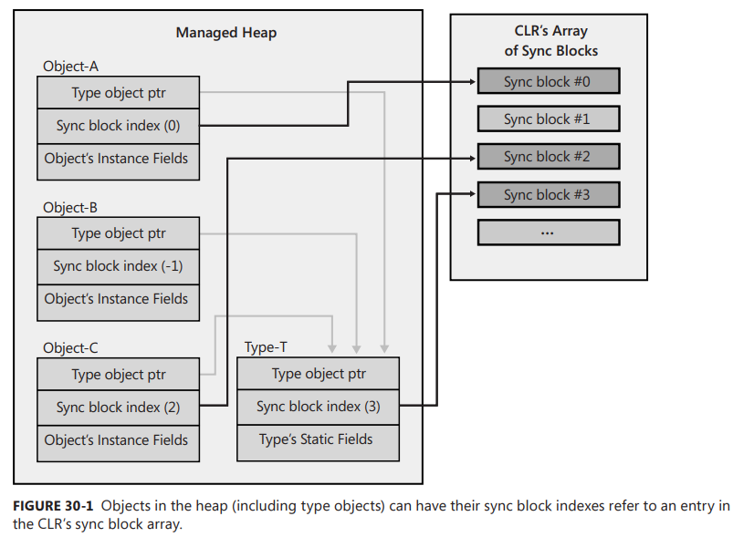

Chapter 30-Hybrid Thread Synchronization Constructs
==============================

## A Simple Hybrid Lock

```C#
internal sealed class SimpleHybridLock : IDisposable {
   // The Int32 is used by the primitive user-mode constructs (Interlocked methods)
   private Int32 m_waiters = 0;

   // The AutoResetEvent is the primitive kernel-mode construct
   private readonly AutoResetEvent m_waiterLock = new AutoResetEvent(false);

   public void Enter() {
      // Indicate that this thread wants the lock
      if (Interlocked.Increment(ref m_waiters) == 1)
         return; // Lock was free, no contention, just return
      // Another thread has the lock (contention), make this thread wait
      m_waiterLock.WaitOne();   // Bad performance hit here
      // When WaitOne returns, this thread now has the lock
   }

   public void Leave() {
      // This thread is releasing the lock
      if (Interlocked.Decrement(ref m_waiters) == 0)
         return;   // No other threads are waiting, just return
      
      // Other threads are waiting, wake 1 of them
      m_waiterLock.Set();   // Bad performance hit here
   }

   public void Dispose() { m_waiterLock.Dispose(); }
}
```
To get great performance, the lock tries to use the Int32 and avoid using the AutoResetEvent as much as possible. Just constructing a SimpleHybridLock object causes the AutoResetEvent to be created, and this is a massive performance hit compared to the overhead associated with the Int32 field. Later in this chapter, we'll see another hybrid construct (AutoResetEventSlim) that avoids the performance hit of creating the AutoResetEvent until the first time contention is detected from multiple threads accessing the lock at the same time. The Dispose method closes the AutoResetEvent, and this is also a big performance hit.

<div class="alert alert-info p-1" role="alert">
    In reality, SimpleHybridLock is not 100% correct because any thread could call Leave at any time because the Enter method does not keep a record of which thread successfully acquired the lock. Adding the field and code to maintain this information is easy to do, but it would increase the memory required for the lock object itself and hurt performance of the Enter and Leave methods because they would have to manipulate this field. I would rather have a fast-performing lock and make sure that my code uses it the right way. You’ll notice that events and semaphores do not maintain this kind of information; only mutexes do.
</div>

## Spinning, Thread Ownership, and Recursion

Because transitions into the kernel incur such a big performance hit and threads tend to hold on to a lock for very short periods of time, an application’s overall performance can be improved by having a thread spin in user mode for a little while before having the thread transition to kernel mode. If the lock that the thread is waiting for becomes available while spinning, then the transition to kernel mode is avoided.

In addition, some locks impose a limitation where the thread that releases the lock must be the thread that acquires the lock. And some locks allow the currently owning thread to own the lock recursively. The mutex lock is an example of a lock that has these characterisitics. Using some fancy logic, it is possible to build a hybrid lock that offers spinnings, thread ownership and recursion. Here is what the code looks like:
```C#
internal sealed class AnotherHybridLock : IDisposable {
   // The Int32 is used by the primitive user-mode constructs (Interlocked methods)
   private Int32 m_waiters = 0;

   // The AutoResetEvent is the primitive kernel-mode construct
   private AutoResetEvent m_waiterLock = new AutoResetEvent(false);

   // This field controls spinning in an effort to improve performance
   private Int32 m_spincount = 4000; // Arbitrarily chosen count
   
   // These fields indicate which thread owns the lock and how many times it owns it
   private Int32 m_owningThreadId = 0, m_recursion = 0;

   public void Enter() {
      // If calling thread already owns the lock, increment recursion count and return
      Int32 threadId = Thread.CurrentThread.ManagedThreadId;
      if (threadId == m_owningThreadId) { 
        m_recursion++; 
        return; 
      }

      // The calling thread doesn't own the lock, try to get it
      SpinWait spinwait = new SpinWait();
      for (Int32 spinCount = 0; spinCount < m_spincount; spinCount++) {
         // If the lock was free, this thread got it; set some state and return
         if (Interlocked.CompareExchange(ref m_waiters, 1, 0) == 0) 
            goto GotLock;

         // Black magic: give other threads a chance to run in hopes that the lock will be released
         spinwait.SpinOnce();
      }

      // Spinning is over and the lock was still not obtained, try one more time
      if (Interlocked.Increment(ref m_waiters) > 1) {
         // Still contention, this thread must wait
         m_waiterLock.WaitOne();   // Wait for the lock; performance hit
         // When this thread wakes, it owns the lock; set some state and return
      }

       GotLock:
           // When a thread gets the lock, we record its ID and indicate that the thread owns the lock once
           m_owningThreadId = threadId; m_recursion = 1;         
   }

   public void Leave() {
      // If the calling thread doesn't own the lock, there is a bug
      Int32 threadId = Thread.CurrentThread.ManagedThreadId;
      if (threadId != m_owningThreadId)
         throw new SynchronizationLockException("Lock not owned by calling thread");

      // Decrement the recursion count. If this thread still owns the lock, just return
      if (--m_recursion > 0) return;

      m_owningThreadId = 0; // No thread owns the lock now

      // If no other threads are waiting, just return
      if (Interlocked.Decrement(ref m_waiters) == 0)
         return;

      // Other threads are waiting, wake 1 of them
      m_waiterLock.Set(); // Bad performance hit here
   }

   public void Dispose() { m_waiterLock.Dispose(); }
}
```

## Hybrid Constructs in the Framework Class Library

The FCL ships with many hybrid constructs that use fancy logic to keep your threads in user mode, improving your application's performance. Some of these hybrid constructs also avoid creating the kernel-mode construct until the first time threads contend on the construct. If threads never contend on the construct, then your applicaiton avoids the performance hot of creating the object and also avoids allocaing memory for the object. A number of the constructs also support the uses of a CancellationToken so that a thread can forcibly unblock other threads that might be waiting on the construct.

## The ManualResetEventSlim and SemaphoreSlim Classes

The first two hybrid constructs are `System.Threading.ManualResetEventSlim` and `System.Threading.SemaphoreSlim` (Although there is no AutoResetEventSlim class, in many situations you can construct a SemaphoreSlim object with a maxCount of 1). These constructs work exactly like their kernel-mode counterparts, except that both employ spinning in user mode, and they both defer creating the kernel-mode construct until the first time contention occurs. Their `Wait` methods allow you to pass a timeout and a CancellationToken.

## The Monitor Class and Sync Blocks

Probably the most-used hybrid thread synchronization construct is the `Monitor` class, which provides a mutual-exclusive lock supporting spinning, thread ownership, and recursion. This is the most-used construct because it has been around the logest, C# has buildt-in keyword to support it. the JIT compiler has built-in knowledge of it. Every object on the heap can have a data structure, called a sync block, associated with it. A sync block contains fields similar to that of the AnotherHybridLock class that appeared earlier in this chapter. Specifically, it has fields for a kernel object, the owning thread’s ID, a recursion count, and a waiting threads count. The Monitor class is a static class whose methods accept a reference to any heap object, and these methods manipulate the fields in the specified object's sync block. Here is what the most commonly used methods of the Monitor class look like:
```C#
public static class Monitor {
   public static void Enter(Object obj);
   public static void Exit(Object obj);

   // You can also specify a timeout when entered the lock (not commonly used):
   public static Boolean TryEnter(Object obj, Int32 millisecondsTimeout);

   public static void Enter(Object obj, ref Boolean lockTaken);
   public static void TryEnter(Object obj, Int32 millisecondsTimeout, ref Boolean lockTaken);
}
```
Now obviously, associating a sync block data structure with every object in the heap is quite wasteful, especially because most objects’ sync blocks are never used. To reduce memory usage, the CLR team uses a more efficient way to offer the functionality just described. Here's how it works: when the CLR initializes, it allocates an array of sync blocks in native heap. As discussed elsewhere in this book, whenever an object is created in the heap, it gets two additional overhead fields associated with it. The first overhead field, the type object pointer, contains the memory address of the type's type object. The second overhead field, the sync block index, contains an integer index into the array of sync blocks.

When an object is constructed, the object's sync block index is initialized to -1, which indicates that it doesn't refer to any sync block. Then, when Monitor.Enter is called, the CLR finds a free sync block in the array and sets the object's sync block index to refer to the sync block that was found. In other words, sync blocks are associated with an object on the fly. When Exit is called, it checks to see whether there are any more threads waiting to see the object's sync block. If there are no threads waiting for it, the sync block is free, Exit sets the object's sync block index back to -1, and the free sync block can be associated with another object in the future.

Figure 30-1 shows the relationship between objects in the heap, their sync block indexes, and elements in the CLR’s sync block array


Here is some code that demonstrates how the Monitor class was originally intended to be used:
```C#
internal sealed class Transaction {
   private DateTime m_timeOfLastTrans;

   public void PerformTransaction() {
      Monitor.Enter(this);
      // This code has exclusive access to the data...
      m_timeOfLastTrans = DateTime.Now;
      Monitor.Exit(this);
   }

   public DateTime LastTransaction {
      get {
         Monitor.Enter(this);
         // This code has exclusive access to the data...
         DateTime temp = m_timeOfLastTrans;
         Monitor.Exit(this);
         return temp;
      }
   }
}
```
On the surface, this seems simple enough, but there is something wrong with this code. The problem is that each object's sync block index is implicitly public. The following code demonstrates the impact of this:
```C#
public static void SomeMethod() {
   var t = new Transaction();
   Monitor.Enter(t); // This thread takes the object's public lock

   // Have a thread pool thread display the LastTransaction time
   // NOTE: The thread pool thread blocks until SomeMethod calls Monitor.Exit!
   ThreadPool.QueueUserWorkItem(o => Console.WriteLine(t.LastTransaction));

   // Execute some other code here...
   Monitor.Exit(t);
}
```
In this code, the thread executing SomeMethod calls Monitor.Enter, taking the Transaction object's publicly exposed lock. When the thread pool thread queries the LastTransaction property, this property also calls Monitor.Enter to acquire the same lock, causing the thread pool thread to block until the thread executing SomeMethod calls `Monitor.Exit`, beucase thread pool thread is a different thread than the thread who calls `Monitor.Enter`. Therefore, my suggestion to you is to always use a private lock instead. Here's how I'd fix the Tansaction class:
```C#
internal sealed class Transaction {
   private readonly Object m_lock = new Object(); // Each transaction has a PRIVATE lock now
   private DateTime m_timeOfLastTrans;

   public void PerformTransaction() {
      Monitor.Enter(m_lock);   // Enter the private lock
      // This code has exclusive access to the data...
      m_timeOfLastTrans = DateTime.Now;
      Monitor.Exit(m_lock); // Exit the private lock
   }

   public DateTime LastTransaction {
      get {
         Monitor.Enter(m_lock);   // Enter the private lock
         // This code has exclusive access to the data...
         DateTime temp = m_timeOfLastTrans;
         Monitor.Exit(m_lock); // Exit the private lock
         return temp;
      }
   }
}
```
If Transaction's members were static, then simply make the m_lock field static, too, and now the static members are thread safe. 

Because it is so common for developers to take a lock, do some work, and then release the lock within a single method, the C# language offers simplified syntax
via its lock keyword. Suppose that you write a method like this:
```C#
private void SomeMethod() {
   lock (this) {
      // This code has exclusive access to the data...
   }
}
```
It is equivalent to having written the method like this:
```C#
private void SomeMethod() {
   Boolean lockTaken = false;
   try {
      // An exception (such as ThreadAbortException) could occur here...
      Monitor.Enter(this, ref lockTaken);
      // This code has exclusive access to the data...
   }
   finally {
      if (lockTaken) {
         Monitor.Exit(this);
      }         
   }
}
```
The first problem here is that the C# team felt that they were doing you a favor by calling Monitor.Exit in a finally block. Their thinking was that this ensures that the lock is always released no matter what happens inside the try block. However, this is not a good thing. If an exception occurs inside the try block whiel changing state, then the state is now corrupted. When the lock is exited in the finally block, another thread will now start manipulating the corrupted state. It is better to have your application hang than it is to continue running with a corrupted state and poetential security holes. The second problem is that entering and leaving a try block decreases the performance of the method. And some JIT compilers won't inline a method that contains a try block in it, which decreases performance even more. So now we have slower code that lets thread access corrupted state. 3 The recommendation is not to use C#'s lock statement.

Now we get to the Boolean lockTaken variable. Here is the problem that this variable is trying to solve. Let’s say that a thread enters the try block and before calling Monitor.Enter, the thread is aborted (as discussed in Chapter 22). Now the finally block is called, but its code should not exit the lock. The lockTaken variable solves this problem. It is initialized to false, which assumes that the lock has not been entered into. Then, if Monitor.Enter is called and successfully takes the lock, it sets lockTaken to true. The finally block examines lockTaken to know whether to call Monitor.Exit or not. By the way, the SpinLock structure also supports this lockTaken pattern.

## The ReaderWriterLockSlim Class

It is common to have threads simply read the contents of some data. If this data is protected by a mutual exclusive lock (like the SimpleSpinLock SimpleWaitLock, SimpleHybridLock, AnotherHybridLock, SpinLock, Mutex, or Monitor). then if mutiple thread attempt this access concurrently, only one thread gets to run and all the other threads are blocked, which can reduce scalability and throughput in your application substantially. However, if all the threads want to access the data in a read-only fashion, then there is no need to block them at all; they should all be able to access the data concurrently. On the other hand. if a thread wants to modify the data, then this thread needs exclusive access to the data. The `ReaderWriterLockSlim` construct encapsulates the logic to solve this problem. Specifically, the construct controls threads like this:

<ul>
  <li>When one thread is writiing to the data, all other threads requesting access are blocked</li>
  <li>When one thread is reading from the data, other threads requesting read access are allowed to continue executing, but threads requesting write access are blocked.</li>
  <li>When a thread writing to the data has completed, either a single write thread is unblocked so it can access the data or all the reader threads are unblokced so that all of them can access the data concurrently. If no threads are blocked, then the lock is freee and available for the next reader or writter thread that wants it.</li>
  <li>When all threads reading from the data have completed, a single writer thread is unblocked so it can access the data. If no threads are blocked, then the lock is freee and available for the next reader or writter thread that wants it.</li>
</ul> 

Here is what this class looks like (some method overloads are not shown):
```C#
public class ReaderWriterLockSlim : IDisposable {
   public ReaderWriterLockSlim(LockRecursionPolicy recursionPolicy);
   public void Dispose();

   public void EnterReadLock();
   public Boolean TryEnterReadLock(Int32 millisecondsTimeout);
   public void ExitReadLock();

   public void EnterWriteLock();
   public Boolean TryEnterWriteLock(Int32 millisecondsTimeout);
   public void ExitWriteLock();

   // Most applications will never query any of these properties
   public Boolean IsReadLockHeld { get; }
   public Boolean IsWriteLockHeld { get; }
   public Int32 CurrentReadCount { get; }
   public Int32 RecursiveReadCount { get; }
   public Int32 RecursiveWriteCount { get; }
   public Int32 WaitingReadCount { get; }
   public Int32 WaitingWriteCount { get; }
   public LockRecursionPolicy RecursionPolicy { get; }
   // Members related to upgrading from a reader to a writer not shown
}
```
Here is some code that demonstrates the use of this construct:
```C#
internal sealed class Transaction : IDisposable {
   private readonly ReaderWriterLockSlim m_lock = new ReaderWriterLockSlim(LockRecursionPolicy.NoRecursion);
   private DateTime m_timeOfLastTrans;

   public void PerformTransaction() {
      m_lock.EnterWriteLock();
      // This code has exclusive access to the data...
      m_timeOfLastTrans = DateTime.Now;
      m_lock.ExitWriteLock();
   }

   public DateTime LastTransaction {
      get {
         m_lock.EnterReadLock();
         // This code has shared access to the data...
         DateTime temp = m_timeOfLastTrans;
         m_lock.ExitReadLock();
         return temp;
      }
   }

   public void Dispose() { m_lock.Dispose(); }
}
```
There are a few concepts related to this construct that deserve special mention. First, ReaderWriterLockSlim’s constructor allows you to pass in a LockRecursionPolicy flag, which is defined as follows:
```C#
public enum LockRecursionPolicy { NoRecursion, SupportsRecursion }
```
If you pass the SupportsRecursion flag, then the lock will add thread ownership and recursion behaviors to the lock. As discussed earlier in this chapter, these behaviors negatively affect the lock's performance, so I recommend that you always pass LockRecursionPolicy.NoRecursion to theconstructor (as I've done). For a reader-writer lock, supporting thread ownership and recursion is phenomenally expensive, because the lock must keep track of all the reader threads that it has let into the lock and keep a separate recursion count for each reader thread.

## Thread Synchronization Construct Summary

My recommendation always is to avoid writing code that blocks any threads. When performing asynchronous compute or I/O operations, hand the data off from thread to thread in such a way to avoid the chance that multiple threads could access the data simulataneously. If you are unable to fully accomplish this, then try to use the Volatile and Interlocked methods because they are fast and they also never blocka thread. Unfortunately, these methods manipulate only simple types,  but you can perform rich operations on these types as described in the “The Interlocked Anything Pattern” section in Chapter 29.

There are two main reasons why you would consider blocking threads:

<ul>
  <li><b>The programming model is simplified</b> By blocking a thread, you are sacrificing some resources and performance so that you can write your application code sequentially without using callback methods, But C#'s async methods feature gives you a simplified programming model without blocking threads.</li>
  <li><b>A thread has a dedicated purpose</b> Some threads must be used for specific tasks. The best example is an application's primary thread. . If an application's primary thread doesn't block, then it will eventually return and the whole process will terminate.</li>
</ul> 

To avoid blocking threads, don't mentally assign a label to your threads. For example, don't create a spell-checking thread, a grammar-checking thread, a thread that handles this particular client request, and so on. The moment you assign a label to a thread, you have also said to yourself that the thread can't do anything else. But threads are too expensive a resource to have them dedicated to a particular purpose. Instead, you should use the thread pool to rent threads for short periods of time. So, a thread pool thread starts out spell checking, then it changes to grammar checking, and then it changes again to perform work on behalf of a client request, and so on.

In addition, avoid using recursive locks (especially recursive reader-writer locks) because they hurt performance. However, Monitor is recursive and its performance is very good, this is partially because Monitor is actually implemented in native code, not managed code.

Of course, if you do write code that holds a lock, your code should not hold the lock for a long time, because this increases the likelihood of threads blocking. In the "Asynchronous Synchronization" section later in this chapter, I will show a technique that uses collection classes as a way to avoid holding a lock for a long time. Finally, for compute-bound work, you can use tasks (discussed in Chapter 27) to avoid a lot of the
thread synchronization constructs.

## The Famous Double-Check Locking Technique

There is a famous technique called double-check locking, which is used by developers who want to defer constructing a singleton object until an application requests it (sometimes called lazy initialization). If the application never requests the object, it never gets constructed, saving time and memory.
A potential problem occurs when multiple threads request the singleton object simultaneously. In this case, some form of thread synchronization must be used to ensure that the singleton object gets constructed just once. Here is code that demonstrates how to implement the double-check locking technique in C#:
```C#
internal sealed class Singleton {
   // s_lock is required for thread safety and having this object assumes that creating
   // the singleton object is more expensive than creating a System.Object object
   private static readonly Object s_lock = new Object();

   // This field will refer to the one Singleton object
   private static Singleton s_value = null; 

   // Private constructor prevents any code outside this class from creating an instance
   private Singleton() {
      // Code to initialize the one Singleton object goes here...
   }

   // Public, static method that returns the Singleton object (creating it if necessary)
   public static Singleton GetSingleton() {
      // If the Singleton was already created, just return it (this is fast)
      if (s_value != null) return s_value;

      Monitor.Enter(s_lock); // Not created, let 1 thread create it
      
      if (s_value == null) {
         // Still not created, create it
         Singleton temp = new Singleton();

         // Save the reference in s_value (see discussion for details)
         Volatile.Write(ref s_value, temp); 
      }
      Monitor.Exit(s_lock);

      // Return a reference to the one Singleton object
      return s_value;
   }
}
```
The idea behind the double-check locking technique is that a call to the GetSingleton method quickly checks the s_value field to see if the object has already been created, and if it has, the method returns a reference to it. The beautiful thing here is that no thread synchronization is required after the object has been constructed; the application will run very fast. On the other hand, if the first thread that calls the GetSingleton method sees that the object hasn’t been created, it takes a thread synchronization lock to ensure that only one thread constructs the single object. This means that a performance hit occurs only the first time a thread queries the singleton object.

In the CLR, calling any lock method is a full memory fence, and any variable writes you have before the fence must complete before the fence and any variable reads after the fence must start after it. For the GetSingleton method, this means that the s_value field must be reread after the call to Monitor.Enter; it cannot be cached in a register across this method call.

Inside GetSingleton, you see the call to Volatile.Write. Here's the problem that this is solving. Let's say that what you had inside the second if statement was the following line of code:
```C#
s_value = new Singleton(); // This is what you'd ideally like to write
```
You would expect the compiler to produce code that allocates the memory for a Singleton, calls the constructor to initialize the fields, and then assigns the reference into the s_value field. Making a value visible to other threads is called publishing. But the compiler could do this instead: allocate memory for the Singleton, publish (assign) the reference into s_value, and then call the constructor. From a single thread's perspective, changing the order like this has no impact. But what if, after publishing the reference into s_value and before calling the constructor, another thread calls the GetSingleton method? This thread will see that s_value is not null and start to use the Singleton object, but its constructor has not finished executing yet! This can be a very hard bug to track down, especially because it is all due to timing.

The call to Volatile.Write fixes this problem. It ensures that the reference in temp can be published into s_value only after the constructor has finished executing.

Let me show you a another way of producing a single Singleton object:
```C#
internal sealed class Singleton {
   private static Singleton s_value = null;

   // Private constructor prevents any code outside this class from creating an instance
   private Singleton() {
      // Code to initialize the one Singleton object goes here...
   }

   // Public, static method that returns the Singleton object (creating it if necessary)
   public static Singleton GetSingleton() {
      if (s_value != null) return s_value;

      // Create a new Singleton and root it if another thread didn't do it first
      Singleton temp = new Singleton();
      Interlocked.CompareExchange(ref s_value, temp, null);

      return s_value; // Return reference to the single object
   }
}
```
If multiple threads call GetSingleton simultaneously, then this version might create two (or more) Singleton objects. However, the call to Interlocked.CompareExchange ensures that only one of the references is ever published into the s_value field. Any object not rooted by this field will be garbage collected later on. Because, in most applications, it is unlikely that multiple threads will call GetSingleton at the same time, it is unlikely that more than one Singleton object will ever be created.

Now it might upset you that multiple Singleton objects could be created, but there are many benefits to this code. First, it is very fast. Second, it never blocks a thread; if a thread pool thread is blocked on a Monitor or any other kernel-mode thread synchronization construct, then the thread pool creates another thread to keep the CPUs saturated with work. So now, more memory is allocated and initialized and all the DLLs get a thread attach notification. With CompareExchange, this can never happen. Of course, you can use this technique only when the constructor has no side effects.

The FCL offers two types that encapsulate the patterns described in this section. The generic `System.Lazy` class looks like this (some methods are not shown):
```C#
public class Lazy<T> {
   public Lazy(Func<T> valueFactory, bool isThreadSafe) : this(valueFactory, isThreadSafe ? LazyThreadSafetyMode.ExecutionAndPublication : LazyThreadSafetyMode.None) {}
   public Lazy(Func<T> valueFactory, LazyThreadSafetyMode mode);
   public Boolean IsValueCreated { get; }
   public T Value { get; }
}

public enum LazyThreadSafetyMode {
   None, // No thread-safety support at all (good for GUI apps)
   ExecutionAndPublication, // Uses the double-check locking technique
   PublicationOnly, // Uses the Interlocked.CompareExchange technique
}
```
This code demonstrates how it works:
```C#
public static void Main() {
   // Create a lazy-initialization wrapper around getting the DateTime
   Lazy<String> s = new Lazy<String>(() => DateTime.Now.ToLongTimeString(), true);

   Console.WriteLine(s.IsValueCreated); // Returns false because Value not queried yet
   Console.WriteLine(s.Value); // The delegate is invoked now
   Console.WriteLine(s.IsValueCreated); // Returns true because Value was queried
   Thread.Sleep(10000); // Wait 10 seconds and display the time again
   Console.WriteLine(s.Value); // The delegate is NOT invoked now; same result
}
/* output is
False
2:40:42 PM
True
2:40:42 PM  (Notice that the time did not change 10 seconds later)
*/
```

## Revisit

`ActionBlock` from FP in C#

<!-- <code>&lt;T&gt;<code> -->

<!-- <div class="alert alert-info p-1" role="alert">
    
</div> -->

<!-- <div class="alert alert-info pt-2 pb-0" role="alert">
    <ul class="pl-1">
      <li></li>
      <li></li>
    </ul>  
</div> -->

<!-- <ul>
  <li></li>
  <li></li>
  <li></li>
  <li></li>
</ul>  -->

<!-- <ul>
  <li><b></b></li>
  <li><b></b></li>
  <li><b></b></li>
  <li><b></b></li>
</ul>  -->

<!--  -->

<!-- <span style="color:red">hurt</span> -->

<style type="text/css">
.markdown-body {
  max-width: 1800px;
  margin-left: auto;
  margin-right: auto;
}
</style>

<link rel="stylesheet" href="./zCSS/bootstrap.min.css">
<script src="./zCSS/jquery-3.3.1.slim.min.js"></script>
<script src="./zCSS/popper.min.js"></script>
<script src="./zCSS/bootstrap.min.js"></script>