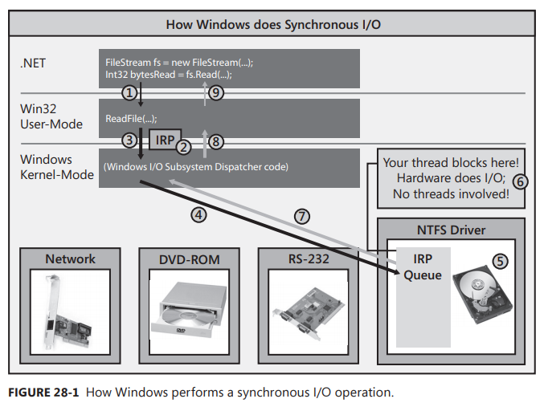
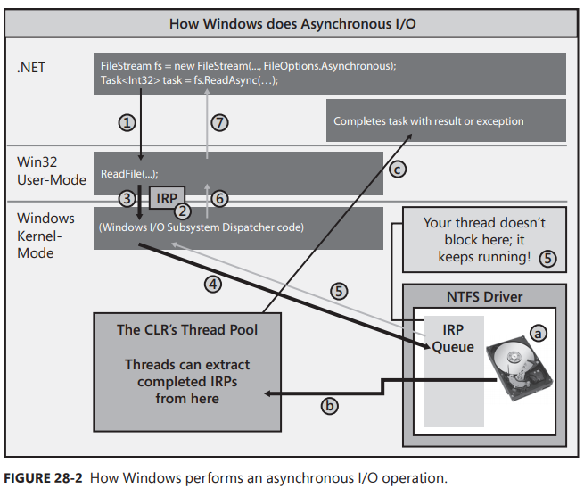

Chapter 28-I/O-Bound Asynchronous Operations
==============================

## How Windows Performs I/O Operations

Let's begin by discussing how Windows performs synchronous I/O operations. Figure 28-1 represents a computer system with several hardware devices connected to it. Each of these hardware devices has its own circuit board, each of which contains a small, special-purpose computer that knows how to control its hardware device. For example, the hard disk drive has a circuit board that knows how to spin up the drive, seek the head to the right track, read or write data from or to the disk, and transfer the data to or from your computer's memory.



In your program, you open a disk file by constructing a `FileStream` object. Then you call the Read method to read data from the file. When you call FileStream's `Read` method, your thread transitions from, managed code to native/user-mode code and Read internally calls the Win32 `ReadFile` function (#1). ReadFile then allocates a small data structure called an I/O Request Packet (IRP) (#2). The IRP structure is initialized to contain the handle to the file, an offset within the file where bytes will start to be read from, the address of a Byte[] that should be filled with the bytes being read, the number of bytes to transfer, and some other less interesting stuff.

ReadFile then calls into the Windows kernel by having your thread transition from native/usermode code to native/kernel-mode code, passing the IRP data structure to the kernel (#3). From the device handle in the IRP, the Windows kernel knows which hardware device the I/O operation is destined for, and Windows delivers the IRP to the appropriate device driver's IRP queue (#4). Each device driver maintains its own IRP queue that contains I/O requests from all processes running on the machine. As IRP packets show up, the device driver passes the IRP information to the circuit board associated with the actual hardware device. The hardware device now performs the requested I/O operation (#5).

But here is the important part: While the hardware device is performing the I/O operation, your thread that issued the I/O request has nothing to do, so Windows puts your thread to sleep so that it is not wasting CPU time (#6). This is great, but although your thread is not wasting time, it is wasting space (memory), as its user-mode stack, kernel-mode stack, thread environment block (TEB), and other data structures are sitting in memory but are not being accessed at all. In addition, for GUI application, the UI can't respond to user input while the thread is blocked. All of this is bad.

Ultimately, the hardware device will complete the I/O operation, and then Windows will wake up your thread, schedule it to a CPU, and let it return from kernel mode to user mode, and then back to managed code (#7, #8, and #9). FileStream's Read method now returns an Int32, indicating the actual number of bytes read from the file so that you know how many bytes you can examine in the Byte[] that you passed to Read.

Let's imagine that you are implementing a web application and as each client request comes in to your server, you need to make a database request. When a client request comes in, a thread pool thread will call into your code. 

If you now issue a database request synchronously, the thread will
block for an indefinite amount of time waiting for the database to respond with the result. If during this time another client request comes in, the thread pool will have to create another thread and again this thread will block when it makes another database request. As more and more client requests come in, more and more threads are created, and all these threads block waiting for the database to respond. The result is that your web server is allocating lots of system resources (threads and their memory) that are barely even used!

And to make matters worse, when the database does reply with the various results, threads become unblocked and they all start executing. But because you might have lots of threads running and relatively few CPU cores, Windows has to perform frequent context switches, which hurts performance even more. This is no way to implement a scalable application.

Now, let's discuss how Windows performs asynchronous I/O operations. In Figure 28-2, I have removed all the hardware devices except the hard disk from the picture, I introduce the CLR's thread pool, and I've modified the code slightly. I still open the disk file by constructing a FileStream object, but now I pass in the FileOptions.Asynchronous flag. This flag tells Windows that I want my read and write operations against the file to be performed asynchronously.



To read data from the file, I now call ReadAsync instead of Read. `ReadAsync` internally allocates a `Task<Int32>` object to represent the pending completion of the tread operation. Then, ReadAsync calls Win32's Read function (#1). ReadFile allocates its IRP, initializes it just like it did in the synchronous scenario (#2), and then passes it down to the Windows kernel (#3). Windows adds the IRP to the hard disk driver's IRP queue (#4), but now, instead of blocking your thread, your thread is allowed to return to your code; your thread immediately returns from its call to ReadAsync (#5, #6, and #7). Now, of course, the IRP has not necessarily been processed yet, so you cannot have code after ReadAsync that attempts to access the bytes in the passed-in Byte[].

Now you might ask, when and how do you process the data that will ultimately be read? Well, when you call ReadAsync, it returns to you a `Task<Int32>` object. Using this object, you can call ContinueWith to register a callback method that should execute when the task completes and then process the data in this callback method. Or, alternatively, you can use C#'s asynchronous function feature to simplify your code by allowing you to write it sequentially (as you would if you were performing synchronous I/O).

When the hardware device completes processing the IRP (a), it will queue the completed IRP into the CLR's thread pool (b). Sometimes in the future, a thread pool thread will extract the completed IRP and execute code that completes the task by setting an exception (if an error occurred) or the result (in this case, an Int32 indicating the number of bytes successfully read). Also note that if you use `ExecuteSynchronously` in with the original task's Continuation, then this thread is the thread that execute the Continuation part. So now the Task object knows when the operation has completed and this, in turn, lets your code run so it can safely access the data inside the Byte[].

Note that ReadAsync return a `Task<Int32>` for a worker thread to process the result later. It is not like the normal Task-based asynchronous operations flow that the calling thread create a Task object whose operation is to call a function asynchronous (e.g. call Win32's Read native function), and then later a worker thread pick up this task and execute it, it is not like this. Here ReadAsync create a `Task<Int32>` object, and then ReadAsync itself calls Win32's Read native function and then return back to the caller thread (because it is async function). When hardware device completes the read operation, it queues the completed IRP into the CLR's thread pool. **The biggest difference between compute-bound async operations and I/O bound async operations is, compute-bound required a dedicated worker thread to do the operation, while I/O bound only needs a worker thread to update the result after the returned task is finished (notified by I/O devices)**.

Internally, the CLR's thread pool uses a Windoes resource called an I/O Completion Port. THe CLR creates an I/O Completion Port when it initailizes and, as you open hardware devices, these devices can be bound to the I/O Completion Port so that devicee drivers know where to queue the completed IRPs.

Then a worker thread to complete this task only by setting result or exception to its result, that's it, this worker thread thread doesn't call any other functions, its job is simply update the task's result and status.

Now that you understand the basics, let's put it all into perspective. Let's say that a client request comes in, and our server makes an asynchronous database request. As a result, our thread won't block, and it will be allowed to the thread pool so that it can handle more incoming client requests. So now we have just one thread handling all incoming client requests. When the database server responds, its response is also queued into the thread pool, so our thread pool thread will just process it at some point and ultimately send the necessary data back to the client. At this point, we have just one thread processing all client requests and all database responses. Our server is using very few system resources and it is still running as fast as it can, especially because there are no context switches!

## C#'s Asynchronous Functions

An concrete example:
```C#
static void Main(string[] args) {
   var myTask = MyMethod();   // note that myTask is the state machine's task (compiler generated)
   Console.WriteLine("Main");
   Console.WriteLine(myTask.Result);
   Console.WriteLine("Main Again");
   Console.ReadLine();
}

// async keyword is needed otherwise the compiler wouldn't know how to turn the method into a state machine. 

static async Task<String> MyMethod() {
   String s1 = await Task<String>.Run(() => {
      Thread.Sleep(1000);
      return "Hello ";
   });

   String s2 = await Task<String>.Run(() => {
      Thread.Sleep(1000);
      return "World!";
   });

   await Task.Run(() => {
      Thread.Sleep(1000);
      s2.Append('!');
   });

   return s1 + s2;
}
```

Performing asynchronous operations is the key to building scalable and responsive applications that allow you to use very few threads to execute lots of operations. And when coupled with the thread pool, asynchronous operations allow you to take advantage of all of the CPUs that are in the machine.
Realizing the enormous potential here, Microsoft designed a programming model that would make it easy for developers to take advantage of this capability.3 This pattern leverages Tasks and a C# language feature called asynchronous functions (or async functions, for short). Here is an example of code that uses an async function to issue two asynchronous I/O operations:

```C#
private static async Task<String> IssueClientRequestAsync(String serverName, String message) {
   using (var pipe = new NamedPipeClientStream(serverName, "PipeName", PipeDirection.InOut, PipeOptions.Asynchronous | PipeOptions.WriteThrough)) {
      pipe.Connect();
      pipe.ReadMode = PipeTransmissionMode.Message;

      // Asynchronously send data to the server
      Byte[] request = Encoding.UTF8.GetBytes(message);
      await pipe.WriteAsync(request, 0, request.Length);
      // Asynchronously read the server's response
      Byte[] response = new Byte[1000];
      Int32 bytesRead = await pipe.ReadAsync(response, 0, response.Length);
      return Encoding.UTF8.GetString(response, 0, bytesRead);
   }
}
```
In the preceding code, you can tell that IssueClientRequestAsync is an async function, because I specified async on the first line just after static. When you mark a method as async, the compiler basically transforms your method's code into a type that implements a state machine. This allows a thread to execute some code in the state machine and then return without having the method esecute all the way to completion. So, when a thread calls IssueClientRequestAsync, the thread constructs a NamedPipeClientStream, calls Connect, sets its ReadMode property, converts the passed-in message to a Byte[] and then calls WriteAsync. WriteAsync internally allocates a Task object and returns it back to IssueClientRequestAsync. At this point, the C# await operator effectively calls ContinueWith on the Task object passing in the method that resumes the state machine and then, the thread returns from IssueClientRequestAsync.

Sometimes in th future, the network device driver will complete writing the data to the pipe and then, a thread pool thread will notify the Task object, which will then activate the ContinueWith callback method, causing a thread (the same worker thread as the state machine uses `TaskContinuationOptions.ExecuteSynchronously` for default). More specifically, a thread will re-enter the IssueClientRequestAsync method but at the point of the await operator.

Because async functions return before their state machine has executed all the way to completion, the method calling IssueClientRequestAsync will continue its execution right after IssueClientRequestAsync executes its first await operator. But, how can the caller know when IssueClientRequestAsync has completed executing its state machine in its entirety? Well, when you mark a method as async, the compiler automatically generates code that creates a Task object when
the state machine begins its execution; this Task object is completed automatically when the state machine runs to completion. You’ll notice that the IssueClientRequestAsync method's return type is a `Task<String>`. It actually returns the `Task<String>` object that the compiler-generated code creates (not the async methods after await) back to its caller, and the Task's Result property is of type String in this case. Near the bottom of IssueClientRequestAsync, I return a string. This causes the compiler-generated code to complete the `Task<String>` object it created and set its Result property to the returned string.

Let's also have a look at how await behaves in compute-bound asyn operation:
```C#
static async Task<String> Test() {
   ... // <------ main thread executes
   string s = await Task<String>.Run(() => {
      Thread.Sleep(2000);  // <-----a worker thread executes
      return "Hello";
   });
   return s;   // <----- the same worker thread executes
}
```
Since state machine uses `TaskContinuationOptions.ExecuteSynchronously` for default as discussed before, so  `return s;` is executed by the same worker thread that executes the task. You can think any code after `await` is chained as ContinueWith of the task.

## How the Compiler Transforms an Async Function into a State Machine

When working with async functions, you will be more productive with them if you have an understanding and appreciation for the code transform that the compiler is doing for you, let's look at an example:
```C#
//-------------------------------------------------------------V
private static async Task<String> MyMethodAsync(Int32 argument) {
   Int32 local = argument;
   try {
      Type1 result1 = await Method1Async();
      for (Int32 x = 0; x < 3; x++) {
         Type2 result2 = await Method2Async();
      }
   }
   catch (Exception) {
      Console.WriteLine("Catch");
   }
   finally {
      Console.WriteLine("Finally");
   }
   return "Done";
}
//-------------------------------------------------------------Ʌ

internal sealed class Type1 { }
internal sealed class Type2 { }

private static async Task<Type1> Method1Async() {
 /* Does some async thing that returns a Type1 object */
}
private static async Task<Type2> Method2Async() {
 /* Does some async thing that returns a Type2 object */
}
```
I took the preceding code, compiled it, and then reverse engineered the IL code back into C# source code. I then simplified the code and added a lot of comments to it so you can understand what the compiler is doing to make async functions work. The following is the essence of the code created by the compiler's transformation:
```C#
// AsyncStateMachine attribute indicates an async method (good for tools using reflection);
// the type indicates which structure implements the state machine
[DebuggerStepThrough, AsyncStateMachine(typeof(StateMachine))]
private static Task<String> MyMethodAsync(Int32 argument)
{
   // Create state machine instance & initialize it
   StateMachine stateMachine = new StateMachine()
   {
      // Create builder returning Task<String> from this stub method
      // State machine accesses builder to set Task completion/exception
      m_builder = AsyncTaskMethodBuilder<String>.Create(),
      m_state = -1, // Initialize state machine location
      m_argument = argument // Copy arguments to state machine fields
   }

   // Start executing the state machine
   stateMachine.m_builder.Start(ref stateMachine);   // internally call MoveNext to start up

   // Note that the below code returns state machine's task, not the task return from executing Method1Async or Method2Async as you might expect normally
   // in other common async function , this is important as the state machine will update this "new" task, when everything finishes asynchronously,  
   // m_builder.SetResult get called, which notify the caller this task is completed.                              
   return stateMachine.m_builder.Task;
}

// This is the state machine structure
[CompilerGenerated, StructLayout(LayoutKind.Auto)]
private struct StateMachine : IAsyncStateMachine
{
   // Fields for state machine's builder (Task) & its location
   public AsyncTaskMethodBuilder<String> m_builder;
   public Int32 m_state;  // is -1 in the beginning

   // Argument and local variables are fields now:
   public Int32 m_argument, m_local, m_x;
   public Type1 m_resultType1;
   public Type2 m_resultType2;

   // There is 1 field per awaiter type.
   // Only 1 of these fields is important at any time.
   private TaskAwaiter<Type1> m_awaiterType1;
   private TaskAwaiter<Type2> m_awaiterType2;

   // This is the state machine method itself
   void IAsyncStateMachine.MoveNext()
   {
      String result = null; // Task's result value

      // Compiler-inserted try block ensures the state machine's task completes 
      try
      {
         Boolean executeFinally = true; // Assume we're logically leaving the 'try' block
         if (m_state == -1)             // If 1st time in state machine method,
            m_local = m_argument;       // execute start of original method

         // Try block that we had in our original code
         try
         {
            TaskAwaiter<Type1> awaiterType1;
            TaskAwaiter<Type2> awaiterType2;

            switch (m_state)
            {
               case -1: // Start execution of code in 'try'
                        // Call Method1Async and get its awaiter
                  awaiterType1 = Method1Async().GetAwaiter();  // <--------------------------------- now you see using `await` transforms `await XXX()` to `XXX().GetAwaiter()`
                  if (!awaiterType1.IsCompleted)
                  {
                     m_state = 0;   // 'Method1Async' is completing asynchronously
                     m_awaiterType1 = awaiterType1; // Save the awaiter for when we come back

                     // Tell awaiter to call MoveNext when operation completes
                     m_builder.AwaitUnsafeOnCompleted(ref awaiterType1, ref this);
                     // The line above invokes awaiterType1's OnCompleted which approximately
                     // calls ContinueWith(t => MoveNext()) on the Task being awaited.
                     // When the Task completes, the ContinueWith task calls MoveNext

                     executeFinally = false; // We're not logically leaving the 'try' block
                     return;   // <------------------------Thread returns to caller MyMethodAsync, then caller execute `return stateMachine.m_builder.Task;`, this is important
                  }
                  // 'Method1Async' completed synchronously
                  break;

               case 0: // 'Method1Async' completed asynchronously
                  awaiterType1 = m_awaiterType1; // Restore most-recent awaiter
                  break;

               case 1: // 'Method2Async' completed asynchronously
                  awaiterType2 = m_awaiterType2; // Restore most-recent awaiter
                  goto ForLoopEpilog;
            }

            // After the first await, we capture the result & start the 'for' loop
            m_resultType1 = awaiterType1.GetResult(); // Get awaiter's result

         ForLoopPrologue:
            m_x = 0;          // 'for' loop initialization
            goto ForLoopBody; // Skip to 'for' loop body

         ForLoopEpilog:
            m_resultType2 = awaiterType2.GetResult();
            m_x++;   // Increment x after each loop iteration
                     // Fall into the 'for' loop’s body

         ForLoopBody:
            if (m_x < 3)
            {   // 'for' loop test
                // Call Method2Async and get its awaiter
               awaiterType2 = Method2Async().GetAwaiter();
               if (!awaiterType2.IsCompleted)
               {
                  m_state = 1; // 'Method2Async' is completing asynchronously
                  m_awaiterType2 = awaiterType2; // Save the awaiter for when we come back

                  // Tell awaiter to call MoveNext when operation completes 
                  m_builder.AwaitUnsafeOnCompleted(ref awaiterType2, ref this);
                  executeFinally = false;   // We're not logically leaving the 'try' block
                  return;                   // Thread returns to caller
               }
               // 'Method2Async' completed synchronously
               goto ForLoopEpilog; // Completed synchronously, loop around
            }
         }
         catch (Exception)
         {
            Console.WriteLine("Catch");
         }

         finally
         {
            // Whenever a thread physically leaves a 'try', the 'finally' executes
            // We only want to execute this code when the thread logically leaves the 'try'
            if (executeFinally)
            {
               Console.WriteLine("Finally");
            }
         }
         result = "Done"; // note that original code is `return "Done";`, but in here,  "return" is stripped/removed, because we want m_builder.SetResult to be called eventually
      }                   // this is important because your async code could have synchronous paths which return a value immediately, check `ValueTask` for details
      catch (Exception exception)
      {
         // Unhandled exception: complete state machine's Task with exception
         m_builder.SetException(exception);
         return;
      }
      // No exception: complete state machine's Task with result
      m_builder.SetResult(result);  // <------set the status of stateMachine.m_builder.Task to RanToCompletion so the caller of MyMethodAsync knows the task it gets is completed
   }
}

// You can see TaskAwaiter is a wrapper of Task, just like Enumerator
public struct TaskAwaiter<TResult> : ICriticalNotifyCompletion, INotifyCompletion {
   private readonly Task<TResult> m_task;

   internal TaskAwaiter(Task<TResult> task) {
       m_task = task;
   }
   public bool IsCompleted { 
      get { return m_task.IsCompleted; }
   }
   public TResult GetResult();
   public void OnCompleted(Action continuation) {
       TaskAwaiter.OnCompletedInternal(m_task, continuation, continueOnCapturedContext:true, flowExecutionContext:true);
   }
   public void UnsafeOnCompleted(Action continuation);
}
```
If you spend the time to walk through the preceding code and read all the comments, I think you'll be able to fully digest what the compiler does for you. However, there is a piece of glue that attaches the object being awaited to the state machine and I think it would be helpful if I explained how this
piece of glue worked. **Whenever you use the await operator in your code, the compiler takes the specified operand and attempts to call a GetAwaiter method on it**. This method can be either an instance method or an extension method. The object returned from calling the GetAwaiter method is referred to as an awaiter. An awaiter is the glue I was referring to.

After the state machine obtains an awaiter, it queries its IsCompleted property. If the operation completed synchronously, true is returned and, as an optimization, the state machine simply continues executing. At this point, **it calls the awaiter's GetResult method, which either throws an exception if the operation failed or returns the result if the operation was successful**. The state machine continues running from here to process the result.

If the operation completes asynchronously, IsCompleted returns false. In this case, **the state machine calls the awaiter's OnCompleted method passing it a delegate to the state machine's MoveNext method**. And now, the state machine allows its thread to return back to where it came from so that it can execute other code. In the future, the awaiter, which wraps the underlying Task, knows when it completes and invokes the delegate causing MoveNext to execute. The fields within the state machine are used to figure out how to get to the right point in the code, giving the illusion that the method is continuing from where it left off. At this point, the code calls the awaiter’s GetResult method and execution continues running from here to process the result.

Let's look at a sightly more complicated example:
```C#
static void Main(string[] args) {
   Console.WriteLine("Checking status every 2 seconds");
   Status();
   Console.WriteLine("After status");   // <------ will execute
   Console.ReadLine(); // Prevent the process from terminating
}

private static async void Status() {
   while (true) {
      Console.WriteLine("Checking status at {0}", DateTime.Now);      
      await Task.Delay(2000);                              
   }
   Console.WriteLine("Status end");   // <------- won't execute
}
```
You might think `await` causes the state machine to stay in the infinite while loop. so the control doesn't return after `Status();` therefore "After status" won't be displayed by the console. This is wrong, control does return to Main, and "After status" does display.

This is because the when compiler generates state machine, it uses "return" to make the call returns to caller, now you see why "After status" displays.

####  Advance Topic

How can we make sure an async method runs asynchronously? For examole, nothing stops you doing:
```C#
public async Task Method1Async() {
   await Method2Async();
}

public async Task Method2Async() {

   for (int i = 0; i < 1000; i++) {   // <-------------- current thread will still be blocked
      // do sth time consuming
   }

   await XXXAsync();
}
```
To solve this potential problem, we use `Yield()`:

```C#
public async Task Method1Async() {
   await Task.Yield();   // <---------------this make sure Method2Async will be run asynchronously
   await Method2Async();
}
```
```C#
public class Task : IAsyncResult, IDisposable {
   // ...
   public static YieldAwaitable Yield() {
      return default;
   }
}

public readonly struct YieldAwaitable {

   public YieldAwaiter GetAwaiter() { return default; }

   public readonly struct YieldAwaiter : ICriticalNotifyCompletion, IStateMachineBoxAwareAwaiter {
      public bool IsCompleted => false;  // <-------------------------this is important, it should always return false 
      // ...
   }
}
```

## Async Function Extensibility

-To work in the future, not very practical, but it shows why `TaskAwaiter` is needed in the `EventAwaiter` example, especially `public EventAwaiter<TEventArgs> GetAwaiter() { return this; }`

## Async Functions and Event Handlers

Async functions usually have a return type of either `Task` or `Task<TResult>` to represent the completion of the function's state machine. However, it is also possible to define an async function with a void return type. This is a special case that the C# compiler allows to simplify the very common scenario where you want to implement an asynchronous event handler. Almost all event handler methods adhere to a method signature similar to this:
```C#
void EventHandlerCallback(Object sender, EventArgs e);
```
But, it is common to want to perform I/O operations inside an event handler, for example, when a user clicks a UI element to open a file and read from it. To keep the UI responsive, this I/O should be done asynchronously. Allowing you to write this code in an event handler mehtod that has a void return type requires that the C# compiler allows async functions to have a void return type so you can use the await operator to perform non-blocking I/O operations. When an async function has a void return type, the compiler still generates code to create the state machine but it does not create a Task object because there is no way that one could be used. Because of this, there is no way to know when the state machine of a void-returning async function has run to completion. For this reason, if you try to mark your program's entry point method (Main) as async, the C# compiler issues the following error: an entry point cannot be marked with the 'async' modifier. If you put any await operators in your Main method, then your process’s primary thread would return from Main as soon as the first await operator executes. But because code that calls Main can’t get a Task to monitor it and wait for it to complete, the process would just terminate (because you’re returning from Main), and the rest of the code in Main would never execute at all. Fortunately, the C# compiler considers this an error to prevent this from happening.

## Async Functions and Exception Handling

When a Windows device driver is processing an asynchronous I/O request, it is possible for something to go wrong, and Windows will need to inform your application of this. For example, while sending bytes or waiting for bytes to come in over the network, a timeout could expire. If the data does not come in time, the device driver will want to tell you that the asynchronous operation completed with an error. To accomplish this, the device driver posts the completed IRP to the CLR's thread pool and a thread pool thread will complete the Task object with an exception. When your state machine method is resumed, the await operator sees that the operation failed and throws this exception.

In Chapter 27, I discussed how Task objects normally throw an AggregateException, and then you'd query this exception’s InnerExceptions property to see the real exception(s) that occurred. **However, when using await with a Task, the first inner exception is thrown instead of an AggregateException. (For the curious, it is TaskAwaiter's GetResult method that throws the first inner exception instead of throwing an AggregateException.)** This was done to give you the programming experience you expect. Also, without this, you'd have to catch AggregateException throughout your code, check the inner exception and either handle the exception or re-throw it. This would be very cumbersome. Check the example below:

```C#
static void Main(string[] args) {
   try {
      var a = MyMethodAsync();
      a.Wait();
   }
   catch (AggregateException ag) {
      Console.WriteLine("Catch AggregateException"); // <2>------this execute if you do <1>
   }

   Console.ReadLine();
}

static async Task<String> MyMethodAsync() {    
   try {
      String s = await TestThrowException();          
   }
   catch (DivideByZeroException e) {  // <1>------if you choose to catch a different (doesn't happen) exception e.g ArgumentOutOfRangeException
      Console.WriteLine("Catch first inner");
   }    
   return "Done";
}

static Task<String> TestThrowException() {
   return Task.Run(() => {
      throw new DivideByZeroException();
      return "placeholder";   // return statement is needed for the compilier to work correctly
   });
}
/* current output is:
"Catch first inner"
*/

/* output will be: (if you don't catch the first inner exception (<1>))
 "Catch AggregateException" 
*/
```
The book says "If your state machine method experiences an unhandled exception ... However, it is also possible for an async function to
have a void return type. In this case, there is no way for a caller to discover the unhandled exception. So, when a void-returning async function throws an unhandled exception, the compiler-generated code catches it and causes it to be rethrown using the caller's synchronization context.
I think it mean this situation:
```C#
static void Main(string[] args) {
   try {
      var a = MyMethodAsync();
      a.Wait();  // calling Wait throw an AggregateException 
   }
   catch (Exception e) {
      Console.WriteLine("Catch");
   }

   Console.ReadLine();
}

static async Task<String> MyMethodAsync() {    
   String s = await TestThrowException();    
   return s;
}

static Task<String> TestThrowException() {
   return Task.Run(() => {
      throw new DivideByZeroException();
      return "placeholder";   // return statement is needed for the compilier to work correctly
   });
}
```
The exception (DivideByZeroException as AggregateException) can be caught, but if you do
```C#
static void Main(string[] args) {
   try {
      MyMethodAsync(); // Since the method return void instead of a Task, even though you can't call Wait() like previous example, 
                       // it will throw an exception to terminate the process
   }
   catch (Exception e) {   // the exception won't get caught, code won't enter here
      Console.WriteLine("Catch AggregateException");  
   }
   Console.ReadLine();
}

static async void MyMethodAsync() {
   await TestThrowException();
}

static Task<String> TestThrowException() {
   return Task.Run(() => {
      throw new DivideByZeroException();
      return "placeholder";   
}
```
Note that `DivideByZeroException` won't be caught in `catch (Exception e) { ...}`, becuase with async void methods, there is no Task object, so any exceptions thrown out of an async void method will be raised directly on the `SynchronizationContext` that was active when the async void method started.

<div class="alert alert-info p-1" role="alert">
    From all these example, you can see that the functions right after await are not necessary to be async functions, they can be normal functions return task. 
</div>

## Other Async Function Features

You might have an async function that performs an intensive amount of processing before initiating an asynchronous operation. If you invoke the function via your app's GUI thread, you user interface will become non-responsive to the user. And, if the asynchronous operation completes synchrously, then your user-interface willbe non-responsive even longer. So, if you want to initiate an async fucntion from a thread other than the thread that calls it, you can use Task's static Run method as follows:
```C#
// Task.Run is called on the GUI thread
Task.Run(async () => {
   // This code runs on a thread pool thread
   // TODO: Do intensive compute-bound processing here...

   await XxxAsync(); // Initiate asynchronous operation
   // Do more processing here...
});
```
Note that you can't just put an await operator inside the body of a regular lambda expression, because the compiler wouldn't know how to turn the method into a state machine. But placing async just before the lambda expression causes the compiler to turn the lambda expression into a state machine method.

When writing code, it is very easy to invoke an async function, forgetting to use the await operator; the following code demonstrates:
```C#
static async Task OuterAsyncFunction() {
   InnerAsyncFunction();   // Oops, forgot to put the await operator on this line!

   // Code here continues to execute while InnerAsyncFunction also continues to execute...
}

static async Task InnerAsyncFunction() { /* Code in here not important */ }
```
Fortunately, when you do this, the C# compiler issues the following warning: "Because this call is not awaited, execution of the current method continues before the call is completed. Consider applying the 'await' operator to the result of the call". This is nice but on rare occasions, you actually don't care when InnerAsyncFunction completes, and you do want to write the preceding code and not have the compiler issue a warning.

To quiet the compiler warning, you can simply assign the Task returned from InnerAsyncFunction to a variable and then ignore the variable:
```C#
static async Task OuterAsyncFunction() {
   var noWarning = InnerAsyncFunction();   // I intend not to put the await operator on this line.
   
   // Code here continues to execute while InnerAsyncFunction also continues to execute...
}
```

## Applications and Their Threading Models

The .NET Framework supports several different kinds of application models, and each application model can impose its own threading model. Console applications and Windows Services (which are really console applications; you just don't see the console) do not impose any kind of threading model; that is, any thread can do whatever it wants when it wants.

However, GUI applications, including Windows Forms, Windows Presentation Foundation (WPF), Silverlight, and Windows Store apps impose a threading model where the thread that created a UI element is the only thread allowed to update that UI element. It is common for the GUI thread to spawn off an asynchronous operation so that the GUI thread doesn’t block and stop responding to user input like mouse, keystroke, pen, and touch events. However, when the asynchronous operation completes, a thread pool thread completes the Task object resuming the state machine.

For some application models, this is OK and even desired because it's efficient. But for some other application models, like GUI applications, this is a problem, because your code will throw an exception if it tries to update UI elements via a thread pool thread. Somehow, the thread pool thread must have the GUI thread update the UI elements.

You might ask: **why it needs to be UI thread to update UI elements**, this is because Win32 API are old and not thread-safe.

ASP.NET applications allow any thread to do whatever it wants. When a thread pool thread starts to process a client's request, it can assume the client's culture, allowing the web server to return culture-specific fomatting for numbers, dates, and times. In addition, the web server can assume the client's identity (`System.Security.Principal.IPrincipal`), so that the server can access only the resources that the client is allowed to access. When a thread pool thread spawns an asynchronous operation, it may be completed by another thread pool thread, which will be processing the result of an asynchronous operation. While this work is being performed on behalf of the original client request, the culture and identity needs to "flow" to the new thread pool thread so any additional work done on behalf of the client is performed using the client's culture and identity information.

Fortunately, the FCL defines a base class, called `System.Threading.SynchronizationContext`, which solves all these problems. Simply stated, a SynchronizationContext-derived object connects an application model to its threading model. The FCL defines several classes derived from SynchronizationContext, but usually you will not deal directly with these classes; in fact, many of them are not publicly exposed or documented. 

For the most part, application developers do not need to know anything about the SynchronizationContext class. When you await a Task, the calling thread's SynchronizationContext object is obtained. When a thread pool thread completes the Task, the SynchronizationContext object is used, ensuring the right theading model for your application model. So, **when a GUI thread awaits a Task, the code following the await operator is guaranteed to execute on the GUI thread as well, allowing that code to update UI elements. For an ASP.NET application, the code following the await operator is guaranteed to execute on a thread pool thread that has the client's culture and principal information associated with it**. read https://devblogs.microsoft.com/dotnet/configureawait-faq/

```C#
public sealed class Thread 
{
   internal SynchronizationContext _synchronizationContext; 
   // ...
}

public partial class SynchronizationContext
{
   public static SynchronizationContext Current => Thread.CurrentThread._synchronizationContext;  // <-------------------------------
   public static void SetSynchronizationContext(SynchronizationContext? syncContext) => Thread.CurrentThread._synchronizationContext = syncContext;

   public virtual void Send(SendOrPostCallback d, object? state) => d(state);
   public virtual void Post(SendOrPostCallback d, object? state) => ThreadPool.QueueUserWorkItem(static s => s.d(s.state), (d, state), preferLocal: false);
   // ...
}

// an example that uses SynchronizationContext
// assuming below is running on UI thread
SynchronizationContext originalContext = SynchronizationContext.Current;  // associate originalContext with UI thread

ThreadPool.QueueUserWorkItem(delegate {
    string text = File.ReadAllText(@"c:\temp\log.txt");
    originalContext.Post(delegate {    // in worker thread, ask UI thread (via UI thread's SynchronizationContext) to update UI element
        myTextBox.Text = text;
    }, null);
});
```


Most of the time, having a state machine resume using the application model's threading model is phenomenally useful and convenient. But, on some occasions, this can get you into trouble. Here is an example that causes a WPF application to deadlock:
```C#
private sealed class MyWpfWindow : Window 
{
   public MyWpfWindow() { Title = "WPF Window"; }

   protected override void OnActivated(EventArgs e) {
      // Querying the Result property prevents the GUI thread from returning;
      // the thread blocks waiting for the result
      String http = GetHttp().Result; // <------------------------get the string synchronously, this causes deadlock because of ".Result"

      base.OnActivated(e);
   }

   private async Task<String> GetHttp() {
      // Issue the HTTP request and let the thread return from GetHttp
      HttpResponseMessage msg = await new HttpClient().GetAsync("http://Wintellect.com/");
      // We never get here: The GUI thread is waiting for this method to finish but this method
      // can't finish because the GUI thread is waiting for it to finish --> DEADLOCK!
      
      return await msg.Content.ReadAsStringAsync();
   }
}
```

note that when an async method performs an await, by default it will capture a current context and use that to resume the async method, so it is like:

```C#
await SomethingAsync();
RestOfMethod();

// translated into
var task = SomethingAsync();
var currentSyncContext = SynchronizationContext.Current;

task.ContinueWith(delegate
{
    if (currentSyncContext == null) RestOfMethod();
    else currentSyncContext.Post(delegate { RestOfMethod(); }, null);

}, TaskScheduler.Current);
```

so, to solve this problem, both the `Task` and `Task<TResult>` classes offer a method called `ConfigureAwait` whose signature looks like this:

```C#
// Task defines this method:
public ConfiguredTaskAwaitable ConfigureAwait(Boolean continueOnCapturedContext);

// Task<TResult> defines this method:
public ConfiguredTaskAwaitable<TResult> ConfigureAwait(Boolean continueOnCapturedContext);
```

Passing true to this method gives you the same behavior as not calling the method at all. But, if you pass false, the `await` operator does not query the calling thread's SynchronizationContext object and, when a thread pool thread completes the Task, it simply completes it and the code after the await operator executes via the thread pool thread.

```C#
private async Task<String> GetHttp() {
   // Issue the HTTP request and let the thread return from GetHttp
   HttpResponseMessage msg = await new HttpClient().GetAsync("http://Wintellect.com/").ConfigureAwait(false);
   // We DO get here now because a thread pool can execute this code
   // as opposed to forcing the GUI thread to execute it. 

   return await msg.Content.ReadAsStringAsync().ConfigureAwait(false);
}
```

Note that this example works because the UI thread in MyWpfWindow program is not updating UI elements. If it is, then you cannot use `ConfigureAwait(false)`, and you need to change `GetHttp().Result` to `GetHttp()`, but this still doesn't make sense, because eventually you do want to assess the result, so a real fix is: you shouldn't use UI thread to query sth asynchronously, only uses UI thread to update UI elements.


As the preceding code shows, ConfigureAwait(false) must be applied to every Task object you await. You can't just add it on the first await operator, this is because asynchronous operations may complete synchronously and, when this happens, the calling thread simply continues executing without returning to its caller; you never know which operation requres ignoring the SynchronizationContext object, so you have to tell all of them to ignore it. 

Alternatively, I could re-write my GetHttp method as follows so that the whole thing executes via a thread pool thread

```C#
private Task<String> GetHttp() {
   return Task.Run(async () => {
      // We run on a thread pool thread now that has no SynchronizationContext on it, ConfigureAwait is not needed
      HttpResponseMessage msg = await new HttpClient().GetAsync("http://Wintellect.com/");
      // We DO get here because some thread pool can execute this code
      return await msg.Content.ReadAsStringAsync();   // ConfigureAwait is not needed
   });
}
```

So in a nutshell, the purpose of using `ConfigureAwait(false)` is to handle the situation that application developers do sth like `var result = DoSthAsync().Result`. As a more advanced library devlopers, we should babysitting the deadlock situation.

## Canceling I/O Operations

In general, Windows doesn't give you a way to cancel an outstanding I/O operation. This is a feature that many developers would like, but it is actually quite hard to implement. After all, if you make a request from a server and then you decide you don’t want the response anymore, there is no way to tell the server to abandon your original request. The way to deal with this is just to let the bytes come back to the client machine and then throw them away. In addition, there is a race condition here—your request to cancel the request could come just as the server is sending the response. Now what should your application do? You'd need to handle this potential race condition occurring in your own code and decide whether to throw the data away or act on it. To assist with this, I recommend you implement a WithCancellation extension method that extends `Task<TResult>` (you need a similar overload that extends Task too) as follows
```C#
public static async Task Go() {
   // Create a CancellationTokenSource that cancels itself after # milliseconds
   var cts = new CancellationTokenSource(5000); // To cancel sooner, call cts.Cancel()
   var ct = cts.Token;

   try {
      // I used Task.Delay for testing; replace this with another method that returns a Task
      await Task.Delay(10000).WithCancellation(ct);
      Console.WriteLine("Task completed");
   }
   catch (OperationCanceledException) {
      Console.WriteLine("Task cancelled");
   }
}

public static class WithCancellationExtension
{
   public static async Task WithCancellation(this Task task, CancellationToken ct) {
      var tcs = new TaskCompletionSource<Void>();
      using (ct.Register(t => ((TaskCompletionSource<Void>)t).TrySetResult(default(Void)), tcs)) {
         if (await Task.WhenAny(task, tcs.Task) == tcs.Task) {
            ct.ThrowIfCancellationRequested();
         }
      }
      // If failure, ensures 1st inner exception gets thrown
      await task;  // <------------------- this line is important
   }
}

private struct Void { }   // Because there isn't a non-generic TaskCompletionSource class.
```
Note that if you don't have `await task;` in the extension method and do like this:
```C#
static async void Go() {
   var cts = new CancellationTokenSource(3000); // To cancel sooner, call cts.Cancel()
   var ct = cts.Token;
   try {
      // var task = Task.Delay(3000).WithCancellation(ct);
      await Task.Run(() => {
         throw new DivideByZeroException();
      }).WithCancellation(ct);
      Console.WriteLine("Task completed");
   }
   catch (Exception e) {   // it won't catch DivideByZeroException 
      Console.WriteLine("Task cancelled");  
   }
}
```
You'll see the program runs normally without throwing DivideByZeroException, which you probaby don't see why it behave like this, you already use await (`await Task.Run(...).WithCancellation(ct);`), then why it doesn't throw DivideByZeroException? This is becaue of the nature of state machine, the returned task is generated by the compiler and this task is not the same task as that task who throws DivideByZeroException. Without `await task;` in the extension method, the state machine related task's status will be RanToCompletion, not Faulted. Even you use await, it is not going to change anything. But if you have `await task;` as the last code in the extension method, it will throw DivideByZeroException can get caught by compiler-generated state machine's own try catch exceptions, check the code you will see how state machine add this exception into the new compiler generated task as its inner exception, now the code can catch DivideByZeroException.

-----------------------------------------------------------------------------------------------

## `TaskCompletionSource`

see https://gigi.nullneuron.net/gigilabs/taskcompletionsource-by-example/

## `ValueTask`

```C#
public readonly struct ValueTask : IEquatable<ValueTask> 
{
   // ...
}

public readonly struct ValueTask<TResult> : IEquatable<ValueTask<TResult>> 
{
   public ValueTask(Task<TResult> task);
   public ValueTask(TResult result);
   public ValueTask(IValueTaskSource<TResult> source, short token);

   public bool IsCompletedSuccessfully { get; }
   public bool IsCompleted { get; }
   public bool IsCanceled { get; }
   public bool IsFaulted { get; }
   public TResult Result { get; }

   public Task<TResult> AsTask();
   public ConfiguredValueTaskAwaitable<TResult> ConfigureAwait(bool continueOnCapturedContext);
   public ValueTaskAwaiter<TResult> GetAwaiter();
   // ...
}
```

Let's see why sometimes we need to use ValueTask. Below is a method that does an asynchronous job just for one time or 1% and in 99% does a synchronous job:

```C#
private static string _myInformation;

// bad
public async Task<string> GetInformation()
{
    if (_myInformation is null)   // reads a value from a file on a disc asynchronously, call it again it will return the same value
    {
       _myInformation = await _myFileService.ReadInformation();  // return ValueTask<TResult> instance that wraps the Task instance
    }

    return _myInformation;
}

// good
public async ValueTask<string> GetInformation()
{
    if (_myInformation is null)
    {
       _myInformation = await _myFileService.ReadInformation();
    }

    return _myInformation;  // return ValueTask<TResult> instance that wraps the string value directly
}
```

The problem of the first bad method is, at most of times, we are paying the allocation cost of adding a new Task in the heap even though we weren't using the state machine to wait for async completions.

`ValueTask` is better in this case because it is a struct, so it won't be allocated on the heap in the cases that there is an immediate value. It's really important to note that when there is any asynchronous work, then it will be allocated on the heap since it would be **converted to a Task** (compiler does the job behind the scene)

With `ValueTask`(introduced in .NET Core 2.0) in hand, we can use new Async Enumerables interface from .NET Core 3.0

```C#
public interface IAsyncEnumerable<T>
{
   IAsyncEnumerator<T> GetAsyncEnumerator(CancellationToken cancellationToken = default);
}

public interface IAsyncEnumerator<out T> : IAsyncDisposable
{
   ValueTask<bool> MoveNextAsync();
   T Current { get; }
}

public interface IAsyncDisposable
{
   ValueTask DisposeAsync();
}
```

Let's first understand when we need to use `IAsyncEnumerable<T>`:

With IOT (smart watch, smart house device etc) becoming bigger and bigger, it makes sense to PAYG (Process As You Go), below is the traditional approach:

```C#
// problematic traditional non-async enumerable approach
static async Task Main(string[] args)
{
    foreach(var dataPoint in await FetchIOTData())
    {
        Console.WriteLine(dataPoint);
    }
    Console.ReadLine();
}

static async Task<IEnumerable<int>> FetchIOTData()
{
    List<int> dataPoints = new List<int>();
    for (int i = 1; i <= 10; i++)
    {
        await Task.Delay(1000);  //Simulate waiting for data to come through. 
        dataPoints.Add(i);
    }
    return dataPoints;
}
```

We have to wait for 10 secs to process the all dataPoints. Even it's not going to be thread blocking and it's still async, but we don't get the data as soon as we receive it. This is where `IAsyncEnumerable` comes in:

```C#
// IAsyncEnumerable approach

static async Task Main(string[] args)
{
    await foreach(var dataPoint in FetchIOTData())   // <--------- we await our foreach loop itself rather than awaiting the FetchIOTData method 
    {                                                // and you cannot do `await FetchIOTData()` because IAsyncEnumerable<T> doesn't have GetAwaiter method
        Console.WriteLine(dataPoint);
    }

    Console.ReadLine();
}

static async IAsyncEnumerable<int> FetchIOTData()
{
    for (int i = 1; i <= 10; i++)
    {
        await Task.Delay(1000);  //Simulate waiting for data to come through. 
        yield return i;
    }
}
```

compiler transforms the `await foreach()` call into:

```C#
IAsyncEnumerator<int> e = FetchIOTData().GetAsyncEnumerator();

try
{
   while (await e.MoveNextAsync()) {
      Console.Write(e.Current + " ");   // <------------ Console.Write method is quite fast, if we do heavy process (takes more than 1 sec) this dataPoint instead of Console.Write
   }                                    // because of `ValueTask<bool> MoveNextAsync()`, when we start to prcoess the next dataPoint which already be ready, then there is 
}                                       // no Task instance allocated on heap, now you see why IAsyncEnumerable uses ValueTask<bool> rathern than Task<bool> for MoveNextAsync()
finally 
{ 
   if (e != null) await e.DisposeAsync(); 
}
```


## `IHostedService`

The basic idea is that it allows us to register background tasks, that run while our web host is running. These are co-ordinated with the lifetime of the application. 

```C#
public interface IHostedService
{  
    Task StartAsync(CancellationToken cancellationToken);  // triggered when the application host is ready to start the service

    Task StopAsync(CancellationToken cancellationToken);   // triggered when the application host is performing a graceful shutdown
}
```

An example that run a service in every specific time manner:

```C#
public abstract class TimedHostedService : IHostedService, IDisposable {
   private Timer timer;
   private Task executingTask;
   private readonly CancellationTokenSource stoppingCts = new CancellationTokenSource();

   IServiceProvider _services;
   public TimedHostedService(IServiceProvider services) {
      _services = services;
   }

   public async Task StartAsync(CancellationToken cancellationToken) {
      Console.WriteLine($"Starting {this.GetType().FullName} hosted service");
      using (var scope = _services.CreateScope()) {
         await InitialisationAsync(scope, cancellationToken);
         if (cancellationToken.IsCancellationRequested) {
            stoppingCts.Cancel();
         }

         if (!cancellationToken.IsCancellationRequested) {
            timer = new Timer(ExecuteTask, null, FirstRunAfter, TimeSpan.FromMilliseconds(-1));
         } else {
            Console.WriteLine($"{this.GetType().FullName} Hosted Service was not started.");
         }
      }
   }

   protected virtual Task InitialisationAsync(IServiceScope scope, CancellationToken cancellationToken) {
      return Task.CompletedTask;
   }

   private void ExecuteTask(object state) {
      if (!stoppingCts.IsCancellationRequested) {
         timer?.Change(Timeout.Infinite, 0);
         executingTask = ExecuteTaskAsync(stoppingCts.Token);
      }
   }

   private async Task ExecuteTaskAsync(CancellationToken stoppingToken) {
      try {
         using (var scope = _services.CreateScope()) {
            await RunJobAsync(scope.ServiceProvider, stoppingToken);
         }
      }
      catch (Exception exception) {
         Console.WriteLine("BackgroundTask Failed", exception);
      }

      if (!stoppingToken.IsCancellationRequested) {
         timer.Change(Interval, TimeSpan.FromMilliseconds(-1));
      }
   }

   public abstract Task RunJobAsync(IServiceProvider scope, CancellationToken stoppingToken);
   public abstract TimeSpan Interval { get; }
   public virtual TimeSpan FirstRunAfter => Interval;

   public virtual async Task StopAsync(CancellationToken cancellationToken) {
      Console.WriteLine($"Stopping {this.GetType().FullName} hosted service");

      timer?.Change(Timeout.Infinite, 0);

      // Stop called without start
      if (executingTask == null) {
         return;
      }

      try {
         // Signal cancellation to the executing method
         stoppingCts.Cancel();
      }
      finally {
         // Wait until the task completes or the stop token triggers
         await Task.WhenAny(executingTask, Task.Delay(Timeout.Infinite, cancellationToken));
      }
   }

   public void Dispose() {
      stoppingCts.Cancel();
      timer?.Dispose();
   }
}

public class YourBackgroundService : TimedHostedService 
{
   // ...
}
```

<!-- <code>&lt;T&gt;<code> -->

<!-- <div class="alert alert-info p-1" role="alert">
    
</div> -->

<!-- <div class="alert alert-info pt-2 pb-0" role="alert">
    <ul class="pl-1">
      <li></li>
      <li></li>
    </ul>  
</div> -->

<!-- <ul>
  <li></li>
  <li></li>
  <li></li>
  <li></li>
</ul>  -->

<!-- <ul>
  <li><b></b></li>
  <li><b></b></li>
  <li><b></b></li>
  <li><b></b></li>
</ul>  -->

<!--  -->

<!-- <span style="color:red">hurt</span> -->

<style type="text/css">
.markdown-body {
  max-width: 1800px;
  margin-left: auto;
  margin-right: auto;
}
</style>

<link rel="stylesheet" href="./zCSS/bootstrap.min.css">
<script src="./zCSS/jquery-3.3.1.slim.min.js"></script>
<script src="./zCSS/popper.min.js"></script>
<script src="./zCSS/bootstrap.min.js"></script>